# Practical fMRI: From NMR Foundations to EPI Artifacts, Advanced Acquisition, and Biological Confounds
## Full Integrated Manuscript (Extracted-Asset Figure Draft)

---

# Title Page

# **Practical fMRI: From NMR Foundations to EPI Artifacts, Advanced Acquisition, and Biological Confounds**

### A textbook-style reconstruction and expansion of the Ben Inglis fMRI course slides for long-term self-study

Prepared as a pedagogical manuscript for advanced undergraduates, beginning graduate students, and research trainees who need a cumulative understanding of MRI/fMRI physics, acquisition logic, artifact behavior, and practical interpretation.

---

# Preface
This book was built from a practical teaching deck rather than from a conventional textbook manuscript. That origin matters. Slide decks are often excellent for live instruction because they compress ideas, foreground figures, and rely on the instructor’s spoken explanation to supply missing context. For self-study, however, that same compression becomes a barrier. Important transitions are omitted, shorthand replaces explanation, and figures that make sense during a lecture can become cryptic when viewed alone.

The purpose of this manuscript is therefore not to summarize the source slides, but to reconstruct them into a coherent, textbook-style learning sequence. Every major scientific topic in the source course has been preserved, but the structure has been reorganized so that a reader can build understanding progressively. Concepts that were only implied in the slides have been made explicit. Equations are explained in words. Figures appear in context rather than as isolated slide visuals. Practical acquisition consequences are highlighted throughout, because MRI and fMRI are not subjects in which theory can be separated cleanly from practice.

This is a book about both **how MRI works** and **how MRI fails in instructive ways**. That second theme is crucial. Functional MRI depends heavily on echo-planar imaging, a fast but fragile acquisition strategy. Many of the most important lessons in practical fMRI arise not from idealized image formation, but from the tension between desirable signal contrast and the artifact burden that accompanies it. Understanding MRI therefore means understanding not only magnetization, gradients, and Fourier reconstruction, but also ghosting, distortion, dropout, motion, receive-field heterogeneity, calibration mismatch, and biological confounds.

The intended reader is an intelligent learner who may not yet have deep MRI physics background but is willing to engage carefully with the material. The text is written for advanced undergraduate students, beginning graduate students, and new imaging researchers. It aims to make the reader capable not just of recognizing terminology, but of reasoning through acquisition tradeoffs and diagnosing real data problems.

A grounding rule should be stated explicitly. The core scientific content of this book is anchored to the Ben Inglis slide deck. Whenever the prose expands beyond terse slide wording, the expansion should either (1) clarify ideas already present in the slides using standard MRI/fMRI language, or (2) be supported by established scientific supplements listed in Appendix D. Any claim that cannot be traced to the slide deck or to those supplements should be treated as a revision target rather than left in place as free-floating explanation.

---

# How to Use This Book
This manuscript is designed to be read in layers.

## If you are new to MRI
Read Chapters 1–7 in order. Those chapters establish the essential foundations:
- spins and magnetization,
- excitation and relaxation,
- scanner hardware,
- Fourier logic,
- gradients,
- slice selection,
- and k-space.

Without those chapters, later EPI and artifact discussions are much harder to interpret correctly.

## If you already know basic MRI but struggle with fMRI practice
Start at Chapter 8 and continue through Chapters 12–14, but refer back to Chapters 5–7 whenever k-space, bandwidth, or gradient-area reasoning feels unclear.

## If you mainly need troubleshooting guidance
Chapter 12 and Appendix B provide the most direct practical diagnostic material. However, their explanations depend heavily on Chapters 8–11.

## If you mainly need confound interpretation
Chapter 13 is the main conceptual destination, but it should be read together with Chapters 10 and 12 because physiological confounds, motion-linked signal changes, and artifact behavior overlap strongly in practice.

## How the pedagogical elements are used
Throughout the manuscript, several recurring teaching devices are used:
- **Why this matters** boxes explain why a concept changes scanner behavior or interpretation.
- **Common confusion** boxes identify typical misunderstandings.
- **Practical scanner implication** boxes translate theory into protocol or QC choices.
- **Artifact recognition** boxes connect physics origin to image appearance.
- **Review questions** are included at the end of chapters to support self-study.

The figure plan is intentionally integrated into the text structure. In the final formatted version, the most important source diagrams and image examples should be inserted at the figure locations already identified in the chapter drafts.

---

# Table of Contents

## Front Matter
- Title Page
- Preface
- How to Use This Book
- Table of Contents

## Chapters
1. **Why MRI and fMRI Work: A Practical Orientation**
2. **Nuclear Magnetization, Precession, and the Rotating Frame**
3. **Relaxation, Dephasing, T1, T2, and T2***
4. **MRI Hardware and the Physical Scanner Environment**
5. **Fourier Transform Intuition for MRI**
6. **Gradients, Slice Selection, and Basic MRI Image Formation**
7. **K-Space: The Organizing Language of MRI**
8. **Echo-Planar Imaging (EPI): Why fMRI Is Fast**
9. **The Classic EPI Artifacts: Ghosting, Distortion, and Dropout**
10. **Susceptibility, Motion History, Inflow, and Receive-Field Confounds**
11. **Accelerated and Advanced EPI Methods**
12. **Artifact Recognition, Quality Control, and Troubleshooting**
13. **Biological Confounds and Human Factors in fMRI**
14. **Integrative Practical Framework for Running and Interpreting fMRI**

## End Matter
- Appendix A. Equation Guide and Symbol Reference
- Appendix B. Artifact Troubleshooting Tables
- Appendix C. Acquisition Tradeoff Summary Tables
- Appendix D. Grounding and Scientific Supplements
- Glossary
- Index-like Keyword Guide

---

# Chapter 1. Why MRI and fMRI Work: A Practical Orientation

## 1.1 Why start with spins?
Magnetic resonance imaging begins at a scale that is easy to forget when looking at a brain image: the scale of atomic nuclei in a magnetic field. An MRI scanner does not directly measure “brain structure,” and it certainly does not directly measure “thought” or “neural activity.” What it measures is an electromagnetic signal generated by nuclear spins—primarily the hydrogen nuclei in water and fat—when those spins are placed in a strong magnetic field, perturbed with a radiofrequency pulse, and then allowed to evolve in a controlled way.

This microscopic starting point matters because almost every practical feature of MRI and fMRI follows from it. Signal strength depends on the main magnetic field strength. Contrast depends on how magnetization relaxes. Spatial localization depends on how magnetic field gradients make resonance frequency or phase depend on position. Echo-planar imaging (EPI), the workhorse of fMRI, is fast precisely because it samples many parts of spatial-frequency space after a single excitation. The same mechanism that makes EPI fast also makes it artifact-prone.

The opening source slides are already making two practical claims that deserve to be stated plainly. First, \(B_0\) sets the Larmor frequency, so field strength determines both how much equilibrium magnetization is available and the RF frequency at which the system must transmit and receive. Second, the population imbalance is tiny on a per-spin basis, so MRI begins as a weak-signal problem long before any image is formed. Those two facts - resonance frequency and fragile polarization - explain why scanner hardware, coil design, and noise management matter from the very start of the subject.

A student who learns only the names of artifacts or sequence parameters often ends up memorizing scanner folklore without understanding why it is true. By contrast, once the underlying spin physics is understood, many practical facts suddenly become coherent. For example:
- why a 3 T scanner provides more signal than a lower-field scanner,
- why T2* effects are central to blood-oxygen-level-dependent (BOLD) fMRI,
- why phase-encoding direction matters so much in EPI,
- why susceptibility variation near sinuses causes distortion and dropout,
- and why motion correction cannot solve every motion-related problem.

MRI therefore rewards a cumulative mode of learning. A small set of physical ideas—magnetization, precession, excitation, relaxation, gradients, Fourier encoding—reappears in many different disguises throughout practical scanning.

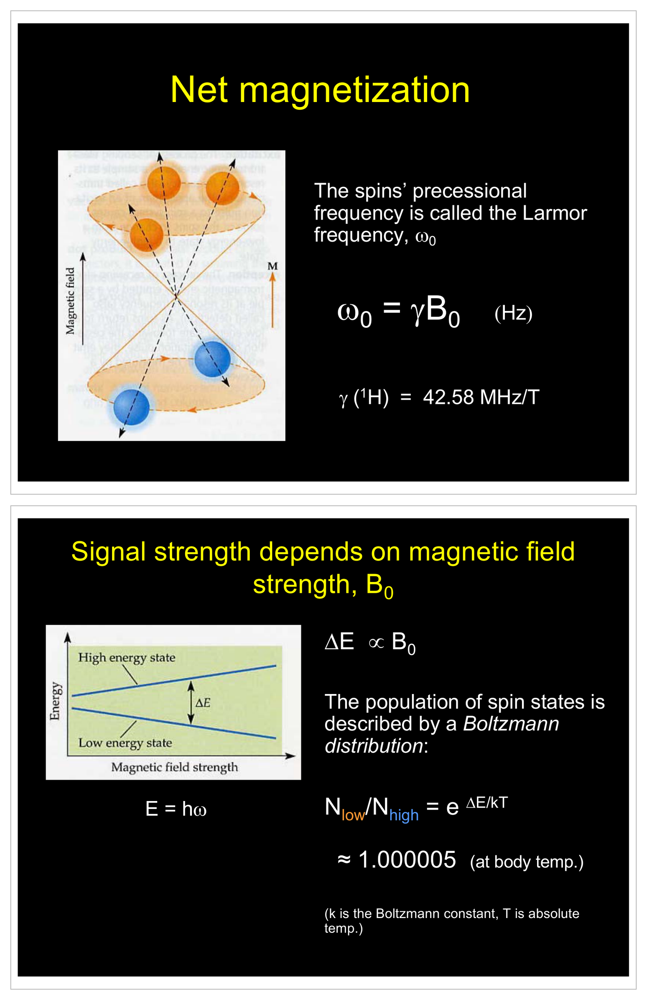

**Figure 1.1. Net magnetization and signal strength dependence on magnetic field strength, B0.**

## 1.2 What MRI measures versus what fMRI infers
Structural MRI and functional MRI use the same basic physical machinery but answer different kinds of questions.

**MRI**, in the broad sense, measures the behavior of nuclear magnetization under a designed pulse sequence. The final image intensity in a voxel depends on properties such as proton density, T1, T2, T2*, diffusion, flow, susceptibility, and the details of the acquisition.

**fMRI**, by contrast, usually seeks to infer changes in neural activity indirectly by measuring changes in MR signal over time. In conventional BOLD fMRI, the signal of interest arises because changes in blood oxygenation alter local magnetic susceptibility, which changes transverse dephasing and therefore affects T2*-weighted signal. This is an indirect chain:

neural activity → vascular and metabolic response → local susceptibility change → T2* change → MR signal change.

That chain is powerful, but it also explains why fMRI is vulnerable to confounds. If any other process changes the measured signal—head motion, eye movements, inflow, drift, breathing, scanner instability, caffeine-related vascular effects, coil sensitivity changes—it can masquerade as a neural effect or distort a genuine one.

Two consequences follow immediately. First, even an apparently simple voxel intensity in MRI is already a pulse-sequence-dependent mixture of tissue properties rather than a direct photograph of tissue. Second, a voxel-wise fMRI statistic is farther removed still: it is typically a model fit to a noisy time series whose amplitude depends on acquisition timing, physiology, nuisance variation, and analysis choices as well as on the neural effect of interest. That is why fMRI interpretation always requires both acquisition literacy and experimental literacy.

A practical fMRI researcher therefore needs two kinds of understanding at once:
1. **physical understanding**, to know how the scanner creates and distorts signal; and
2. **interpretive understanding**, to know what part of the resulting signal likely reflects BOLD physiology and what part reflects nuisance sources.

That is why this book moves from physics to image formation, then to artifacts, then to confounds. The ordering is not decorative. It reflects how competent interpretation is built.

## 1.3 Why EPI dominates fMRI despite its weaknesses
Most modern whole-brain fMRI depends on **echo-planar imaging (EPI)**. EPI is attractive because it can collect an entire image—or a large fraction of one—very rapidly after a single excitation. That speed is essential for fMRI. Functional MRI requires repeated sampling over time, often across the whole brain, with temporal resolution good enough to estimate slow hemodynamic changes and separate them from nuisance fluctuations.

However, EPI is not a perfect method. In fact, it is often better described as a highly useful compromise. Because the readout is long and the effective bandwidth in one direction is relatively low, EPI is especially sensitive to:
- geometric distortion,
- susceptibility-related signal dropout,
- odd/even line mismatch and Nyquist ghosting,
- chemical-shift-related contamination,
- and motion-related corruption.

The practical logic of fMRI is therefore not that EPI is artifact-free. It is that EPI is sufficiently fast and sufficiently informative that researchers accept its weaknesses, then work actively to understand, diagnose, and mitigate them.

A large portion of applied fMRI competence consists of learning that tradeoff structure. Faster imaging can reduce some problems while increasing others. Higher spatial resolution can sharpen anatomical specificity while reducing signal-to-noise ratio (SNR). Thinner slices can reduce dropout while increasing scan time or reducing coverage. Parallel imaging can reduce distortion while introducing noise amplification or residual aliasing. Multi-echo EPI can improve BOLD classification while raising complexity and reconstruction demands.

Practical MRI education therefore should not treat parameter choices as arbitrary menu selections. They are interconnected engineering compromises grounded in spin physics and signal encoding.

## 1.4 How this book connects physics, images, and practice
The source course slides are highly visual and highly practical. They move quickly from magnetic resonance fundamentals to EPI, artifacts, acceleration methods, troubleshooting, and biological confounds. That practical emphasis is a strength. The challenge is that slide decks often rely on tacit background knowledge: a single diagram may presuppose several pages’ worth of physical explanation.

This textbook reconstruction makes that implicit knowledge explicit. It follows a recurring teaching pattern:
1. **Intuition first.** What physical phenomenon is happening, in plain language?
2. **Formal statement.** What is the relevant equation or sequence logic?
3. **Imaging consequence.** How does that phenomenon affect image contrast, geometry, or time series quality?
4. **Practical implication.** What should the scanner operator, analyst, or reader notice in real data?

That means the book is not simply about “MRI physics” in the abstract. It is about MRI physics as it appears in actual images, actual artifact patterns, and actual fMRI interpretation.

## 1.5 A roadmap from signal physics to confounds
The early chapters establish the core physics of magnetization, excitation, relaxation, and hardware. Those are the foundations. The middle chapters show how gradients and Fourier encoding produce MRI images and how EPI samples k-space quickly. The later chapters turn that physics into practical recognition: ghosting, distortion, dropout, motion-related effects, receive-bias interactions, accelerated imaging tradeoffs, quality control, and biological confounds.

This sequence reflects a basic truth of practical fMRI: poor interpretation often begins far upstream. A reader who does not understand why T2* matters will struggle to understand BOLD. A reader who does not understand phase encoding will struggle to understand distortion. A reader who does not understand receive-field heterogeneity will struggle to understand why “perfect” motion correction can still leave structured signal changes.

The goal, therefore, is not just to help the reader recognize familiar terms. It is to make the reader able to reason from first principles when an acquisition behaves unexpectedly.

---

### Why This Matters
If you remember only one thing from this chapter, remember this: **fMRI is not a direct movie of neural activity. It is an MR signal acquired under severe time pressure, shaped by spin physics, spatial encoding, physiology, and hardware.** Understanding the chain from spins to interpretation is what makes practical troubleshooting possible.

---

## Chapter 1 Summary
- MRI measures signals produced by nuclear magnetization, mainly from hydrogen nuclei.
- fMRI usually relies on T2*-weighted BOLD contrast, which reflects vascular consequences of neural activity rather than neural firing directly.
- EPI dominates fMRI because it is fast enough for repeated whole-brain imaging, even though it is artifact-prone.
- Practical fMRI requires simultaneous understanding of physics, image appearance, sequence design, and confounds.
- The rest of the book follows the causal chain from spin behavior to acquisition tradeoffs to biological interpretation.

## Key Terms
- Magnetic resonance
- Nuclear spin
- Hydrogen proton
- BOLD contrast
- T2*
- Echo-planar imaging (EPI)
- Signal-to-noise ratio (SNR)
- Confound
- Spatial encoding

## Review Questions
1. Why is it misleading to say that fMRI directly measures neural activity?
2. Why is EPI so useful for fMRI, despite its well-known artifacts?
3. What kinds of practical problems arise if MRI physics and image interpretation are taught separately rather than together?
4. In a single sentence, describe the chain linking neural activity to BOLD fMRI signal.

---

# Chapter 2. Nuclear Magnetization, Precession, and the Rotating Frame

## 2.1 Net magnetization and spin population imbalance
MRI exploits the fact that certain atomic nuclei possess angular momentum and an associated magnetic moment. In biological MRI, the overwhelmingly important nucleus is **hydrogen-1 (¹H)**, because hydrogen is abundant in water and lipids and has favorable magnetic resonance properties.

When a person is placed in the scanner’s main magnetic field, conventionally called **B0**, these microscopic magnetic moments do not all line up perfectly. Thermal energy at body temperature is far too large for perfect alignment. Instead, a very slight excess of spins occupies the lower-energy orientation relative to the field. The result is not perfect order, but a tiny statistical imbalance across an enormous number of nuclei. Summed over tissue, that imbalance produces a small but measurable **net magnetization**.

This point is conceptually crucial. MRI signal does **not** arise because each proton behaves neatly and synchronously in isolation. It arises because a tiny energy preference, multiplied across an astronomical number of spins, produces a bulk magnetization vector that can be manipulated and detected.

The source slides introduce this by emphasizing net magnetization and the field dependence of signal strength. The stronger the main field, the larger the energy difference between spin states, and therefore the larger the equilibrium magnetization available to generate signal.

## 2.2 The Larmor frequency and field strength
A magnetic moment placed in a magnetic field does not simply point and freeze. Instead, it **precesses** around the direction of the field. The precessional angular frequency is the **Larmor frequency**, given by

\[
\omega_0 = \gamma B_0
\]

where:
- \(\omega_0\) is the Larmor angular frequency,
- \(\gamma\) is the gyromagnetic ratio of the nucleus,
- and \(B_0\) is the main magnetic field strength.

For hydrogen-1, the gyromagnetic ratio corresponds to approximately **42.58 MHz/T** when expressed in cycles per second per tesla. At **3 T**, this yields a resonance frequency of about **127.7 MHz**. The source slides label the RF system as **123 MHz**, but for textbook purposes that should be read as scanner-side shorthand or slide notation rather than as the precise nominal proton Larmor frequency for a 3.0 T system.

This equation matters for much more than basic physics. It tells us:
- what RF frequency must be used to excite hydrogen spins at a given field,
- why scanner field strength changes hardware design,
- why off-resonance effects matter,
- and why chemical shift and susceptibility can create position-dependent signal problems.

The Larmor equation also gives the cleanest definition of off-resonance. If a spin experiences a slightly different local field than expected, it precesses at a slightly different frequency than the RF system or reconstruction model assumes. Later in the book that small mismatch reappears as chemical shift, susceptibility-induced phase accumulation, and distortion. The point is worth making here because many later artifacts are just the imaging consequences of local departures from \(\omega_0 = \gamma B_0\).

A useful intuition is that \(B_0\) sets the "native clock speed" of the spins. To control the spins efficiently, the RF system must speak to them at that frequency.

## 2.3 Boltzmann distribution and why MRI signal is intrinsically small
The source slides emphasize that signal strength depends on field strength because the energy difference between spin states grows with \(B_0\). The population ratio of lower- and higher-energy states follows a Boltzmann relation of the form

\[
\frac{N_{\text{low}}}{N_{\text{high}}} = e^{\Delta E/kT}
\]

where:
- \(N_{\text{low}}\) and \(N_{\text{high}}\) are the spin populations in the two energy states,
- \(\Delta E\) is the energy difference between those states,
- \(k\) is Boltzmann’s constant,
- and \(T\) is absolute temperature.

At body temperature, this ratio is only slightly greater than 1. The source slide gives an illustrative value around **1.000005**. That tiny imbalance is one of the most sobering facts in MRI. Almost all spins are effectively “canceling” each other in the bulk average. MRI works because a tiny excess remains.

Yet “tiny” does not mean useless. A cubic millimeter of tissue still contains such a large number of hydrogen nuclei that even a minute fractional imbalance produces a macroscopic bulk magnetization. The entire scanner is then designed to protect and detect that weak signal efficiently: stronger fields increase the starting polarization, tuned coils improve coupling to the induced voltage, careful sequence timing avoids wasting coherence, and repeated measurements improve precision.

This immediately explains two important practical facts.

First, MRI is inherently SNR-hungry. If the equilibrium polarization were much larger, imaging would be easy. Because it is so small, MRI depends on strong fields, efficient coils, repeated averaging, careful pulse design, and noise-conscious reconstruction.

Second, increasing field strength generally increases available signal. That does not make high-field MRI universally better—high field also amplifies susceptibility effects, nonuniformity, and certain safety or hardware constraints—but it does explain why modern MRI systems often operate at 3 T for research applications.

## 2.4 The rotating frame as a conceptual simplifier
One of the most elegant tools in MRI is the **rotating reference frame**. In the laboratory frame, spins precess around \(B_0\) at tens or hundreds of megahertz. If one tried to reason directly in that frame at all times, even simple excitation would be hard to visualize.

The rotating frame solves this problem by imagining that the observer rotates at the same angular frequency as the equilibrium precession, so that

\[
\omega_{\text{rot}} = \omega_0.
\]

In that frame, magnetization that is precessing exactly at the Larmor frequency appears approximately stationary. This does not change the physics; it changes only the viewpoint. But the viewpoint is transformative. It lets us describe excitation as a controlled rotation of the magnetization vector under the influence of an applied RF field.

The source slide labeled “Before excitation” uses exactly this idea: in the rotating frame, the bulk magnetization at thermal equilibrium is aligned with the \(z\)-axis (or \(z'\)-axis in the rotating-frame notation), along the direction of \(B_0\).

This is one of the first places where MRI becomes far more intuitive than it first appears. Instead of imagining billions of tiny magnets whipping around at radiofrequency speeds, we imagine a net vector sitting along the longitudinal axis, waiting to be tipped away from equilibrium.

## 2.5 Equilibrium magnetization before excitation
At thermal equilibrium, the bulk magnetization vector **M** points along the main field direction. This longitudinal component is often denoted \(M_z\), and its equilibrium value is often called \(M_0\).

In this state, there is no net transverse magnetization. That means there is no coherent time-varying magnetic component in the transverse plane available to induce a detectable MR signal in the receive coil. In other words, equilibrium magnetization is “stored” signal potential, not yet observable signal.

A useful way to say this is that the scanner begins with magnetization aligned along the wrong axis for detection. The task of excitation is to rotate some of that longitudinal magnetization into the transverse plane, where it can be observed as an oscillating signal.

## 2.6 RF excitation and the B1 field
Excitation is achieved by briefly applying a second magnetic field, usually called **B1**, using an RF coil. The source slides emphasize three crucial facts about this field:
1. **B1 is oscillatory in time**, unlike the static field \(B_0\).
2. **B1 must be applied at the Larmor frequency** to efficiently interact with the spins.
3. **B1 must act perpendicular to \(B_0\)** in order to tip the magnetization away from the longitudinal axis.

In the rotating frame, if the RF field oscillates at the correct frequency, it appears approximately stationary. Under that condition, the magnetization vector rotates about the direction of the effective \(B_1\) field. This is the basis of pulse control in MRI.

This is a good place to pause and make the practical point explicit: the transmit RF system is not merely "turning the scanner on." It is performing a precise resonant manipulation of spin orientation. If the RF pulse is too weak, too strong, too short, too long, or off-resonance, the intended excitation will not occur correctly.

The frequency-matching requirement on the source slides has another practical consequence. An RF pulse does not tip every spin equally well unless the spins are close enough to the targeted resonance. In well-shimmed, on-resonance tissue, the intended flip angle is achieved. In off-resonance tissue, the same pulse may under-rotate, over-rotate, or rotate around a somewhat different effective axis. This is why center-frequency setting, transmit calibration, and later shimming choices all matter for turning a nominal pulse sequence into the excitation that actually occurs in the head.

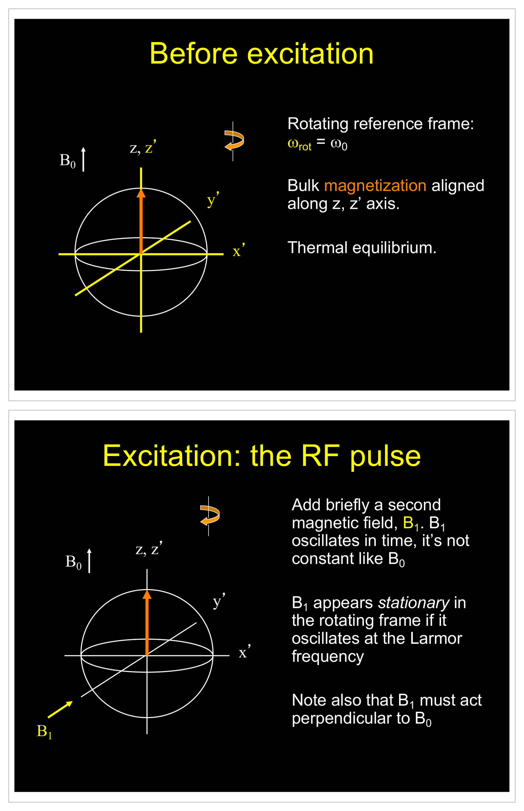

**Figure 2.1. Rotating-frame view before excitation and the RF pulse.**

## 2.7 Flip angle and pulse duration
The source slides summarize excitation with the relation

\[
\theta = \gamma B_1 T_p
\]

where:
- \(\theta\) is the **flip angle**,
- \(\gamma\) is the gyromagnetic ratio,
- \(B_1\) is the magnitude of the RF field,
- and \(T_p\) is the pulse duration.

This equation states that the tip angle is determined by how strongly the RF field acts and for how long it acts. A **90° pulse** rotates the longitudinal magnetization into the transverse plane. A **180° pulse** inverts magnetization or, in spin-echo sequences, reverses phase dispersion patterns so that a later refocusing can occur.

Flip angle is one of the most important practical parameters in MRI. It governs how much longitudinal magnetization is converted into transverse magnetization, how much longitudinal magnetization remains for future excitations, how strongly T1 weighting appears, and how saturated tissue becomes in repeated acquisitions.

In fMRI, flip angle is not just a physics exercise. It affects signal amplitude, temporal SNR, inflow sensitivity, and spin-history behavior.

The 90-degree and 180-degree cases are worth keeping conceptually linked. They are not different kinds of special pulses; they are different amounts of rotation generated by the same basic control variables. A 180-degree pulse does not create new signal on its own. Its value is that it rearranges magnetization so later signal behavior changes - for example by inverting longitudinal magnetization or by reversing the geometry of phase spread in a spin echo.

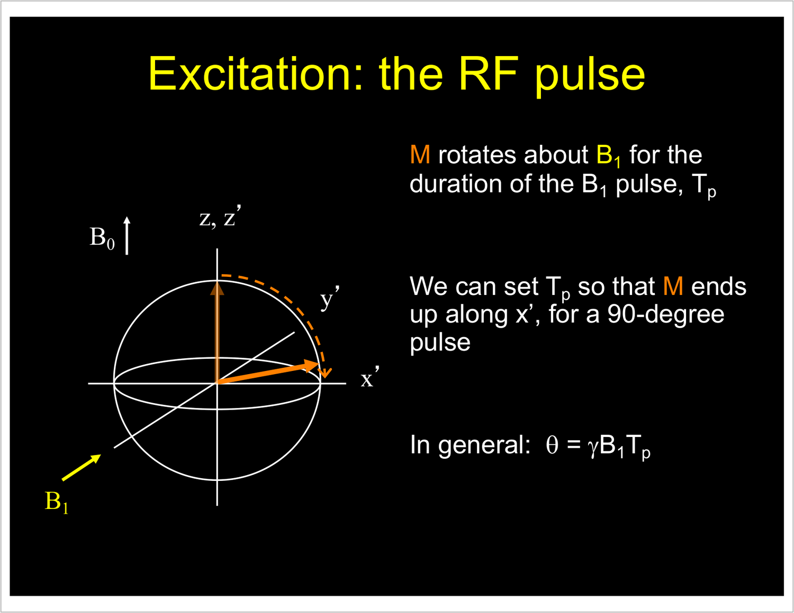

**Figure 2.2. RF-pulse duration and flip-angle setting.**

## 2.8 Magnetization immediately after excitation
After a 90° pulse, the source slides describe the transverse magnetization as

\[
M_{xy} = M_0
\]

immediately after excitation. In the rotating frame, this transverse magnetization appears stationary at first. But that is only true in an idealized sense. In a real tissue sample, microscopic variations in local magnetic environment cause different spins to precess at slightly different rates.

The moment spins begin to lose phase coherence with one another, the net transverse magnetization starts to shrink, even though the individual spins still exist and are still precessing. This process is called **dephasing**.

The signal loss therefore begins immediately after excitation, not only when the scanner "starts reading out." Sequence timing is an attempt to sample the signal before too much coherence has been lost or, in spin-echo methods, after some of it has been purposefully refocused. This is why echo time becomes such a central acquisition variable: it determines how much transverse coherence is allowed to survive before the signal is measured.

This idea is central to MRI signal formation. What the scanner detects is not the existence of spins per se. It detects coherent transverse magnetization. Once that coherence is lost, the measured signal decays.

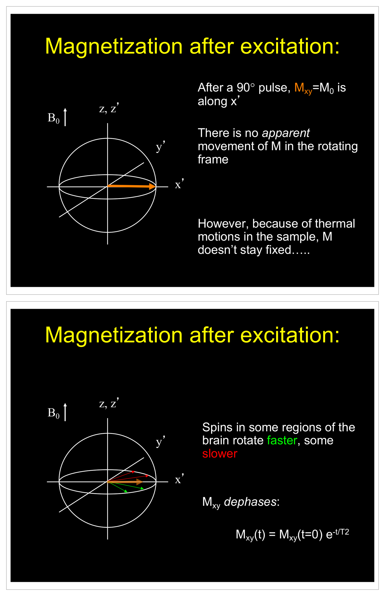

**Figure 2.3. Magnetization after excitation and early dephasing.**

## 2.9 Transverse magnetization and signal detection
The receive system detects signal through **electromagnetic induction**. A changing magnetic flux through the receive coil induces a voltage. The relevant changing field is produced by the component of magnetization in the transverse plane.

Thus, once magnetization has been tipped into the transverse plane, it generates an oscillating signal at the Larmor frequency. In the time domain, this is the beginning of the observable MR signal. In the simplest case, that signal decays as dephasing proceeds.

One subtlety is worth making explicit. In the rotating frame, a perfectly on-resonance transverse magnetization can be drawn as if it were stationary. But the receive coil exists in the laboratory frame, not the pedagogical rotating frame. In the laboratory frame the transverse magnetization is still precessing at radiofrequency, and that oscillation is exactly what induces the measurable voltage. The rotating frame is useful because it hides the rapid carrier motion while preserving the slower sequence-relevant changes in phase and amplitude.

The source slides correctly emphasize that the changing magnetic component in the transverse plane is what matters for detection. This apparently simple statement has major consequences:
- if transverse coherence is lost, signal falls;
- if transverse signal is refocused, an echo appears;
- if susceptibility variation makes local precession rates differ, transverse coherence is lost more rapidly;
- and if receive coil sensitivity varies spatially, the same physical magnetization can appear brighter in one location than another.

The path from magnetization to image therefore begins with a simple idea: create transverse magnetization, then detect how it evolves.

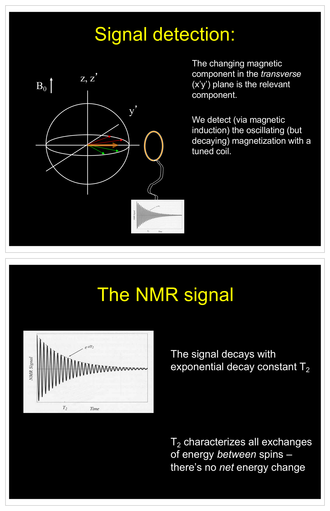

**Figure 2.4. Signal detection and the NMR signal.**

---

### Common Confusion: frequency versus phase
Students often confuse **frequency** and **phase**. Frequency describes how rapidly a spin precesses. Phase describes where it is within its precessional cycle at a given moment. Spins can have the same frequency but different phase, or the same phase temporarily despite slightly different frequencies. MRI signal depends critically on whether transverse magnetization remains phase coherent across spins.

---

## Chapter 2 Summary
- A strong static field produces a small but measurable net magnetization by slightly favoring the lower-energy spin state.
- Spins precess at the Larmor frequency, which is proportional to field strength.
- The rotating frame simplifies MRI by making resonant spin behavior easier to visualize.
- RF excitation applies a transverse oscillating field at the Larmor frequency to tip magnetization away from equilibrium.
- Flip angle depends on RF field strength and pulse duration.
- Transverse magnetization is detectable because it induces a voltage in a tuned receive coil.
- MRI signal is fundamentally a measurement of coherent transverse magnetization, not of spins in isolation.

## Key Terms
- Net magnetization
- Larmor frequency
- Gyromagnetic ratio
- Rotating frame
- Equilibrium magnetization
- RF pulse
- B1 field
- Flip angle
- Transverse magnetization
- Magnetic induction

## Review Questions
1. Why does MRI rely on a bulk statistical imbalance rather than perfectly aligned spins?
2. What does the equation \(\omega_0 = \gamma B_0\) tell you practically about a 3 T MRI system?
3. Why is the rotating frame so useful in MRI teaching and sequence design?
4. Why must the RF excitation field be perpendicular to \(B_0\)?
5. What determines the flip angle of an RF pulse?
6. Why is there no detectable MR signal from perfectly longitudinal magnetization at equilibrium?

---

# Chapter 3. Relaxation, Dephasing, T1, T2, and T2*

## 3.1 Why transverse magnetization decays
Once transverse magnetization has been created, it does not remain perfectly coherent. Even if the scanner hardware were ideal, spins in tissue experience slightly different local magnetic environments because of molecular interactions, microscopic susceptibility variation, diffusion through nonuniform fields, and other sources of local field fluctuation.

As a result, some spins precess a little faster, some a little slower, and their phases spread out over time. The vector sum of all these individual transverse components therefore shrinks. This loss of phase coherence is what the source slides introduce immediately after excitation.

In the simplest phenomenological description, transverse magnetization decays exponentially:

\[
M_{xy}(t) = M_{xy}(0)e^{-t/T_2}.
\]

Here:
- \(M_{xy}(0)\) is the transverse magnetization immediately after excitation,
- \(M_{xy}(t)\) is the remaining coherent transverse magnetization at time \(t\),
- and \(T_2\) is the transverse relaxation time constant.

This equation is not just a mathematical convenience. It is one of the central engines of MRI contrast. Different tissues lose transverse coherence at different rates, and that difference can be translated into image contrast by appropriate timing.

## 3.2 T2 as spin-spin dephasing
The source slides describe T2 as characterizing interactions among spins that produce no net energy exchange with the surroundings. In the traditional language of MRI, T2 is often called **spin-spin relaxation**. That phrase can be misleading if interpreted too literally. The key idea is not simply that spins interact, but that these interactions make the transverse phases diverge.

T2 therefore describes how quickly transverse coherence disappears because of microscopic processes intrinsic to the tissue environment. It is shorter than T1 in most tissues, and it is usually the first transverse decay constant a student learns.

A practical intuition is useful here. If many small clocks begin in perfect synchrony and then gradually run at slightly different rates, the average rhythmic signal from the group fades-even though the clocks themselves still exist. T2 is the MRI analogue of that loss of synchrony.

This is also the point where a practical distinction has to be introduced. Some phase dispersion comes from stable frequency offsets that can, in principle, be rewound or refocused. Other dispersion comes from microscopic interactions and motion through varying fields that are not fully reversible. MRI teaching often compresses all of this into "the signal decays," but the later difference between T2, T2*, and spin-echo recovery depends on separating those cases.

## 3.3 Signal induction and the observed NMR signal
The source deck emphasizes that the measured NMR signal is the decaying oscillating transverse magnetization. In other words, the receive coil observes not a static property but a time-varying electromagnetic response. The detected time-domain signal after excitation is often called a **free induction decay** (FID), although in practical MRI this signal is often shaped by gradients, refocusing pulses, and readout design.

In free precession after a simple excitation, the signal falls as coherence is lost. In pulse sequences, however, the signal can be redirected, refocused, and sampled in many different ways. This is why understanding signal decay is necessary but not sufficient. One must also understand how pulse sequences intervene in that decay.

The source slides move quickly from the decaying signal to the spin echo for exactly this reason. If the reader only remembers that the FID falls, later sequence diagrams look like a bag of tricks. If the reader understands that sequence timing can either let dephasing accumulate or deliberately reverse part of it, then echoes, gradient rewinds, and contrast timing become intelligible variations on one principle.

## 3.4 The spin echo: refocusing reversible dephasing
One of the most important conceptual steps in MRI education is learning why a **spin echo** can recover signal after dephasing. The source slides devote a full sequence of pages to this process, and rightly so.

Suppose spins fan out in phase after a 90° pulse because some are effectively precessing faster and others slower. If no further intervention occurs, the net transverse magnetization simply keeps shrinking. But if a **180° RF pulse** is applied after a delay of TE/2, the phase ordering of the spins is inverted. The spins that had been leading become lagging, and the spins that had been lagging become leading. If the underlying frequency offsets remain stable during the process, the phase spread begins to reconverge. After another interval of TE/2, the spins re-align and form an **echo**.

This is one of the most beautiful ideas in MRI: dephasing need not always mean permanent signal loss. Some dephasing is reversible.

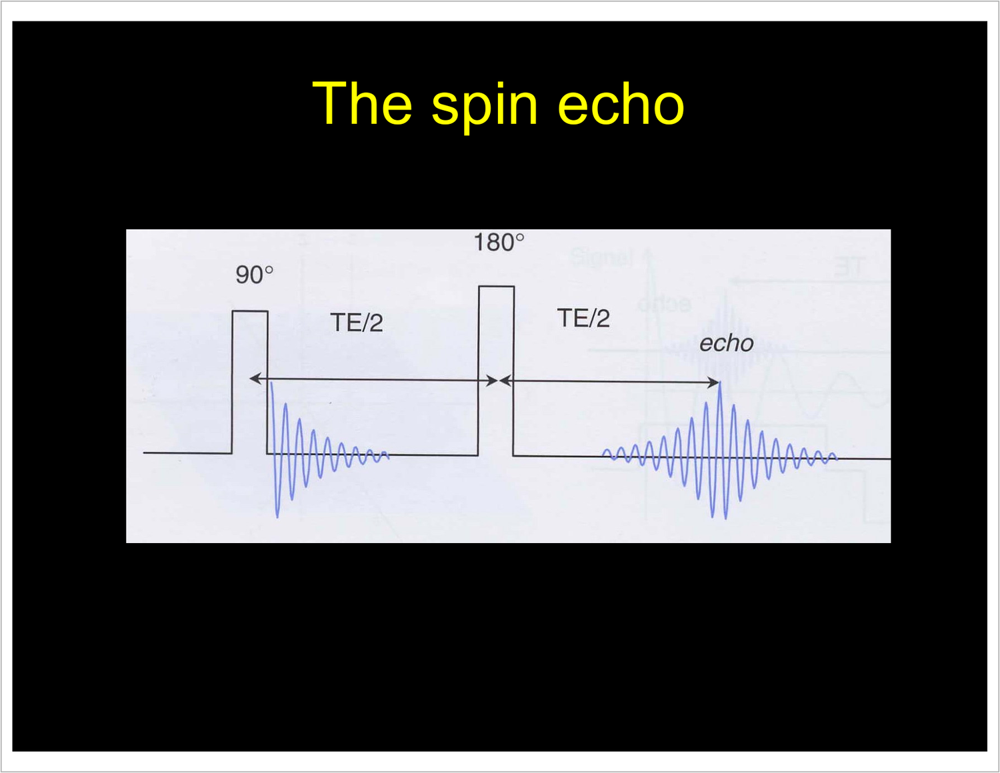

**Figure 3.1. The spin echo overview.**

## 3.5 Echo formation step by step
The spin-echo sequence can be described in the same staged way as the source slides:

1. **Excitation.** A 90° pulse tips longitudinal magnetization into the transverse plane.
2. **First evolution period.** Spins dephase because some precess faster and some slower.
3. **Refocusing pulse.** A 180° pulse flips the transverse spin configuration so that relative phase ordering is reversed.
4. **Second evolution period.** The faster spins, now behind in phase, catch up; the slower spins, now ahead, fall back toward coherence.
5. **Echo.** At time TE, coherent transverse magnetization is re-established and a spin echo is observed.

The symmetry of the sequence matters. In the classic spin-echo timing shown in the source slides, the 180-degree pulse is placed halfway to the echo, so the first and second evolution periods each last TE/2. That is why spins with stable frequency offsets reconverge specifically at TE rather than at some arbitrary later time. If the frequency environment changes during the interval—for example because of diffusion through gradients, motion, or time-varying field errors—refocusing is incomplete and the echo is weakened.

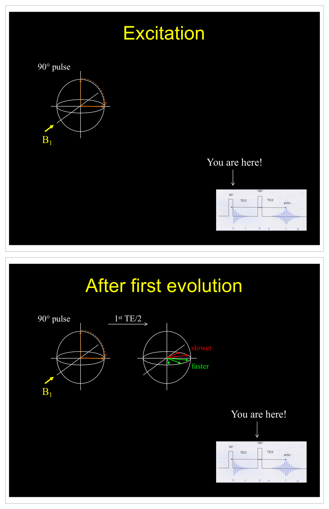

**Figure 3.2. Spin-echo excitation and first evolution.**

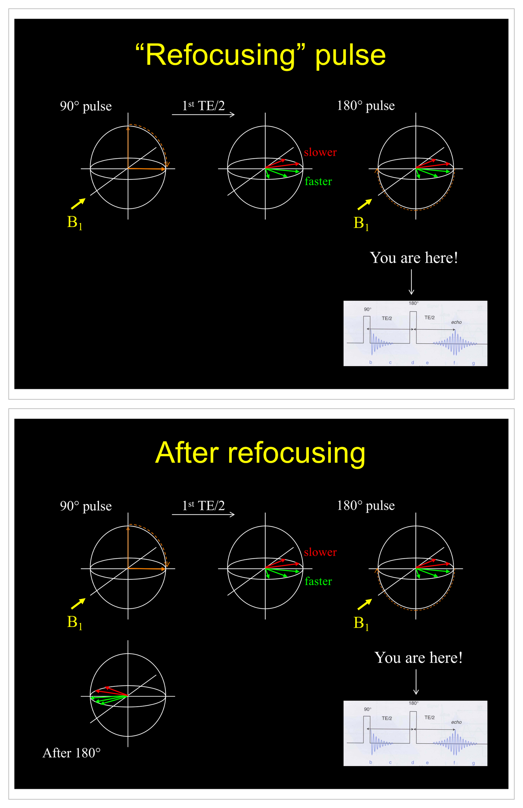

**Figure 3.3. Spin-echo refocusing and after-refocusing stages.**

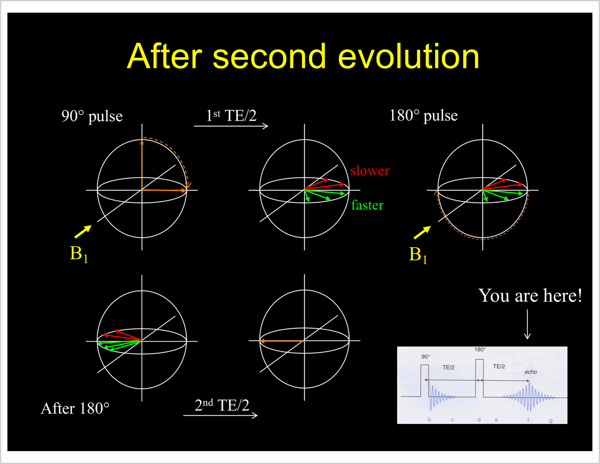

**Figure 3.4. Spin echo after second evolution.**

The deep physical lesson is that a spin echo refocuses phase dispersion caused by certain kinds of field inhomogeneity or stable frequency offsets, but it does **not** reverse truly irreversible microscopic dephasing processes. That is why the echo amplitude still decays with T2 rather than returning fully to the original transverse magnitude.

This distinction leads naturally to the difference between **T2** and **T2***.

## 3.6 Longitudinal recovery and T1
While transverse magnetization is losing coherence, longitudinal magnetization is simultaneously recovering toward equilibrium. The source slides define the longitudinal relaxation time **T1**, also called **spin-lattice relaxation**, as the time constant describing re-establishment of thermal equilibrium.

After a 90° pulse, the longitudinal component is initially zero. Recovery can be written as

\[
M_z(t) = M_0\left(1 - e^{-t/T_1}\right).
\]

In this equation:
- \(M_z(t)\) is the longitudinal magnetization at time \(t\),
- \(M_0\) is the equilibrium longitudinal magnetization,
- and \(T_1\) is the longitudinal recovery time constant.

Physically, T1 processes involve exchange of energy between the spin system and its molecular environment-the "lattice," in older terminology. The source slides phrase this intuitively as energy from spins going into vibrations, rotations, and translations of whole molecules, effectively as heat.

T1 matters enormously in MRI because repeated excitations do not wait for full recovery. If one image is acquired before full longitudinal recovery, the next excitation starts from a partially saturated state. That is the basis of T1 weighting and also why repetition time (TR) and flip angle interact so strongly.

A practical way to read the T1 equation is that MRI usually operates before recovery is complete. Short-TR imaging repeatedly interrogates tissue while magnetization is still climbing back toward \(M_0\). That makes the image history-dependent: the signal on the next excitation depends on how much longitudinal magnetization the previous excitation left behind. Later in the book, this same logic reappears in steady-state behavior, flip-angle choice, inflow sensitivity, and spin-history confounds.

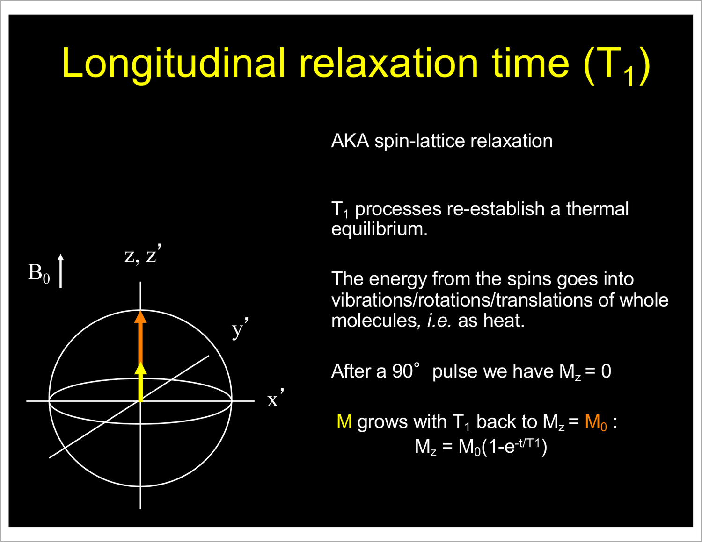

**Figure 3.5. Longitudinal relaxation time (T1).**

## 3.7 Molecular origins of relaxation
The molecular origins of relaxation are usually introduced in qualitative terms before a full spectral-density treatment. That approach is appropriate here.

Relaxation arises because molecules are not motionless. They tumble, vibrate, translate, interact, and create fluctuating local magnetic fields. When the time scales of those fluctuations are favorable, they efficiently drive relaxation.

The source deck notes an important conceptual point: T2 processes can be driven by fluctuations with components both near the Larmor frequency and near zero frequency, whereas T1 relaxation depends more specifically on fluctuations with spectral content near the Larmor frequency. This helps explain why T2 is generally shorter than T1 and why T1 tends to lengthen substantially as field strength increases.

A practical reader does not need to memorize full relaxation theory immediately, but should understand the following:
- relaxation times are not arbitrary labels,
- they reflect molecular dynamics and magnetic environment,
- tissue composition changes relaxation behavior,
- and field strength changes the balance of relevant interactions.

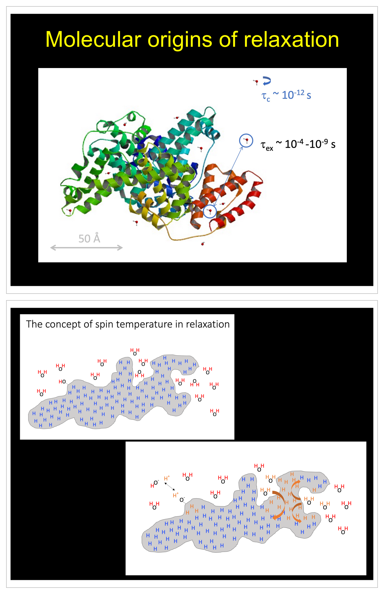

**Figure 3.6. Molecular origins of relaxation and the concept of spin temperature in relaxation.**

## 3.8 Typical tissue T1 and T2 values at 3 T
The source slides provide approximate values at 3 T:

| Tissue | Approximate T2 (ms) | Approximate T1 (ms) |
|---|---:|---:|
| White matter | 60 | 800 |
| Gray matter | 80 | 1200 |
| CSF | 400+ | 2500+ |

These values are approximate and vary with acquisition details, measurement method, pathology, and temperature, but they are pedagogically useful.

Several patterns matter immediately:
- **CSF has very long T1 and T2**, so it behaves very differently from brain parenchyma.
- **Gray matter generally has longer T1 and T2 than white matter**, reflecting differences in tissue composition and microstructure.
- **T2 is typically shorter than T1**, often substantially so.
- **T1 increases with field strength more strongly than T2**, which affects contrast behavior at higher fields.

The table is useful not because the exact numbers must be memorized, but because the rank order carries forward into scanner behavior. CSF keeps signal for a long time and recovers slowly. White matter recovers comparatively quickly but loses transverse coherence relatively quickly as well. Gray matter usually sits between those extremes. Once a reader has those directional expectations, sequence timing stops feeling arbitrary and starts feeling like selective emphasis of known tissue behavior.

These differences explain why sequence timing changes image appearance. Images with strong T1 weighting emphasize recovery differences. Images with strong T2 weighting emphasize differences in transverse decay. T2*-weighted imaging, especially gradient-echo EPI, adds sensitivity to local field inhomogeneity and susceptibility.

## 3.9 Diffusion effects and their relation to T2 and T2*
The source deck places diffusion alongside T2 and T2*, which is conceptually appropriate. Diffusion means that spins move through space, even microscopically. If a spin diffuses through a spatially varying magnetic field, it experiences a changing precessional frequency over time. That motion can contribute to dephasing and signal attenuation.

In ordinary fMRI teaching, diffusion is often not the main focus, because the dominant fMRI contrast mechanism is BOLD-related T2* weighting rather than explicit diffusion weighting. However, diffusion remains important conceptually because it reminds us that dephasing is not caused only by static frequency differences. Motion through field gradients also matters.

This becomes especially relevant whenever strong gradients are applied or when microscopic susceptibility gradients exist in tissue.

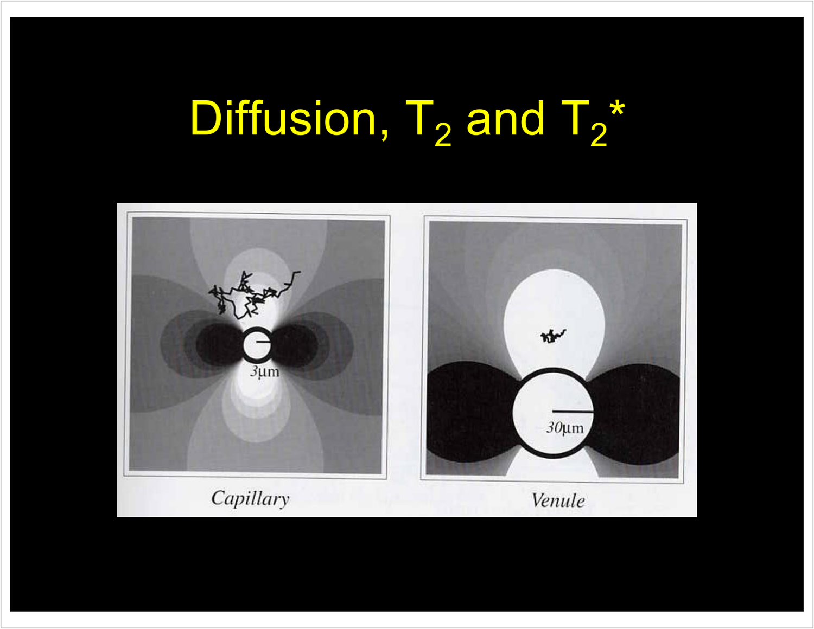

**Figure 3.7. Diffusion, T2 and T2*.**

## 3.10 T2* and the role of static field inhomogeneity
Although the earliest slides focus first on T2, practical fMRI depends heavily on T2-star (T2*). T2-star describes apparent transverse decay when both intrinsic spin-spin processes and additional dephasing from magnetic field inhomogeneity are present.

A useful way to think about it is this:
- **T2** reflects irreversible microscopic dephasing processes intrinsic to tissue,
- whereas **T2*** includes those processes **plus** extra dephasing caused by local field nonuniformity.

Because static field inhomogeneity accelerates apparent signal loss, T2* is shorter than T2. Gradient-echo sequences do not remove that added dephasing, so they are sensitive to T2*. Spin-echo sequences can refocus some of the static inhomogeneity component, making them less susceptible to certain artifacts.

This distinction is central for fMRI. BOLD contrast is mainly observed in T2*-weighted images because changes in blood oxygenation alter local magnetic susceptibility and therefore alter apparent dephasing.

The practical consequence is double-edged. T2* sensitivity is what makes BOLD fMRI possible, because oxygenation changes perturb local field and therefore perturb signal. But the same sensitivity is what makes gradient-echo EPI vulnerable to geometric distortion and dropout near air-tissue interfaces. In other words, fMRI's contrast mechanism and many of its main artifacts come from the same underlying physics.

## 3.11 Chemical shift as a consequence of electronic shielding
The source slides include chemical shift in the introductory relaxation block because it is another consequence of the fact that not all spins experience exactly the same magnetic field.

Electrons circulating around a nucleus generate small local magnetic fields that slightly shield the nucleus from the external field. As a result, chemically distinct hydrogen nuclei resonate at slightly different frequencies. This frequency difference is called **chemical shift**.

In spectroscopy, chemical shift is a major source of information about molecular structure. In imaging, it can become a nuisance or artifact source. Fat and water resonate at slightly different frequencies, which can cause spatial misregistration or ghost-like contamination unless acquisition design or fat suppression addresses it.

The source course later returns to this issue when discussing EPI and scalp fat suppression. Even at this early stage, however, chemical shift provides an important lesson: any mechanism that changes local resonance frequency can matter in MRI, whether the source is chemistry, susceptibility, or deliberately applied gradients.

Chemical shift is especially instructive because it shows how even modest frequency offsets can become spatial problems once readout and reconstruction interpret frequency as position. The later EPI chapters revisit this with scalp fat and ghost-like contamination, but the basic logic is already present here: if two proton pools resonate differently, an imaging system that assumes one frequency-position mapping will misplace at least one of them unless the acquisition accounts for the difference.

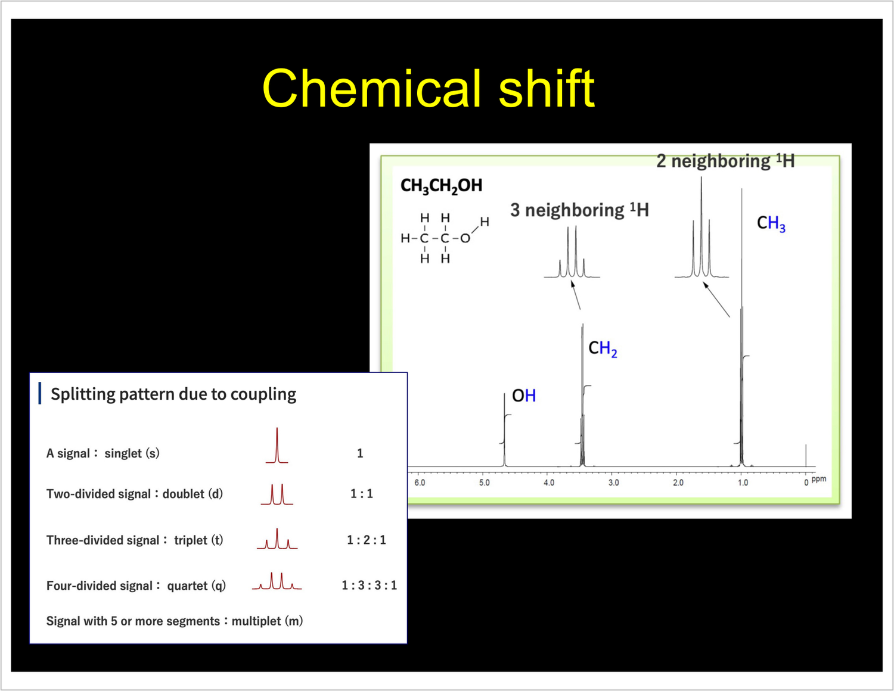

**Figure 3.8. Chemical shift.**

**Table 3.1. Approximate T1 and T2 values at 3 T for major tissue classes.** Source slide 20.

| Tissue | T2 (ms) | T1 (ms) |
|---|---:|---:|
| White matter | 60 | 800 |
| Gray matter | 80 | 1200 |
| CSF | 400+ | 2500+ |

---

### Common Confusion: T2 versus T2*
A frequent beginner error is to treat T2 and T2* as interchangeable. They are not. T2 is the intrinsic transverse relaxation time arising from microscopic dephasing mechanisms. T2* is the faster apparent decay seen when static field inhomogeneity and susceptibility variation further disperse phase. Gradient-echo fMRI is T2*-weighted, not pure T2-weighted.

### Practical Scanner Implication
If your acquisition is highly sensitive to T2*, then any factor that alters local magnetic field uniformity—sinuses, ear canals, dental work, motion through a biased receive field, poorly shimmed regions—can alter signal in ways that matter for both image appearance and time-series interpretation.

---

## Chapter 3 Summary
- Transverse magnetization decays because spins lose phase coherence over time.
- T2 describes intrinsic transverse dephasing caused by microscopic interactions.
- The measured MR signal is an induced voltage generated by time-varying transverse magnetization.
- A spin echo can refocus reversible dephasing caused by stable frequency offsets.
- T1 describes longitudinal recovery toward equilibrium and involves energy exchange with the molecular environment.
- T2 is generally shorter than T1, and tissue values differ substantially.
- T2* includes both intrinsic T2 decay and extra dephasing caused by field inhomogeneity.
- Chemical shift arises from electronic shielding and produces frequency differences between chemically distinct proton pools.

## Key Terms
- T1 relaxation
- T2 relaxation
- T2*
- Free induction decay
- Spin echo
- Refocusing pulse
- Echo time (TE)
- Longitudinal magnetization
- Transverse coherence
- Chemical shift
- Diffusion

## Review Questions
1. Why does transverse signal fall even when the spins themselves remain present in the sample?
2. What kind of dephasing can a 180° refocusing pulse reverse, and what kind can it not reverse?
3. Why is T2* shorter than T2?
4. What physical process is described by T1 recovery?
5. Using the approximate 3 T values provided, why would CSF behave so differently from white matter in many MRI sequences?
6. Why does chemical shift matter in imaging even if one is not doing spectroscopy?

---

# Chapter 4. MRI Hardware and the Physical Scanner Environment

## 4.1 Main scanner components
The source slides transition from NMR fundamentals to scanner basics by listing the major physical components of an MRI system. This is exactly the right move pedagogically. MRI physics is not performed in abstraction; it is implemented by hardware.

A modern MRI scanner requires at least four major subsystems:
1. a strong **main magnet** to establish \(B_0\),
2. **gradient coils** to make magnetic field vary with position,
3. **RF transmit hardware** to excite spins,
4. and **RF receive hardware** to detect the signal.

In addition, practical MRI requires shim systems, analog and digital electronics, gradient amplifiers, RF amplifiers, reconstruction computers, physiologic monitoring interfaces, safety interlocks, and mechanical support systems. The source slide understandably compresses this, but a textbook should make explicit that MRI is both a physics method and a coordinated electromechanical instrument.

The source slide specifically refers to a **3 T** system with:
- a 3 T magnet for polarization,
- three-axis gradient coils with maximum gradient amplitudes around **80 mT/m**,
- proton RF hardware operating near the nominal **3.0 T hydrogen resonance (~127.7 MHz)**,
- and a receive chain tuned to that same proton frequency.

A useful practical mindset is to treat the scanner as a synchronized chain rather than as four isolated boxes. The main field sets the resonance condition, the transmit system perturbs it, the gradients encode it, and the receive system measures the consequence. Parameters such as TE, TR, bandwidth, and echo spacing are therefore not abstract numbers typed into software; they are compact summaries of what all those subsystems can coordinate in real time.

Those values are not incidental. They reflect the direct consequences of the spin physics already introduced. At 3 T, proton resonance lies near **127.7 MHz**. Gradient performance determines encoding power and EPI speed. Receive-coil design strongly affects SNR and acceleration capability. The source slide's 123 MHz label is better treated as local scanner/shorthand wording than as the exact nominal proton frequency.

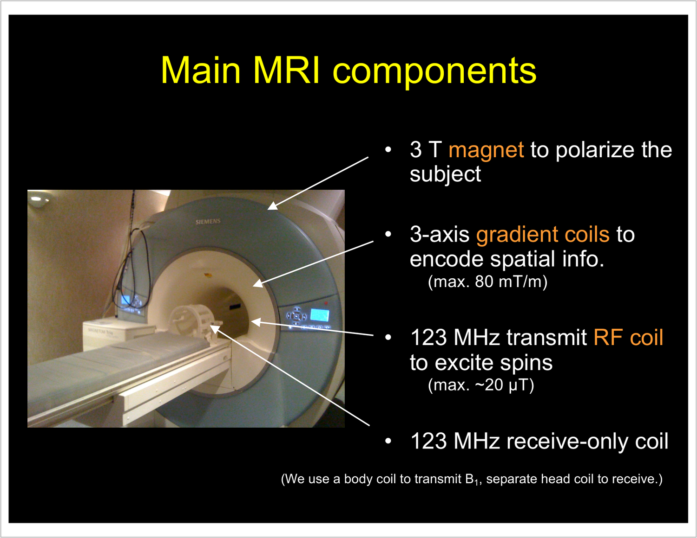

**Figure 4.1. Main MRI components.**

## 4.2 The role of the main field B0
The main magnet establishes the background field that makes magnetic resonance possible. Without \(B_0\), there is no well-defined Larmor frequency, no useful equilibrium polarization, and no controllable bulk magnetization for imaging.

The main field plays several simultaneous roles:
- it sets the resonance frequency,
- it determines equilibrium magnetization magnitude,
- it affects relaxation behavior,
- and it influences susceptibility effects and field nonuniformity challenges.

A stronger field generally provides more available signal, but it also sharpens practical problems. Susceptibility differences become more consequential. RF wavelength effects and transmit nonuniformity become more important. Certain artifacts become more severe. Thus, high field is best understood as a tradeoff space rather than a simple upgrade.

This is why moving from 1.5 T to 3 T or beyond never means "same scan, just brighter." Field strength changes the available signal, but it also changes the severity of susceptibility effects, the burden on shimming, the effective RF wavelength in tissue, and the difficulty of keeping excitation uniform. Practical protocol design always has to decide which of those changes are worth trading for the extra signal.

## 4.3 Gradient coils and spatial encoding power
The source slides highlight the **three-axis gradient system**. Gradient coils superimpose small, controlled linear variations in magnetic field on top of \(B_0\). Because resonance frequency depends on total magnetic field, a gradient makes resonance frequency depend on position.

This is the foundation of spatial encoding. Without gradients, MRI would produce a bulk signal from the entire excited sample, but it could not localize where in space that signal originated.

Each gradient axis has a different practical role depending on sequence timing:
- one can be used for **slice selection**,
- one for **frequency encoding (readout)**,
- one for **phase encoding**,
- and these roles can be reassigned depending on imaging plane and sequence design.

The maximum gradient amplitude and slew rate are practically important because they influence:
- how rapidly k-space can be traversed,
- how thin a slice can be selected,
- how short echo spacing can be made,
- and how aggressive advanced acquisitions can be.

For EPI especially, gradient performance is not a background specification; it is a direct determinant of distortion, timing, and achievable resolution.

The gradient specification on the source slide therefore deserves to be read as a performance ceiling rather than as decoration. Stronger and faster gradients can shorten echo spacing and help EPI, but only within limits imposed by heating, acoustic vibration, stimulation thresholds, and amplifier behavior. When a protocol cannot reach a desired echo-spacing or resolution combination, the explanation is often sitting here in the gradient hardware rather than in the reconstruction stage.

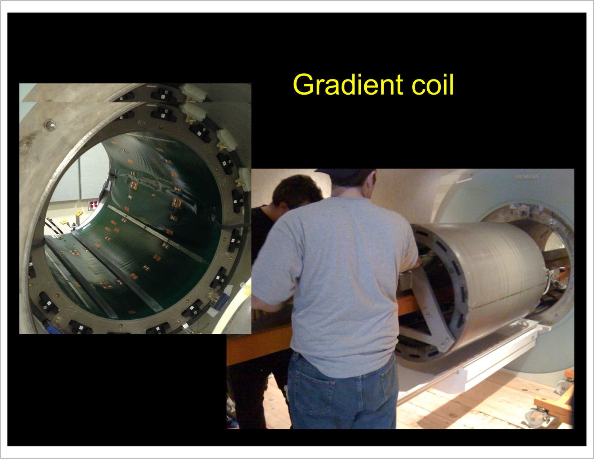

**Figure 4.2. Gradient coil.**

## 4.4 RF transmit versus receive hardware
The source slides note that the system uses a **body coil to transmit B1** and a separate **head coil to receive**. This division is standard in many human MRI systems.

The **transmit RF coil** creates the oscillating magnetic field \(B_1\) used for excitation. It must produce the right field orientation and frequency to tip magnetization by the intended flip angle. Uniform transmit behavior is important because spatial variation in transmit efficiency changes actual flip angle across the brain.

The **receive coil**, by contrast, listens rather than drives. Its task is to capture the weak induced signal with as high an SNR as possible.

There are strong engineering reasons to separate these roles. A body coil can provide broad, relatively uniform transmit coverage, whereas a close-fitting head receive array can provide much higher sensitivity than a large-volume receive structure.

The separation also clarifies why coil choice changes not just raw SNR but the entire style of acquisition that is feasible. A uniform body-transmit field supports predictable excitation, whereas a close receive array supports sensitivity, parallel imaging, and multiband unaliasing. Much of practical MRI is therefore built around using different hardware pieces for the job each one does best rather than expecting one coil to do everything equally well.

This division also prepares the student for a crucial later lesson: transmit nonuniformity and receive nonuniformity are different phenomena. The slides in this opening hardware block particularly foreshadow the importance of **receive field heterogeneity**, which later interacts with motion correction and signal interpretation.

## 4.5 Receive coil arrays and why channel count matters
The source deck includes slides on **receive coil arrays** and a **32-channel coil**. Multi-channel receive arrays are central to modern MRI because they improve local sensitivity and enable advanced reconstruction methods.

The 32-channel head coil shown in the source deck is a concrete example of this logic. It is not simply a detector with more pieces. It provides a library of partially overlapping spatial sensitivity profiles around the head. Modern reconstructions exploit those differences directly: parallel imaging uses them to estimate omitted k-space information, and simultaneous multi-slice reconstruction uses them to separate slices that were excited at the same time.

Each element in a receive array is most sensitive to signal arising near that element. By combining data from many elements positioned around the head, the scanner can obtain:
- improved SNR near the array,
- richer spatial sensitivity information,
- and the encoding diversity required for methods such as GRAPPA and simultaneous multi-slice unaliasing.

Channel count matters, but not in a simplistic “more is always better” way. More channels can improve acceleration capability and local sensitivity, but they also come with tradeoffs in geometry, coupling, reconstruction complexity, and sometimes uneven benefit across the field of view. What matters most is not the raw channel number alone but the spatial sensitivity structure of the array and how well it serves the acquisition task.

For practical fMRI, receive arrays are especially important because:
- whole-brain EPI is SNR-constrained,
- parallel imaging is often used to reduce distortion,
- and advanced methods like SMS depend heavily on spatially distinct coil sensitivities.

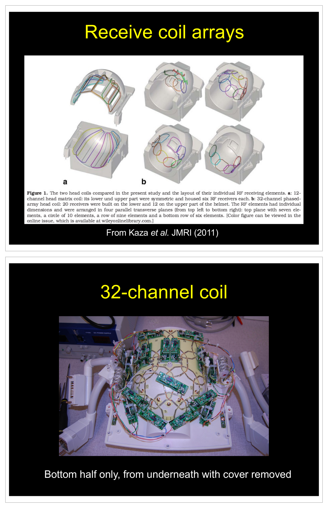

**Figure 4.3. Receive coil arrays and 32-channel coil.**

## 4.6 Receive field heterogeneity and its downstream consequences
The final slide in this opening hardware set addresses **receive field heterogeneity**. This topic deserves emphasis because it is not merely a cosmetic shading issue.

A receive coil does not detect the signal equally from every location. Regions close to coil elements usually appear brighter because receive sensitivity is higher there. Regions farther away appear darker. This spatial variation in receive sensitivity produces a **receive bias field**.

A useful diagnostic habit follows from this. If a cortical region brightens or darkens as the head shifts within the coil, that is not automatically physiology and not automatically a failure of realignment. It may simply reflect the same tissue being sampled under a different receive-sensitivity weighting at different time points.

In structural imaging, this can appear as smooth brightness nonuniformity. In fMRI, however, receive-field heterogeneity can become dynamically important. If the head moves through a nonuniform receive field, the same anatomical tissue can be measured with different sensitivity at different times. Even after rigid-body motion correction, the time course in that tissue may still contain structured signal modulation due to changing receive sensitivity. The later source slides refer to this as an RFC-MoCo-type problem.

This is an excellent example of why hardware understanding belongs early in a practical textbook. A student who treats the receive array as a passive detector may be confused later when motion-related intensity fluctuations survive "perfect" realignment. A student who already understands receive-field nonuniformity will recognize that motion can change not only anatomy position but also sensitivity weighting.

A further practical consequence is that receive bias can interact with normalization and QC in misleading ways. A spatially smooth bias field may look harmless in a single mean image, yet still amplify apparent temporal changes when the head shifts relative to the coil. That is why later motion diagnostics need to be interpreted together with knowledge of the receive geometry rather than as purely kinematic measures.

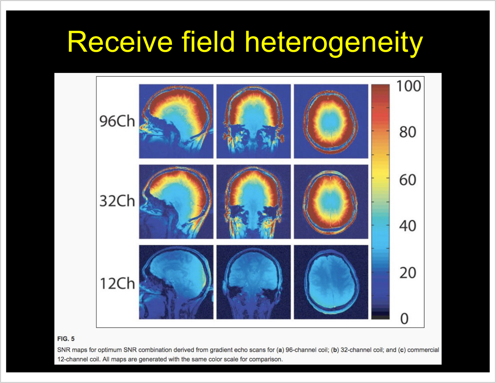

**Figure 4.4. Receive field heterogeneity.**

## 4.7 Why hardware knowledge matters for practical scanning
Scanner hardware is not just background context for physicists. It determines what kinds of images are realistically obtainable and what kinds of artifacts are likely.

Examples include:
- poor coil positioning can reduce SNR,
- weak or limited gradient performance can lengthen EPI echo spacing,
- inappropriate coil choice can undermine acceleration methods,
- receive-field heterogeneity can complicate intensity interpretation,
- transmit nonuniformity can alter effective flip angle,
- and hardware instability can produce spikes, drifts, or structured temporal noise.

A practical scanner operator or data analyst does not need to become an RF engineer, but should know enough hardware to connect image behavior to its likely origin.

---

### Practical Scanner Implication
Before blaming a sequence parameter, always ask whether the hardware setup is contributing. Coil choice, coil placement, element failure, unstable electronics, bias-field pattern, and gradient limitations can all shape the observed data before any higher-level interpretation begins.

---

## Chapter 4 Summary
- MRI requires coordinated hardware: main magnet, gradients, RF transmit, and RF receive systems.
- The main field \(B_0\) establishes polarization and resonance frequency.
- Gradient coils make resonance position-dependent and therefore enable spatial encoding.
- Transmit and receive functions are often separated in human MRI, with body-coil transmission and head-coil reception.
- Receive coil arrays improve sensitivity and enable parallel imaging and SMS methods.
- Receive field heterogeneity is not merely a visual shading issue; it can contribute to motion-linked signal modulation and later analysis problems.

## Key Terms
- Main field \(B_0\)
- Gradient coil
- Slice selection
- Frequency encoding
- Phase encoding
- RF transmit coil
- Receive coil
- Receive array
- Channel count
- Receive bias field

## Review Questions
1. Why is the main field required for MRI in the first place?
2. What does a gradient coil do that the main magnet does not?
3. Why do many MRI systems use separate transmit and receive coils?
4. Why are receive arrays essential for many modern fMRI acquisitions?
5. How can receive field heterogeneity create problems that survive motion correction?
6. Why should a practical fMRI user care about hardware limitations even if they are not designing pulse sequences?

# Chapter 5. Fourier Transform Intuition for MRI

## 5.1 Why MRI needs the Fourier transform at all
Once the existence of a detectable transverse MR signal is understood, the next practical question is obvious: how can that signal be turned into an image? The answer is that MRI does not measure spatial location directly in the ordinary photographic sense. Instead, it encodes spatial information into signal frequency and phase, then uses a **Fourier transform** to recover the underlying spatial pattern.

That is why the source slides begin this section with a pair of conjugate-variable relationships:
- **time <-> frequency**
- **space <-> k-space**

The Fourier transform is the mathematical bridge that connects each pair.

MRI learners often find this stage psychologically harder than the earlier NMR material. Magnetization and excitation can be imagined as arrows and rotations. Fourier analysis feels more abstract. But the physical idea is simpler than it first appears: if a measured waveform is built from many oscillatory contributions, the Fourier transform tells us what frequencies are present and how much of each is present. In MRI, gradients deliberately make spins at different positions behave like different frequency or phase contributors, so that the Fourier transform becomes a spatial decoder.

## 5.2 Conjugate variables in MRI
Two conjugate-variable relationships matter constantly in MRI.

### Time and frequency
A signal recorded as a function of **time** can be transformed into a representation as a function of **frequency**. This is the familiar use of Fourier analysis in signal processing.

### Space and k-space
A signal represented as a function of **position** can be transformed into a representation as a function of **spatial frequency**, commonly called **k-space** in MRI.

Spatial frequency does not mean “how fast tissue moves.” It means how rapidly image intensity changes across space.
- Low spatial frequencies correspond to broad, slowly varying image structure and overall contrast.
- High spatial frequencies correspond to sharp edges, fine detail, and rapid intensity transitions.

MRI works because magnetic field gradients convert position into phase/frequency variation in a controlled way, allowing the scanner to sample spatial-frequency information directly.

**Fourier transform: The analysis of frequency content**

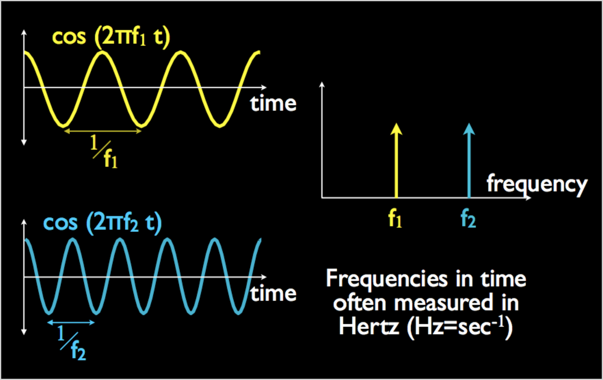

**Figure 5.1. Conjugate-variable relationships between time and frequency, and between space and k-space.**

## 5.3 What the Fourier transform does physically
The source slides introduce the Fourier transform as an analysis of frequency content. That is the correct practical entry point. A complex waveform that looks confusing in the time domain may be understood as the sum of simpler oscillatory components. The Fourier transform decomposes it into those components.

In symbolic form, the time-to-frequency transform can be written as

\[
s(\omega) = \int_{-\infty}^{\infty} S(t)e^{-i\omega t}\,dt,
\]

where:
- \(S(t)\) is the signal as a function of time,
- \(s(\omega)\) is the signal represented as a function of angular frequency,
- \(\omega\) is angular frequency,
- and \(i\) is the imaginary unit.

The source slides also remind the reader of Euler’s relation,

\[
e^{i\phi} = \cos\phi + i\sin\phi,
\]

which matters because rotating vectors, oscillating sinusoids, and phase evolution are all different views of the same underlying complex representation.

A rotating vector in the complex plane generates a sinusoidal projection along any axis. This is exactly why precessing transverse magnetization can be treated naturally with complex exponentials.

## 5.4 Why complex notation is not optional ornament
Complex notation in MRI is sometimes treated as a technical nuisance, but it is actually one of the cleanest ways to represent signal phase and amplitude simultaneously. The measured MR signal is not only about “how much signal” exists. It is also about **how the phase evolves** across time and across space.

This matters immediately for MRI because gradients do not just scale the signal. They impose position-dependent phase evolution. The Fourier transform then converts that phase pattern into spatial localization.

**The Fourier transform can determine the frequency content of complex waves**

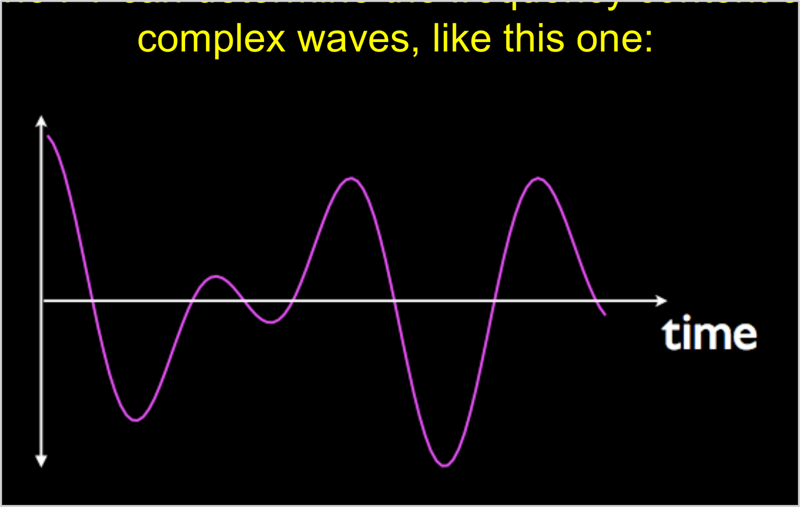

**Figure 5.2. Complex-wave decomposition into component frequencies under the Fourier transform.**

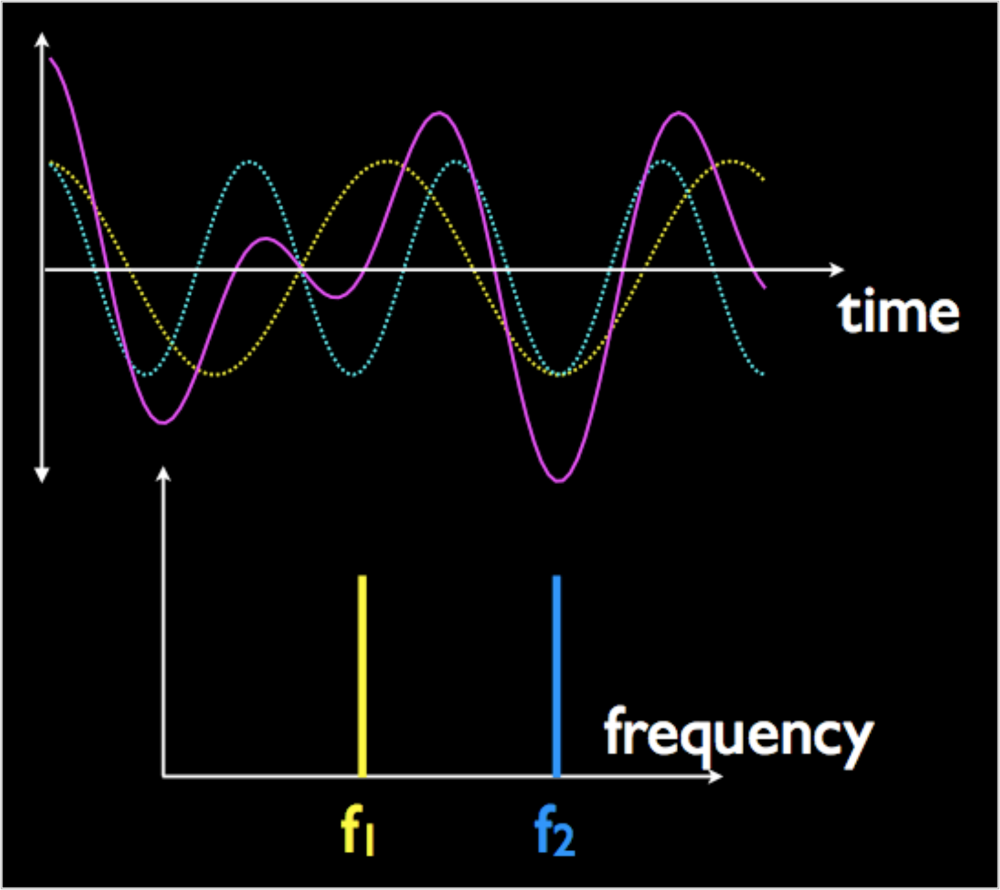

**Figure 5.3. Fourier decomposition example showing component-frequency peaks for a complex signal.**

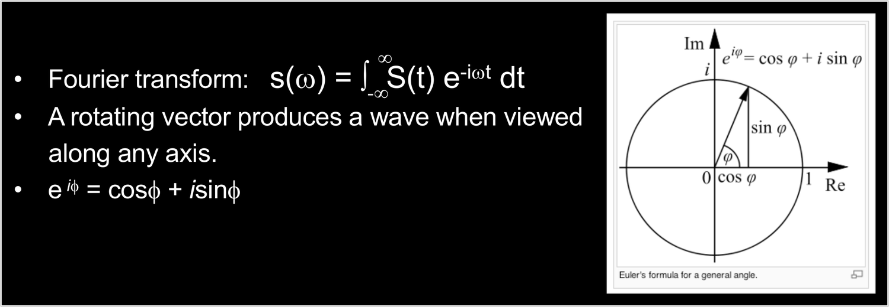

**Figure 5.4. Fourier transform notation, Euler relation, and example frequency spectra from time-varying signals.**

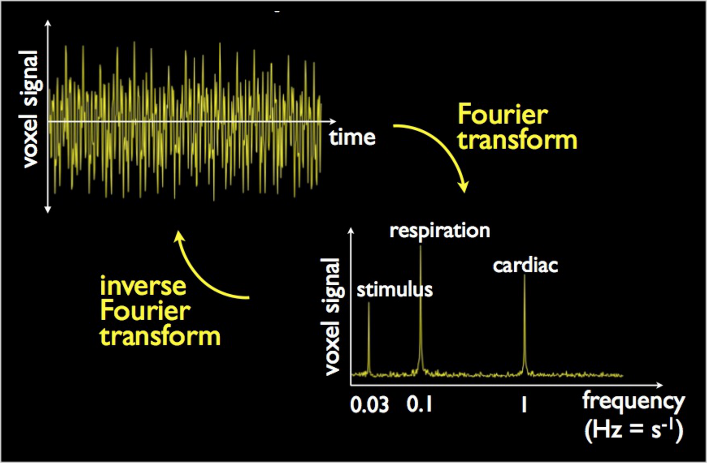

**Figure 5.5. Time-domain and frequency-domain illustration of Fourier decomposition for a complex signal.**

**Some useful Fourier pairs**

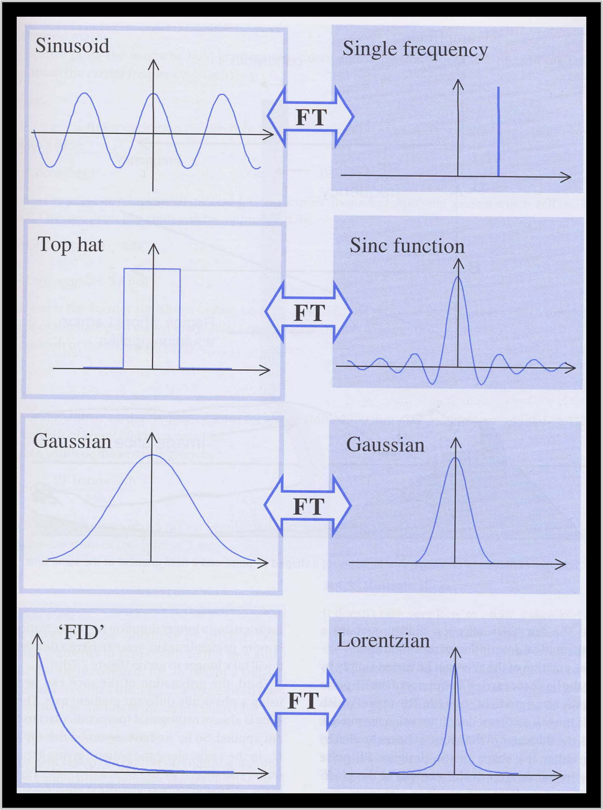

**Figure 5.6. Useful Fourier pairs that recur in MRI intuition.**

## 5.5 Magnetic field gradients as frequency encoders
The source slides return to the Larmor equation and then add a gradient along the x direction:

\[
\omega_0 = \gamma B_0,
\]

and with a gradient,

\[
\omega(x) = \gamma\big(B_0 + G_x x\big).
\]

This equation is one of the decisive transitions in MRI. It says that when a gradient is applied, spins at different positions experience different magnetic fields and therefore precess at different frequencies.

That is the essence of spatial encoding. Without a gradient, all positions would precess at the same base frequency \(\omega_0\). With a gradient, location along x becomes frequency-labeled.

Several practical consequences follow.

1. When the gradient is off, all points again precess at the same base rate determined by \(B_0\).
2. When the gradient is on, spins on one side of isocenter precess faster and spins on the other side precess slower.
3. The total field is what matters. The gradient does not replace \(B_0\); it perturbs it linearly across space.
4. The sign and magnitude of the gradient determine the direction and steepness of spatial frequency encoding.

## 5.6 One-dimensional MRI as the cleanest starting model
The slides wisely introduce **one-dimensional MRI** before two-dimensional imaging. If a gradient is applied along x, and the sample is thought of as a set of small spatial elements along x, then each element contributes signal with its own gradient-imposed precessional frequency.

In that picture,
- positions \(x_1, x_2, \ldots, x_n\) map to frequencies \(\omega_1, \omega_2, \ldots, \omega_n\),
- the total signal is the sum of all these contributions,
- and the Fourier transform of the measured waveform reveals the spatial distribution along x.

This is not yet full MRI, but it contains the central intuition: gradients translate position into spectral structure.

The source slide on other one-dimensional projections makes an important extension explicit. If the same logic is applied with a gradient along y instead of x, the scanner obtains a different 1D projection of the object. That means the encoding method is not tied to one privileged axis; it is a general strategy for turning position along a chosen direction into measurable spectral structure.

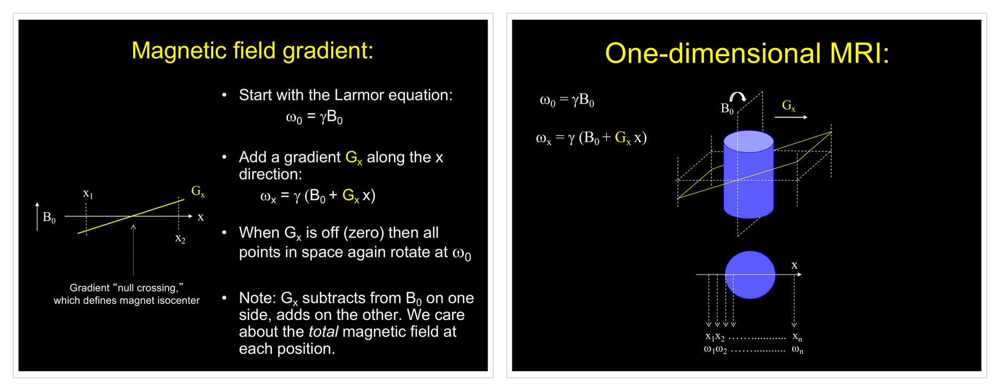

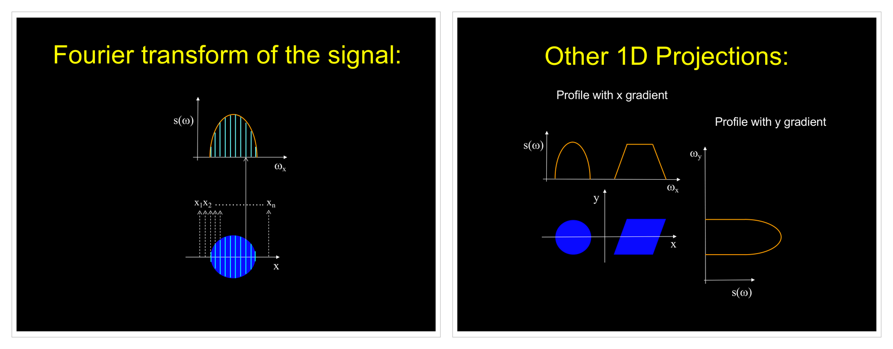

**Figure 5.7. One-dimensional gradient encoding and how position maps to frequency components.**

Gradient “ null crossing, ” which defines magnet isocenter.

Note: Gx subtracts from B0 on one side, adds on the other. We care about the total magnetic field at each position.

w x = g (B0 + Gx x).

x 1 x 2 ……….…. x n.

Profile with x gradient.

Profile with y gradient.

## 5.7 Projection imaging and the historical first MRI
The source deck references Paul Lauterbur’s first MRI work, which is historically important because it shows that image formation did not begin with fully modern k-space formalism. Early MRI development relied heavily on projection logic: acquire signals under different gradient directions and infer spatial structure from those projections.

This historical reminder matters pedagogically. MRI is not mysterious because it uses Fourier transforms; it is a natural extension of the idea that if different spatial locations are made to contribute distinguishable signal components, an image can be reconstructed.

It also clarifies why Lauterbur-style projection imaging belongs in this chapter rather than as a historical side note. Before modern 2D k-space language became standard, one could already see that different gradient directions produce different projections, and that enough complementary projections contain spatial information about the object. K-space formalism is the cleaner and more flexible modern language, but it grows out of the same encoding idea rather than replacing it with unrelated mathematics.

**The first MRI**

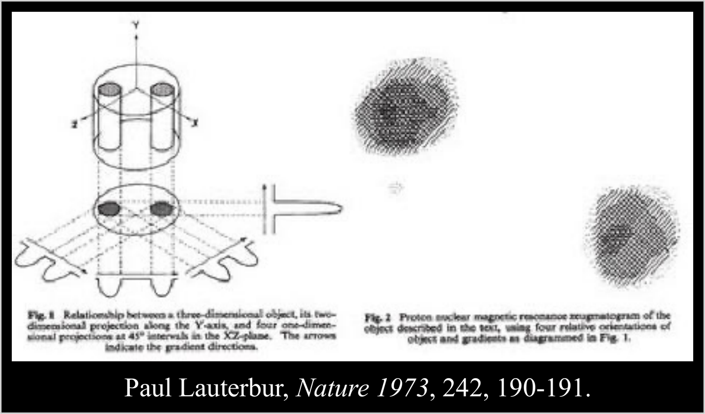

**Figure 5.8. Historical projection imaging and Lauterbur’s early MRI logic.**

## 5.8 From time-domain signal to spatial-domain description
The source slides set up the central MRI derivation by imagining the sample divided into small signal-producing chunks along x. Before a gradient is turned on, each chunk contributes simply according to its local magnetization.

With the gradient off,

\[
S(t) = \int M(x)\,dx,
\]

if one ignores relaxation and explicit phase evolution. Once the frequency-encoding gradient is turned on, each little chunk accumulates a phase proportional to position and time, and the signal becomes

\[
S(t) = \int M(x)e^{i\gamma G_x t x}\,dx.
\]

This is the point where the text should resist sounding more abstract than the physics really is. The receive coil still measures only one voltage from the whole excited sample. What changes when the gradient turns on is not that the coil suddenly knows where signal came from, but that each location begins contributing with a systematically different phase evolution. Fourier reconstruction works because the encoding itself has already converted position into distinguishable phase-frequency structure.

This is the central bridge equation. It says that the measured signal is the integral of the object weighted by a position-dependent phase factor imposed by the gradient.

If we then define a spatial-frequency coordinate,

\[
k_x = \frac{\gamma}{2\pi}\int G_x(t)\,dt,
\]

or, in the simple constant-gradient case used in the slides,

\[
k_x \propto \gamma G_x t,
\]

then the signal can be rewritten in the form

\[
S(k_x) = \int M(x)e^{i2\pi k_x x}\,dx,
\]

which is precisely a Fourier transform relationship between object space and k-space.

### A note on conventions
MRI literature uses slightly different Fourier conventions. Some write the exponent with \(i kx\), others with \(i2\pi kx\), depending on whether angular or cyclic frequency conventions are being used. The important point is not the bookkeeping constant. The important point is that **gradient area determines the sampled spatial frequency**.

## 5.9 Space and k-space are Fourier pairs
The slides state directly that space and k-space are Fourier pairs. This should be taken literally.

- **Image space** is where anatomy appears.
- **K-space** is a representation of the same object in spatial-frequency coordinates.

K-space is not a weird alternate image. It is not “halfway reconstructed anatomy.” It is the domain in which the scanner naturally collects encoded information.

One of the most useful conceptual shifts in MRI education occurs when a reader realizes that pulse sequences can be understood as **recipes for moving through k-space**.

## 5.10 Why this matters for the rest of MRI
Once the Fourier viewpoint is accepted, many later topics become much easier:
- slice selection becomes frequency selection under a gradient,
- gradient echo readout becomes a journey through k-space,
- phase encoding becomes a controlled displacement in ky,
- EPI becomes a rapid multi-echo raster through two-dimensional k-space,
- reduced resolution becomes omission of high spatial frequencies,
- and artifacts become errors in how k-space was sampled, shifted, or phase-corrupted.

This is why Fourier intuition is not just a mathematical prelude. It is the conceptual language of MRI pulse sequences.

---

### Why This Matters
If you do not understand why the Fourier transform belongs in MRI, later topics like k-space, EPI ghosting, partial Fourier, and parallel imaging will feel like disconnected tricks. If you do understand it, those later topics become variations on one idea: **the scanner encodes space into measurable phase and frequency patterns, then reconstructs the object by Fourier inversion**.

---

## Chapter 5 Summary
- MRI relies on Fourier relationships between time and frequency, and between space and k-space.
- Gradients make resonance frequency or phase depend on position.
- The measured MR signal under a gradient is the sum of many spatial contributions with position-dependent phase.
- That signal naturally takes the mathematical form of a Fourier transform of the underlying object.
- K-space is the spatial-frequency representation of the image, not a partial image in ordinary space.

## Key Terms
- Fourier transform
- Conjugate variables
- Spatial frequency
- K-space
- Frequency encoding
- Complex signal
- Euler relation
- Projection imaging

## Review Questions
1. What does it mean to say that time and frequency are conjugate variables?
2. Why does adding a gradient make MRI spatially informative?
3. What is the physical meaning of k-space?
4. Why is complex notation especially useful in MRI?
5. In plain language, what does the Fourier transform do for MRI reconstruction?

---

# Chapter 6. Gradients, Slice Selection, and Basic MRI Image Formation

## 6.1 Magnetic field gradients as controlled spatial encoders
Gradients are the practical devices that make MRI an imaging method rather than a bulk spectroscopy experiment. A gradient superimposes a linearly varying magnetic field on top of the main field. Because resonance frequency depends on total field, a gradient converts location into a predictable shift in phase or frequency.

But gradients do more than “label space.” Their time course controls how much phase accumulates. This makes them exquisitely flexible. The same gradient hardware can select a slice, generate a readout echo, encode phase, rewind unwanted dephasing, and steer a trajectory through k-space.

In practical MRI, gradients are therefore best understood not as background hardware but as dynamic sequence components that create the mapping between magnetization and image coordinates.

## 6.2 Slice selection with sinc-shaped RF pulses
The source slides introduce slice selection using one of the classic Fourier facts: the Fourier transform of a **sinc** is a **rectangular frequency profile** (and conversely, the transform of a rectangular profile is a sinc-like time-domain function).

This matters because a standard square RF pulse excites a broad frequency content with poor selectivity. If, instead, a **sinc-modulated RF pulse** is used, then its frequency-domain profile becomes much more sharply bounded. That makes it possible to excite only a controlled frequency band.

Now combine this selective RF pulse with a gradient applied along z. Under the gradient, resonance frequency depends on z position. Therefore a selected frequency band corresponds to a selected spatial band. That spatial band is the **slice**.

This is one of the most elegant uses of Fourier thinking in MRI: a shape in time is chosen so that its transform has the right frequency selectivity, and the gradient converts that frequency selection into spatial selection.

One practical consequence should be stated explicitly. The RF pulse does not determine only how thick the slice is; its **center frequency** also determines where the slice sits along z when the gradient is on. Holding \(G_z\) fixed while shifting the RF center frequency moves the selected slice up or down the body. In other words, gradient strength sets the frequency-to-position slope, RF bandwidth helps set thickness, and RF center frequency selects slice position.

## 6.3 How slice thickness is determined
The source slides explain slice thickness in a practical way: if the RF pulse defines an excited frequency bandwidth \(\Delta \nu\), and a slice-selection gradient \(G_z\) maps frequency to position, then the selected thickness \(\Delta z\) is proportional to the ratio of RF bandwidth to gradient strength.

In conceptual form,

\[
\Delta z \propto \frac{\Delta \nu}{\gamma G_z}.
\]

This means slice thickness can be changed in two main ways:
1. change the gradient strength, or
2. change the RF pulse bandwidth.

The source slides point out an important practical preference. If one wants to halve slice thickness, one could double \(G_z\), or alternatively lengthen the RF pulse so that its bandwidth narrows appropriately. In many practical settings, it is preferable to adjust the gradient and keep RF pulse duration fixed if possible, because changing pulse duration has broader consequences for sequence timing and efficiency.

This is a good example of how sequence design balances theory with operational convenience. Theoretically, multiple knobs can achieve the same slice thickness. Practically, some knobs are more convenient than others.

The source figure also helps separate two different slice-design decisions that beginners often blur together: **where the slice is** and **how thick it is**. Slice position is set by the center of the selected frequency band under the gradient. Slice thickness is set by how wide that selected band is relative to the gradient slope. The same sequence can therefore move a slice without changing its thickness, or change its thickness without moving its center, depending on which control parameter is altered.

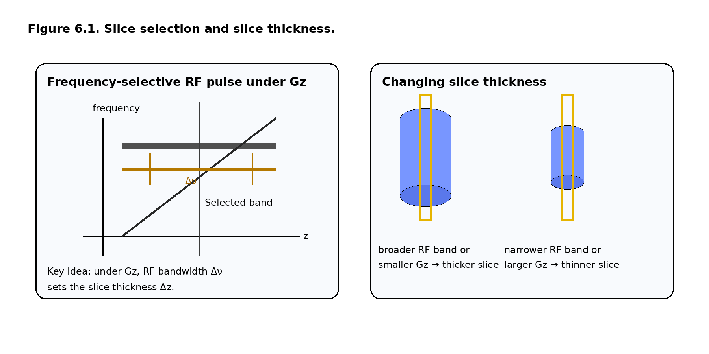

**Figure 6.1. Sinc-shaped RF pulse and rectangular excitation bandwidth, showing frequency-selective slice selection under Gz.**

Instead of using an on-off (square) RF pulse for excitation, if we use a sinc-shaped RF pulse then we can select a square “ notch ” of frequencies centered about the frequency of the RF pulse.

To change slice thickness we can change Gz. If we double Gz (bottom) we halve the slice thickness.

Alternatively, we could change the RF pulse length. Since time and frequency are inverses, to halve the slice thickness we would need to double the duration of the sinc-shaped RF pulse. Hence, we control Gz if we can, and keep the RF pulse duration fixed.

## 6.4 Why slice selection needs a refocusing gradient
The source slides emphasize that slice selection requires more than simultaneous RF excitation and a gradient. During the RF pulse, the slice-selection gradient also introduces **phase dispersion** across the slice. If nothing were done about this, the slice would be selected, but the magnetization within it would already be partially dephased.

To compensate, a slice-select **refocusing gradient lobe** is applied. Its purpose is to reverse the phase accumulation caused by the slice-selection gradient so that the net phase of the selected magnetization is re-centered.

The practical lesson is important: many gradients in MRI serve dual roles. The same gradient that enables a desired encoding operation may also create unwanted dephasing that must later be undone.

The source slide is helpful here because it marks the moment where the **phase of magnetization is zero** again. That is the operational target of the slice-refocusing lobe. The lobe area is not chosen arbitrarily; it is chosen so that the phase winding introduced while \(G_z\) overlaps the RF pulse is balanced back out. If this balance is wrong, the nominally selected slice begins the rest of the sequence carrying residual phase from the selection step itself.

**Slice selection also needs a refocusing gradient (echo) in practice**

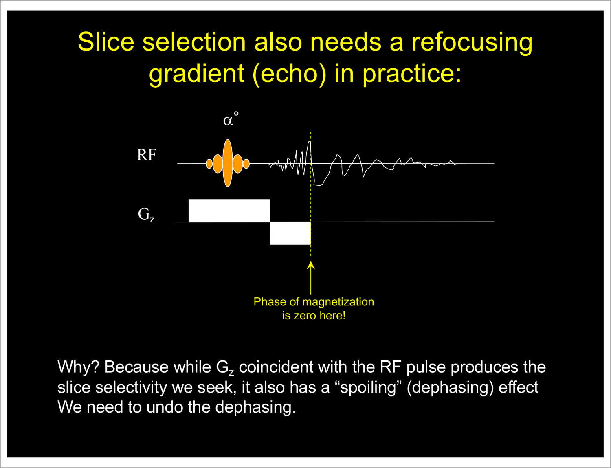

**Figure 6.2. Slice-selection gradient plus refocusing lobe.**

Why? Because while Gz coincident with the RF pulse produces the slice selectivity we seek, it also has a "spoiling" (dephasing) effect. We need to undo the dephasing.

## 6.5 Gradient echoes: reversible gradient-induced dephasing
The source deck next turns to the **gradient echo (GRE)** as a readout mechanism. This is another sequence that makes sense immediately once gradients are understood as phase-imposing devices.

If a gradient is applied in one direction, spins at different positions dephase relative to each other. But unlike intrinsic microscopic T2 processes, this gradient-induced dephasing is controlled and reversible. If a later gradient of opposite sign is applied with the right area, the phase dispersion can be canceled, bringing the magnetization back into coherence and producing a **gradient echo**.

This is the gradient analogue of refocusing, but the key distinction is that it does **not** use a 180° RF pulse. It uses balanced gradient moments instead.

## 6.6 Gradient echo formation step by step
The source slides break gradient echo formation into three periods. That staged explanation is worth preserving.

1. **Initial dephasing period.** A readout gradient drives magnetization away from coherence by making position-dependent phase accumulate.
2. **Rephasing period.** A gradient of opposite sign drives the system back toward zero net phase.
3. **Second dephasing/readout period.** After the echo center is reached, continued gradient evolution dephases the signal again while the readout samples it.

The source slides also emphasize the point of zero phase coherence: the moment when all the reversible gradient-induced dispersion has been undone. That instant is the gradient echo center.

This stepwise view is especially useful because it later becomes the language of k-space traversal. Periods 1, 2, and 3 are not just phase manipulations in image space; they are directed movements through k-space.

The acquisition window shown in the source slides also deserves a practical reading. Readout is arranged around the echo center rather than beginning at it. Early samples are collected while the trajectory is still moving toward maximum coherence, and later samples are collected after the trajectory has passed through that point and is moving away again. This is why one often acquires both the rephasing and dephasing sides of the echo rather than discarding one side entirely.

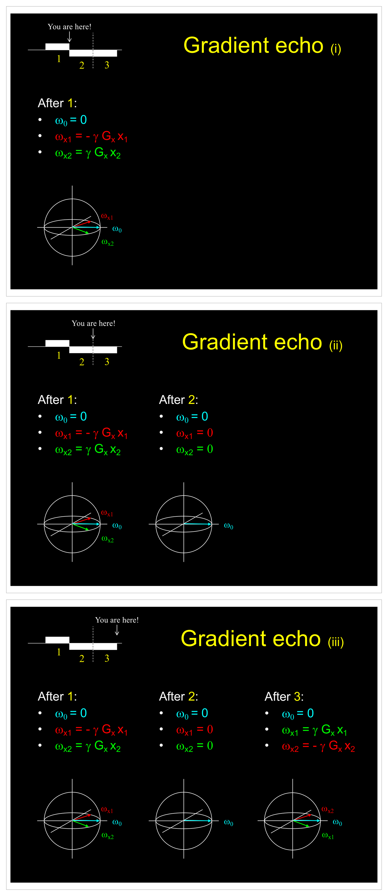

**Figure 6.3. Three-stage gradient-echo formation sequence.**

The dephasing effect of gradient 1 can be undone by reversing the direction of the gradient 2.

Gradient dephasing is reversible.

Receiver.

Phase of magnetization is zero here!

Acquiring the rephasing plus the dephasing magnetization (segments 2 + 3) provides ~sqrt(2) more signal than 2 or 3 alone. • A gradient echo adds some time between RF excitation and detection. • Does NOT refocus T2 ’ effects! • A gradient echo is very different from a spin echo!

Acquire.

## 6.7 Why a gradient echo is not a spin echo
The source material explicitly warns that a gradient echo is very different from a spin echo. This deserves strong emphasis.

A **spin echo** uses a 180° RF pulse to reverse certain types of dephasing caused by static field offsets. A **gradient echo** only reverses dephasing caused by the applied gradient moments themselves. It does **not** refocus dephasing associated with \(T_2'\) or other susceptibility-related field inhomogeneity effects.

That is why gradient echoes are intrinsically sensitive to **T2*** rather than pure T2. This is exactly why gradient-echo EPI is so useful for BOLD fMRI—and also why it is so vulnerable to susceptibility artifact.

## 6.8 Signal gain and readout timing in GRE
The source slides make a subtle but practically interesting point: acquiring both the rephasing and dephasing sides of the gradient echo yields about \(\sqrt{2}\) more signal than acquiring only one side. This reflects the benefit of collecting more of the coherent echo waveform rather than discarding half of it.

The slides also note that a gradient echo introduces time between excitation and signal detection. This matters because signal continues to decay during that interval. Echo formation is useful, but it is not free. Longer echo times increase T2* weighting and can improve BOLD sensitivity, but they also reduce signal amplitude and worsen dropout or distortion vulnerabilities.

This is another place where the GRE-versus-spin-echo distinction matters practically. A gradient echo can be timed and sampled efficiently, but the reward for that efficiency is that the signal remains exposed to off-resonance and \(T_2'\) effects throughout the interval. The same timing choice that increases sensitivity to susceptibility-driven contrast also increases susceptibility to susceptibility-driven artifact.

## 6.9 From slice selection to basic image formation
By this stage the basic pieces of an MRI image are in place:
1. use RF plus a gradient to select a slice,
2. control phase and frequency with gradients,
3. generate a detectable echo,
4. record the signal during a controlled trajectory through spatial-frequency space,
5. and reconstruct the image with a Fourier transform.

The remaining conceptual step is to describe that trajectory explicitly. That is the job of k-space.

---

### Common Confusion: dephasing is not always permanent
Students often learn “dephasing means signal loss” and stop there. The more accurate statement is that **some dephasing is reversible and some is not**. Gradient-induced phase dispersion is deliberately reversible. T2* losses from field inhomogeneity are not fully reversed by a gradient echo. This distinction is one of the foundations of later fMRI artifact physics.

---

## Chapter 6 Summary
- Slice selection uses a frequency-selective RF pulse during a gradient, converting a selected frequency band into a selected spatial slice.
- Slice thickness depends on RF bandwidth and gradient strength.
- Slice selection also creates unwanted phase dispersion, so a refocusing gradient is required.
- Gradient echoes are formed by reversing gradient-induced dephasing with balanced gradient moments.
- Gradient echoes are not spin echoes; they do not refocus susceptibility-related T2* effects.
- GRE timing choices affect signal, contrast, and later artifact burden.

## Key Terms
- Slice selection
- Sinc pulse
- Slice thickness
- Refocusing gradient
- Gradient echo
- T2*- Readout gradient
- Echo center

## Review Questions
1. Why is a sinc-shaped RF pulse useful for slice selection?
2. How can slice thickness be changed in practice?
3. Why does slice selection require a refocusing lobe?
4. Why is a gradient echo sensitive to T2* effects?
5. What is the difference between reversible gradient dephasing and spin-echo refocusing?

---

# Chapter 7. K-Space: The Organizing Language of MRI

## 7.1 What k-space is and what it is not
K-space is often introduced visually before it is explained conceptually, which is why students sometimes mistake it for a strange “pre-image.” The source slides correctly describe it as a useful pictorial representation of imaging pulse sequences. That is an excellent starting definition.

K-space is the domain in which MRI stores **spatial-frequency information**. Every point in k-space represents a particular Fourier component of the image. The final image is obtained by taking the inverse Fourier transform of the fully sampled k-space data.

K-space is therefore not:
- a distorted image waiting to be fixed,
- a direct map of anatomy,
- or a separate physical space inside the scanner.

It is a coordinate system for describing what spatial frequencies of the object have been sampled.

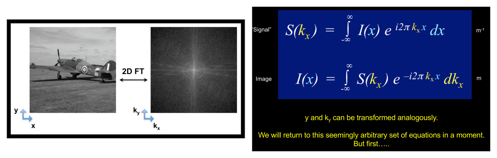

**Figure 7.1. Image space versus k-space, showing that they are Fourier pairs rather than different anatomical spaces.**

## 7.2 The Fourier transform of an image
The source slides show that if one takes the two-dimensional Fourier transform of an ordinary image, one gets its reciprocal-space representation. That is the cleanest way to see why k-space exists. The image and k-space contain the same information, but expressed differently.

The image tells us where structures are.
K-space tells us what spatial frequencies are present.

In practical MRI, we typically acquire the k-space representation first and reconstruct the image second.

## 7.3 Frequency encoding as movement through kx
The source slides derive the key x-dimension signal relationship under a readout gradient:

\[
S(t) = \int M(x)e^{i\gamma G_x t x}\,dx,
\]

which can be rewritten as

\[
S(k_x) = \int M(x)e^{i2\pi k_x x}\,dx
\]

once one defines kx appropriately from gradient area.

This means that turning on the read gradient causes the system to **move through kx**. When the gradient is off, kx is static. When the gradient is on, kx changes according to gradient amplitude and time.

The source slides put this beautifully: the action of the gradient is to **trace a path through the Fourier transform of the image**. That sentence is worth keeping almost verbatim because it captures the physical meaning of readout better than many formal derivations do.

The source slide immediately after the derivation sharpens that intuition in an operational way: when \(G_x\) is off, \(k_x\) is static; when \(G_x\) is on, \(k_x\) changes with both gradient magnitude and elapsed time. In other words, readout is not merely "collecting signal." It is steering the acquisition point through a specific sequence of spatial frequencies. A stronger gradient or a longer duration pushes the trajectory farther through k-space; reversing gradient polarity reverses the direction of travel.

## 7.4 Gradient area is the real k-space control variable
The source slides summarize the k parameter as the time integral of a gradient. In its standard form,

\[
k(t) = \frac{\gamma}{2\pi}\int_0^t G(\tau)\,d\tau.
\]

This is one of the most operationally useful equations in MRI.

It tells us that k-space position is determined not by gradient amplitude alone and not by duration alone, but by **gradient area**. That means:
- a strong short gradient and a weaker longer gradient can reach the same k-space point if their areas match,
- rewinder gradients move the trajectory backward by contributing opposite area,
- and complicated sequences can be understood by mentally integrating gradient waveforms over time.

This is why the source slides urge the reader to do a “mental integration” of the pulse sequence. That mental habit is central to MRI fluency.

## 7.5 The gradient echo as a k-space journey
In the source deck, the gradient echo is reinterpreted as a path through k-space.

- Before period 1, the system begins at the origin: \((k_x, k_y) = (0,0)\).
- Period 1 moves the trajectory away from the origin.
- Period 2 returns the trajectory toward the center.
- Period 3 carries it past the origin in the opposite direction while the echo is sampled.

This is a profound conceptual simplification. Instead of thinking of readout only in terms of spins being more or less dephased, one thinks in terms of where in k-space the sequence is at each moment.

The stepwise source slides make the geometry more concrete still. After the first gradient episode the trajectory sits at one edge of the sampled \(k_x\) range. The rephasing episode walks it back toward the center. The actual echo center occurs when the trajectory crosses the origin, where low spatial frequencies are sampled. Continued readout then carries the system to the opposite side of \(k_x\). That is why the readout window naturally spans both sides of central k-space rather than starting or ending there by accident.

That perspective generalizes immediately to phase encoding and to EPI.

## 7.6 Phase encoding as movement through ky
The source slides next introduce a second gradient episode, \(G_y\), which encodes position in the y direction as phase. Just as frequency encoding made x-position contribute a distinct oscillatory term, phase encoding makes y-position contribute a distinct accumulated phase.

The y-dimension signal relationship is analogous:

\[
S(k_y) = \int M(y)e^{i2\pi k_y y}\,dy,
\]

with

\[
k_y = \frac{\gamma}{2\pi}\int G_y(t)\,dt.
\]

Importantly, the phase-encoding gradient is usually applied in a short episode before readout, not during acquisition of the readout itself. Otherwise the simultaneous presence of both gradients would create an oblique effective encoding direction during data collection.

In practical terms, phase encoding shifts the trajectory to a chosen ky value, and then the readout gradient sweeps through kx at that ky level.

The source sequence diagrams make this easier to visualize than prose alone. A brief \(G_y\) episode changes which horizontal line of 2D k-space will be sampled next. The subsequent \(G_x\) readout then traverses that line. Repeating the experiment with a different \(G_y\) area changes the next line. That is the whole logic of line-by-line 2D sampling.

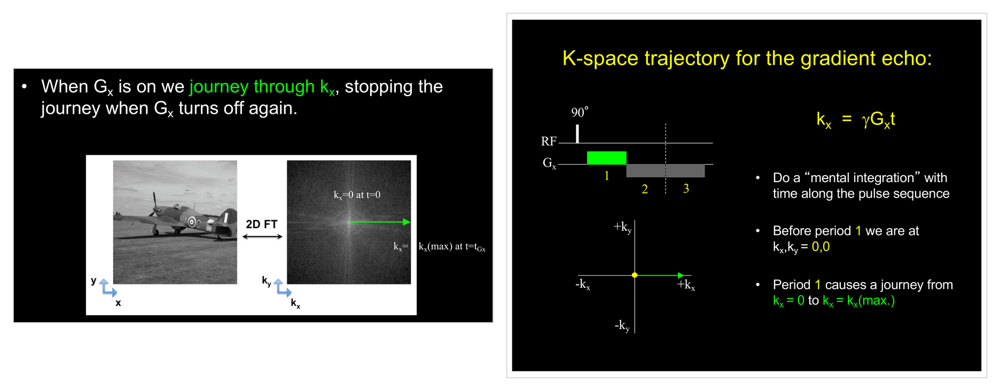

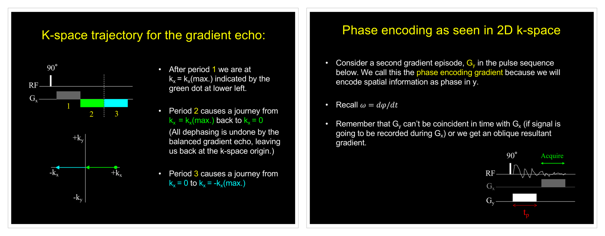

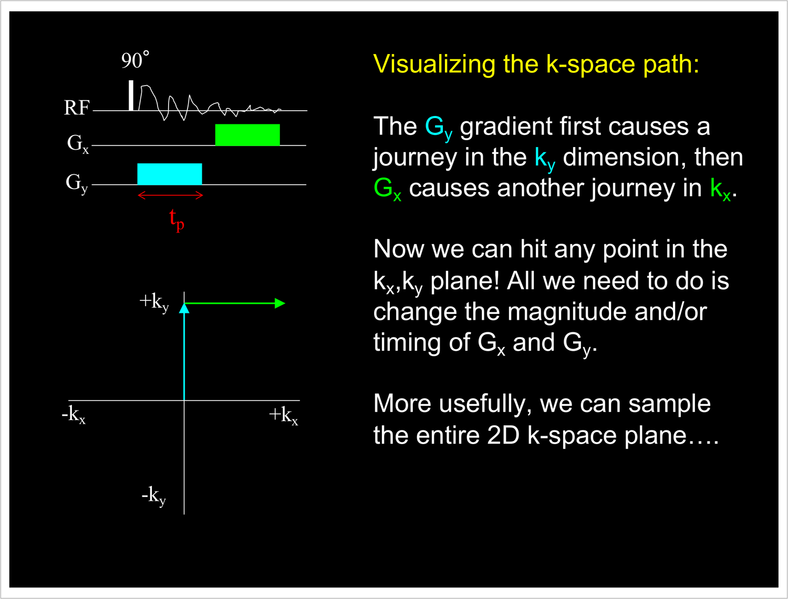

**Figure 7.2. Gradient-echo trajectory through kx and phase-encoding shifts through ky.**

At t=0 the gradient is off; we are at the origin, k x =0.

k x = g Gx t.

Do a “ mental integration ” with time along the pulse sequence.

Before period 1 we are at k x,k y = 0,0.

Period 1 causes a journey from k x = 0 to k x = k x (max.).

After period 1 we are at k x = k x (max.) indicated by the green dot at lower left.

Period 2 causes a journey from k x = k x (max.) back to k x = 0 (All dephasing is undone by the balanced gradient echo, leaving us back at the k-space origin.).

Period 3 causes a journey from k x = 0 to k x = -k x (max.).

Consider a second gradient episode, Gy in the pulse sequence below. We call this the phase encoding gradient because we will encode spatial information as phase in y.

Remember that Gy can’t be coincident in time with Gx (if signal is going to be recorded during Gx) or we get an oblique resultant gradient. Acquire.

The Gy gradient first causes a journey in the k y dimension, then Gx causes another journey in k x.

Now we can hit any point in the k x,k y plane! All we need to do is change the magnitude and/or timing of Gx and Gy.

More usefully, we can sample the entire 2D k-space plane….

## 7.7 Filling a two-dimensional k-space matrix
The source slides show how repeated acquisitions with different phase-encoding amplitudes can fill a 2D grid of k-space points. A small example using a 16 × 16 grid makes the basic logic visible.

Each repetition of the pulse sequence:
1. selects the slice,
2. applies a chosen phase-encoding step to set the ky position,
3. reads across kx during the readout,
4. and stores one line of k-space.

Repeat that process across all required ky values, and the full 2D k-space matrix is obtained.

A two-dimensional Fourier transform of that matrix then yields the 2D image.

The source slides summarize 2D MRI in exactly this way:
1. select a slice,
2. fill the k-space matrix,
3. take the 2D Fourier transform.

That is as good a minimal description of MRI image formation as one can give.

The 16-by-16 example in the source deck is worth treating as more than a toy picture. It shows that the matrix size is not decorative bookkeeping; it is the actual number of sampled spatial-frequency locations. Each green line in the figure is one readout at a chosen ky value. A fully sampled matrix means the trajectory has visited every required line. An incompletely sampled matrix means some spatial-frequency information is missing and the image must either blur, alias, or rely on additional reconstruction assumptions.

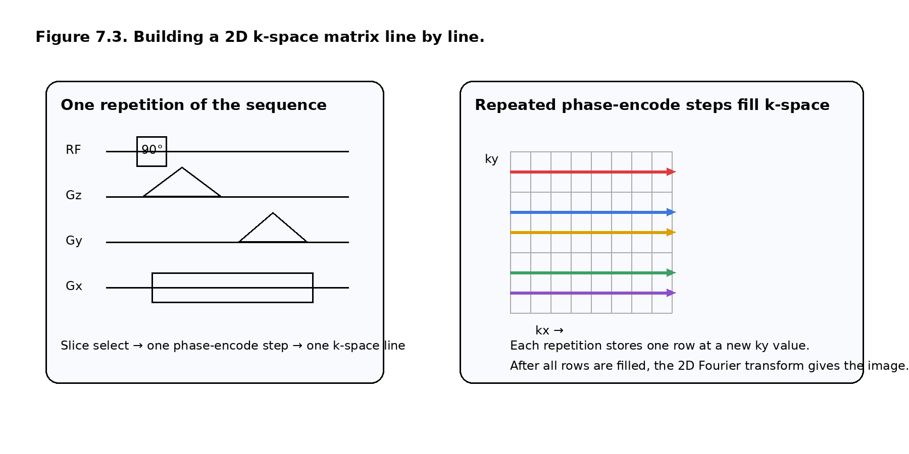

**Figure 7.3. Building a 2D k-space matrix line by line.**

1. Select a slice.

2. Fill the k-space.

The k parameter is simply the time-integral of a gradient multiplied by a coefficient, g /2 p:.

We can now see that in MRI, the conjugate variable for space is the gradient area. So, if we know what gradients are being applied, we can easily relate them to the image we will obtain!

## 7.8 What low and high spatial frequencies contribute
One of the most important intuitive lessons in k-space comes from seeing what happens when parts of k-space are removed.

The central region of k-space contains **low spatial frequencies**. These contribute broad contrast, gross shape, and coarse intensity variation.

The outer regions contain **high spatial frequencies**. These contribute edges, sharp transitions, and fine detail.

The source slides illustrate this with examples of reduced resolution and high-spatial-frequency-only content. These are textbook-worthy because they cure one of the most common misunderstandings: many students incorrectly assume the center of k-space corresponds to the center of the image. It does not. It corresponds to low spatial frequencies across the whole image.

The visual examples also show why this matters. Keeping only the center of k-space still preserves a recognizable image, but the result is blurred because broad contrast is retained while fine detail is missing. Keeping only the edges of k-space does almost the opposite: boundaries and sharp transitions remain emphasized, but the overall anatomical shading and low-contrast structure become impoverished. The image has not been "cropped." Its frequency content has been selectively filtered.

## 7.9 Reduced resolution and selective loss of k-space content
If one omits high spatial frequencies, the image becomes blurred and reduced in resolution. Boundaries soften because fine detail is missing.

If one keeps only high spatial frequencies, broad intensity structure is lost and the image becomes edge-like, emphasizing transitions but not overall anatomy.

This perspective is essential for later understanding of acceleration methods and reconstruction artifacts. Many practical acquisition compromises effectively reshape or incompletely sample k-space, and the resulting image changes should be interpreted as changes in spatial-frequency content rather than mysterious visual side effects.

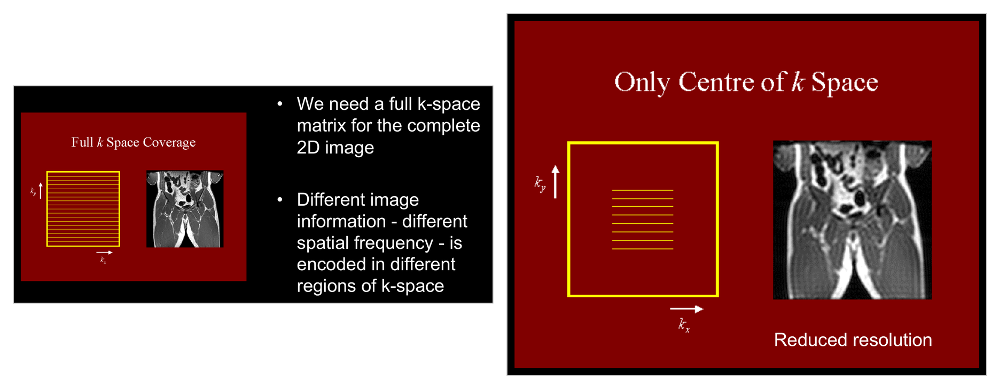

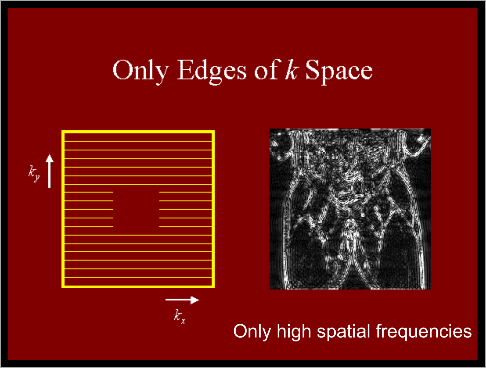

**Figure 7.4. Effects of preserving only low or high spatial frequencies; reduced resolution and edge-enhanced images.**

## 7.10 Aliasing (wrap-around)
The source slides then turn to **aliasing**, also called **wrap-around**. Aliasing occurs when the object extends beyond the field of view in an encoded dimension, or equivalently when sampling is insufficient to represent the full spatial extent without ambiguity.

In image space, anatomy from outside the nominal field of view appears wrapped into the image.

In Fourier terms, aliasing is not a random artifact. It is the expected consequence of insufficient sampling. This matters later in EPI as well, because some ghost images and accelerated-imaging artifacts can be understood as special forms of aliasing or controlled unaliasing failure.

The source slide makes the practical control knob obvious by comparing different fields of view. If the field of view in the encoded dimension is too small for the object, anatomy beyond the sampled extent folds back into the image. Increasing the field of view in that dimension reduces or removes the wrap-around. This is a useful reminder that aliasing is often a geometry-and-sampling decision before it becomes a reconstruction complaint.

## 7.11 Truncation artifact (Gibbs ringing)
The source slides explicitly identify **truncation artifact**, also known as **Gibbs ringing**. This artifact occurs when k-space is abruptly truncated, especially when a sharp edge in image space is represented by an insufficient number of Fourier components.

The result is oscillatory overshoot and undershoot near sharp intensity boundaries.

This is a beautiful illustration of the fact that Fourier reconstruction is exact only for fully and appropriately represented spatial frequencies. Sharp edges require broad frequency support. If that support is cut off, oscillatory ringing appears.

In practice, Gibbs ringing is often visible near high-contrast boundaries, such as tissue-fluid interfaces or edges of structures in high-resolution imaging.

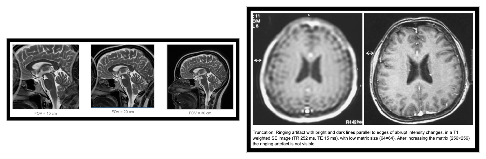

**Figure 7.5. Aliasing and truncation artifact examples.**

## 7.12 Gradient switching and stimulation limits
The last slide in this source block mentions **stimulus limits** and effective current loops induced by gradient switching. This is a practical point that belongs in a textbook even though it is easy to overlook.

Rapidly switched magnetic field gradients induce electric fields in conductive tissue. If switching is strong enough, these induced fields can stimulate peripheral nerves or produce uncomfortable sensations. Thus, gradient performance is constrained not only by hardware capability but also by physiologic tolerance and safety limits.

This is a useful reminder that sequence design is not governed only by image quality. It is also bounded by human safety and comfort.

Placed next to the preceding k-space discussion, the slide serves another purpose: it explains why one cannot always make echo spacing shorter simply by demanding more aggressive gradient switching. The limiting factors are not only amplifier strength and duty cycle. Human physiology imposes limits too. Practical sequence design therefore lives inside a box set by image goals, hardware, and safety at the same time.

---

### Practical Scanner Implication
Whenever you change resolution, field of view, bandwidth, or acceleration, ask yourself: **what part of k-space sampling am I changing?** This question is often more useful than asking, “what parameter menu option did I modify?”
---

## Chapter 7 Summary
- K-space is the spatial-frequency representation of the image.
- Gradient area, not just gradient amplitude, determines k-space position.
- Frequency encoding sweeps through kx; phase encoding selects ky positions.
- MRI images are formed by filling a k-space matrix and applying a 2D Fourier transform.
- Central k-space contains low spatial frequencies; outer k-space contains high spatial frequencies.
- Reduced resolution, aliasing, and Gibbs ringing all follow naturally from how k-space is sampled or truncated.
- Gradient switching is limited not only by engineering but also by physiologic stimulation constraints.

## Key Terms
- K-space
- Spatial frequency
- Gradient area
- Frequency encoding
- Phase encoding
- Field of view
- Aliasing
- Gibbs ringing
- Peripheral nerve stimulation

## Review Questions
1. Why is gradient area the natural control variable for k-space position?
2. What is the difference between the roles of kx and ky in a standard 2D acquisition?
3. Why does loss of high spatial frequencies reduce resolution?
4. Why does aliasing occur?
5. What is the physical basis of Gibbs ringing?
6. Why can gradient switching not simply be made arbitrarily fast?

---

# Chapter 8. Echo-Planar Imaging (EPI): Why fMRI Is Fast

## 8.1 What makes EPI different
The source slides describe EPI k-space as a **multiple gradient echo sequence**. That is an excellent operational definition. Unlike conventional imaging, where each excitation typically fills only one line of k-space, EPI acquires a long train of echoes after a single excitation and uses them to sample many lines of k-space rapidly.

This is the practical reason EPI became the backbone of fMRI. Whole-brain functional imaging requires repeated sampling over time. If each image required many separate excitations and long delays, temporal resolution would be poor. EPI solves this by being extraordinarily efficient in k-space coverage.

## 8.2 The EPI trajectory
The classic EPI trajectory is a rapid raster or zig-zag across two-dimensional k-space. A strong readout gradient alternates polarity, sweeping left-to-right on one line and right-to-left on the next. Between readouts, small phase-encoding “blips” step the trajectory to the next ky line.

The source slides illustrate this with the first several echoes of a 16-echo train. Although that small matrix is pedagogical, the logic scales directly to modern EPI.

The key point is that EPI converts one excitation into a long, densely packed sampling trajectory through k-space. That is what makes it fast. It is also what makes it fragile.

Fragility follows from the same sequence feature that provides speed. Once the EPI train begins, every line must be sampled with consistent timing, consistent gradient behavior, and consistent odd-even polarity correction. There is very little slack. Timing asymmetry, gradient mismatch, off-resonance accumulation, or motion during the train do not merely add generic noise; they change how specific lines of k-space are represented and therefore change the reconstructed image in structured ways.

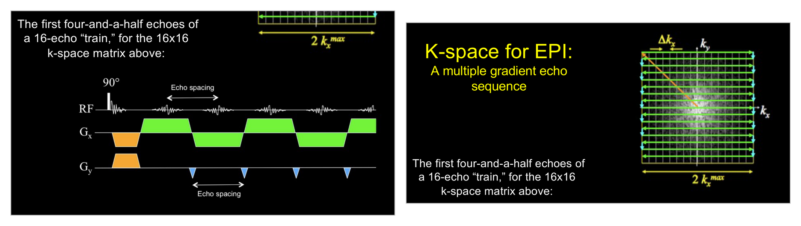

**Figure 8.1. Zig-zag EPI k-space trajectory with alternating read gradients and phase-encoding blips.**

## 8.3 Why EPI is efficient enough for fMRI
Several features make EPI attractive for fMRI:
- it covers large portions of k-space very quickly,
- it supports whole-brain repeated imaging,
- it provides natural T2* sensitivity when implemented as gradient-echo EPI,
- and it can be combined with multislice, multiband, and acceleration methods.

Because BOLD contrast is a T2*-weighted phenomenon, EPI’s susceptibility sensitivity is not merely a nuisance. It is part of why the method works for functional imaging at all.

This is one of the central tradeoffs of the field: the very mechanism that gives EPI BOLD sensitivity also amplifies its vulnerability to susceptibility artifact.

## 8.4 Echo spacing and why long readouts are dangerous
The source slides later quantify why EPI becomes artifact-prone: one axis of the acquisition is sampled very rapidly, while the phase-encoded axis is effectively updated much more slowly. Echo spacing matters because during the long EPI train, the magnetization continues to evolve under T2* decay and local field inhomogeneity.

The longer the total readout:
- the more time there is for geometric warping,
- the more severe susceptibility-related misregistration becomes,
- the greater the phase mismatch risk between odd and even lines,
- and the more likely signal dropout or blur becomes.

One can phrase the asymmetry this way. Samples within a readout line are separated by very short dwell times, but successive ky updates are separated by the much larger echo-spacing interval. That means off-resonance and T2* decay have far more opportunity to accumulate their consequences between phase-encode steps than within a single read line. The result is an acquisition with one relatively robust axis and one extremely vulnerable low-bandwidth axis.

EPI is therefore best thought of as a time-pressured acquisition. It wins speed, but every extra moment during the readout is costly.

## 8.5 The three classic EPI artifacts as a structural consequence
The source slides identify three classic EPI artifact categories:
1. **ghosting**,
2. **distortion**,
3. **dropout**.

This classification is pedagogically useful because it reflects three different failure modes of the same fast readout strategy.

- Ghosting arises when the intended k-space trajectory is sampled inconsistently, especially between alternating readout lines.
- Distortion arises because local off-resonance displaces signal along the slowly encoded direction.
- Dropout arises because transverse coherence is lost so strongly in some regions that little usable signal remains.

In practical reading terms, ghosting creates displaced replica structure, distortion warps anatomy away from its true geometry, and dropout creates focal signal voids where there is too little coherent signal left to measure reliably. Those image appearances differ, but they are all consequences of the same general fact: EPI spends a long time reading out a T2*-sensitive signal under nonideal field conditions.

All three stem from the fact that EPI trades readout stability for speed.

That is why the three artifacts should be taught together before they are separated. They are not unrelated nuisances. They are three ways in which a long gradient-echo train can fail: inconsistent trajectory sampling creates ghosts, off-resonance misregistration creates distortion, and severe intravoxel dephasing creates dropout. Chapter 9 then unpacks each mechanism with dedicated figures and artifact-specific examples.

## 8.6 Multislice EPI and slice ordering
The source slides also cover **slice order** in multislice EPI: ascending, descending, and interleaved. This may sound like a housekeeping detail, but it can matter practically.

If adjacent slices are acquired in immediate succession, imperfect slice profiles and repeated excitations can lead to cross-talk or spin-history effects. Interleaving is often used to reduce such interactions. However, motion complicates the situation. As the source slides note, slice-order choice can interact with motion and spin history.

The source deck goes beyond naming the slice orders and shows standard-deviation images for descending versus interleaved acquisition. That comparison matters. Slice order changes which slices are temporally adjacent, which in turn changes how motion, imperfect slice profiles, and partial saturation produce striping or slice-to-slice instability. Interleaving is therefore a practical countermeasure, not merely a housekeeping convention.

This means slice timing is not just an analysis nuisance. It is also an acquisition-level phenomenon that can affect what signal is present in the first place.

The no-motion versus motion comparison in the source material sharpens that point. With little motion, slice-order choice may seem almost invisible in the final images. Once motion is present, however, different ordering strategies can produce visibly different spin-history artifacts and instability patterns. Slice order is therefore partly a statement about how the sequence will behave when a real participant fails to remain perfectly still.

## 8.7 EPI pros and cons
The source slides summarize the central compromise of EPI nicely:
- T2* relaxation during the readout causes image artifacts.
- But EPI is fast, and when speed is imperative, one accepts the artifacts and manages them.
- BOLD contrast depends on T2* changes when using gradient-echo sequences like EPI.

This can be sharpened into a more complete practical statement.

### Advantages of EPI
- very rapid acquisition,
- compatible with whole-brain repeated imaging,
- strong T2* sensitivity for BOLD,
- supports advanced acceleration strategies.

### Disadvantages of EPI
- high sensitivity to susceptibility variation,
- strong vulnerability to distortion and dropout,
- odd/even line mismatch and ghosting risk,
- sensitivity to motion and instability,
- and more difficult reconstruction than slower, simpler readouts.

## 8.8 Crusher gradients and real EPI pulse sequences
The source slides include a “real EPI pulse sequence” and mention **crusher gradients**, including fat-signal crushers and spurious-water crushers. In textbook form, this belongs in a practical section on making the idealized sequence actually work.

Real pulse sequences include additional gradient moments and correction components for several reasons:
- suppress unwanted residual transverse coherences,
- manage fat contamination,
- handle ghost correction,
- establish correct slice selection,
- and produce the intended k-space echo train.

The source slides make two especially practical points here. First, the sequence contains fat-signal and spurious-water crusher gradients because real tissue produces unwanted coherence pathways that a cartoon sequence diagram usually ignores. Second, the sequence includes explicit N/2 ghost-correction echoes before the main train. That detail is easy to miss, but it reinforces a major lesson: modern EPI devotes sequence real estate to measuring and correcting odd-even readout mismatch because the acquisition would otherwise be too vulnerable to Nyquist ghosting.

This is a useful caution against overlearning simplified diagrams. Educational sequence schematics often show only the core logic; actual scanner implementations contain many additional components needed for robustness.

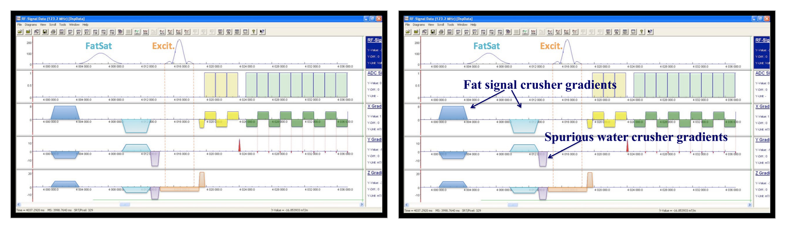

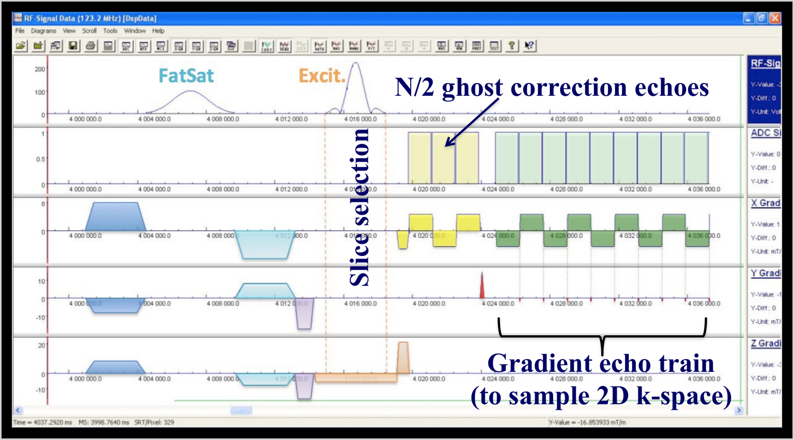

**Figure 8.2. Real EPI pulse sequence with slice select, echo train, and correction components.**

## 8.9 What a good EPI dataset looks like
The source slides include “Good EPI” examples and a temporal-SNR image. This is important because practical MRI competence is not only about knowing artifacts when they are obvious. It is also about knowing what normal, acceptable data look like.

A good EPI dataset should typically show:
- consistent anatomy across slices,
- manageable and expected susceptibility losses rather than catastrophic dropout,
- minimal visible Nyquist ghosting,
- no strong residual wrap-around or aliasing,
- stable temporal behavior across the run,
- and a temporal SNR pattern consistent with coil geometry and known physiology.

The source examples also matter because they show good axial, coronal, and sagittal EPI rather than a single favored slice. A dataset can look acceptable in one plane yet reveal severe stretching, dropout, or wrap-around in another. Practical inspection should therefore cross-check multiple planes instead of relying on one reassuring snapshot.

The source slide is effectively using reference examples as a training set for the eye. That is worth preserving in textbook form. Good EPI quality is not defined only by absence of catastrophic failure; it is learned by comparing real data against known-good axial, coronal, and sagittal examples and asking whether anatomy, distortion burden, and ghosting level remain within the expected range in each orientation.

## 8.10 Temporal SNR as a quality metric
Temporal SNR (tSNR) is often estimated as the mean signal over time divided by the standard deviation over time. The source slide pairing of a tSNR image with a standard-deviation image is valuable because it teaches the reader to look not only at anatomy but at stability.

An image can look acceptable structurally and still be functionally poor if temporal fluctuations are large. That matters especially in fMRI, where the signal of interest is usually only a few percent or less.

Low tSNR can arise either because mean signal is weak, because temporal variance is high, or because both are true. That distinction matters in practice. Orbitofrontal cortex may show low tSNR because susceptibility reduces mean signal, whereas tissue near the eyes may have reasonable mean signal but poor tSNR because motion-related or physiological fluctuation enlarges the standard deviation. Viewing tSNR alongside a standard-deviation image helps separate those cases.

Thus, a practical EPI evaluation should always ask two questions:
1. does the image look anatomically plausible?
2. is the signal stable enough over time for meaningful functional analysis?

The source standard-deviation image also teaches a more specific habit: temporal instability is often spatially structured. Scalp-lip ghosts, large vessels, and posterior or inferior regions can stand out in the standard-deviation map even when the mean EPI image looks superficially acceptable. A temporal-quality image should therefore be read like an artifact map, not merely like a summary statistic.

**Figure 8.3. Example of good EPI and corresponding temporal-SNR / standard-deviation images.**

## 8.11 The brain is always moving
The last slide in this block announces a theme that becomes central later: **the brain is always moving**. Even before full motion and confound chapters are introduced, this statement belongs here because it reveals a hidden fragility of EPI. Fast acquisition does not mean motion-immune acquisition. In fact, EPI often captures motion consequences vividly because it depends on consistent k-space sampling across time.

This serves as the bridge to both artifact chapters and later confound chapters.

---

### Why This Matters
EPI is not the dominant fMRI method because it is clean. It is dominant because it is fast enough to be useful. Every practical fMRI user must therefore learn to think like an engineer of compromises: **what speed am I buying, and what artifacts am I accepting in return?**

---

## Chapter 8 Summary
- EPI fills large portions of k-space after a single excitation by using a train of gradient echoes.
- Its speed makes whole-brain repeated fMRI feasible.
- Its long readout and alternating trajectory make it structurally vulnerable to ghosting, distortion, and dropout.
- Slice ordering, crusher gradients, and ghost-correction elements matter in real pulse-sequence implementations.
- Image quality must be judged both anatomically and temporally, for example using tSNR.

## Key Terms
- Echo-planar imaging (EPI)
- Echo train
- Echo spacing
- Phase-encoding blip
- Multislice acquisition
- Interleaved slices
- Temporal SNR (tSNR)
- Crusher gradient

## Review Questions
1. Why is EPI so much faster than conventional line-by-line acquisition?
2. Why does the same feature that makes EPI fast also make it fragile?
3. Why is EPI especially well suited to BOLD fMRI?
4. What practical role does slice ordering play in multislice EPI?
5. Why should a dataset with good anatomy still be checked with tSNR or standard-deviation maps?

---

# Chapter 9. The Classic EPI Artifacts: Ghosting, Distortion, and Dropout

## 9.1 Why these three artifacts dominate practical fMRI
The source slides identify ghosting, distortion, and dropout as the three classic EPI artifacts. This classification is extremely useful because these are not merely three random visual defects. They correspond to three different physical consequences of fast T2*-weighted sampling.

- **Ghosting** is mainly a trajectory consistency problem.
- **Distortion** is mainly an off-resonance displacement problem.
- **Dropout** is mainly an intravoxel dephasing problem.

A practical reader should learn to associate each artifact with both its image appearance and its physics origin. If only the appearance is memorized, diagnosis becomes brittle. If only the physics is memorized, real datasets remain hard to interpret. The skill lies in connecting the two.

Image appearance follows directly from the mechanism. Ghosting produces displaced replicas, often repeated along the phase-encode axis. Distortion changes geometry so that anatomy no longer aligns cleanly with structural reference. Dropout creates focal signal voids, especially in susceptibility-prone regions. Those signatures can coexist in the same image, but separating them is the first act of practical diagnosis.

## 9.2 Nyquist ghosting: the core mechanism
The source slides explain Nyquist ghosting using one of the canonical EPI problems: a delay in signal digitization relative to the alternating read-gradient periods. In EPI, adjacent k-space lines are acquired with opposite read-gradient polarity. If the timing or phase relationship between these odd and even lines is mismatched, their positions no longer align perfectly after reversal into a common k-space orientation.

The source slides show this as a zigzag in reconstructed k-space: rightward lines and leftward lines are shifted relative to each other. The larger the mismatch, the stronger the ghosting.

This is a beautiful example of an artifact that is best understood in k-space first and image space second. The ghost image is not “coming from nowhere.” It is the Fourier consequence of structured line-to-line error.

## 9.3 Why ghosts appear at half the field of view
The source slides make the key point that Nyquist ghosts commonly appear at **FOV/2** in the phase-encoding direction. Their explanation is elegant: if the line-to-line error effectively doubles the ky increment of the error term, then the corresponding ghost image has half the field of view and therefore wraps around in the final image.

The practical rule is easy to remember:
- classic Nyquist ghosts are centered about the midpoint of the phase-encode dimension.

This makes them diagnostically distinctive. If a repeated replica appears in the expected half-FOV displacement, Nyquist-related odd/even mismatch is a prime suspect.

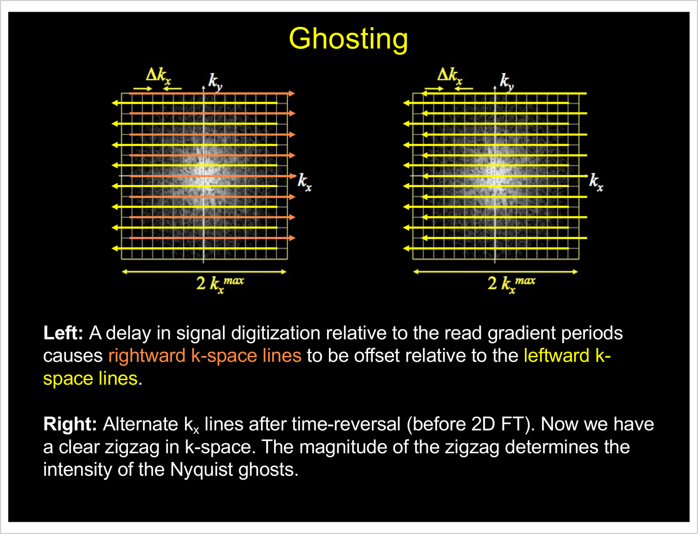

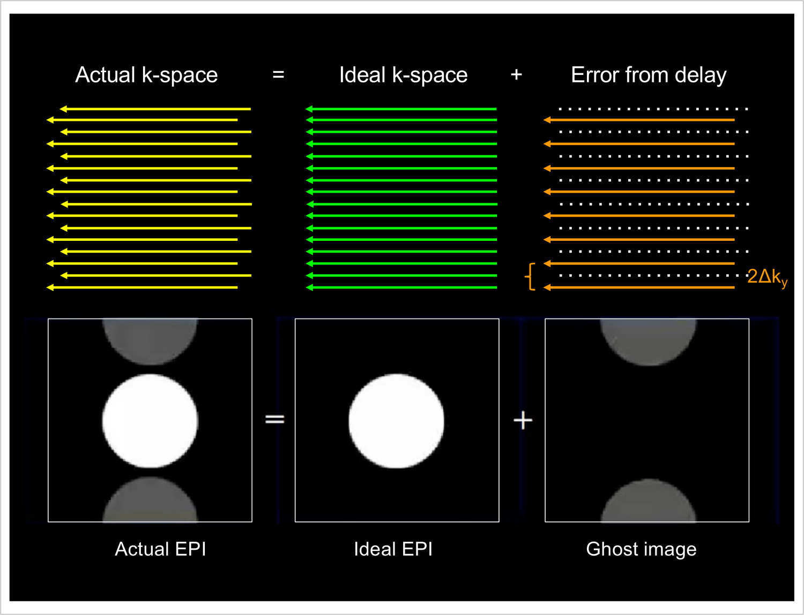

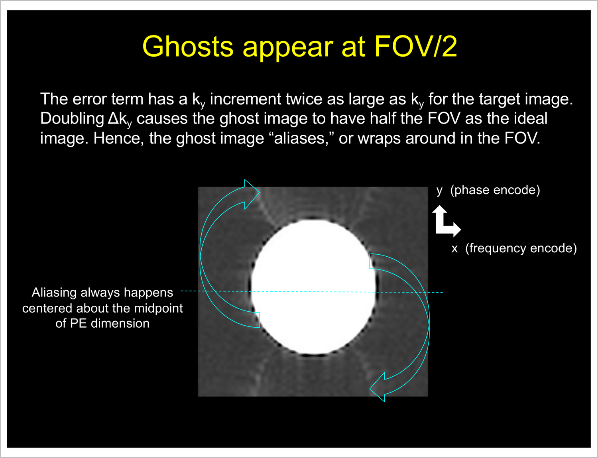

**Figure 9.1. Nyquist ghosting mechanism: odd/even line mismatch, zig-zag k-space, and half-FOV ghost formation.**

Left: A delay in signal digitization relative to the read gradient periods causes rightward k-space lines to be offset relative to the leftward k-space lines.

Right: Alternate kx lines after time-reversal (before 2D FT). Now we have a clear zigzag in k-space. The magnitude of the zigzag determines the intensity of the Nyquist ghosts.

The error term has a ky increment twice as large as ky for the target image. Doubling dky causes the ghost image to have half the FOV as the ideal image. Hence, the ghost image "aliases," or wraps around in the FOV.

## 9.4 Why weak ghosts can still be serious
The source slides note that in a good experiment ghosts are often faint. That is true—but it is not reassuring enough. Faint ghosts can still matter if they overlap brain tissue, vary over time, or correlate with task or motion.

In fMRI, weak structured instability can be more dangerous than an obvious catastrophic artifact, because the dataset may appear acceptable while still containing systematic nuisance variation.

This is why the source slides also emphasize that ghosts vary with time and show standard-deviation images. Time variation is often more important than static visibility.

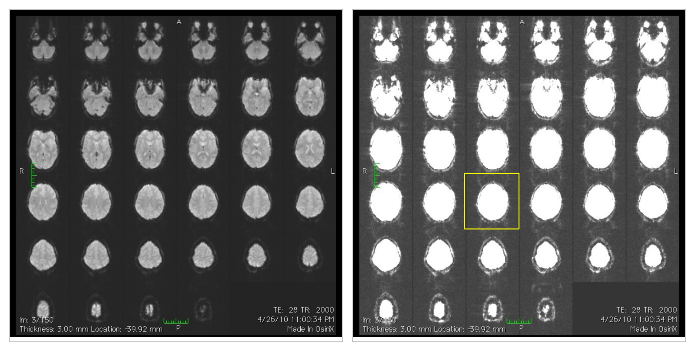

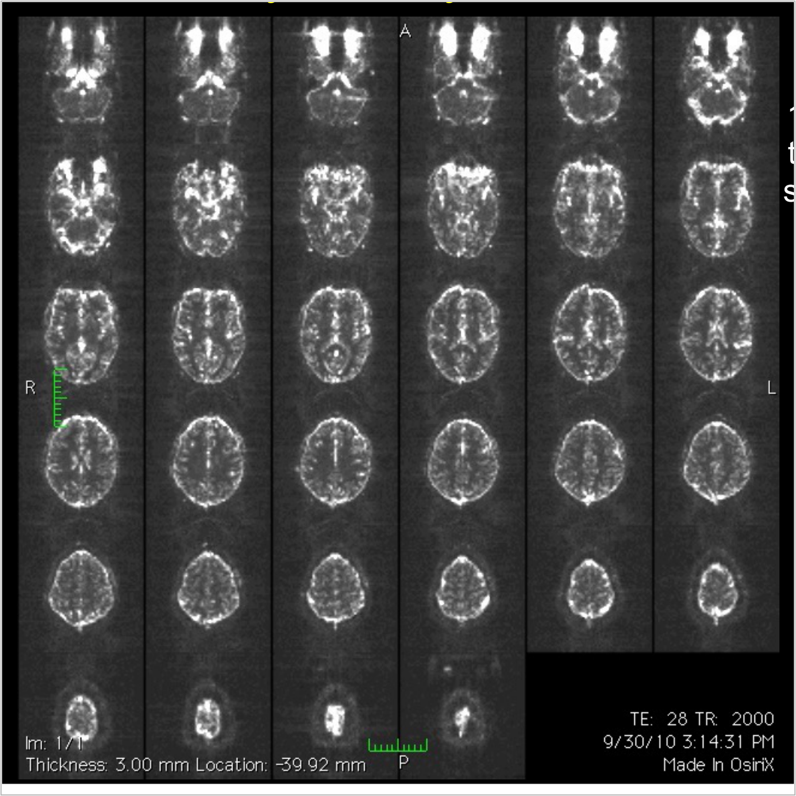

**Figure 9.2. Time-varying ghosting shown with standard-deviation imagery.**

## 9.5 Other common causes of ghosting
The source deck includes a slide on other common causes of EPI ghosts. Even when digitization delay is the textbook model, practical ghosting can arise from multiple sources, including:
- eddy currents,
- gradient timing asymmetry,
- phase errors,
- hardware instability,
- motion, especially periodic motion,
- physiological sources like eye movements,
- and fat signal contamination.

This broader view matters because not every ghost-like pattern should be blamed on the same correction strategy.

## 9.6 Scalp fat suppression and chemical-shift contamination
The source slides explicitly state that **scalp fat suppression is required**. This is a highly practical point.

Fat and water resonate at slightly different frequencies because of chemical shift. In EPI, where bandwidth along the phase-encoded axis is very low, even modest off-resonance differences can produce substantial misregistration. Strong fat signal from the scalp can therefore appear shifted into the brain or create ghost-like contamination.

That is why fat suppression is not just a cosmetic preference in EPI. It is often essential to prevent signal from outside the brain from being mis-mapped into functionally relevant locations.

## 9.7 Chemical shift in imaging practice
The source slides revisit chemical shift here with a more imaging-specific emphasis. They note that shielding differences create the frequency shift and give a ppm-to-hertz scaling example at approximately 3 T.

In practical MRI, the exact ppm convention matters less than the consequence: **fat and water precess at different frequencies**, and low-bandwidth dimensions are especially sensitive to this difference.

Thus, chemical shift becomes important not only in spectroscopy but in routine EPI artifact control. The later artifact signature—especially when fat suppression fails—can look like displaced bright signal or ghost-like contamination.

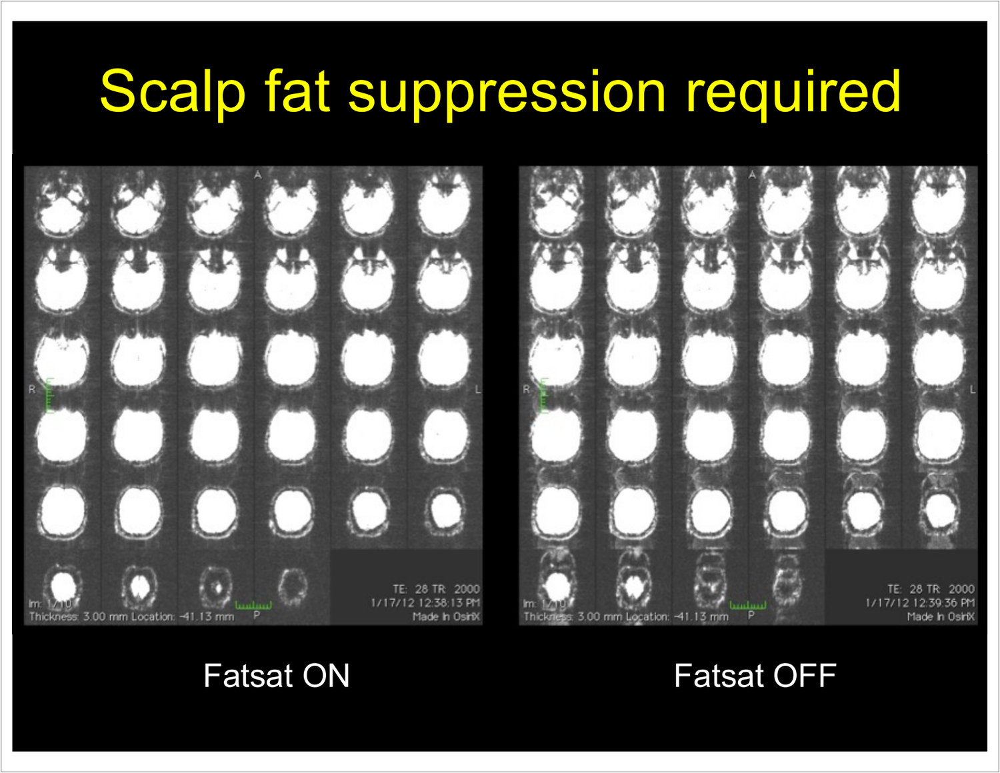

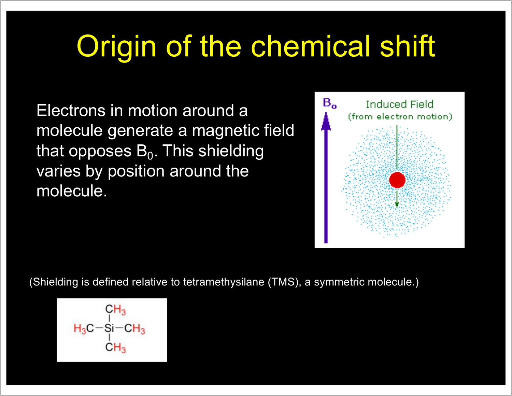

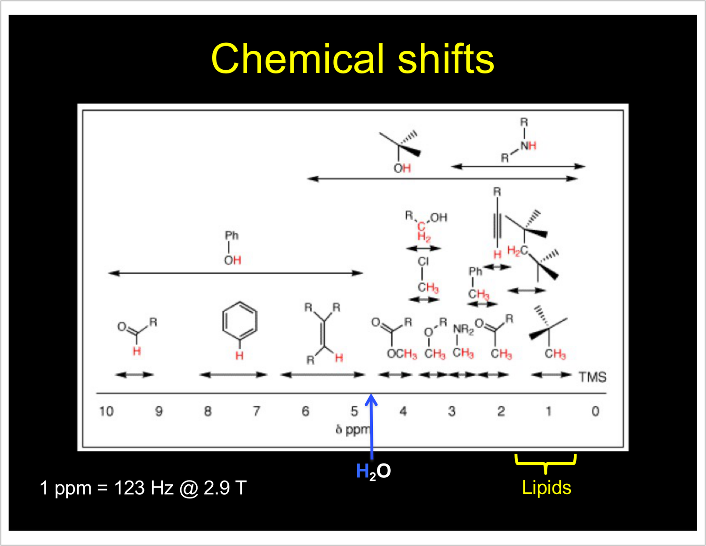

**Figure 9.3. Fat suppression on/off and chemical-shift contamination in EPI.**

## 9.8 Ramp sampling and pushing readout speed too far
The source slides then discuss **ramp sampling**, in which data acquisition occurs not only during the flat part of the read gradient but also during its ramps. This can improve efficiency because more k-space is sampled per unit time.

But the source slides also warn that ramp sampling can go too far. Shortening echo spacing from, for example, 0.50 ms to 0.43 ms may look attractive, but if gradient behavior and digital correction are not accurate enough, ghosting or other artifacts can worsen.

This is an important acquisition-design lesson: every speed gain has a fidelity cost. A sequence that samples more aggressively may reduce one burden while increasing another.

## 9.9 Distortion: why geometry fails in EPI
The source slides define distortion as misplacement of voxels along the phase-encoded dimension. They further note that this arises because the phase-encoded dimension is sampled relatively slowly.

This can be explained physically as follows. Local field inhomogeneity changes the resonance frequency of the signal. In the frequency-encoding direction, bandwidth per pixel is high, so a given off-resonance shift causes only a small positional error. In the phase-encoded direction, effective bandwidth per pixel is extremely low, so the same off-resonance shift causes a much larger displacement.

Thus, EPI distortion is largely an **off-resonance-to-position-misregistration conversion problem** concentrated in the phase-encoded axis.

## 9.10 Bandwidth and why one axis distorts much more than the other
The source slides make this quantitative using per-pixel bandwidth estimates.

For the frequency-encoding axis,

\[
\text{BW}_{\text{read}} \approx \frac{1/\Delta t}{N_{\text{pixels}}},
\]

with typical values around **2000-2600 Hz/pixel**.

For the phase-encoded axis,

\[
\text{BW}_{\text{phase}} \approx \frac{1/\Delta t_{\text{esp}}}{N_{\text{pixels}}},
\]

with typical values around **20-35 Hz/pixel**.

That difference is enormous. If local field heterogeneity near the sinuses is on the order of **200-300 Hz**, then a region can be misplaced by several pixels in the phase-encode direction but hardly shifted in the read direction.

This is one of the most important practical numbers in EPI. It explains why distortion is not a vague nuisance but a predictable directional effect.

## 9.11 A-P versus P-A phase encoding
The source slides show anterior-to-posterior (A-P) versus posterior-to-anterior (P-A) phase encoding. This is not a trivial orientation choice. Reversing phase-encoding direction reverses the direction in which off-resonance displacement occurs.

That means:
- the same field inhomogeneity can produce different apparent geometric warping depending on phase-encoding direction,
- distortion can be redistributed rather than eliminated,
- and paired reverse-phase-encoded images can be used for distortion correction strategies in modern workflows.

For the practical user, this means phase-encoding direction is a deliberate design choice with anatomical and analysis consequences.

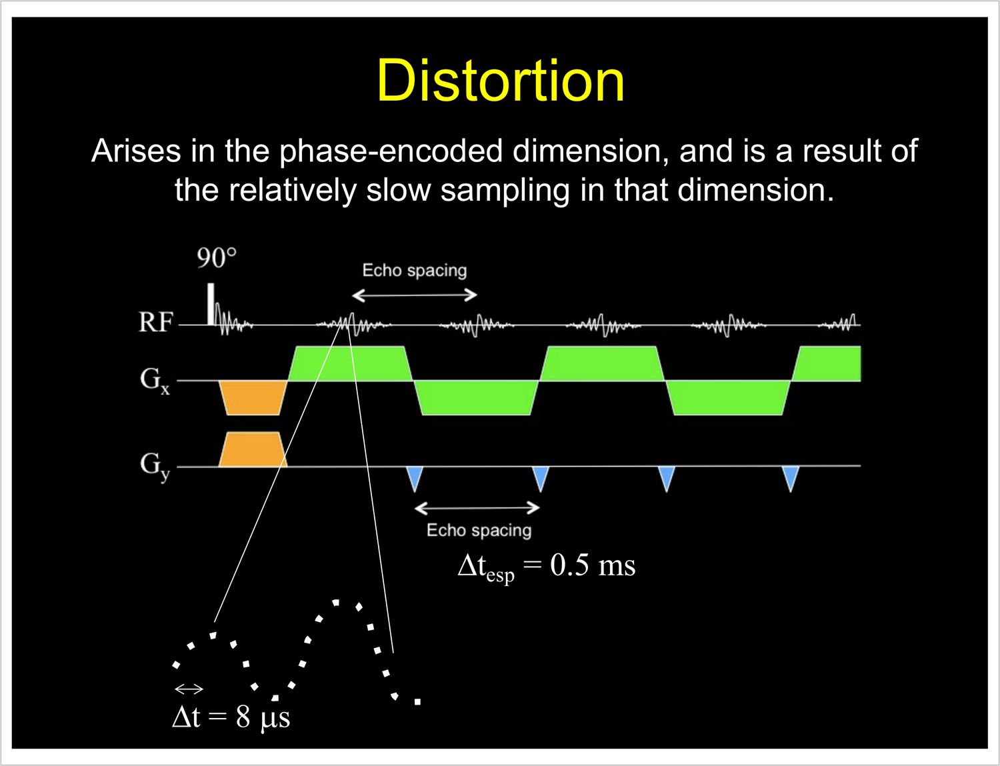

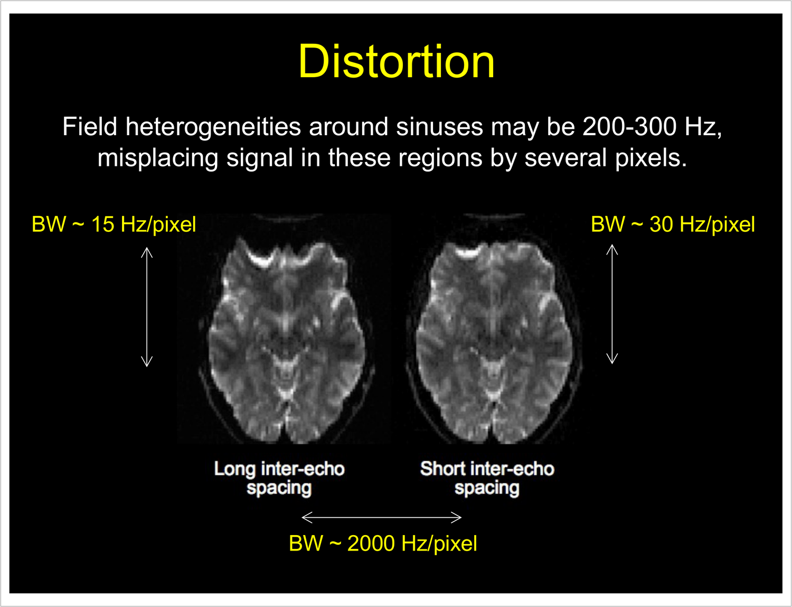

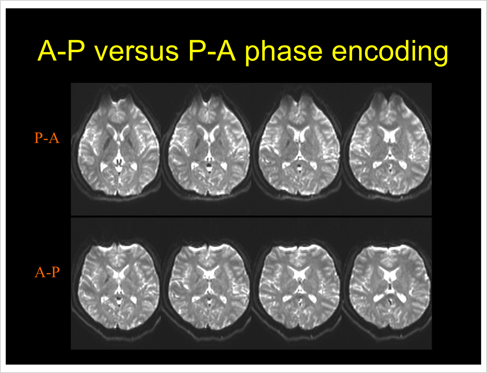

**Figure 9.4. Distortion and bandwidth comparison between read and phase directions.**

Arises in the phase-encoded dimension, and is a result of the relatively slow sampling in that dimension.

Frequency encoding axis: BW = (1/dt)/Npixels. Typically 2000-2600 Hz/pixel.

Phase encoding axis: BW = (1/dtesp)/Npixels. Typically 20-35 Hz/pixel.

Field heterogeneities around sinuses may be 200-300 Hz, misplacing signal in these regions by several pixels.

## 9.12 Dropout: when signal is not merely displaced but lost
Unlike distortion, **dropout** is not mainly about signal being moved. It is about signal being lost because within a voxel, spins dephase so strongly that little coherent transverse magnetization remains by the time the echo is sampled.

The source slides correctly note that dropout is not strictly an EPI-only issue. Any gradient-echo acquisition at the same TE could show dropout in a sufficiently inhomogeneous region. However, EPI often makes the problem worse because signal continues to decay during the long in-plane readout.

This is the practical meaning of susceptibility-driven signal dropout in fMRI: there may not be enough coherent signal left to represent the local tissue reliably at all.

This is why orbitofrontal cortex, ventromedial prefrontal regions, and inferior temporal cortex are repeated casualties in gradient-echo EPI. In those locations the problem is often not merely that anatomy has shifted. The local signal may be attenuated so strongly that there is little usable information left to recover.

## 9.13 Why thin slices reduce dropout
The source slides make a particularly important practical point: **thinner slices produce less dropout**. The reason is that intravoxel field variation is reduced when the voxel spans less depth. If less field variation exists within each voxel, less intravoxel dephasing occurs.

This is also why the source slides emphasize that **two thin slices are better than one thick slice** in this context. The tradeoff, of course, is that thinner slices often reduce raw SNR, increase the number of slices needed for coverage, or complicate timing.

But in dropout-prone regions, reduced intravoxel dephasing can outweigh those costs.

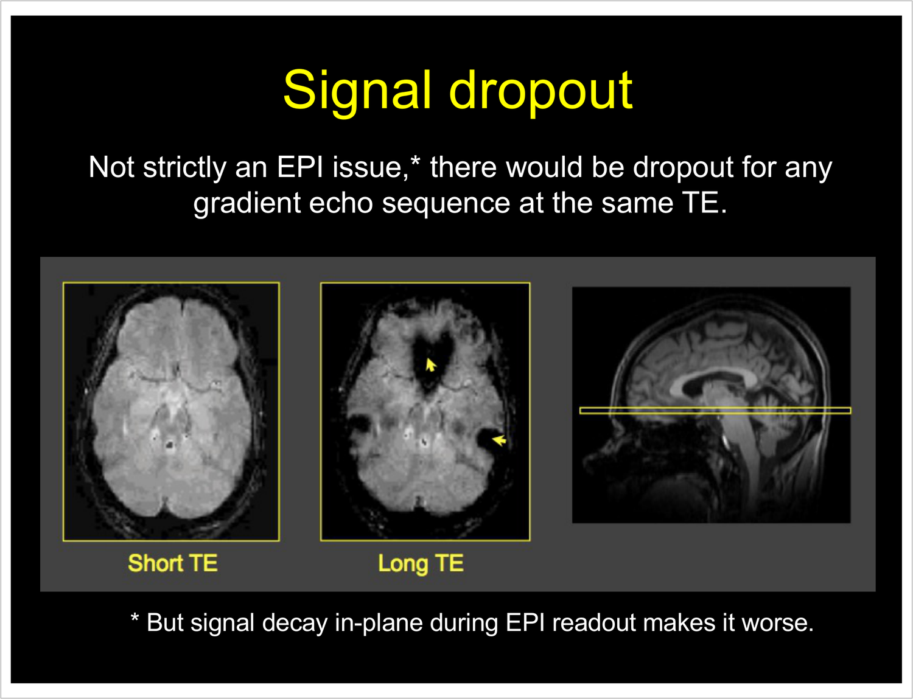

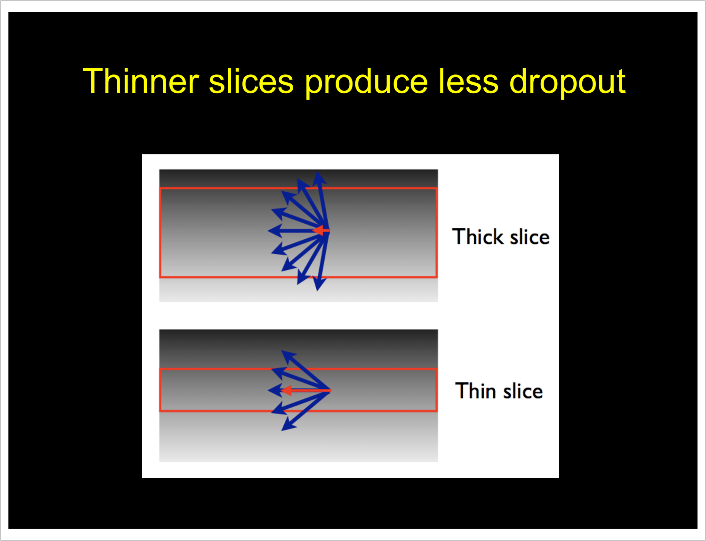

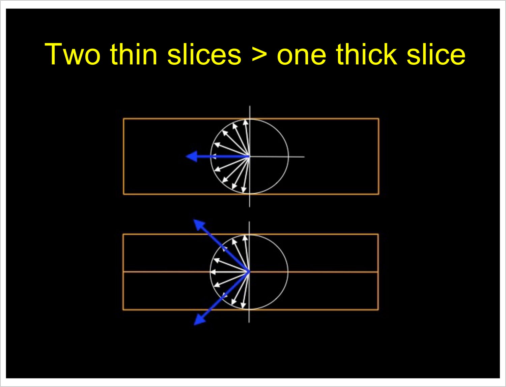

**Figure 9.5. Signal dropout and slice-thickness dependence.**

Not strictly an EPI issue: there would be dropout for any gradient echo sequence at the same TE.

But signal decay in-plane during EPI readout makes it worse.

Thinner slices produce less dropout.

Two thin slices > one thick slice.

## 9.14 Tradeoffs among TE, slice thickness, coverage, and artifact burden
By this stage the reader can see that many EPI parameters are coupled.

- Longer **TE** increases T2* weighting and often improves BOLD sensitivity, but worsens dropout and reduces signal amplitude.
- Thinner slices reduce dropout but usually reduce per-voxel SNR and may reduce coverage or lengthen acquisition.
- Faster readout or higher acceleration may reduce distortion but increase noise amplification or reconstruction sensitivity.
- Narrower effective bandwidth makes distortion worse but may be tied to other timing constraints.

This is exactly why practical EPI is best taught as a tradeoff system rather than a menu of independent artifact fixes.

## 9.15 Artifact recognition rules of thumb
A practical recognition guide, distilled from the source slides, would include the following:

### Ghosting
- replicated structures in the phase-encode direction,
- often near FOV/2 displacement,
- may vary over time,
- often linked to odd/even mismatch, motion, eyes, or fat.

### Distortion
- stretched, compressed, or displaced anatomy,
- predominantly in the phase-encoded direction,
- strongest near frontal sinuses, ear canals, and other susceptibility boundaries,
- reverses direction when PE polarity is reversed.

### Dropout
- dark signal voids rather than shifted bright anatomy,
- common in orbitofrontal cortex and inferior temporal regions,
- worsens with longer TE and thicker slices,
- reflects irrecoverable local dephasing rather than mere voxel displacement.

---

### Artifact Recognition: physics origin versus image appearance
A useful discipline is to describe each artifact in two sentences: one sentence for **physics origin**, one for **image appearance**.

- **Ghosting origin:** inconsistent odd/even line sampling or related trajectory phase error.  
  **Appearance:** faint replicated anatomy in the phase-encode direction, often near FOV/2.

- **Distortion origin:** off-resonance displacement in the low-bandwidth phase-encode direction.  
  **Appearance:** warped, shifted, stretched, or compressed anatomy near susceptibility boundaries.

- **Dropout origin:** strong intravoxel dephasing from local field gradients.  
  **Appearance:** localized signal voids, often in orbitofrontal and inferior temporal areas.

### Practical Scanner Implication
When someone says an EPI image “looks bad,” the correct next question is: **bad in what way?** The remedy for ghosting is not the remedy for distortion, and the remedy for distortion is not the remedy for dropout.

---

## Chapter 9 Summary
- Ghosting, distortion, and dropout are the three classic EPI artifact families because they arise directly from the physics of fast T2*-weighted readout.
- Nyquist ghosting often comes from odd/even line mismatch and commonly appears at half the field of view in the phase-encode direction.
- Chemical shift and unsuppressed scalp fat can exacerbate ghost-like contamination.
- Ramp sampling can improve efficiency but can also worsen instability if pushed too hard.
- Distortion occurs mainly in the phase-encoded dimension because its effective bandwidth per pixel is much lower than in the read direction.
- Phase-encoding direction determines the direction of off-resonance displacement.
- Dropout reflects local intravoxel dephasing and is worsened by long TE and thick slices.
- Many EPI design choices are best understood as tradeoffs among speed, SNR, distortion, dropout, and stability.

## Key Terms
- Nyquist ghost
- Odd/even line mismatch
- Ramp sampling
- Distortion
- Bandwidth per pixel
- Phase-encoding direction
- Signal dropout
- Intravoxel dephasing
- Fat suppression

## Review Questions
1. Why do Nyquist ghosts commonly appear at half the field of view?
2. Why is distortion much more severe in the phase-encoded direction than in the read direction?
3. Why can fat suppression be essential in EPI rather than merely helpful?
4. Why does thinner slicing reduce dropout?
5. How does changing phase-encoding direction affect distortion appearance?
6. Why is it dangerous to describe all EPI artifacts simply as “motion” or “noise”

---

# Chapter 10. Susceptibility, Motion History, Inflow, and Receive-Field Confounds

## 10.1 Magnetic susceptibility as a spatially varying perturbation
The source slides define **magnetic susceptibility**, usually written \(\chi\), as the tendency of a material to become magnetized when exposed to an external magnetic field. In MRI, susceptibility matters because it determines how different tissues, air spaces, bone, blood products, and foreign materials perturb the local magnetic field.

This is not a minor refinement to basic MRI physics. It is one of the most important reasons that real MRI differs from the idealized scanner model. In the ideal model, the main field \(B_0\) is spatially uniform except where deliberately modified by the imaging gradients. In real brains, however, variations in susceptibility create **intrinsic, static magnetic field gradients**. These act like additional unwanted gradients superimposed on the acquisition.

The source slides make exactly this point: susceptibility-induced gradients dephase spins “just like the imaging gradients, except that we can’t turn the intrinsic gradients off.” That is one of the best practical descriptions of the problem. Susceptibility effects are powerful precisely because they are always present. One may shim them, minimize their consequences, or design around them—but one does not simply turn them off the way one turns off a readout gradient.

## 10.2 Why air-bone-brain interfaces are especially problematic
The source deck highlights **air-bone-brain interfaces**, especially around the paranasal sinuses and temporal bone, as major generators of local field heterogeneity. This is a foundational fact of practical fMRI.

Air and tissue differ greatly in magnetic susceptibility. Whenever such materials meet, the magnetic field is perturbed strongly in the surrounding region. The result is a local spatial gradient in off-resonance frequency. These gradients are often strongest in precisely the regions that many fMRI researchers care about most, including:
- orbitofrontal cortex,
- ventromedial prefrontal regions,
- inferior temporal areas,
- medial temporal lobe structures in some orientations,
- and regions near ear canals or mastoid air cells.

This explains why susceptibility artifact is not evenly distributed throughout the brain. It clusters in anatomically predictable locations.

## 10.3 Phase maps reveal the hidden field problem
The source slides include a map of MR phase to show the problem directly. This is pedagogically valuable because image magnitude alone can hide the underlying mechanism.

Phase images can reveal structured spatial variation in local field. If neighboring voxels exhibit strong phase gradients, that is evidence that off-resonance conditions differ substantially across space. In practice, those same regions are often where one later sees distortion, dropout, or unstable signal behavior in gradient-echo EPI.

This is a useful diagnostic principle: **magnitude artifacts are often consequences of field structure that is easier to appreciate in phase or field maps**.

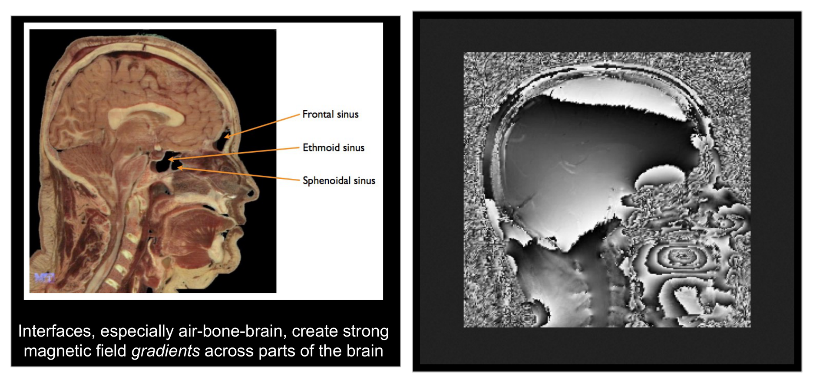

**Figure 10.1. Susceptibility gradients near air-bone-brain interfaces, with phase-map illustration.**

## 10.4 T2* relaxation revisited in the context of EPI
The source slides explicitly state that **T2* relaxation occurs during the EPI readout**, and that in BOLD fMRI we usually try to set **TE ~ T2*** to maximize contrast sensitivity.

This deserves a more formal textbook unpacking.

As established earlier, T2* is the effective transverse decay constant that includes both intrinsic T2 processes and additional dephasing caused by static field inhomogeneity. In gradient-echo EPI, there is no 180° refocusing pulse to recover that added dephasing. Therefore signal evolution during the readout remains highly sensitive to local field nonuniformity.

Why set TE near T2* for BOLD? Because BOLD contrast is strongest when the acquisition samples the signal at a time where small changes in T2* produce appreciable changes in signal amplitude. If TE is too short, BOLD sensitivity is reduced. If TE is too long, signal may be too weak, distortion worsens, and dropout becomes more severe.

This is a quintessential MRI tradeoff:
- shorter TE reduces dropout and improves raw signal retention,
- but longer TE increases T2*-weighting and therefore BOLD sensitivity.

A competent fMRI acquisition is therefore not just “as short as possible” or “as BOLD-sensitive as possible.” It is a compromise between sensitivity and robustness.

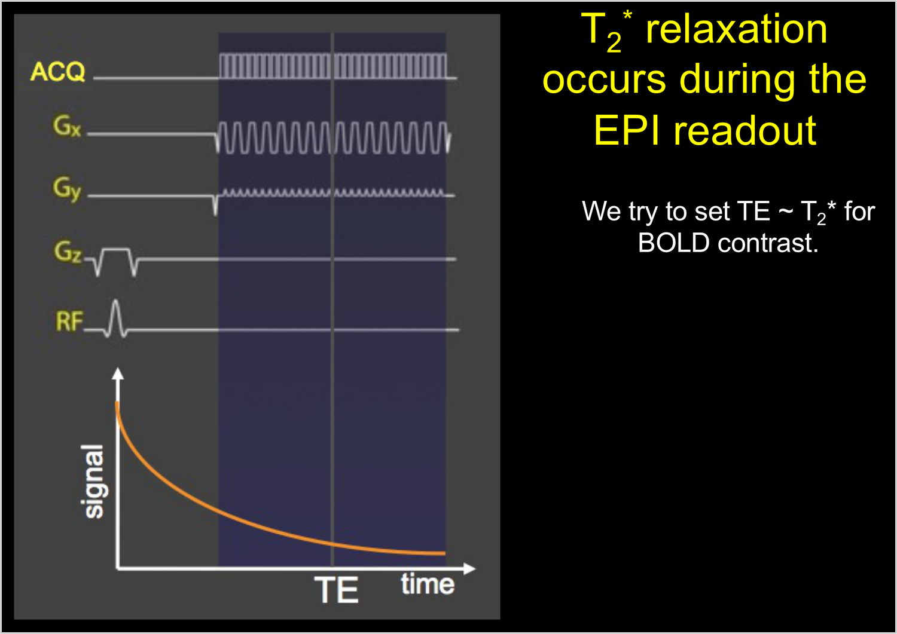

**Figure 10.2. TE near T2* for BOLD contrast, with tradeoff schematic for sensitivity versus dropout.**

## 10.5 Flip angle effects and spin history
The source deck next turns to **flip angle effects**, especially in the presence of flow and repeated excitation. This is an area where many new fMRI users underestimate how sequence behavior can interact with physiology.

In repeated imaging, spins do not begin each excitation in a fully reset state. Their current magnetization depends on what happened during prior excitations. This dependence is often called **spin history**.

If a subject moves between slices or if flowing blood enters the imaging volume after experiencing a different number of previous excitations than stationary tissue, its magnetization history differs. That can change signal intensity in ways that are not directly attributable to local neural activity.

Thus, spin history is not merely a sequence-design subtlety. It is a mechanism by which acquisition timing, motion, and physiology become entangled.

## 10.6 Inflow effects in GRE-based fMRI
The source slides cite work by Duyn, Frahm, and others showing that **blood inflow plays a major role in GRE-based functional brain maps**. This is a crucial reminder that not every signal change in gradient-echo fMRI is pure deoxyhemoglobin-mediated BOLD.

**Inflow effects** occur because spins flowing into a slice or imaging volume may be less saturated than the stationary tissue already being repeatedly excited. Fresh inflowing blood can therefore produce elevated signal simply because its longitudinal magnetization has recovered more completely. In addition, blood volume changes and inflow timing can alter the temporal shape of the observed response.

The source slide specifically notes that with flow, the **apparent T1 of blood decreases**. Operationally, this means the inflowing signal behaves as though it recovers more quickly than static tissue under repeated excitation.

This matters for fMRI because inflow can:
- increase signal changes with certain flip-angle choices,
- shift apparent response timing,
- add non-neural vascular contributions,
- and complicate interpretation of what is “BOLD” versus what is simply flow-sensitive gradient-echo signal.

## 10.7 Flip angle, inflow, and hemodynamic response shape
The source slides show that higher flip angles at 3 T and TR = 1000 ms produce slightly higher signal change and an earlier apparent time-to-peak of the hemodynamic response, consistent with inflow plus CBV-BOLD effects.

This is a very important practical lesson. Sequence parameters do not merely scale signal uniformly—they can bias what physiological mixture contributes to the measured response.

Higher flip angle generally does at least three things in this context:
1. changes the steady-state magnetization of stationary tissue,
2. changes the contrast between inflowing fresh spins and repeatedly excited tissue,
3. and therefore changes not only signal magnitude but potentially the temporal profile of the response.

Thus, if two studies use different TR/flip-angle combinations, their functional time courses may differ not only because of neural or task factors but because the acquisition itself weights physiological mechanisms differently.

## 10.8 Flip angle effects on SNR and temporal SNR
The source deck includes slides on flip angle, SNR, and temporal SNR, with explicit comparisons such as **FA = 20° versus FA = 65°**. These comparisons are especially important because they correct a common beginner mistake: assuming that the largest instantaneous signal automatically produces the best fMRI data.

That is not always true. In fMRI, **temporal SNR** is often more important than static image brightness. A higher flip angle may increase mean signal in some regions or conditions, but if it also changes variability structure, saturation behavior, or inflow sensitivity, the net effect on functional interpretability can be complex.

This is why one must separate several related but nonidentical questions:
- Which flip angle maximizes signal magnitude?
- Which maximizes steady-state SNR for the tissue of interest?
- Which maximizes temporal SNR?
- Which yields the most interpretable BOLD-weighted response rather than a contaminated physiological mixture?

In many practical contexts, the **Ernst-angle intuition** is useful but incomplete. For fMRI, temporal stability and confound sensitivity matter just as much as mean signal.

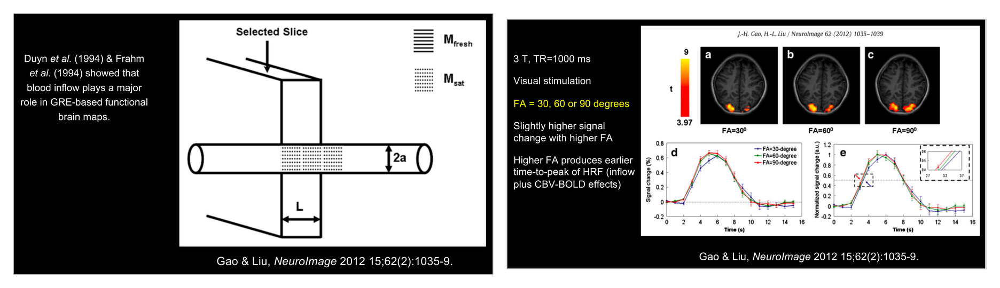

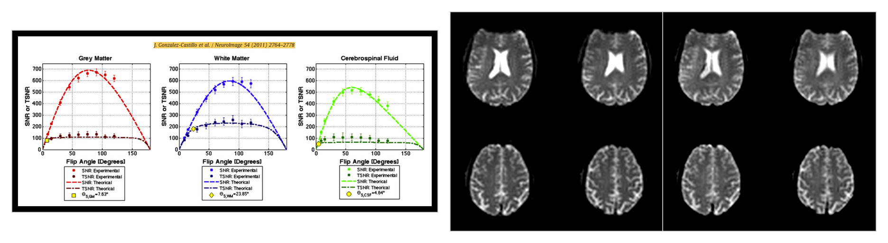

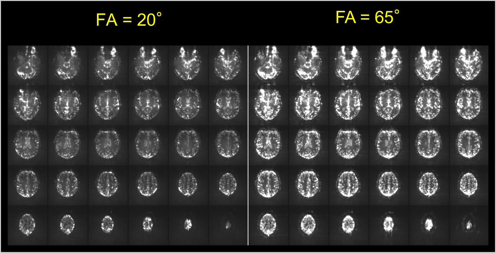

**Figure 10.3. Flip-angle / inflow effects on response magnitude and timing.**

## 10.9 Receive bias field effects
The source slides then pivot from physiology to hardware-linked confounds with **receive bias field effects**. This is a key bridge between hardware chapters and artifact chapters.

A receive array does not measure the same sensitivity everywhere in the head. The result is a spatial sensitivity pattern, sometimes called receive contrast “staining.” In static structural images, this appears as brightness nonuniformity. But in fMRI, the issue becomes more serious because the head is not perfectly stationary.

If tissue moves through a steep receive sensitivity gradient, then even if the tissue itself is unchanged biologically, its measured signal changes. This means the time series can contain structured fluctuations that arise from motion through the receive field rather than from neural or vascular effects.

## 10.10 RFC-MoCo: why perfect rigid-body realignment is not enough
The source slides specifically name this effect as **RFC-MoCo** and quote Larry Wald’s formulation: even after perfect rigid-body alignment, the signal time course in a given brain structure will be modulated by motion through the steep sensitivity gradient.

This is one of the most important conceptual corrections in practical fMRI. Many users believe that if motion estimates are small and rigid-body realignment is applied well, then motion-related intensity problems are largely solved. That is false.

Rigid-body motion correction aligns anatomy geometrically. It does **not** change the fact that each time point may have been acquired under a different receive sensitivity profile for a given tissue location. After realignment, the anatomy may sit still in reconstructed space while its intensity still fluctuates because the original coil sensitivity weighting was different at acquisition time.

Thus, motion correction can solve positional mismatch while leaving receive-field modulation intact.

## 10.11 Homogeneous versus heterogeneous receive coils
The source slides contrast motion correction under homogeneous and heterogeneous receive fields. This is pedagogically ideal. If receive sensitivity were perfectly uniform, rigid-body realignment could in principle restore geometric correspondence without creating residual intensity error from this mechanism. But with realistic heterogeneous receive fields, motion correction aligns position while preserving a motion-induced amplitude modulation.

This comparison should be emphasized in textbook form because it makes the causal chain explicit:

head moves → tissue samples different coil sensitivity → time-varying intensity bias → realignment restores geometry but not original sensitivity weighting.

That is why later nuisance regression or bias-field-aware processing may be needed even when motion correction appears visually successful.

## 10.12 How large can the effect be?
The source slides include simulation results showing percentage signal change for 1 mm translation under different coil types (birdcage, 12-channel, 32-channel). This is important because it demonstrates that the effect is not merely theoretical.

The exact magnitude depends on coil geometry, motion direction, anatomical location, and acquisition details, but the principle is clear:
- more spatially varying receive profiles can create larger motion-linked intensity modulation,
- small motion can create non-negligible apparent signal change,
- and higher-channel arrays can be especially powerful and especially nonuniform.

This is not an argument against modern arrays—they are essential for high-SNR and accelerated imaging—but it is an argument for intellectually honest interpretation. Improved hardware can amplify certain confound pathways even while improving overall acquisition capability.

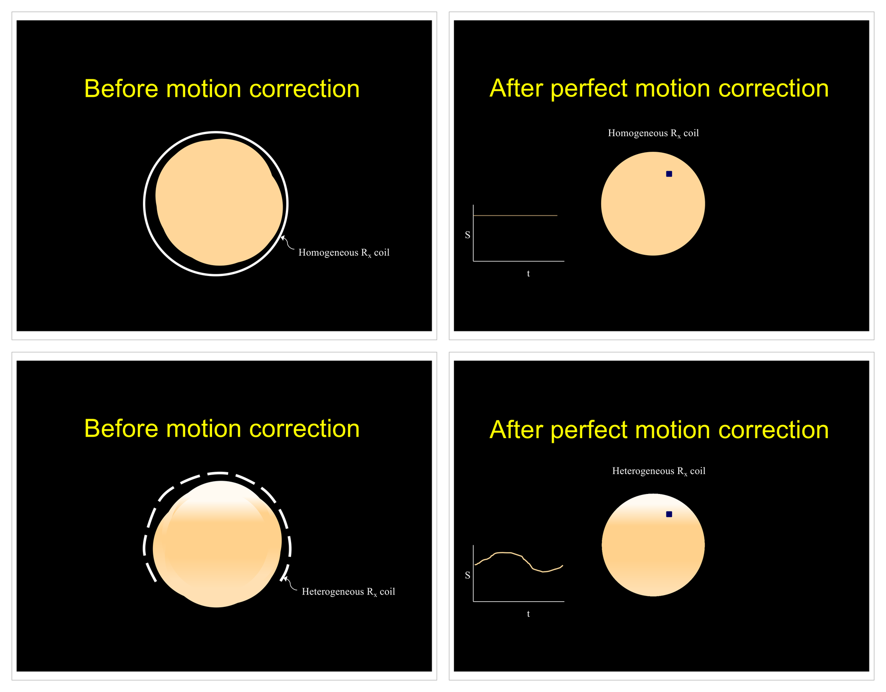

**Figure 10.4. Receive-bias-motion interaction before and after perfect motion correction under homogeneous versus heterogeneous receive fields.**

## 10.13 Anchoring during volume realignment
The source slides conclude this section with **anchoring during volume realignment**. The idea is subtle but important: if receive-field contrast becomes strong enough, it can dominate the apparent image similarity structure used by volume registration algorithms. In that case, the cost function may partially anchor to receive bias patterns rather than to underlying anatomy.

The source slide suggests normalization by the receive bias field as a mitigation strategy. This is a practical lesson that should be generalized:
- motion correction is not just an optimization problem over anatomy,
- the image intensity landscape being optimized may itself be corrupted by hardware sensitivity patterns,
- and preprocessing choices can influence whether registration follows anatomy or follows bias-field structure.

## 10.14 Putting the confounds together
This chapter’s source material is valuable because it shows that not all “extra” fMRI signal comes from the same place.

Three broad classes are interacting here:
1. **Susceptibility-related field structure**, which drives T2*, distortion, and dropout.
2. **Physiological inflow and spin-history effects**, which alter signal amplitude and timing.
3. **Receive-field heterogeneity plus motion**, which creates time-varying intensity modulation even after geometric alignment.

A practical researcher must be able to distinguish among them. They may coexist in the same run, but they imply different remedies and different interpretive caution.

---

### Common Confusion: motion correction does not remove all motion effects
Motion correction aligns images in space. It does **not** guarantee that voxel intensities are comparable across time for all reasons. If motion changes receive sensitivity weighting, inflow state, or spin history, those effects can survive even excellent realignment.

### Practical Scanner Implication
If a dataset shows unexpected temporal fluctuations after apparently good motion correction, do not assume the remaining problem is “just noise.” Ask whether receive-field heterogeneity, inflow, or spin-history effects are contributing.

---

## Chapter 10 Summary
- Magnetic susceptibility differences create intrinsic local field gradients that cannot simply be switched off.
- Air-bone-brain interfaces are major sources of off-resonance problems in practical fMRI.
- T2* relaxation during EPI readout is both the basis of BOLD contrast and a source of artifact vulnerability.
- Flip angle changes not only signal magnitude but also inflow weighting, temporal behavior, and temporal SNR.
- Receive field heterogeneity can convert small motion into structured signal modulation.
- Rigid-body motion correction does not remove receive-bias-induced intensity fluctuations.
- Realignment itself can be affected by receive-field contrast if that contrast dominates the registration cost function.

## Key Terms
- Magnetic susceptibility
- Off-resonance
- T2*
- Inflow effect
- Spin history
- Receive bias field
- RFC-MoCo
- Realignment
- Temporal SNR

## Review Questions
1. Why do susceptibility variations act like gradients that the user cannot turn off?
2. Why are frontal and inferior brain regions particularly vulnerable to susceptibility-related problems?
3. Why is TE usually chosen near T2* for BOLD fMRI?
4. How can higher flip angle affect not only signal amplitude but also response timing?
5. Why can receive-field-related intensity modulation survive perfect rigid-body realignment?
6. What does “anchoring” mean in the context of volume realignment?

---

# Chapter 11. Accelerated and Advanced EPI Methods

## 11.1 Why acceleration methods are attractive in fMRI
The source slides open Day Four with advanced EPI methods. The reason these methods matter is straightforward: standard EPI is useful, but it is always under pressure from competing demands.

Researchers want:
- more slices,
- shorter TR,
- higher spatial resolution,
- less distortion,
- less dropout,
- and acceptable SNR,

all at the same time.

Acceleration methods are attempts to improve this tradeoff surface. But they do not create free performance. They exchange one type of cost for another. The central educational goal in this chapter is therefore not to catalog methods as if they were upgrades, but to explain their **tradeoff logic**.

## 11.2 Partial Fourier EPI and conjugate symmetry
The first advanced method in the source deck is **partial Fourier EPI**. The key mathematical idea is **conjugate symmetry in k-space**. If an image is real-valued under appropriate assumptions, then one side of k-space contains information related to the complex conjugate of the opposite side.

The source slides illustrate this with the familiar relation between \(a-ib\) and \(a+ib\). This is the basis for the idea that not all of k-space necessarily needs to be acquired directly. One may omit part of k-space and reconstruct the missing portion approximately.

This is a powerful strategy because it can reduce acquisition time, but it is only safe insofar as the assumptions behind the reconstruction are sufficiently satisfied in practice.

## 11.3 Reconstructing omitted k-space
The source deck notes that several reconstruction approaches exist and that one practical implementation is to **zero-fill the missing portion before the 2D Fourier transform**. In modern practice, additional phase-estimation strategies may also be used, but the source’s operational point is still important: omitted data are not magically unnecessary. They are being inferred, estimated, or replaced using assumptions.

This means partial Fourier is not just “faster EPI.” It is **less directly sampled EPI with compensatory reconstruction**.

## 11.4 Early versus late echo omission
A particularly useful contribution of the source slides is the comparison between omitting **early echoes** versus omitting **late echoes**.

- Omitting **early echoes** allows a shorter **TE**.
- Omitting **late echoes** allows a shorter **TR** or more slices for the same TR.

The source slides argue that for BOLD fMRI, omitting late echoes is generally preferable, because BOLD contrast usually benefits from keeping TE near T2* rather than shortening it excessively.

This is a practical example of physics informing protocol design. If TE is shortened too much, one may gain efficiency but lose the desired BOLD sensitivity.

## 11.5 Coverage gains and BOLD logic in partial Fourier
The source slides provide a concrete example on a Siemens 3 T Trio with TR = 2000 ms:
- full Fourier: 37 slices at TE = 22 ms,
- early 6/8 partial Fourier: 40 slices at TE = 18 ms,
- late 6/8 partial Fourier: 44 slices at TE = 22 ms.

The conclusion is practical and important: **late echo omission can yield greater coverage without sacrificing a TE favorable for BOLD**.

This is precisely the kind of scanner-facing judgment that distinguishes practical fMRI from abstract sequence theory. The “best” option depends on whether BOLD contrast, coverage, TR, or robustness is the priority.

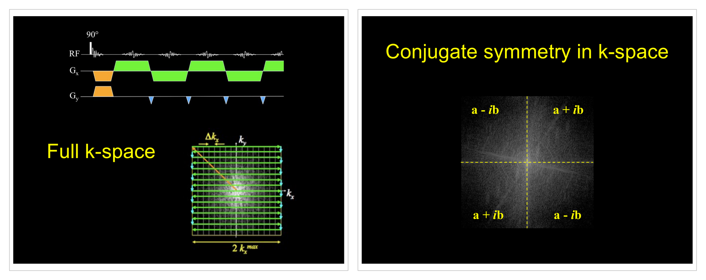

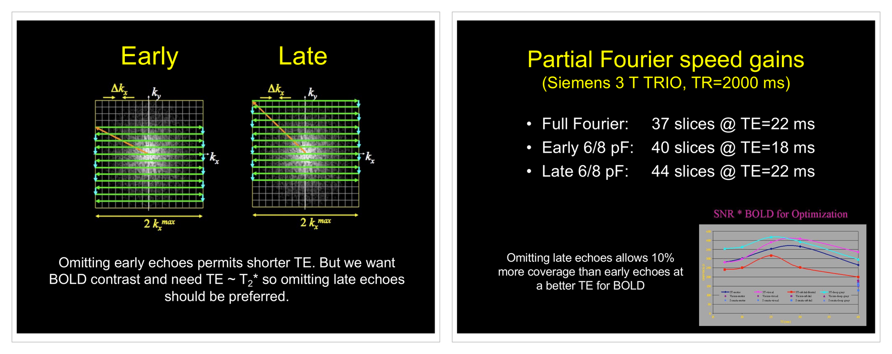

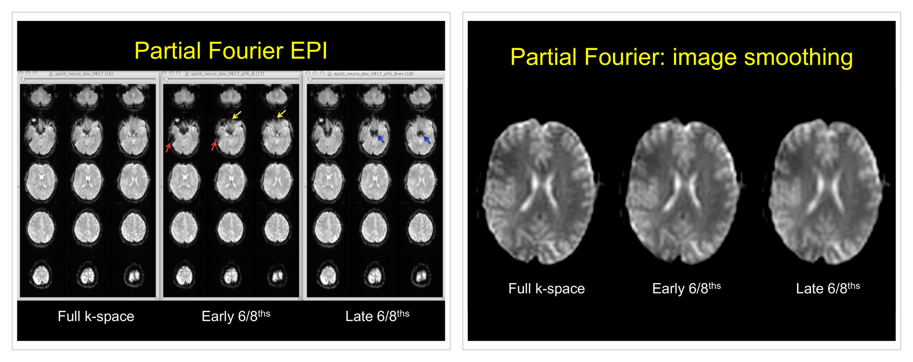

**Figure 11.1. Conjugate symmetry and partial Fourier omission of early versus late echoes.**

We should be able to omit acquisition of the early or the late echoes, with different experimental consequences.

Product EPI omits early echoes. CMRR EPI allows omission of late echoes as an option.

Omitting early echoes allows a shorter TE, whereas omitting later echoes allows a shorter TR.

Late echo omission nets ~20% more slices in TR.

Dropout may be enhanced slightly, but no new motion sensitivity is introduced.

## 11.6 Partial Fourier and dropout tradeoffs
The source slides raise a subtle but important concern: partial Fourier can increase dropout. Why? Because local susceptibility gradients can make the actual local k-space trajectory deviate from the idealized assumption. If the missing k-space portion corresponds to information that is already fragile in certain regions, the reconstruction may exacerbate signal loss or smoothing.

The source slides further note that signal dropping out under early omission may differ from signal behavior under late omission, and that some practical control exists through the choice of omission direction and phase-encoding direction.

This is a particularly sophisticated acquisition point. Partial Fourier is not simply about how many lines are omitted. It is also about **which part of k-space** is omitted, **which way the EPI train runs**, and **which anatomy is already vulnerable to susceptibility loss**.

## 11.7 Partial Fourier, smoothing, and phase-encode direction
The source slides emphasize two practical effects:
1. dropout may be enhanced slightly,
2. smoothing is implicit.

This makes sense. When part of k-space is estimated rather than measured, the reconstruction is generally less faithful to the highest-fidelity full-k-space representation. That often behaves like a smoothing or resolution-loss mechanism.

The slides also note that the interaction with phase-encode direction gives the user some control over which regions are most affected. This is a practical design space, not an all-purpose solution.

## 11.8 Partial Fourier: pros and cons
Summarizing the source material in textbook form:

### Advantages
- more slices or shorter TR,
- no fundamentally new motion sensitivity compared with full EPI,
- potentially better BOLD-compatible coverage if late echoes are omitted.

### Disadvantages
- some SNR loss,
- implicit smoothing,
- possible enhancement of dropout in vulnerable regions,
- full k-space still remains the fidelity ceiling.

## 11.9 In-plane acceleration with GRAPPA
The next method in the source deck is **in-plane acceleration**, specifically **GRAPPA**. This method under-samples k-space lines during acquisition and uses coil-sensitivity information plus calibration data to reconstruct the missing lines.

The source slides show an R = 2 trajectory, illustrating that every other line may be skipped and later inferred. The method depends critically on a multi-channel receive array, because each coil sees the anatomy with a different sensitivity profile. Those differing profiles provide the extra encoding information needed to reconstruct the omitted lines.

GRAPPA should therefore be understood as a way of exchanging hardware-supported parallel information for reduced acquisition burden in the phase-encoded direction.

## 11.10 ACS lines and reconstruction logic
The source deck describes the role of **ACS (autocalibration signal) lines** very clearly. These fully sampled reference lines are used to fit the reconstruction relationship between acquired and missing k-space lines. The fit is performed for each receive coil separately, and the coil images are later combined.

This means GRAPPA has two informational components:
1. the under-sampled time-series data,
2. the calibration reference data set.

This dual dependence is what gives GRAPPA both its power and one of its major vulnerabilities.

## 11.11 GRAPPA motion sensitivity
The source slides emphasize motion sensitivity repeatedly, and this is one of their most important practical teachings.

If motion occurs **during ACS acquisition**, the reference data themselves are corrupted. Since those ACS data are used to reconstruct the entire under-sampled time series, the corruption propagates broadly.

If motion occurs **after ACS acquisition**, then the ACS still represent a different head position from the current EPI volumes. A mismatch remains even if the subject becomes still afterward.

The source slides illustrate both cases and show resulting temporal-SNR degradation.

This is a crucial real-world lesson: GRAPPA can reduce distortion, improve nominal resolution, and increase coverage, but it comes at the price of substantial sensitivity to calibration mismatch.

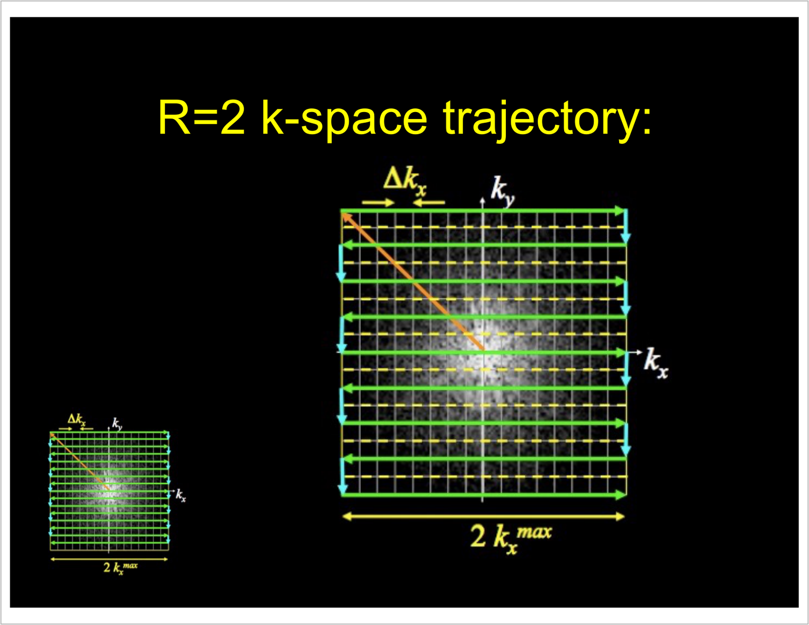

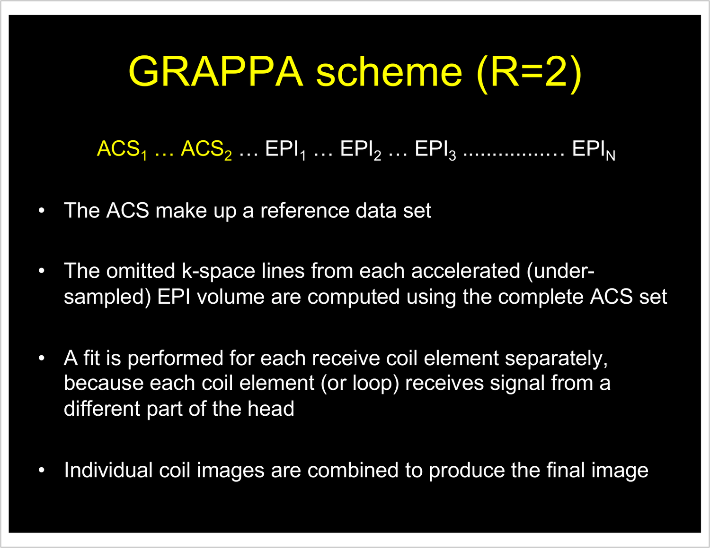

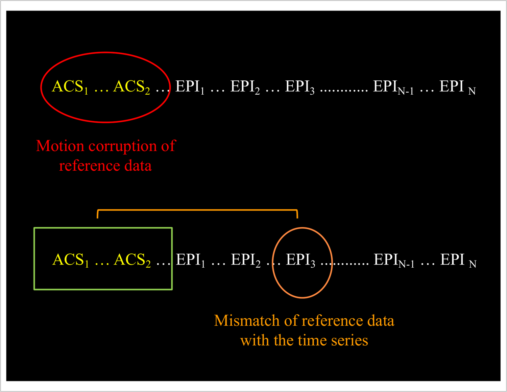

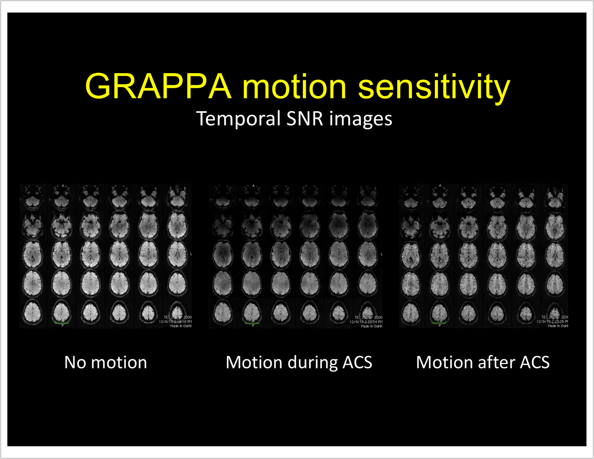

**Figure 11.2. GRAPPA R=2 trajectory, ACS logic, and motion mismatch scenarios.**

GRAPPA motion sensitivity.

ACS used to reconstruct all the under-sampled time series Motion during the ACS affects all data!!! Motion after the ACS generates a mismatch between the ACS and the current EPI volume If subject position changes yet subject is now motionless, a mismatch may remain!

GRAPPA pros & cons.

Reduces PE distortion by factor R Reduced distortion can recover some signal dropout Can allow higher nominal resolution.

10-15% more slices in TR LARGE increase in motion sensitivity!

## 11.12 GRAPPA: pros and cons
The source deck summarizes the tradeoff well.

### Advantages
- reduces phase-encode distortion roughly by factor \(R\),
- can recover some dropout indirectly by reducing distortion burden,
- can support higher nominal resolution,
- can yield modest slice-count gains in a fixed TR.

### Disadvantages
- large increase in motion sensitivity,
- dependence on high-quality reference data,
- residual aliasing if reconstruction is imperfect,
- SNR penalties and noise amplification in practical use.

The key teaching point is this: GRAPPA is not just a distortion-reduction tool. It is also a calibration-sensitive reconstruction strategy.

## 11.13 Simultaneous multi-slice (SMS) / multiband EPI
The next acceleration method is **simultaneous multi-slice (SMS)**, also called **multiband (MB)** EPI. Instead of accelerating within a slice, SMS excites multiple slices at once and then uses coil sensitivity differences to unalias them.

The source slides make several critical practical points:
- SMS requires a phased-array coil.
- It specifically benefits from many coil loops distributed along the slice axis.
- It requires a reference set of **single-band** images (SBRef-like information) for calibration.
- Reconstruction is conceptually similar to GRAPPA-like unaliasing.

Thus, SMS is another example of trading acquisition efficiency for reconstruction dependence on coil geometry and reference stability.

## 11.14 Coil requirements for SMS separation
The source deck rightly pauses to ask whether there are enough coils along the slice axis. This is not a trivial hardware question. SMS only works well if simultaneously excited slices produce distinguishable patterns across the receive array.

If coil sensitivity variation along the slice axis is insufficient, unaliasing becomes poor and slice leakage or residual aliasing increases.

This is why channel geometry matters, not just channel count in the abstract.

## 11.15 SMS pulse sequence logic and benefits
The source slides use classic diagrams from Feinberg and Setsompop to illustrate SMS pulse-sequence logic. In textbook form, the main point is that multiple slices are excited simultaneously, the readout acquires their combined signal, and the reconstruction uses spatial sensitivity information to separate them.

The benefit is obvious: one can acquire many more slices per unit time without simply making the readout longer in the usual line-by-line sense.

For fMRI, this often means:
- shorter TR,
- more whole-brain coverage,
- or better spatial resolution at similar temporal resolution.

**Simultaneous multi-slice (SMS) EPI**

a.k.a. multi-band (MB) EPI

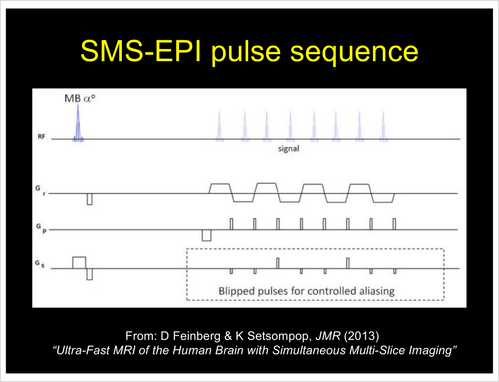

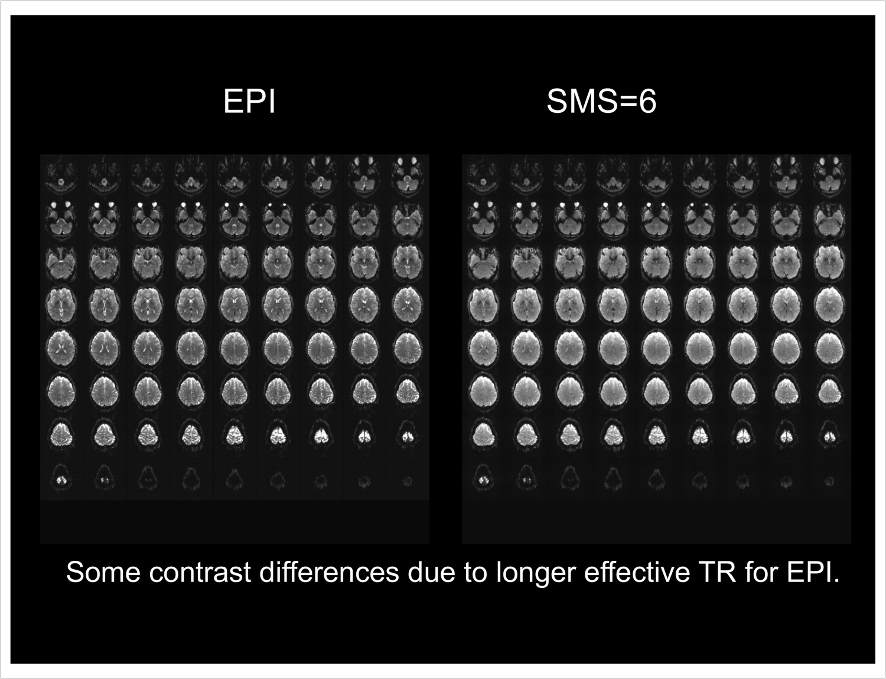

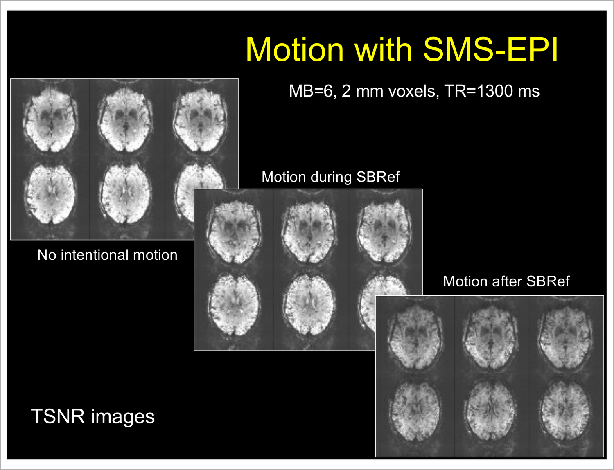

**Figure 11.3. SMS acquisition and coil-based slice unaliasing.**

Requires a phased-array coil.

Need lots of coil loops along the slice axis.

Acquire a set of "single band" reference EPIs without acceleration, i.e. one multi-slice set at a time (takes SMS x TR to acquire).

Then acquire time series using simultaneous slice excitation.

Use a GRAPPA-like reconstruction to un-alias the simultaneous slices.

Some contrast differences arise because conventional EPI can have a longer effective TR.

But even SMS has limits: voxels below (2 mm)3 have low SNR, SMS > 5 is generally not advised, and one must think about R x SMS if using GRAPPA too.

## 11.16 SMS limits and motion sensitivity
The source slides also stress that SMS has limits. They note, for example, that:
- voxels below approximately \((2\text{ mm})^3\) have low SNR,
- 1.5 mm resolution at 3 T is probably a practical limit for partial-brain coverage,
- SMS factors greater than 5 are generally not advised,
- and one must think carefully about combining **R x SMS** when using GRAPPA too.

This is important because SMS is sometimes discussed as though more multiband is always better. The source slides reject that simplification. More aggressive SMS can increase leakage, motion sensitivity, reconstruction burden, and SNR penalties.

The slide set also shows motion effects tied to SBRef mismatch. This parallels the GRAPPA ACS problem: calibration mismatch can persist even when the subject is currently still.

In practical use, that means SMS problems often present as structured slice leakage, depressed tSNR, or a stubborn reference-versus-time-series mismatch rather than as a single obvious blur. If the subject moves between the single-band reference acquisition and the accelerated run, the reconstruction is effectively using the wrong slice-sensitivity relationship for the current head position.

The warning about **R x SMS** should also be taken literally. Combining in-plane acceleration with multiband acceleration compounds the reconstruction burden. Even if each factor seems acceptable alone, the combination can lower effective SNR, reduce calibration margin, and leave less tolerance for motion or anatomy-driven sensitivity variation.

## 11.17 Multi-echo EPI
The source deck then turns to **multi-echo EPI (ME-EPI)**. Here, more than one echo is collected after a single excitation, allowing the signal to be analyzed across multiple echo times.

The source slides identify two major uses:
1. combine echoes to boost SNR,
2. or use TE dependence to classify **BOLD** versus **non-BOLD** signal changes.

This is one of the conceptually richest methods in the deck because it turns contrast evolution itself into a diagnostic tool. If a signal behaves like BOLD, it should vary with TE in a characteristic way. If it is TE-independent or behaves inconsistently with BOLD expectations, it is more likely to reflect a non-BOLD source.

## 11.18 Weighted echo combination and BOLD classification
The source slides mention **weighted sum of echoes** and explicit classification of BOLD versus non-BOLD. In textbook form, the core idea is that multi-echo data provide a small contrast trajectory rather than a single snapshot.

A BOLD-like effect should scale with TE because it is linked to T2* changes. A non-BOLD signal source—such as some motion-linked or hardware-linked amplitude modulations—may not show the same TE dependence.

This does not mean ME-EPI magically distinguishes all nuisance variation. The source deck is careful here, noting that some physiology (such as blood-gas-related changes) may be real BOLD but non-neural, and subtle motion issues can remain.

Thus, ME-EPI improves interpretive leverage, not perfect truth access.

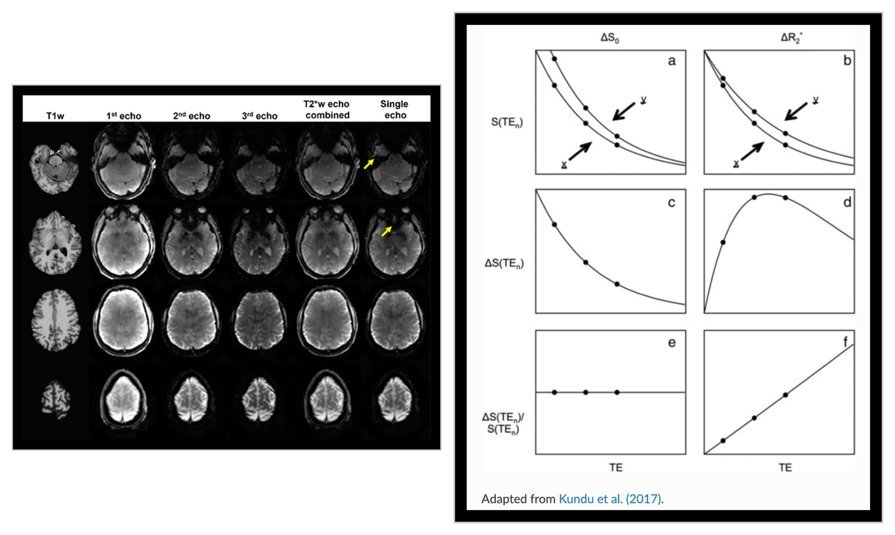

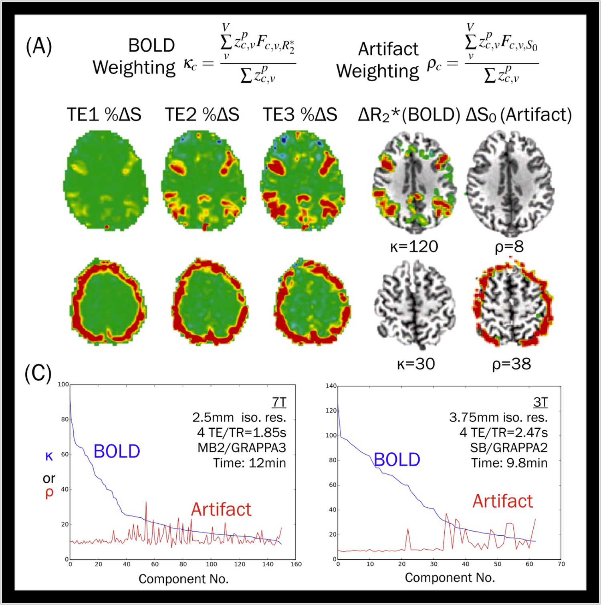

**Figure 11.4. Multi-echo TE dependence for BOLD versus non-BOLD signal components.**

## 11.19 Multi-echo pros and cons
The source slides summarize ME-EPI as follows.

### Advantages
- can improve regional SNR,
- can help distinguish some artifact classes,
- can support more nuanced BOLD/non-BOLD separation.

### Disadvantages
- does not solve all physiology-related confounds,
- may leave subtle motion problems,
- often needs in-plane GRAPPA for three or more echoes,
- adds complexity to acquisition, reconstruction, and analysis.

This is a good example of an advanced method that improves model richness more than it improves basic raw acquisition simplicity.

## 11.20 FLEET as a stabilization strategy
The last advanced method in the source block is **FLEET** (Fast Low-angle Excitation Echo-planar Technique), cited to Polimeni et al. The source slides describe it as minimizing time between ACS segments for each slice and looping ACS then slices using low flip angle to reduce spin history.

This is best understood as a strategy for making calibration data more robust. If reference segments are acquired close together in time and with lower flip-angle perturbation, one reduces the opportunities for motion mismatch and spin-history inconsistency. In other words, FLEET is not just “another acceleration trick.” It is a practical response to calibration fragility in accelerated EPI.

**FLEET: Fast Low-angle Excitation Echo-planar Technique**

Polimeni et al. Magn Reson Med. 2016;75(2):665-679

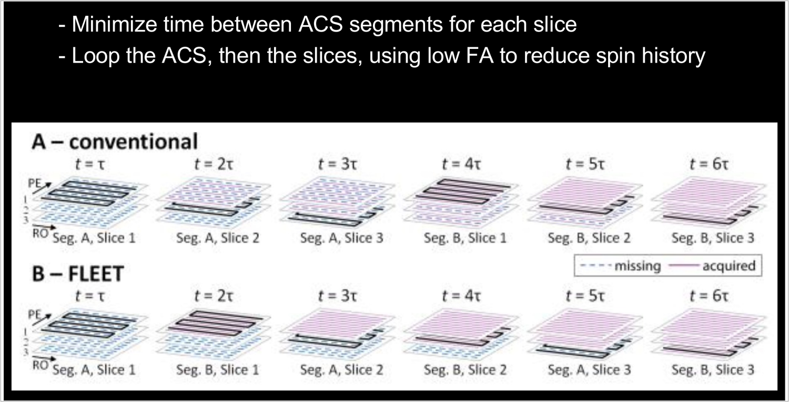

**Figure 11.5. FLEET calibration logic.**

## 11.21 The deeper lesson of advanced EPI
The advanced methods in this chapter are often marketed as efficiency tools, but the deeper lesson is broader: every acceleration or enhancement method rebalances four pressures:
1. distortion,
2. SNR,
3. motion sensitivity,
4. reconstruction dependence.

The practical user should therefore not ask “Which advanced method is best?” in the abstract. The right question is “Which compromise best matches my study’s tolerance for distortion, instability, coverage limits, and analysis complexity?”
---

### Tradeoff box: partial Fourier versus GRAPPA
A useful practical comparison from the source material is this:
- **Partial Fourier** mainly trades fidelity for shorter acquisition or greater coverage, with modest smoothing and possible dropout tradeoffs.
- **GRAPPA** mainly trades calibration dependence and motion sensitivity for reduced distortion and higher effective acceleration.

Neither is universally superior. The right choice depends on whether distortion reduction or calibration robustness matters more for the specific study.

### Practical Scanner Implication
Before enabling multiple accelerations together, ask what failure mode you are stacking. For example, combining high SMS with GRAPPA may reduce TR and distortion but can also amplify residual aliasing, calibration mismatch sensitivity, and low-SNR fragility.

---

## Chapter 11 Summary
- Advanced EPI methods exist to improve coverage, speed, distortion burden, or contrast separability—but every one introduces new tradeoffs.
- Partial Fourier uses conjugate symmetry to omit part of k-space, with choices about early versus late echo omission that matter for BOLD and coverage.
- GRAPPA reduces distortion and supports higher resolution but is highly sensitive to ACS quality and motion mismatch.
- SMS accelerates slice acquisition using coil-based unaliasing and depends strongly on coil geometry and calibration stability.
- Multi-echo EPI uses TE dependence to improve SNR and help distinguish BOLD-like from some non-BOLD signal changes.
- FLEET is a practical method for improving the robustness of calibration in accelerated EPI.

## Key Terms
- Partial Fourier
- Conjugate symmetry
- Early echo omission
- Late echo omission
- GRAPPA
- ACS lines
- Simultaneous multi-slice (SMS)
- Multiband EPI
- SBRef
- Multi-echo EPI
- TE dependence
- FLEET

## Review Questions
1. Why can late echo omission in partial Fourier be more attractive than early echo omission for BOLD fMRI?
2. Why can partial Fourier slightly increase dropout or smoothing?
3. What makes GRAPPA especially sensitive to subject motion?
4. Why does SMS require strong coil sensitivity variation along the slice axis?
5. What kind of signal behavior allows ME-EPI to help separate some BOLD from non-BOLD changes?
6. Why is combining multiple acceleration methods not automatically beneficial?

---

# Chapter 12. Artifact Recognition, Quality Control, and Troubleshooting

## 12.1 The diagnostic mindset
The source slides begin the troubleshooting block with an excellent practical principle: **learn what good data look like for your scan**. This is perhaps the most important operational lesson in the entire course.

Troubleshooting in MRI is not mostly about memorizing rare catastrophic failures. It is about learning to distinguish:
- normal artifact from abnormal artifact,
- expected imperfection from harmful instability,
- subject-related problems from hardware-related problems,
- and acquisition tradeoffs from actual scanner failure.

The source slides also state bluntly that **motion is the biggest issue**, **user error is the next biggest**, and **scanner failures are rare but do happen**. That ordering should be preserved, because it is practical wisdom. In everyday scanning, the most likely explanation is not mysterious machine collapse; it is usually movement, setup error, parameter choice, or a predictable interaction between subject and acquisition.

## 12.2 Good data must be recognized before bad data can be classified
A recurring theme in the source deck is the need to know what **good axial EPI**, **good coronal EPI**, and **good sagittal EPI** look like. This deserves more emphasis than it often gets.

Artifact recognition is impossible without an internal reference standard. A new scanner user who has never really studied good EPI will overcall some normal features and undercall important failures.

What counts as “good” does not mean perfect. Good EPI may still include:
- some expected frontal susceptibility loss,
- faint normal Nyquist ghosting,
- receive field shading,
- and modest residual distortion.

The question is not whether the image is pristine, but whether the observed imperfections are:
- expected for the protocol,
- stable over time,
- spatially tolerable for the scientific target,
- and unlikely to dominate interpretation.

**Normal ghosting**

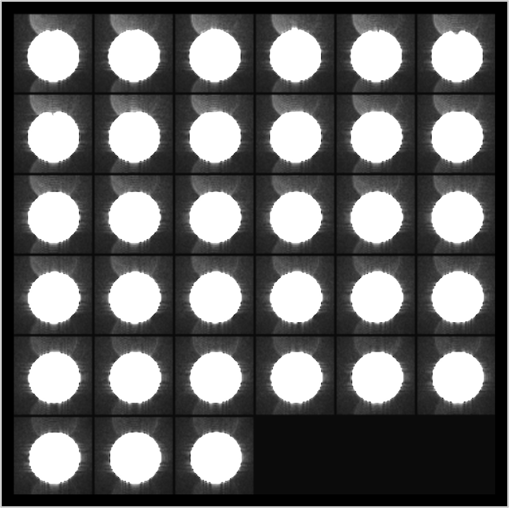

**Figure 12.1. Normal ghosting reference example in EPI.**

## 12.3 Normal ghosting versus abnormal ghosting
The source slides explicitly distinguish **normal ghosting** from more problematic ghost patterns. This is an important teaching move because it avoids a false binary. Not every ghost is evidence of a failed scan.

Small, stable Nyquist ghosts are common in EPI. The practical issue is whether they are:
- weak or strong,
- stable or time-varying,
- outside regions of interest or overlapping them,
- and anatomically predictable or newly abnormal.

A user who treats all ghosting as a disaster may overreact. A user who ignores ghosting entirely may miss task-correlated or motion-correlated nuisance structure. The correct posture is calibrated attention.

## 12.4 Scalp ghosts and eye-movement ghosts
The source deck includes scalp ghosts and specifically warns that Nyquist ghosts from **eye movements** should not fall on something scientifically important. This is highly practical advice.

Eye movements are a classic example of nuisance signal that is both biologically real and scientifically irrelevant to many experiments. Because the eyes are bright, mobile, and anterior, their movement can generate structured ghosting along the phase-encode axis. If those ghosts project into orbitofrontal or medial frontal regions, interpretation becomes especially hazardous.

This is one reason phase-encode direction and artifact placement matter. A good acquisition does not merely minimize artifacts in the abstract; it tries to place unavoidable artifacts somewhere less damaging.

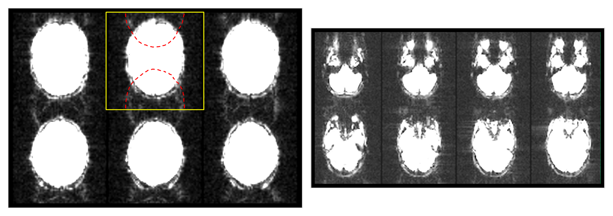

**Figure 12.2. Scalp ghosts and eye-movement ghost placement.**

## 12.5 Standard-deviation images and temporal instability
The source slides repeatedly use **standard-deviation images** and **tSNR maps**. This is one of the most valuable practical habits they teach. Some artifacts are easiest to see not in the mean image, but in temporal-variability summaries.

A standard-deviation image can reveal:
- unstable ghosts,
- motion-affected edges,
- pulsation-sensitive regions,
- calibration mismatch effects,
- or structured scanner instability.

A tSNR map converts the same idea into a normalized stability metric. Together, these tools help separate visually acceptable anatomy from functionally unacceptable time-series behavior.

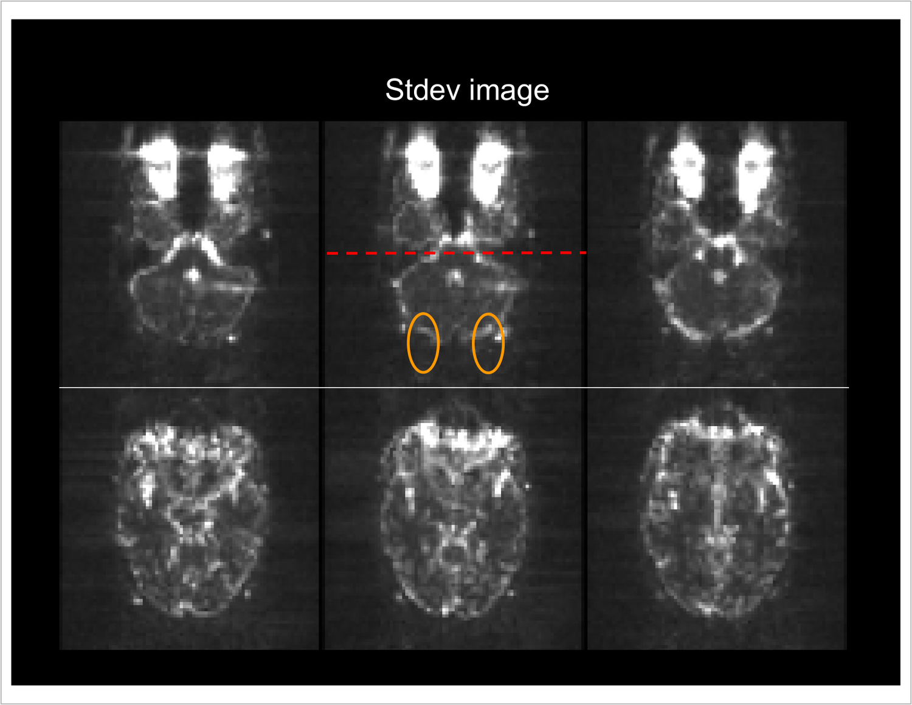

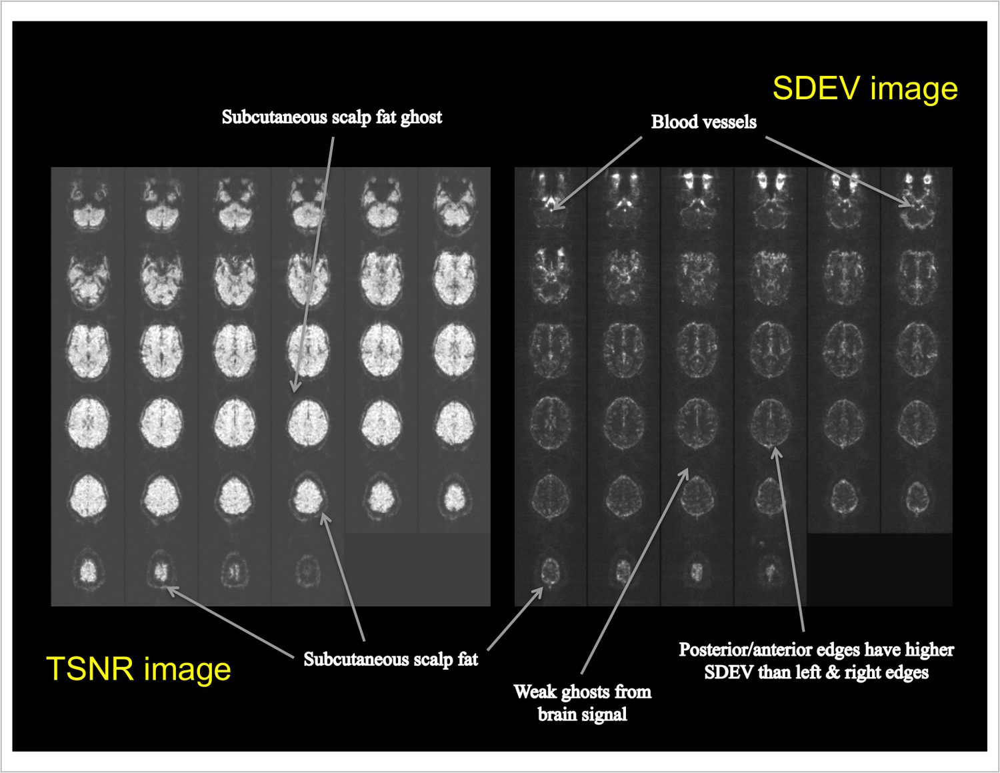

**Figure 12.3. Temporal-SNR and standard-deviation images as temporal-stability tools.**

## 12.6 Prescan normalize and background appearance
The source slides show that **prescan normalize** affects background intensity. This is a good reminder that some apparent changes in image quality are not due to anatomy or pathology but to preprocessing or scanner reconstruction options.

Prescan normalization can be useful, especially for reducing receive bias-field prominence. But it also changes background appearance and sometimes alters the visual salience of certain artifacts.

The practical lesson is simple: know your scanner’s reconstruction settings. Otherwise, you may confuse a processing choice with a physics problem.

## 12.7 Residual aliasing in accelerated acquisitions
The source deck shows **residual aliasing** for GRAPPA, SMS, and SMS + GRAPPA combinations. This is an important continuation of the advanced EPI chapter, but here the emphasis is on recognition rather than mechanism.

Residual aliasing often appears as faint replicated or leaked structure that follows the logic of the acceleration scheme rather than the classic Nyquist ghost pattern. It may be spatially structured, sometimes subtle, and can worsen when calibration is poor or SNR is low.

The practical challenge is that accelerated-imaging residual aliasing can be mistaken for motion, poor anatomy, or normal ghosting. Recognition requires knowing the expected aliasing geometry of the acquisition.

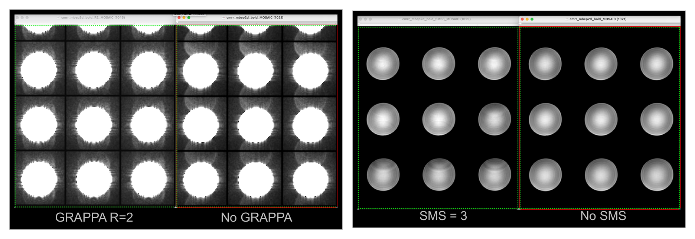

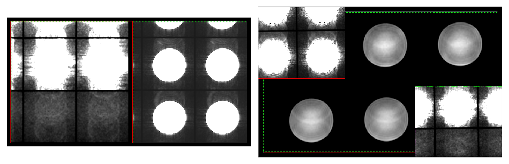

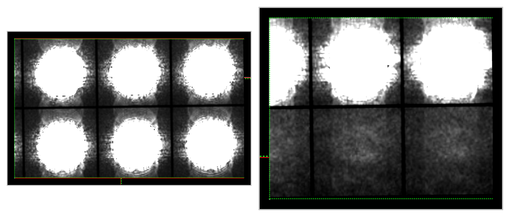

**Figure 12.4. Residual aliasing examples for GRAPPA, SMS, and SMS + GRAPPA.**

## 12.8 Movement is more than head motion
One of the strongest practical sections in the source deck is the decomposition of “movement” into multiple categories:
- real head motion,
- pseudo-motion from breathing,
- movement of other body parts,
- unstable hardware.

This is important because “motion artifact” is often used too loosely. Head motion is only one mechanism. Breathing can modulate the head position or B0 field. Feet moving can transmit mechanical disturbances. Talking changes head posture, jaw position, and physiology. Even third-party movement, as the source deck amusingly illustrates with sea-lion fMRI, can couple into the data.

The diagnostic point is that movement-like image instability does not uniquely identify one cause.

## 12.9 Eye movements, head movements, talking, and moving feet
The source slides devote separate examples to eye movements, head movements, talking, and moving feet. This is worth preserving because each has a different pattern.

- **Eye movements** often produce strong anterior ghosting.
- **Head movements** cause broad spatial misalignment plus spin-history and receive-bias interaction effects.
- **Talking** can create jaw and face motion, respiratory changes, and broader head perturbation.
- **Moving feet** may seem remote, but can transmit motion through the body and scanner support.

The important practical principle is that the body is mechanically and physiologically connected. Motion is rarely as localized as the subject believes.

## 12.10 Coil instability as a distinct failure class
The source slides pay unusual and valuable attention to **coil instability**, including the practical reality that some head coils may have physical play or tilt potential. This is exactly the kind of issue that often escapes purely theoretical MRI teaching.

Coil instability matters because if the coil moves relative to the head, then receive sensitivity can change even if the head itself is relatively still. The resulting artifact can resemble subject motion, receive-bias fluctuation, or inexplicable temporal instability.

This is an excellent example of why troubleshooting should include physical inspection and setup awareness, not only image review.

## 12.11 Third-party movement and environmental contributions
The source deck’s example of third-party movement is humorous, but the lesson is real. Not all instability originates inside the subject’s skull. Environmental disturbances, bed motion, cable tugging, or interactions with external equipment can all perturb the acquisition.

A good troubleshooter therefore asks not only “Did the subject move?” but also “What in the setup may have moved?”
## 12.12 Motion in structural imaging
The inclusion of **motion in MP-RAGE** is important because it broadens the student’s perspective beyond EPI. Motion is not only a functional-series problem. Structural scans can be severely degraded by motion, producing blurred anatomy, ringing, or segmentation problems that later compromise registration and analysis.

This matters because poor structural data can contaminate the entire downstream pipeline even if the EPI itself looks acceptable.

## 12.13 Foreign objects, RF interference, and spike artifacts
The source deck next shows several classic scanner-room or hardware issues:
- foreign objects such as a metal pin,
- RF interference,
- gradient spiking,
- RF coil spikes.

These belong in a textbook because they teach the user to keep an open diagnostic mind. Not every artifact is a subject-behavior problem.

### Foreign objects
Metallic objects distort the local magnetic field, induce severe susceptibility artifacts, and may create signal voids or geometric deformation.

### RF interference
External RF noise can introduce structured stripes, bands, or spikes, depending on its frequency and coupling.

### Gradient spiking
Gradient-related transient faults can produce abrupt structured corruption, sometimes best confirmed using phantom checks.

### RF coil spikes
Coil-electronics instability can create sudden localized or temporally sparse corruption that may also appear in localizers or structural images.

These examples reinforce a central diagnostic rule: if a problem appears across multiple sequence types, hardware causes rise in likelihood.

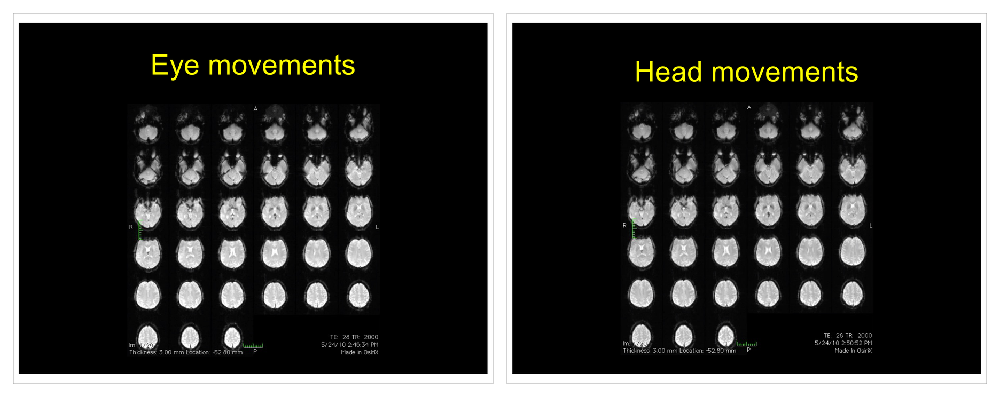

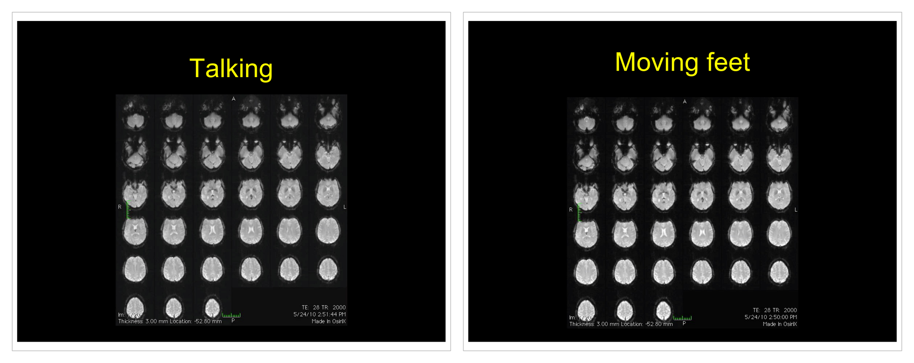

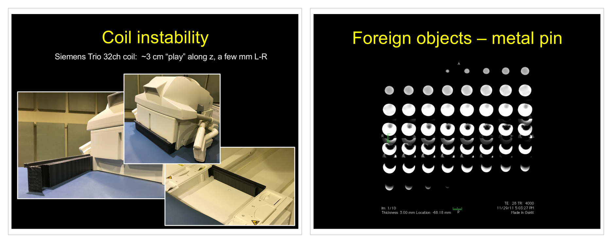

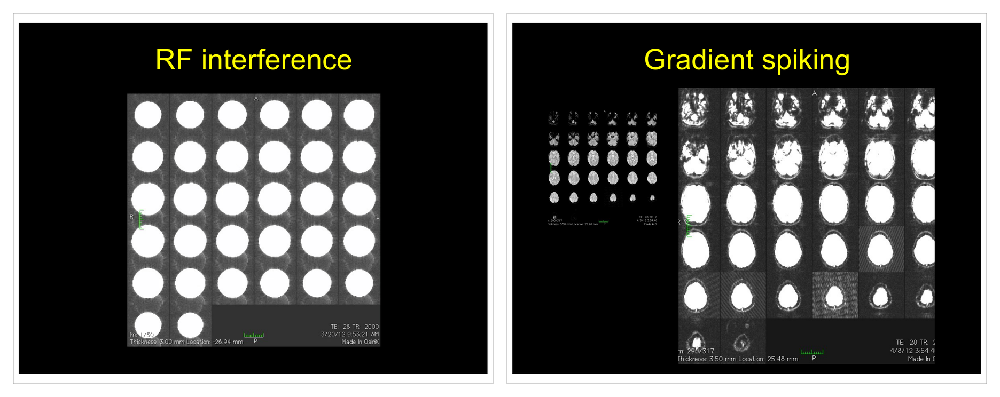

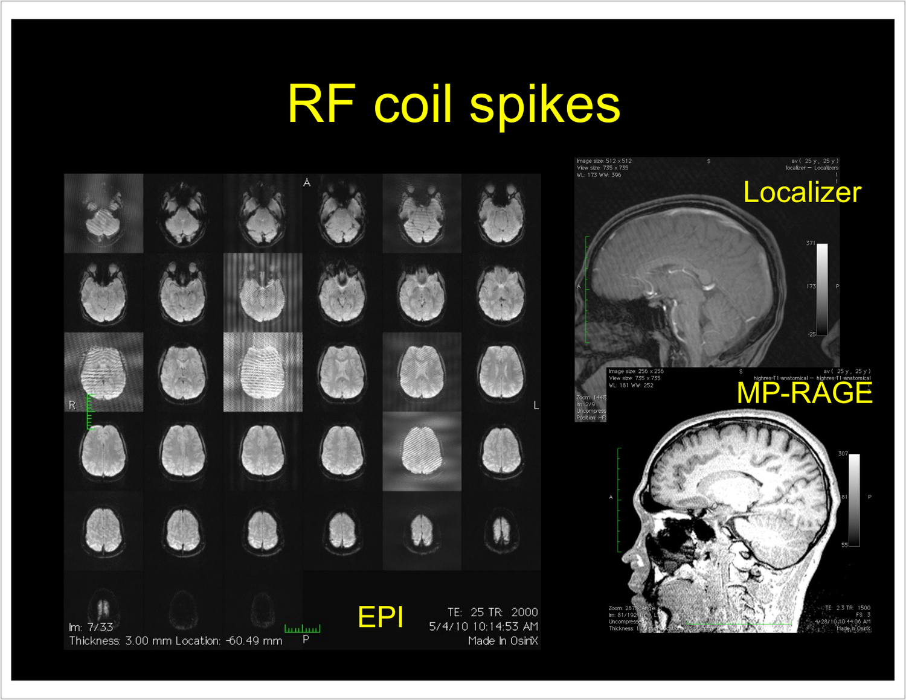

**Figure 12.5. Movement and hardware failure atlas: eyes, head, talking, feet, coil instability, metal, RF interference, gradient spikes, and RF coil spikes.**

## 12.14 System drifts and chronic motion
The source slides conclude with **system drifts and chronic motion**. This is another important reminder that not all problems are transient acute failures. Some are slow, persistent, or cumulative.

Possible contributors include:
- inadequate foam padding,
- talking,
- long-run discomfort,
- slow changes in coil sensitivity map,
- B0 shim drift,
- and other evolving session-level factors.

These are especially dangerous in long runs because they may not produce a single obvious catastrophic frame. Instead, they gradually erode temporal stability.

## 12.15 Tactics for diagnosis
The source deck ends with a practical diagnostic checklist. This should be preserved almost as a canonical scanner-room decision process.

### Step 1: assess temporal stability
Do not begin with a single snapshot. Look across time. Use mean images, standard-deviation images, tSNR, and motion traces if available.

### Step 2: acquire a short retest
A short repeat acquisition can distinguish persistent setup problems from transient anomalies.

### Step 3: make a brief list of possible explanations
Do not jump immediately to a single cause. Enumerate a small differential diagnosis.

### Step 4: develop the most likely hypothesis
Then test it by asking questions such as:
- Does the problem appear in a different scan type?
- Can the problem be made worse deliberately or by changing conditions?
- Does removing and resetting the subject change the outcome?
- Would a short QC test or phantom run help separate subject from hardware causes?

This is excellent troubleshooting advice because it treats MRI diagnosis as a hypothesis-testing process rather than a reflex.

## 12.16 A practical troubleshooting hierarchy
Combining the source deck’s lessons, a practical troubleshooting hierarchy might look like this:

1. **Check whether the artifact is actually abnormal.** Compare against known-good reference images.
2. **Assess whether it is stable or time-varying.** Mean image alone is not enough.
3. **Ask whether the pattern matches a known acquisition artifact.** Ghosting, distortion, dropout, residual aliasing, receive-bias effects.
4. **Assess subject behavior.** Eyes, head, speech, breathing, feet, discomfort.
5. **Assess setup and hardware.** Coil seating, cable position, prescan options, interference risk, physical play, shim state.
6. **Retest briefly.** If needed, remove and reposition.
7. **Escalate to QC or phantom tests** if hardware causes remain plausible.

This is exactly the kind of structured thinking that turns a scanner user into a competent practical operator.

---

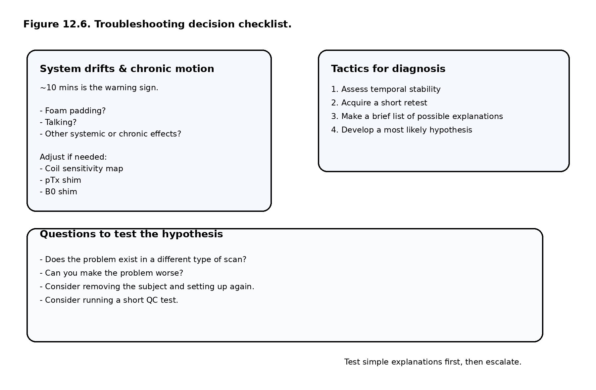

**Figure 12.6. Troubleshooting decision checklist.**

---

### Artifact Recognition: ask three questions first
For any suspicious pattern, ask:
1. **Where is it?** (phase-encode axis? frontal region? background only? global?)
2. **How does it vary over time?** (stable? drifting? intermittent? task-locked?)
3. **What class of mechanism fits it best?** (trajectory mismatch, off-resonance, motion, receive bias, hardware instability, interference)

### Practical Scanner Implication
When in doubt, a short retest is often more informative than a long argument. MRI troubleshooting improves dramatically when hypotheses are tested quickly with small, purposeful acquisitions.

---

## Chapter 12 Summary
- Artifact recognition begins with knowing what good data look like.
- Many “normal” artifacts exist in EPI; the challenge is to judge whether they are stable, tolerable, and away from regions of interest.
- Ghosts from scalp or eye motion can be especially misleading if they fall on brain regions of interest.
- Standard-deviation images and tSNR maps are essential tools for detecting instability.
- Prescan normalization and other reconstruction settings can change image appearance without changing the underlying acquisition problem.
- Residual aliasing from GRAPPA and SMS must be recognized as distinct from classic Nyquist ghosting.
- Movement includes more than head motion; setup, breathing, talking, feet, coil instability, and environmental factors all matter.
- Hardware problems such as RF interference, gradient spiking, and coil spikes are uncommon but real and should be considered when artifacts cross sequence types.
- Good troubleshooting is hypothesis-driven and testable.

## Key Terms
- Artifact recognition
- Standard-deviation image
- Temporal SNR
- Prescan normalize
- Residual aliasing
- Coil instability
- RF interference
- Gradient spike
- QC retest
- Phantom check

## Review Questions
1. Why is learning what good EPI looks like a prerequisite for troubleshooting?
2. How can eye-movement ghosts interfere with interpretation of frontal-lobe data?
3. Why are standard-deviation images often more useful than mean images for troubleshooting?
4. How would you distinguish residual aliasing from classic Nyquist ghosting?
5. Why can coil instability mimic subject motion?
6. What sequence of steps would you follow when a new artifact appears during an fMRI session?

---

# Chapter 13. Biological Confounds and Human Factors in fMRI

## 13.1 Why confounds belong at the end of the physics story
The source deck’s final day is devoted to **confounds in fMRI**, and that placement is pedagogically wise. Biological confounds are easiest to understand only after the reader already understands BOLD contrast, T2* sensitivity, EPI artifacts, motion, receive-bias effects, and accelerated acquisition tradeoffs.

If confounds are introduced too early, they sound like a miscellaneous list of things that can go wrong. If they are introduced after the acquisition and artifact chapters, they become intelligible as the final layer of an already complex system.

Functional MRI is not merely an image-acquisition problem. It is an inference problem. The signal of interest is usually a small time-varying effect embedded within a larger mixture of nuisance sources. Some nuisance sources are scanner-related. Some are motion-related. Some are genuine biological responses that are real, measurable, and even BOLD-like, but not the neural process the experimenter hoped to isolate.

That last category is especially important. Biological confounds are not “fake” in the sense of being nonexistent. Many are real physiologic processes that alter MR signal lawfully. They are confounds because they threaten the mapping from measured signal to intended neural interpretation.

## 13.2 Biological mechanisms that modify fMRI signal
The source slides begin this final block with “Biological mechanisms,” and that broad framing is exactly right. A useful way to organize the topic is by asking: **what biological processes can change the MR signal, even if neural activity of interest has not changed in the intended way?**

Several broad classes matter repeatedly in practical fMRI.

### Baseline vascular state
The BOLD response depends not only on neural activity but on vascular reactivity and baseline physiology. Two subjects with the same neural activation can show different BOLD amplitudes if their vascular systems respond differently.

### Blood gases and respiration-related physiology
Arterial carbon dioxide, oxygenation status, and respiratory pattern can alter cerebral blood flow, blood volume, and blood oxygenation. These changes can produce signal fluctuations that are spatially structured and physiologically meaningful, yet unrelated to the psychological process under study.

### Cardiac pulsation and pulsatile vascular motion
The cardiac cycle can produce local signal fluctuations through vessel motion, cerebrospinal fluid pulsatility, and subtle tissue displacement. These effects may be modest in mean images but important in temporal variability.

### Arousal, fatigue, vigilance, and behavioral state
Alertness and task engagement can change over the course of a scan. These changes may alter both neural activity and physiology, making them especially difficult to classify cleanly.

### Endogenous motion-linked physiology
Breathing, swallowing, jaw tension, posture adjustment, and subtle body movement can alter both physiology and image quality simultaneously.

These mechanisms are not independent; they often interact. For example, anxiety can change breathing and vascular tone, which changes signal. Fatigue can change compliance, eye behavior, and task performance. Caffeine can alter both vascular dynamics and subjective alertness.

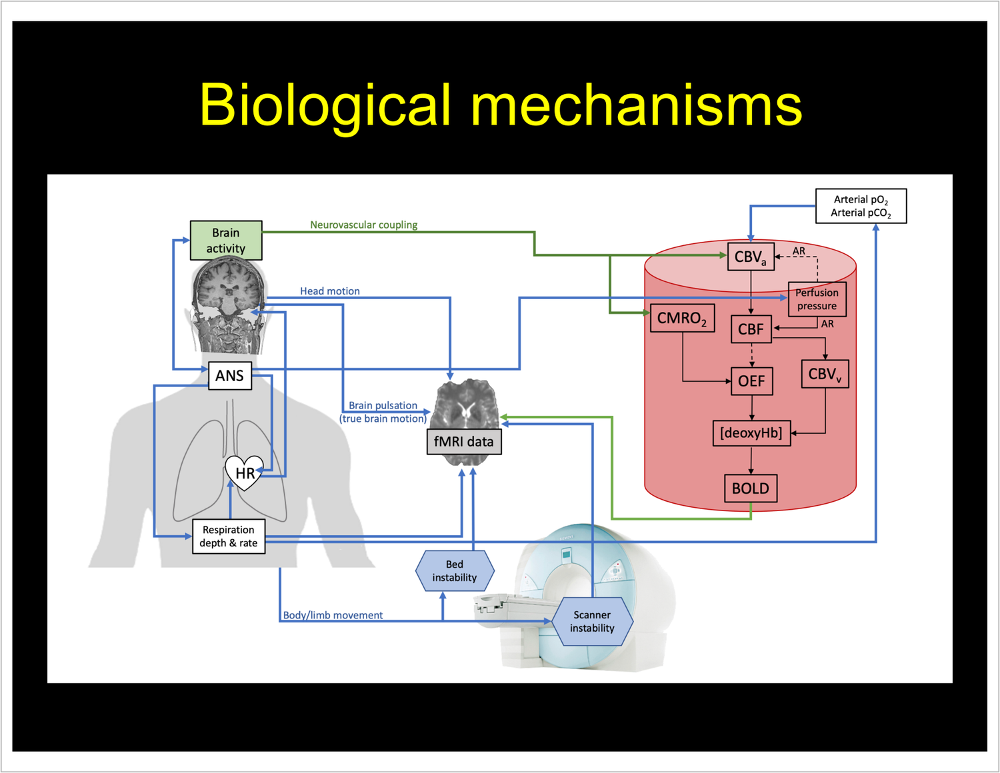

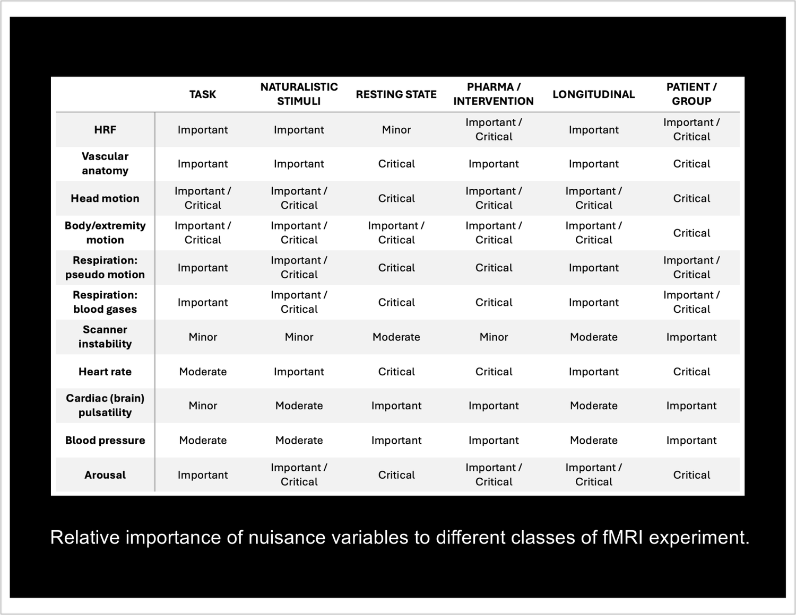

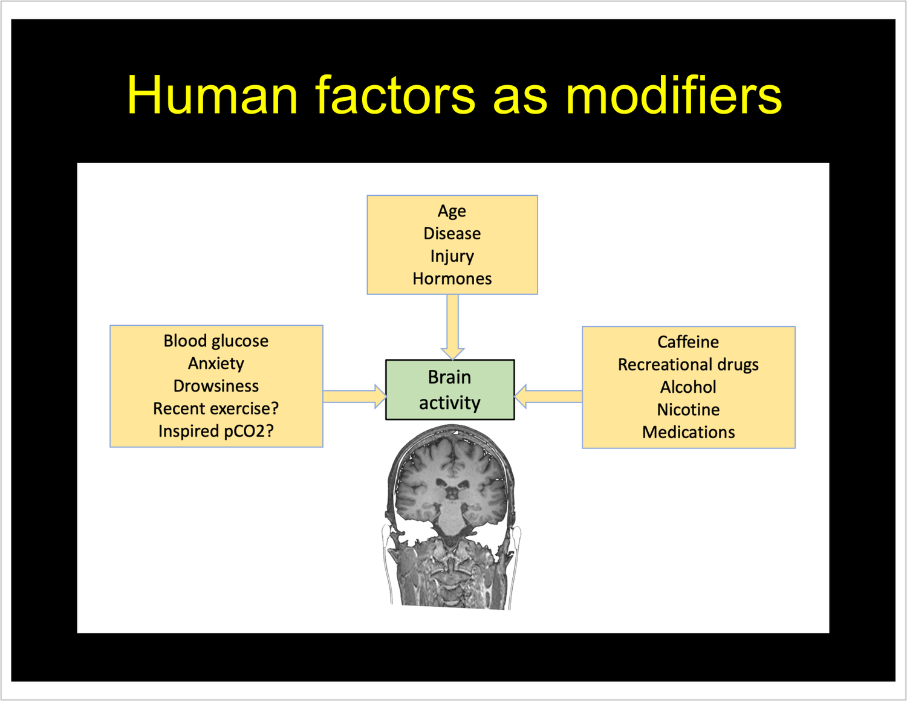

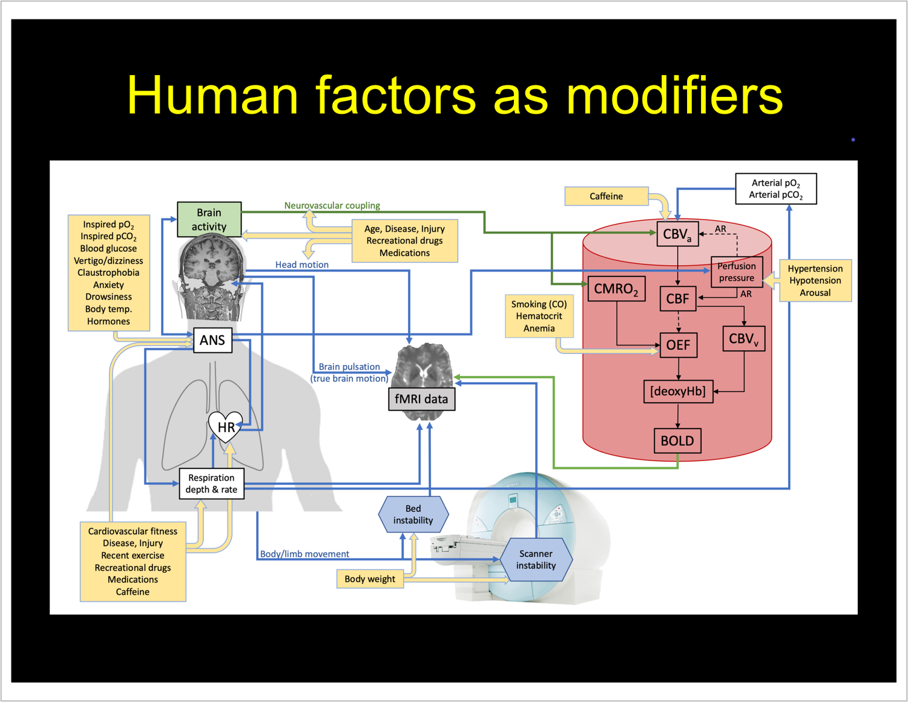

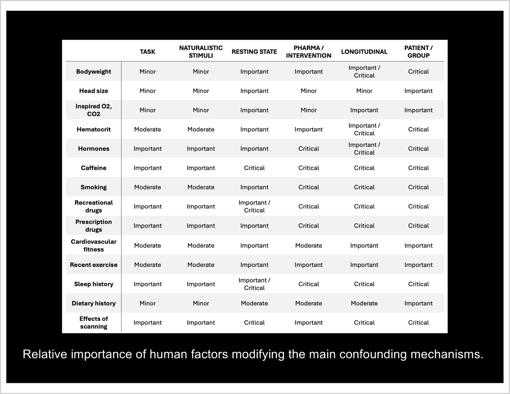

**Figure 13.1. Biological confound mechanisms and how they interact with acquisition and interpretation.**

Figure 13.1 preserves the concept maps and the two ranking tables from the source sequence, so the discussion below can refer directly to those visuals.

## 13.3 Why nuisance importance depends on experiment type
One of the source slides explicitly addresses the **relative importance of nuisance variables to different classes of fMRI experiment**. This is one of the most valuable high-level ideas in the entire confounds section.

There is no single universal ranking of confounds. Their importance depends on the experiment.

For example:
- In a **visual task**, eye movements and vigilance shifts may matter greatly.
- In a **motor task**, subtle motion and muscle-associated physiology may dominate.
- In a **resting-state study**, breathing, cardiac fluctuations, sleepiness, and slow drifts can strongly influence the apparent network structure.
- In a **single-trial event-related design**, time-varying arousal, habituation, and rapid physiologic fluctuations can be especially damaging because the effects of interest are already small and temporally sparse.
- In studies of **clinical or pharmacologic populations**, baseline vascular differences may change the amplitude or timing of BOLD independent of neural mechanism.

This means good fMRI practice does not ask only, “What confounds exist?” It asks, “Which confounds matter most for this specific design, population, target region, and interpretation?”
## 13.4 Human factors as modifiers rather than mere nuisances
The source deck then reframes the issue as **human factors as modifiers**. This wording is important. Human behavior and state do not merely add noise. They often alter the size, timing, or spatial distribution of the measured response.

Examples include:
- alertness and sleepiness,
- anxiety or discomfort,
- task comprehension,
- compliance and effort,
- respiration pattern,
- caffeine or medication use,
- hydration,
- recent exercise,
- and whether the subject talks, fidgets, or moves subtly between runs.

A confound is therefore not always something external to the experiment. Sometimes the experimental session itself changes the biologic conditions under which the imaging is performed.

This perspective is especially helpful because it prevents a false separation between “scanner issues” and “subject issues.” In real fMRI, the subject is part of the measurement system.

## 13.5 Caffeine as a concrete case study
The source slides single out **caffeine** with the memorable phrase “Damned if you do…?” and refer to changes in visual-task responses before and after a 200 mg dose. This is a good case study because caffeine is common, biologically active, behaviorally relevant, and not straightforward to handle.

Caffeine can:
- alter cerebral blood flow,
- change vascular tone and reactivity,
- affect alertness and performance,
- modify baseline state,
- and therefore change the measured BOLD response in more than one way.

This produces a practical dilemma. If participants consume caffeine, vascular and performance effects may change the fMRI signal. If they abstain abruptly, withdrawal or altered arousal may also change the signal. Thus the best practice is not a naive universal ban or universal allowance, but **consistency plus documentation**.

The broader principle is that many common lifestyle factors—sleep, stress, food timing, medication, exercise, nicotine, caffeine—behave similarly. They are not always dominant, but they can become important depending on study design.

**Caffeine: Damned if you do…?**

Block and single trial responses to a visual task prior to and 40 minutes after a 200-mg caffeine dose. From Liu et al. (2004).

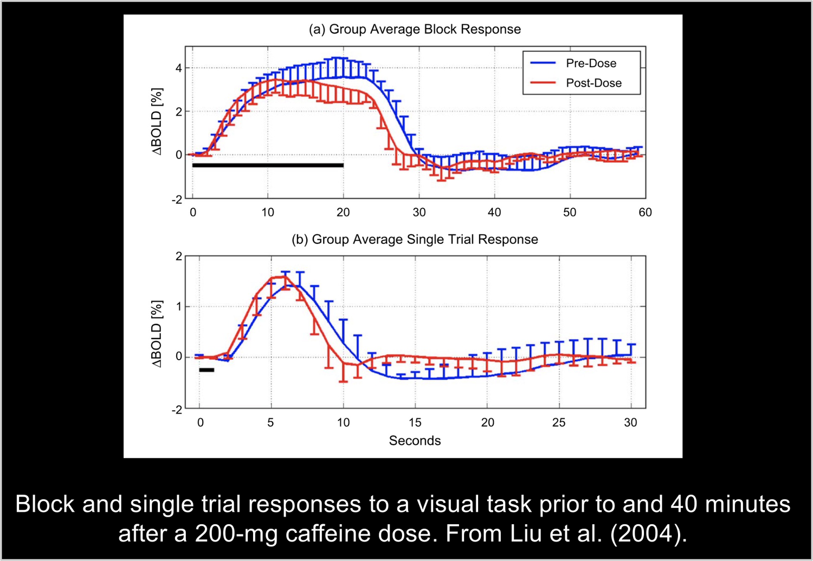

**Figure 13.2. Caffeine case study showing response differences before and after dose.**

## 13.6 Human factors modify the main confounding mechanisms
The source slides explicitly discuss the **relative importance of human factors modifying the main confounding mechanisms**. This suggests a useful conceptual framework.

Human factors modify confounds through several pathways:

### Pathway 1: physiology
Arousal, caffeine, fatigue, and stress change vascular and autonomic physiology.

### Pathway 2: motion and compliance
Discomfort, anxiety, poor task understanding, or boredom increase motion, fidgeting, and inconsistent performance.

### Pathway 3: neural state variation
Subjects may not remain in a stable cognitive state across a run. Mind wandering, habituation, and drowsiness alter the neural background itself.

### Pathway 4: interaction with acquisition choices
Some human-factor effects become more visible under certain protocols. For example, inflow-sensitive acquisitions may accentuate some vascular differences, while high-SMS short-TR protocols may reveal subtle physiologic periodicities more clearly.

This is why the most useful confound model is not a flat list but an interaction map.

## 13.7 Which MRI scans are most useful for capturing biological confounds?
The source deck includes a slide on the **relative utility of MRI scans to capture biological confounds**. This is a particularly practical question because it turns confound awareness into acquisition planning.

Different MRI measurements can be useful for different confound classes:
- **Field maps or reverse-phase-encoded EPI pairs** help characterize distortion-related off-resonance structure.
- **Structural scans** help identify anatomy, susceptibility-prone regions, and motion-degraded morphology.
- **Temporal stability measures** such as tSNR maps help identify unstable regions.
- **Multi-echo acquisitions** can help separate some TE-dependent BOLD-like signal from certain non-BOLD components.
- **Additional physiology-sensitive scans** may be useful depending on the research question, such as vascular reactivity or perfusion-related acquisitions, although these are not always part of routine protocols.

The broader lesson is that some confounds are better addressed with extra imaging, while others are better addressed with auxiliary non-imaging measurements or with better session control.

**Table 13.3. Relative utility of MRI scans to capture biological confounds (retyped from source slide 225).**

| MRI scan / measurement | Task | Naturalistic stimuli | Resting state | Pharma / intervention | Longitudinal | Patient / group |
|---|---|---|---|---|---|---|
| Vascular maps | Helpful | Helpful / Important | Important | Helpful | Helpful | Important |
| Subject-specific HRF | Helpful / Important | Helpful | Minor | Important | Helpful | Important |
| Baseline CBF | Helpful | Helpful | Helpful | Important | Important | Important |
| Baseline Yv | Helpful | Helpful | Helpful | Important | Important | Important |
| CVR | Minor | Minor | Helpful | Helpful | Helpful | Helpful |
| Normalization | Helpful | Minor | Minor | Helpful | Helpful | Helpful |
| Calibrated BOLD | Minor | Minor | Minor | Helpful | Helpful | Helpful |

## 13.8 The role of simultaneous auxiliary data
The source slides also refer to the **relative utility of simultaneous auxiliary data**. This is a crucial point because many confounds are physiologic time-series phenomena, not just image-space phenomena.

Auxiliary data can include:
- respiration traces,
- cardiac pulse recordings,
- end-tidal CO2 when available,
- eye tracking,
- behavioral performance logs,
- button-response timing,
- and task-compliance measures.

These are valuable because they provide direct or indirect access to nuisance processes that are otherwise only inferred from the imaging data. In many studies, such recordings are not optional luxuries. They are the only way to model or at least recognize certain confound sources with confidence.

**Table 13.4. Relative utility of simultaneous auxiliary data (retyped from source slide 225).**

| Simultaneous auxiliary data | Task | Naturalistic stimuli | Resting state | Pharma / intervention | Longitudinal | Patient / group |
|---|---|---|---|---|---|---|
| Pulse oximetry / ECG | Helpful | Important | Important / Critical | Critical | Important | Important |
| Chest motion | Important | Important / Critical | Critical | Important / Critical | Important | Important |
| Expired CO2, O2 | Minor | Minor | Helpful | Helpful | Minor | Helpful |
| Continuous blood pressure | Helpful | Helpful | Helpful / Important | Helpful | Helpful | Important |
| Arousal / vigilance | Helpful | Important | Important / Critical | Important | Important | Important |

## 13.9 What should be collected before and after the scan?
The source deck closes with the **relative importance of auxiliary data to collect pre/post scan**. This is perhaps the most operationally important question of the confounds chapter.

Useful pre/post-scan information may include:
- recent caffeine use,
- sleep quality or sleep duration,
- medication status,
- nicotine or stimulant use,
- hydration and meal timing,
- exercise prior to scan,
- anxiety/discomfort notes,
- task understanding and compliance,
- and any unusual scanner-room events.

These data are often omitted because they feel secondary to the MRI itself. In reality, they can be essential for interpretation, especially when a dataset looks unusual and the imaging alone cannot explain why.

**Table 13.5. Relative importance of auxiliary data to collect pre/post scan (retyped from source slide 226).**

| Pre/post-scan auxiliary data | Task | Naturalistic stimuli | Resting state | Pharma / intervention | Longitudinal | Patient / group |
|---|---|---|---|---|---|---|
| Bodyweight | Minor | Minor | Important | Important | Important / Critical | Critical |
| Resting blood pressure | Minor | Minor | Helpful | Helpful | Helpful | Helpful |
| Hematocrit | Helpful | Helpful | Important | Important | Important / Critical | Critical |
| Hormones | Important | Important | Important | Important | Important | Important |
| Genetic polymorphisms | Helpful | Helpful | Helpful | Important | Minor | Helpful |
| Sociodemographics | Important | Important | Helpful | Helpful | Minor | Helpful / Important |
| Education level | Helpful | Minor | Minor | Minor | Minor | Helpful |
| Language abilities | Important | Helpful | Minor | Minor | Minor | Helpful |
| Psychological assessment | Important | Important | Important | Important / Critical | Important / Critical | Important / Critical |
| Arousal / anxiety | Helpful | Helpful | Important | Important | Important | Important |
| Caffeine history | Important | Important | Critical | Critical | Critical | Critical |
| Dietary history | Minor | Minor | Helpful | Helpful | Helpful | Important |
| Recreational drug history | Important | Important | Important / Critical | Critical | Critical | Critical |
| Sleep history | Important | Important | Important / Critical | Critical | Critical | Critical |
| Exercise history | Helpful | Helpful | Important | Important | Important | Important |

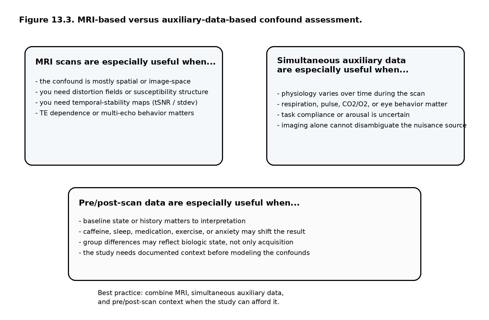

**Figure 13.3. MRI-based versus auxiliary-data-based confound assessment.**

## 13.10 A practical confounds hierarchy
Combining the source slides with the earlier chapters, a practical confounds hierarchy in fMRI can be framed like this:

### Level 1: acquisition and hardware confounds
- ghosting,
- distortion,
- dropout,
- residual aliasing,
- coil instability,
- spikes and drift.

### Level 2: motion-linked and setup-linked confounds
- head motion,
- eye motion,
- breathing-linked pseudo-motion,
- receive-bias modulation,
- spin-history effects.

### Level 3: physiological confounds
- vascular baseline variation,
- breathing and CO2changes,
- cardiac effects,
- inflow,
- arousal and fatigue.

### Level 4: human-factor modifiers
- caffeine,
- sleep,
- stress,
- discomfort,
- effort,
- compliance,
- medication.

The levels interact, but this hierarchy helps the user reason systematically about what class of explanation is most plausible when a dataset or response pattern looks abnormal.

## 13.11 Interpretation rules for practical fMRI
A cautious but useful set of interpretation rules follows from this chapter.

1. **Do not equate statistically significant with neurally specific.** A strong signal can still reflect a confound.
2. **Do not equate BOLD-like with task-specific.** Real BOLD physiology can still reflect nuisance vascular or systemic influences.
3. **Always ask what state the subject was in.** Subject state is not background; it is part of the measurement context.
4. **Confounds matter differently by design.** There is no universal ranking.
5. **Consistency is often more valuable than theoretical purity.** Standardized participant preparation and good metadata can sometimes do more for interpretability than minor protocol tweaks.

---

### Why This Matters
The biggest mistake in fMRI interpretation is not missing a rare scanner failure. It is failing to ask whether the signal you trust is actually the signal you think you are measuring.

### Practical Scanner Implication
For many studies, improved confound handling begins before the first RF pulse: standardize participant preparation, record relevant human-factor information, and decide in advance which auxiliary measurements are worth collecting.

---

## Chapter 13 Summary
- Biological confounds are real physiologic processes that alter measured fMRI signal without necessarily reflecting the neural process of interest.
- The importance of different confounds depends strongly on experiment type, region of interest, and participant population.
- Human factors such as caffeine, sleep, stress, and compliance often modify the main physiological confound pathways rather than merely adding generic noise.
- Extra MRI scans and simultaneous auxiliary recordings can help characterize different confound classes, but they solve different problems.
- Good fMRI interpretation requires both acquisition awareness and session-context awareness.

## Key Terms
- Biological confound
- Vascular reactivity
- Inflow
- Auxiliary data
- Vigilance
- Compliance
- Caffeine effect
- Baseline physiology
- Non-neural BOLD-like signal

## Review Questions
1. Why is the importance of a confound design-dependent rather than universal?
2. Why can caffeine be both scientifically relevant and methodologically problematic in fMRI?
3. What types of simultaneous auxiliary data are most useful for identifying physiological confounds?
4. Why is it misleading to treat all non-neural signal change as simple “noise”
5. What types of pre/post-scan information are most useful to collect for interpretation?
6. How would you explain the difference between a hardware artifact and a biological confound?

---

# Chapter 14. Integrative Practical Framework for Running and Interpreting fMRI

## 14.1 Why a synthesis chapter is necessary
The source slides end with confound-prioritization tables, but the broader course as a whole teaches something even more valuable: practical fMRI is an exercise in **integrative judgment**.

A reader who finishes this book should not merely know isolated facts such as “ghosts occur at FOV/2” or “SMS requires a phased-array coil.” The reader should be able to connect acquisition choices to predictable artifact patterns, connect those artifact patterns to likely interpretive risks, and connect interpretive risks to choices about QC and auxiliary measurements.

That is the purpose of this final chapter. It converts the preceding chapters into a workflow of practical reasoning.

## 14.2 Connecting acquisition choices to artifact vulnerability
Every major acquisition decision changes the error landscape.

### Main field strength
Higher field often improves available signal but increases susceptibility burden and nonuniformity challenges.

### Echo time (TE)
Longer TE generally increases BOLD sensitivity but worsens dropout and signal loss in susceptibility-prone regions.

### Repetition time (TR)
Shorter TR improves temporal sampling but increases steady-state complexity, flip-angle dependence, and often acceleration pressure.

### Slice thickness
Thinner slices reduce intravoxel dephasing and therefore can reduce dropout, but they reduce per-voxel SNR and may force compromises in coverage or TR.

### Phase-encoding direction
Changes the direction in which distortion and ghost placement occur, which can change whether artifacts overlap the region of interest.

### Partial Fourier
Can increase coverage or shorten timing but may increase smoothing and vulnerability to dropout-related tradeoffs.

### GRAPPA
Can reduce distortion but increases reconstruction dependence and motion sensitivity.

### SMS
Can reduce TR or increase coverage but increases slice-leakage and calibration sensitivity when pushed too far.

### Multi-echo EPI
Can improve interpretive leverage but increases complexity and often requires further acceleration support.

The practical user should therefore think of protocol design as choosing not just what data to collect, but also what failure modes to tolerate.

## 14.3 Connecting artifacts to downstream analysis risk
An artifact is not important merely because it is visually ugly. It is important because it threatens a downstream inference.

Some examples:
- **Ghosting** is especially dangerous when it overlaps expected activation regions or varies with time.
- **Distortion** is especially dangerous when accurate anatomical localization matters.
- **Dropout** is especially dangerous when the study depends on orbitofrontal or inferior temporal signal.
- **Residual aliasing** is dangerous when accelerated-imaging leakage creates structured but subtle nuisance patterns.
- **Receive-bias motion effects** are dangerous when small motion appears as plausible regional time-series modulation.
- **Biological confounds** are dangerous when they mimic expected timing or correlate with task structure indirectly.

Thus, QC should not be aesthetic alone. It should be hypothesis-aware.

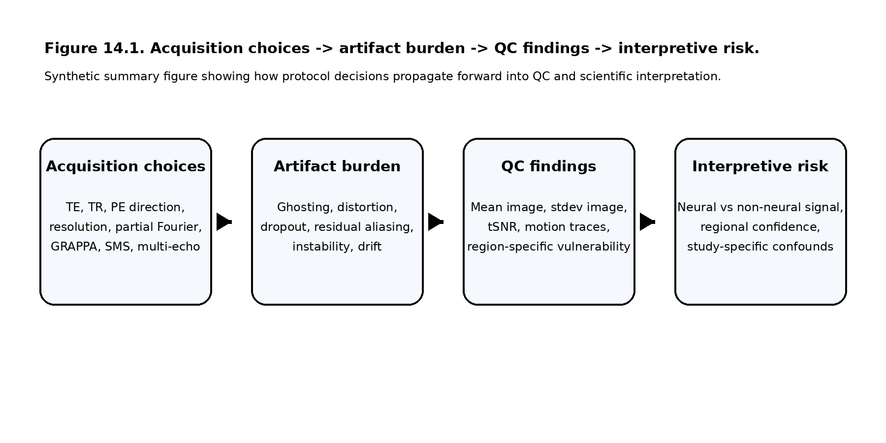

**Figure 14.1. Integrated concept map from acquisition choice to artifact burden to interpretive risk.**

## 14.4 Choosing compromises for different study goals
Different studies justify different compromises.

### Whole-brain task fMRI
Coverage and robust temporal sampling may dominate. Moderate distortion may be acceptable if the target regions are not in severe susceptibility zones.

### Orbitofrontal or anterior temporal studies
Dropout and distortion burden become central. Phase-encoding direction, slice thickness, TE, and perhaps multi-echo strategy deserve extra attention.

### High-resolution laminar or small-structure work
SNR, distortion, and motion sensitivity become much more severe constraints. Aggressive acceleration may help some aspects while worsening others.

### Resting-state studies
Long-run stability, physiologic recording, vigilance control, and drift become especially important.

### Clinical or developmental studies
Motion tolerance, participant comfort, and standardized preparation may matter more than theoretical peak efficiency.

This is why no acquisition template is universally optimal.

## 14.5 A pre-scan checklist
Before the scan begins, a practical operator should ask:

### Subject preparation
- Has caffeine/medication/sleep status been documented if relevant?
- Does the participant understand the task?
- Is the participant comfortable enough to remain still?
- Is the importance of eye behavior, talking avoidance, and motion control clear?

### Hardware/setup
- Is the coil seated correctly and stably?
- Are cables, pads, and accessories positioned cleanly?
- Is the phase-encoding direction appropriate for the region of interest?
- Are acceleration settings justified rather than habitual?

### Protocol design
- Is TE appropriate for the target contrast and anatomical region?
- Is slice thickness acceptable given dropout concerns?
- Are auxiliary recordings planned if the study needs them?

## 14.6 An in-scan checklist
During the scan, the following questions matter:
- Do the mean images resemble known-good data?
- Is ghosting weak and where expected?
- Is distortion tolerable for the target anatomy?
- Is dropout catastrophic in the target region?
- Are there signs of unexpected spikes, leakage, or instability?
- Is the subject moving, talking, breathing irregularly, or fatiguing?
- Does a quick retest improve or reproduce the problem?

The value of rapid visual QC cannot be overstated. Detecting a correctable issue during the session is vastly better than discovering it after the subject has left.

## 14.7 A post-scan checklist
After the acquisition, interpretation should be guided by structured review.

### Image quality review
- mean image,
- standard-deviation image,
- temporal SNR,
- motion estimates,
- distortion profile,
- presence of residual aliasing or spikes.

### Session-context review
- unusual subject behavior,
- discomfort or noncompliance,
- caffeine or sleep irregularity,
- hardware/setup notes,
- any mid-session changes.

### Analysis-risk review
- Did the main confounds likely overlap the regions of interest?
- Are there design features that make specific confounds especially dangerous?
- Are auxiliary recordings adequate for nuisance modeling?

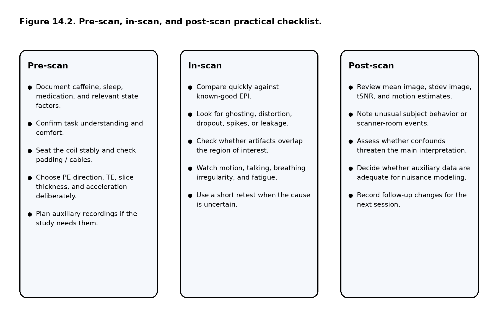

**Figure 14.2. Pre-scan, in-scan, and post-scan practical checklist.**

## 14.8 A decision tree for practical interpretation
When interpreting a result, a cautious practical workflow is:

1. **Is the data quality acceptable in principle?**  
   If not, stop before overinterpreting statistics.

2. **Do known artifacts overlap the effect location?**  
   If yes, interpret with strong caution.

3. **Could the effect be explained by motion, physiology, or human-factor variation?**  
   If yes, evaluate available nuisance evidence.

4. **Does the acquisition design make the region especially vulnerable to the observed pattern?**  
   If yes, do not treat the effect as generic evidence.

5. **Are additional supporting data available?**  
   Structural alignment, auxiliary physiology, task behavior, retests, or alternative contrasts can increase confidence.

This process is slower than naive interpretation, but it is much more scientifically honest.

## 14.9 The final synthesis: from signal physics to scientific validity
The deepest lesson of practical fMRI is that scientific validity emerges from a chain, not from a single good image.

The chain looks like this:

spin physics → excitation and relaxation → spatial encoding → EPI trajectory → artifact structure → motion and hardware interaction → physiologic modulation → human-factor modification → interpretation.

At any stage, simplifications can be useful. But if too many stages are ignored, the final inference becomes fragile.

This is why MRI education should not split into disconnected courses on “physics,”“sequences,” and “analysis.” Practical competence lives in the links between them.

A reader who can reason across the full chain is much less likely to make two common errors:
1. overtrusting a clean-looking but unstable dataset,
2. or dismissing a complex but still interpretable dataset without understanding what actually limits it.

## 14.10 What practical mastery looks like
Practical mastery in fMRI does not mean memorizing every pulse-sequence option or every published correction technique. It means being able to answer questions like these:
- Why does this region look distorted?
- Why does this task effect appear earlier at one flip angle than another?
- Why did motion correction not remove the fluctuation?
- Why did acceleration reduce one problem but create another?
- What extra data should I collect next time to distinguish competing explanations?

If this manuscript succeeds, the reader should be able to treat those questions not as isolated mysteries, but as reasoned consequences of the system described throughout the book.

---

### Key takeaway box
Good fMRI is never just “good pictures.” It is the disciplined management of tradeoffs across physics, hardware, physiology, behavior, and interpretation.

---

## Chapter 14 Summary
- Practical fMRI requires connecting acquisition parameters to expected artifact behavior and downstream inferential risk.
- Different study goals justify different compromises; there is no universally optimal protocol.
- Good practice includes structured pre-scan preparation, in-scan QC, and post-scan interpretive review.
- Scientific confidence in fMRI depends on understanding the full chain from spins to confounds.

## Key Terms
- Protocol tradeoff
- Inferential risk
- Quality control
- Auxiliary recording
- Hypothesis-aware QC
- Session context

## Review Questions
1. Why is a visually acceptable image not sufficient evidence of scientifically acceptable fMRI data?
2. How do study goals change the appropriate acquisition tradeoffs?
3. Why should QC be hypothesis-aware rather than purely aesthetic?
4. What information should be gathered before, during, and after the scan to support interpretation?
5. What does it mean to say that scientific validity in fMRI emerges from a chain rather than from a single step?

---

# Appendix A. Equation Guide and Symbol Reference

## A.1 Core equations

### Larmor equation
\[
\omega_0 = \gamma B_0
\]
**Meaning:** precessional angular frequency is proportional to the magnetic field.  
**Why it matters:** sets resonance frequency, RF hardware frequency, and the sensitivity of imaging to field perturbations.

### Boltzmann population relation
\[
\frac{N_{\text{low}}}{N_{\text{high}}} = e^{\Delta E/kT}
\]
**Meaning:** lower-energy spin states are slightly more populated.  
**Why it matters:** explains why equilibrium magnetization exists but is intrinsically small.

### Flip-angle relation
\[
\theta = \gamma B_1 T_p
\]
**Meaning:** RF amplitude and pulse duration determine the tip angle.  
**Why it matters:** connects sequence timing to excitation strength, saturation behavior, inflow sensitivity, and steady-state contrast.

### Transverse decay
\[
M_{xy}(t) = M_{xy}(0)e^{-t/T_2}
\]
**Meaning:** coherent transverse magnetization decays exponentially.  
**Why it matters:** underlies T2 contrast and helps explain why echoes must be sampled promptly.

### Longitudinal recovery
\[
M_z(t) = M_0\left(1-e^{-t/T_1}\right)
\]
**Meaning:** longitudinal magnetization recovers toward equilibrium after excitation.  
**Why it matters:** determines saturation, T1 weighting, and repeated-excitation behavior.

### Signal under a readout gradient
\[
S(t) = \int M(x)e^{i\gamma G_x t x}\,dx
\]
**Meaning:** the measured signal is the sum of spatial contributions whose phase evolves according to gradient-imposed position dependence.  
**Why it matters:** provides the direct bridge from object space to encoded signal.

### k-space definition
\[
k(t) = \frac{\gamma}{2\pi}\int_0^t G(\tau)\,d\tau
\]
**Meaning:** k-space position depends on gradient area.  
**Why it matters:** allows pulse sequences to be understood as trajectories through spatial-frequency space.

### Image–k-space Fourier relationship
\[
S(k_x) = \int M(x)e^{i2\pi k_x x}\,dx
\]
**Meaning:** k-space data are the Fourier transform of the spatial object.  
**Why it matters:** explains reconstruction, aliasing, partial Fourier, and many artifact classes.

## A.2 Common symbols
- \(B_0\): static main magnetic field
- \(B_1\): RF excitation field
- \(\gamma\): gyromagnetic ratio
- \(\omega_0\): Larmor angular frequency
- \(M_0\): equilibrium magnetization
- \(M_z\): longitudinal magnetization
- \(M_{xy}\): transverse magnetization
- \(T_1\): longitudinal relaxation time
- \(T_2\): intrinsic transverse relaxation time
- \(T_2^*\): apparent transverse decay including field inhomogeneity
- \(G_x, G_y, G_z\): gradient amplitudes along x, y, z
- \(k_x, k_y\): spatial-frequency coordinates
- \(TE\): echo time
- \(TR\): repetition time
- \(FA\): flip angle
- \(\chi\): magnetic susceptibility

---

# Appendix B. Artifact Troubleshooting Tables

## B.1 Quick symptom-to-cause table

| Symptom | Likely mechanism | First thing to check | Common response |
|---|---|---|---|
| Replica image at ~FOV/2 in PE direction | Nyquist ghosting / odd-even mismatch | Is it stable or time-varying? | Check ghost correction, eye motion, fat suppression, timing stability |
| Warped anatomy near sinuses or ear regions | Off-resonance distortion | PE direction and local susceptibility zones | Reverse PE pair, adjust protocol, accept tradeoff with caution |
| Signal voids in orbitofrontal or inferior temporal cortex | Susceptibility dropout / intravoxel dephasing | TE, slice thickness, target anatomy | Consider thinner slices, shorter TE, alternative protocol choices |
| Bright shifted scalp signal or ghost-like contamination | Fat-related chemical shift / inadequate fat suppression | Was fatsat on and effective? | Improve fat suppression and review PE placement |
| Fine replicated structure after accelerated imaging | Residual aliasing from GRAPPA/SMS | Calibration/reference stability | Review ACS/SBRef quality, reduce acceleration if needed |
| Sudden spikes across time | RF interference / gradient or coil spikes | Does it appear across sequence types? | Run short retest, QC, phantom if needed |
| Structured fluctuation after motion correction | Receive-bias modulation / spin history / residual motion | Coil geometry, motion traces, receive nonuniformity | Interpret cautiously, review preprocessing and acquisition context |
| Global or slow drift over run | System drift, chronic motion, subject-state change | Long-run stability and session notes | Retest, review padding/setup, consider nuisance modeling |

## B.2 Practical diagnostic questions
1. Is the problem in one frame or across the whole run?
2. Is it present in multiple sequence types?
3. Does it align with the phase-encode direction?
4. Does it worsen with motion or calibration mismatch?
5. Does it overlap the region of interest?
6. Would a short retest or phantom test distinguish subject from hardware causes?

---

# Appendix C. Acquisition Tradeoff Summary Tables

## C.1 Parameter tradeoffs

| Parameter / method | Main benefit | Main cost | Best use case | Main caution |
|---|---|---|---|---|
| Longer TE | Stronger T2* / BOLD sensitivity | More dropout and lower raw signal | BOLD-sensitive studies in moderate artifact regions | Risky in orbitofrontal / inferior temporal cortex |
| Shorter TE | Less dropout, better signal retention | Reduced BOLD sensitivity | Artifact-prone regions or robustness-first protocols | May weaken functional contrast |
| Thinner slices | Less intravoxel dephasing | Lower per-voxel SNR, more slices needed | Susceptibility-prone regions | Coverage/TR tradeoff |
| Partial Fourier | More slices or shorter TR | Smoothing, SNR loss, some dropout tradeoff | Coverage-limited EPI | Choose early vs late omission deliberately |
| GRAPPA | Less distortion, higher nominal efficiency | Motion-sensitive calibration, noise amplification | Distortion-limited EPI | ACS quality is crucial |
| SMS | Shorter TR / more coverage | Slice leakage, calibration burden, low-SNR fragility | Fast whole-brain EPI | Avoid overaggressive MB factors |
| Multi-echo EPI | Better regional SNR and TE-dependent classification | More complexity and acceleration pressure | Studies where BOLD/non-BOLD separation matters | Does not solve all physiology |
| Higher flip angle | More signal in some settings | More saturation/inflow weighting changes | Specific steady-state designs | Temporal behavior can change |
| Reverse PE pair | Distortion characterization/correction | Extra acquisition time | Distortion-sensitive protocols | Still not a substitute for good base EPI |

## C.2 Study-priority framing
- **If coverage is limiting:** consider SMS or partial Fourier, but watch calibration and smoothing costs.
- **If distortion is limiting:** consider GRAPPA and PE-direction choice.
- **If dropout is limiting:** consider thinner slices, TE adjustment, and anatomy-aware compromises.
- **If interpretation is limiting:** consider multi-echo and better auxiliary recordings.

---

# Appendix D. Grounding and Scientific Supplements

## D.1 Grounding policy for this manuscript
This book should be read as a reconstruction of the source slide deck, not as an invitation to improvise unsupported MRI lore. The intended grounding rule is:
- core claims should be traceable to the source slides,
- pedagogical expansions should clarify slide content rather than drift away from it,
- and any substantive expansion beyond slide wording should be supported by established MRI/fMRI literature.

This policy is especially important in a topic like practical fMRI, where a fluent-sounding explanation can still be wrong if it silently overextends beyond what the acquisition physics and published methods actually support.

## D.2 Slide-anchored references explicitly visible in the source deck
The slide deck itself cites or names several references that anchor major parts of the manuscript. These include, at minimum:
- **Lauterbur P. C. (1973).** *Image formation by induced local interactions: examples employing nuclear magnetic resonance.* Nature 242:190–91.  
  Relevance: historical projection-imaging logic and the first MRI examples.
- **Feinberg D. A., Setsompop K. (2013).** *Ultra-fast MRI of the human brain with simultaneous multi-slice imaging.* Journal of Magnetic Resonance 229:90–00.  
  Relevance: simultaneous multi-slice (SMS) / multiband acquisition logic.
- **Polimeni J. R., et al. (2016).** *Reducing sensitivity losses due to respiration and motion in accelerated echo planar imaging by reordering the autocalibration data acquisition.* Magnetic Resonance in Medicine 75:665–79.  
  Relevance: FLEET-style calibration strategy and motion/respiration robustness in accelerated EPI.
- **Wald L. L. (slide-cited; coil-sensitivity / motion-correction context).**  
  Relevance: receive-field heterogeneity and the persistence of motion-linked intensity modulation after rigid-body realignment.
- **Duyn / Frahm / Gao & Liu / Liu et al. (slide-cited in inflow, physiology, and caffeine/confound contexts).**  
  Relevance: inflow contributions, physiological modulation, and human-factor effects in GRE-based fMRI.
- **Kaza et al. (slide-cited in receive-coil-array and SMS coil-sensitivity contexts).**  
  Relevance: array-coil architecture, spatial sensitivity structure, and the coil-encoding logic that matters for receive performance and SMS unaliasing.

Where the manuscript discusses these topics, the slide deck itself is therefore not just a pedagogical source but also a visible reference source.

## D.3 Core scientific supplements used to justify expansion beyond slide shorthand
To keep the reconstructed textbook from inventing unsupported material, expansions should remain within the scope of standard references such as:
- **Buxton R. B. (2009).** *Introduction to Functional Magnetic Resonance Imaging: Principles and Techniques* (2nd ed.). Cambridge University Press.  
  Use: BOLD logic, hemodynamics, fMRI interpretation, physiological confounds.
- **Bernstein M. A., King K. F., Zhou X. J. (2004).** *Handbook of MRI Pulse Sequences.* Elsevier Academic Press.  
  Use: pulse-sequence structure, gradients, echoes, slice selection, k-space trajectories.
- **Brown R. W., Cheng Y.-C. N., Haacke E. M., Thompson M. R., Venkatesan R. (2014).** *Magnetic Resonance Imaging: Physical Principles and Sequence Design* (2nd ed.). Wiley-Blackwell.  
  Use: foundational MRI physics, relaxation, Fourier encoding, contrast mechanisms, hardware.

These supplements are not meant to replace the slide deck. They are the guardrails that allow the prose to become textbook-like without becoming speculative.

## D.4 Practical editing rule for future revisions
When revising this manuscript, use the following test for every substantial explanatory addition:
1. Is the claim already present, implied, or directly motivated by the slide content?
2. If not, is it standard enough to be supported by one of the core supplements above or by a clearly named slide-cited paper?
3. If the answer to both questions is no, rewrite or remove it.

This rule is intentionally conservative. In a self-study textbook, slightly less embellishment is better than confident but weakly grounded elaboration.

# Appendix E. Source Resource Slides and External Links
These slides are not core physics or acquisition-theory content, but they are part of the source deck and are worth preserving in textbook form so the book does not silently drop useful follow-up material.

## E.1 Bonus videos (source slide 23)
- **How MRI works**  
  https://www.youtube.com/watch?v=TQegSF4ZiIQ
- **NMR spectroscopy for visual learners**  
  https://www.youtube.com/watch?v=fG-ZexdlziU

## E.2 Additional concept / teaching links from the source deck
- **Slide 83 — Aliasing**  
  https://mriquestions.com/eliminate-wrap-around.html
- **Slide 111 — Multi-slice EPI / spin-history-effects background**  
  https://imaging.mrc-cbu.cam.ac.uk/imaging/CommonArtefacts
- **Slide 114 — A real EPI pulse sequence**  
  https://practicalfmri.blogspot.com/2012/07/physics-for-understanding-fmri.html
- **Slide 120 — Magnetic susceptibility**  
  https://mriquestions.com/what-is-susceptibility-chi.html

## E.3 Further information on partial Fourier versus GRAPPA (source slide 168)
- **Partial Fourier versus GRAPPA for increasing EPI slice coverage**  
  https://practicalfmri.blogspot.com/2014/01/partial-fourier-versus-grappa-for.html

## E.4 Artifact-identification background links (source slides 188 and 198)
- **Good axial EPI**  
  https://practicalfmri.blogspot.com/2011/11/understanding-fmri-artifacts-good-axial.html
- **Artifacts by category**  
  https://practicalfmri.blogspot.com/2012/09/understanding-fmri-artifacts-contents.html
- **Good coronal & sagittal EPI**  
  https://practicalfmri.blogspot.com/2011/11/understanding-fmri-artifacts-good.html

## E.5 Multi-echo EPI resources from the source deck
- **Slide 178 — tedana: TE Dependent ANAlysis**  
  https://tedana.readthedocs.io/en/stable/index.html
- **Slide 179 — Weighted sum of echoes reference**  
  https://doi.org/10.3390/s23094329

## E.6 Why these links are preserved
These resource slides function as a lightweight operator bibliography inside the teaching deck. They are not substitutes for the textbook itself, but they are part of the original instructional package and may still be useful for visual examples, blog-style explanations, and supplemental review.

# Glossary

**Aliasing** — Wrap-around of signal caused by insufficient sampling or inadequate field of view representation.

**Autocalibration signal (ACS)** — Fully sampled reference data used to reconstruct missing lines in GRAPPA-style parallel imaging.

**B0** — Static main magnetic field of the MRI system.

**B1** — Oscillating RF magnetic field used for excitation.

**BOLD** — Blood-oxygen-level-dependent contrast; a T2*-weighted fMRI signal mechanism linked to hemodynamic consequences of neural activity.

**Chemical shift** — Frequency difference between chemically distinct proton environments caused by electronic shielding.

**Conjugate symmetry** — Relationship between opposite parts of k-space used in partial Fourier reconstruction under appropriate assumptions.

**Conjugate variables** — Paired domains related by Fourier transform, such as time/frequency and space/k-space.

**Distortion** — Off-resonance-driven misplacement of signal, especially along the phase-encoded direction in EPI.

**Dropout** — Local signal loss caused by strong dephasing, often from susceptibility variation.

**Echo-planar imaging (EPI)** — Rapid imaging method that samples many k-space lines after a single excitation using a train of gradient echoes.

**Echo time (TE)** — Time between excitation and echo sampling.

**Flip angle (FA)** — Rotation angle of magnetization produced by an RF pulse.

**Fourier transform** — Mathematical operation that converts a signal between conjugate domains, such as time and frequency or image space and k-space.

**Free induction decay (FID)** — Decaying transverse MR signal following excitation in the absence of full refocusing.

**Ghosting** — Replica-image artifact, commonly caused in EPI by odd/even line mismatch or related timing/phase errors.

**Gradient echo (GRE)** — Echo produced by reversing gradient-induced dephasing with balanced gradient moments rather than with a 180° RF pulse.

**Gradient spiking** — Artifact arising from abrupt transient gradient-related corruption.

**GRAPPA** — Parallel imaging method that reconstructs omitted k-space lines using multi-channel coil data and reference calibration.

**Gyromagnetic ratio** — Constant linking magnetic field strength to resonance frequency for a given nucleus.

**Inflow effect** — Signal change caused by fresh spins entering the imaging region with different saturation history than stationary tissue.

**K-space** — Spatial-frequency representation of the image.

**Larmor frequency** — Resonance frequency of precession in a magnetic field.

**Multi-echo EPI** — EPI acquisition collecting more than one echo per excitation for combined-SNR or TE-dependent analysis.

**Nyquist ghost** — Classic EPI ghosting artifact often displaced by half the field of view in the phase-encoded direction.

**Partial Fourier** — Acquisition strategy that omits part of k-space and reconstructs the missing portion approximately.

**Phase encoding** — Spatial encoding dimension in which gradient-induced phase steps are varied across repetitions.

**Prescan normalize** — Reconstruction or scanner option used to reduce apparent intensity nonuniformity from receive bias.

**Receive bias field** — Spatial variation in receive-coil sensitivity across the image.

**Receive field heterogeneity** — Nonuniform receive sensitivity pattern, especially important with coil arrays.

**Residual aliasing** — Incomplete unaliasing after acceleration methods such as GRAPPA or SMS.

**Repetition time (TR)** — Time between successive excitations in a repeated sequence.

**Rotating frame** — Reference frame rotating at or near the Larmor frequency, used to simplify spin dynamics.

**Signal-to-noise ratio (SNR)** — Ratio of measured signal amplitude to noise level.

**Simultaneous multi-slice (SMS)** — Method that excites multiple slices at once and uses coil sensitivity to separate them.

**Slice selection** — Excitation of a limited spatial slab using a selective RF pulse during a gradient.

**Spin echo** — Echo formed by applying a 180° RF pulse to refocus certain types of dephasing.

**Spin history** — Dependence of current magnetization on previous excitation history.

**Susceptibility** — Tendency of a material to magnetize in an external field, affecting local field structure.

**T1** — Longitudinal relaxation time describing recovery toward equilibrium magnetization.

**T2** — Intrinsic transverse relaxation time describing loss of coherence from microscopic interactions.

**T2*** — Apparent transverse decay that includes T2 plus additional dephasing from field inhomogeneity.

**Temporal SNR (tSNR)** — Mean signal over time divided by temporal standard deviation; a measure of time-series stability.

**Wrap-around** — Another term for aliasing.

---

# Index-like Keyword Guide

## Core physics
B0; B1; Larmor frequency; net magnetization; rotating frame; flip angle; T1; T2; T2*; spin echo; gradient echo.

## Image formation
Fourier transform; conjugate variables; gradients; slice selection; k-space; frequency encoding; phase encoding; readout.

## EPI and artifacts
EPI; ghosting; Nyquist ghost; distortion; dropout; fat suppression; chemical shift; bandwidth; phase-encoding direction.

## Advanced methods
Partial Fourier; GRAPPA; ACS; SMS; multiband; multi-echo EPI; FLEET.

## Troubleshooting and QC
tSNR; standard-deviation image; residual aliasing; coil instability; RF interference; gradient spiking; retest; phantom check.

## Confounds and interpretation
Inflow; spin history; receive bias field; biological confounds; human factors; caffeine; auxiliary data; interpretation risk.

