# Preface

Practical fMRI rewards readers who can connect physics, pulse sequence design, image appearance, and experimental interpretation. This book reconstructs the practical fMRI course as a self-study textbook. It keeps the original course emphasis on mechanisms and real data appearances while expanding the terse slide language into cumulative explanation.

The intended reader is an advanced undergraduate, beginning graduate student, new imaging researcher, or technically minded collaborator who needs to understand how scanner choices become fMRI data quality. The book starts with NMR signal formation, moves through MRI spatial encoding, builds EPI from k-space principles, and then treats modern acceleration, artifacts, troubleshooting, and biological confounds.

Figures are source-backed when the source labels, arrows, legends, edge tags, or image examples are part of the teaching evidence. Each figure is grouped by concept rather than by slide number. Dense sequences are continued so that small labels and diagnostic image patterns remain readable.

# Chapter 1. NMR Signal Formation

This chapter covers source pages 1-23 and turns them into a self-study sequence about build the
physical vocabulary for precession, excitation, relaxation, spin echoes, and chemical shift. The
chapter is organized by mechanism and scanning consequence, not by slide order alone, so figures
appear where they support the local explanation.

## Magnetization, Larmor precession, and signal strength

Magnetization, Larmor precession, and signal strength is the local bridge between the course
vocabulary and a self-study explanation. The relevant source ideas include Day One; Morning;
Introduction to NMR; Net magnetization; The spins' precessional; frequency is called the Larmor;
frequency, w0; w0 = gB0; (Hz); Signal strength depends on magnetic field; strength, B0; DE micro
B0. Taken together, they should be read as one argument about connect B0, spin populations, and
detectable net magnetization. The textbook version therefore slows the slide sequence down:
first define the measured or manipulated quantity, then state what changes it, and only then
connect the change to image appearance or fMRI interpretation.

In this part of nmr signal formation, the central discipline is to separate mechanism from
display. A pulse sequence diagram, a k-space grid, or a brain image is not merely a picture of a
result; it encodes a chain of causes. For magnetization, larmor precession, and signal strength,
that chain starts with the controlled scanner quantity, passes through spin phase or signal
weighting, and ends as a spatial pattern, time-series change, or acquisition tradeoff. If the
chain is left implicit, the same term can be memorized without being understood.

A useful way to study magnetization, larmor precession, and signal strength is to ask three
questions for every equation or panel. What quantity is deliberately controlled in Chapter 1's
local sequence or example? What uncontrolled physical or biological quantity can perturb it?
What image-space or time-series signature would reveal the problem? These questions keep the
mathematics connected to practical fMRI, where protocol choices are judged by SNR, temporal
stability, distortion, dropout, timing, and interpretability rather than by elegance alone.

The source pages named Day One, Net magnetization, Signal strength depends on magnetic field
also show why MRI explanations often require several levels. At the microscopic level, spins
precess, relax, dephase, or refocus. At the sequence level, RF pulses and gradients impose
timing and spatial encoding. At the reconstruction level, Fourier relationships convert sampled
signals into images. At the experimental level, subject motion, physiology, hardware stability,
and human factors determine whether the image series supports a defensible fMRI interpretation.

For practice, the reader should be able to restate magnetization, larmor precession, and signal
strength without using slide shorthand. The restatement should include the relevant variables,
the direction of the effect, and the likely failure mode. A good explanation is specific enough
to predict what would happen if the field strength, gradient area, echo spacing, flip angle,
coil sensitivity, motion state, or nuisance measurement changed.

## Figure 1.1. Magnetization and field-dependent signal strength

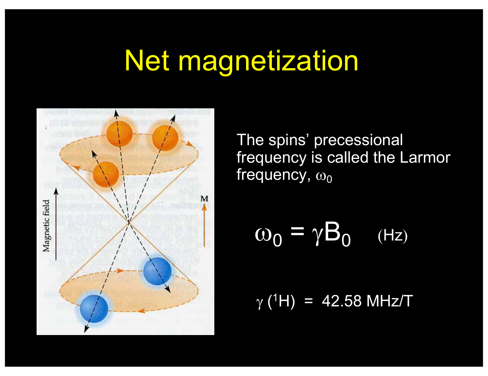

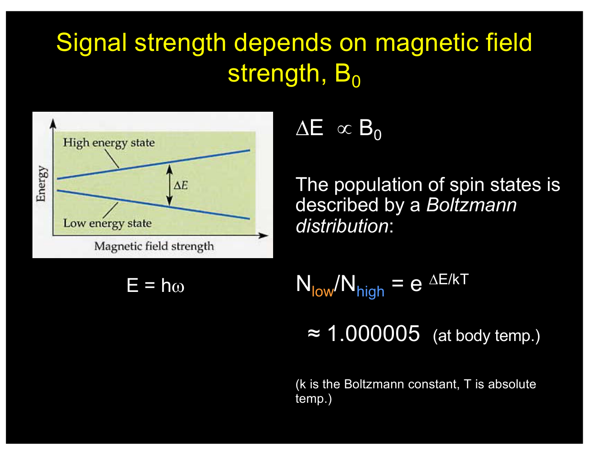

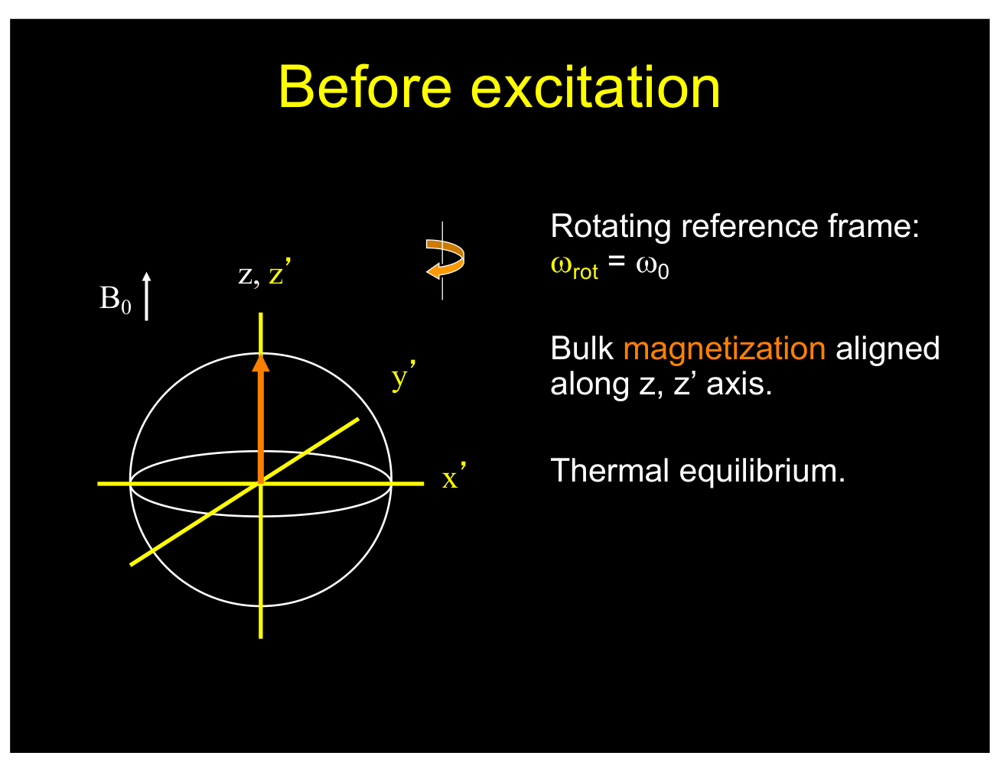

**Figure 1.1. Magnetization and field-dependent signal strength.** Larmor precession, Boltzmann imbalance, and the equilibrium z-axis state. Source pages 2-4 are grouped because they teach one local mechanism or diagnostic comparison. Key source labels and terms include: Net magnetization; The spins' precessional; frequency is called the Larmor; frequency, w0; w0 = gB0; (Hz); Signal strength depends on magnetic field; strength, B0.

This figure should be read as a sequence inside Chapter 1, not as an isolated picture. It begins
with net magnetization and ends with before excitation, so the reader can follow how the local
idea changes across the source panels. The retained source-backed panels are used here because
the original annotations are part of the evidence: the reader needs the labels, axes, arrows,
image examples, and comparison tags to see why the mechanism matters.

The practical lesson is larmor precession, boltzmann imbalance, and the equilibrium z-axis
state. In a scanner context, the important move is to translate what is drawn into an
acquisition consequence: which gradient is acting, which echo or reference data are being
trusted, which bandwidth or timing choice is limiting, or which image pattern would appear
during quality control.

For Figure 1.1, use the panels as a local reasoning test. If they show a temporal sequence, ask
what physical quantity is being conserved, reversed, accelerated, or lost. If they show images,
compare the same anatomical region across the named conditions before making a protocol
conclusion. That habit prevents a common fMRI error: treating the label magnetization and field-
dependent signal strength as a diagnosis before checking the visual evidence.

## RF excitation in the rotating frame

RF excitation in the rotating frame is the local bridge between the course vocabulary and a
self-study explanation. The relevant source ideas include Before excitation; Rotating reference
frame:; wrot = w0; Bulk magnetization aligned; along z, z' axis.; Thermal equilibrium.;
Excitation: the RF pulse; Add briefly a second; magnetic field, B1. B1; oscillates in time, it's
not; constant like B0; B1 appears stationary in. Taken together, they should be read as one
argument about show how B1 tips magnetization and why transverse phase coherence is temporary.
The textbook version therefore slows the slide sequence down: first define the measured or
manipulated quantity, then state what changes it, and only then connect the change to image
appearance or fMRI interpretation.

In this part of nmr signal formation, the central discipline is to separate mechanism from
display. A pulse sequence diagram, a k-space grid, or a brain image is not merely a picture of a
result; it encodes a chain of causes. For rf excitation in the rotating frame, that chain starts
with the controlled scanner quantity, passes through spin phase or signal weighting, and ends as
a spatial pattern, time-series change, or acquisition tradeoff. If the chain is left implicit,
the same term can be memorized without being understood.

A useful way to study rf excitation in the rotating frame is to ask three questions for every
equation or panel. What quantity is deliberately controlled in Chapter 1's local sequence or
example? What uncontrolled physical or biological quantity can perturb it? What image-space or
time-series signature would reveal the problem? These questions keep the mathematics connected
to practical fMRI, where protocol choices are judged by SNR, temporal stability, distortion,
dropout, timing, and interpretability rather than by elegance alone.

The source pages named Before excitation, Excitation: the RF pulse, Excitation: the RF pulse,
Magnetization after excitation:, Magnetization after excitation: also show why MRI explanations
often require several levels. At the microscopic level, spins precess, relax, dephase, or
refocus. At the sequence level, RF pulses and gradients impose timing and spatial encoding. At
the reconstruction level, Fourier relationships convert sampled signals into images. At the
experimental level, subject motion, physiology, hardware stability, and human factors determine
whether the image series supports a defensible fMRI interpretation.

For practice, the reader should be able to restate rf excitation in the rotating frame without
using slide shorthand. The restatement should include the relevant variables, the direction of
the effect, and the likely failure mode. A good explanation is specific enough to predict what
would happen if the field strength, gradient area, echo spacing, flip angle, coil sensitivity,
motion state, or nuisance measurement changed.

## Figure 1.2. RF excitation and transverse dephasing

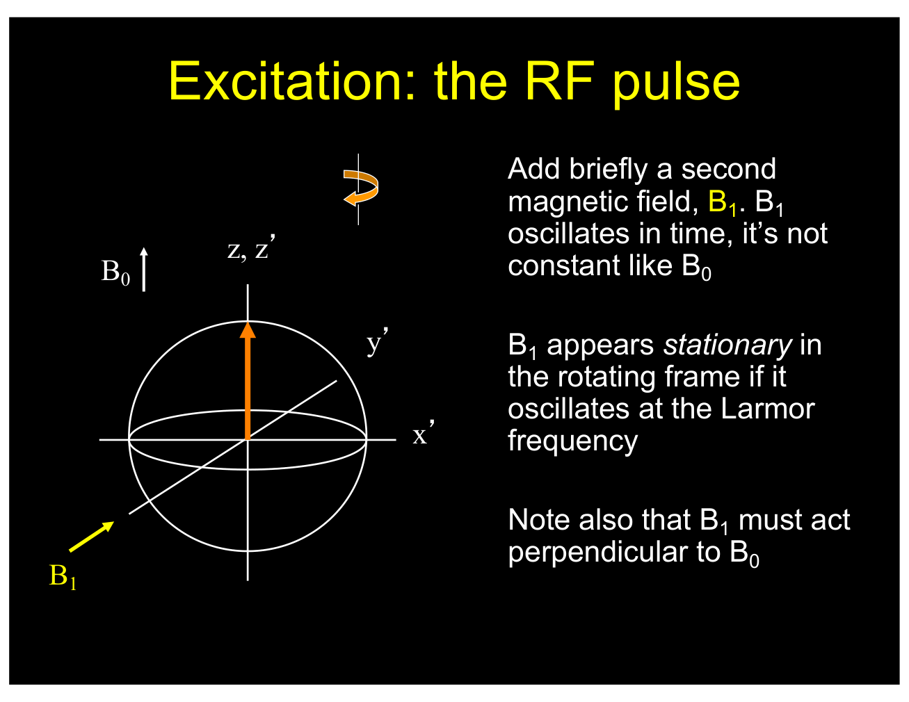

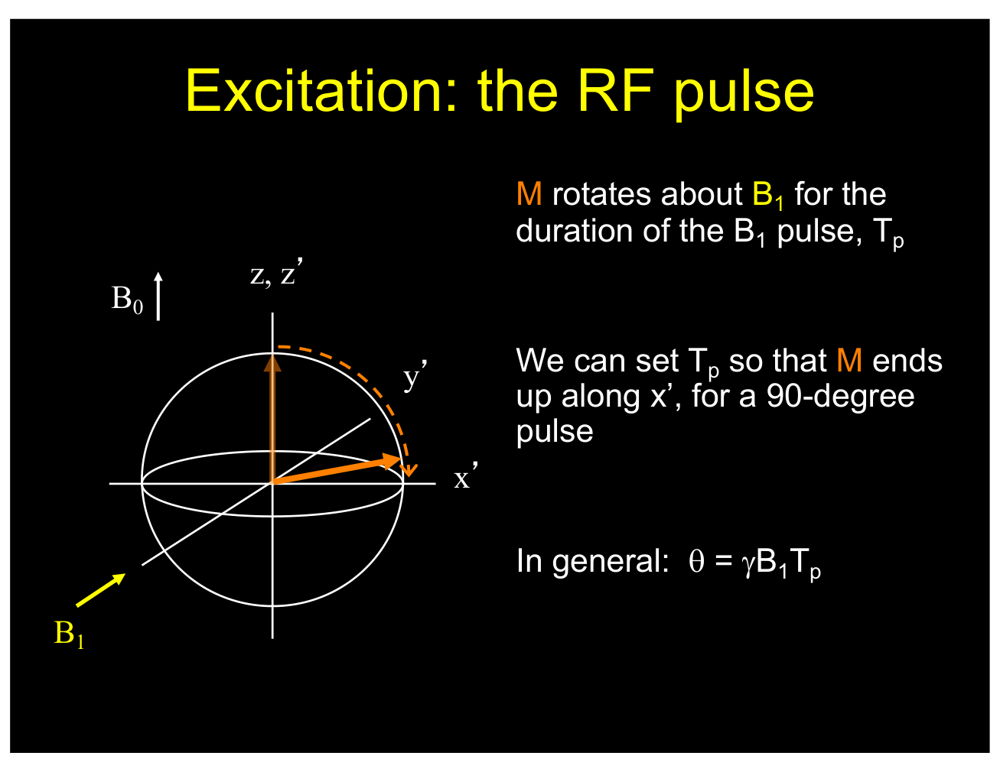

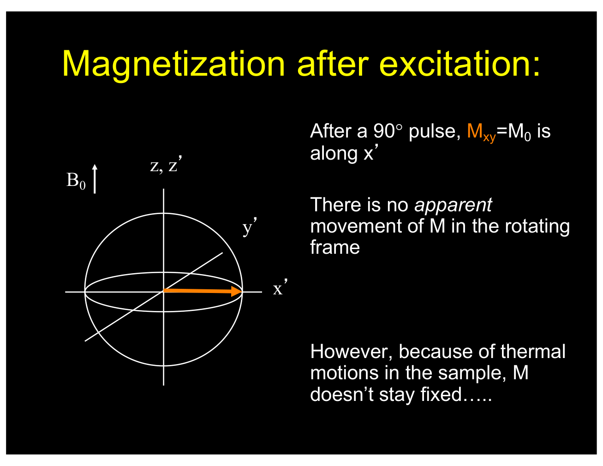

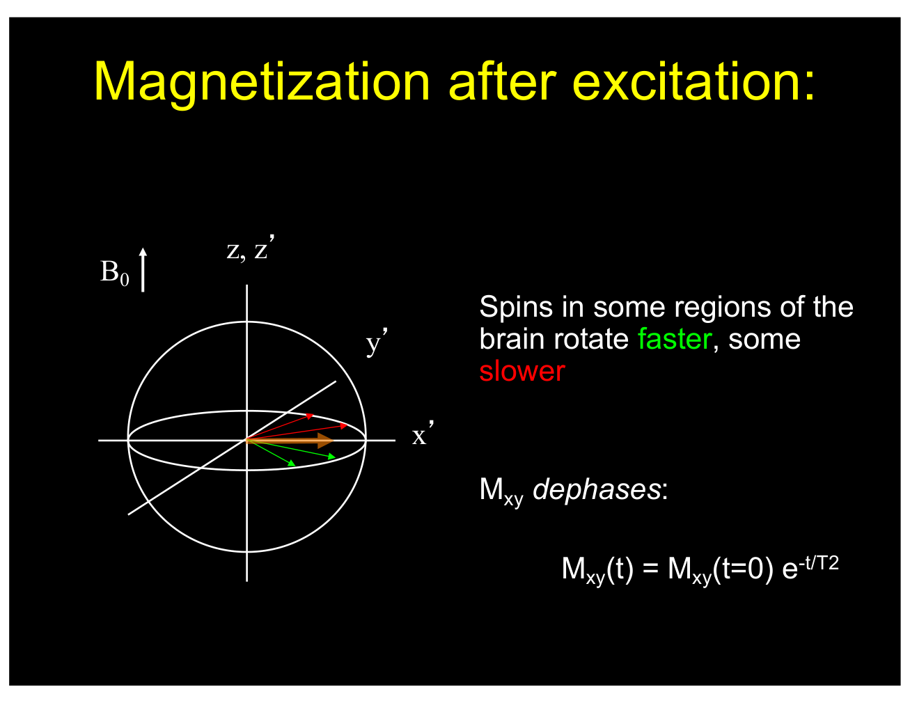

**Figure 1.2. RF excitation and transverse dephasing.** The B1 pulse in the rotating frame and the loss of transverse phase coherence. Source pages 5-8 are grouped because they teach one local mechanism or diagnostic comparison. Key source labels and terms include: Excitation: the RF pulse; Add briefly a second; magnetic field, B1. B1; oscillates in time, it's not; constant like B0; B1 appears stationary in; M rotates about B1 for the; duration of the B1 pulse, Tp.

This figure should be read as a sequence inside Chapter 1, not as an isolated picture. It begins
with excitation: the rf pulse and ends with magnetization after excitation:, so the reader can
follow how the local idea changes across the source panels. The retained source-backed panels
are used here because the original annotations are part of the evidence: the reader needs the
labels, axes, arrows, image examples, and comparison tags to see why the mechanism matters.

The practical lesson is the b1 pulse in the rotating frame and the loss of transverse phase
coherence. In a scanner context, the important move is to translate what is drawn into an
acquisition consequence: which gradient is acting, which echo or reference data are being
trusted, which bandwidth or timing choice is limiting, or which image pattern would appear
during quality control.

For Figure 1.2, use the panels as a local reasoning test. If they show a temporal sequence, ask
what physical quantity is being conserved, reversed, accelerated, or lost. If they show images,
compare the same anatomical region across the named conditions before making a protocol
conclusion. That habit prevents a common fMRI error: treating the label rf excitation and
transverse dephasing as a diagnosis before checking the visual evidence.

## Signal detection and echo formation

Signal detection and echo formation is the local bridge between the course vocabulary and a
self-study explanation. The relevant source ideas include Signal detection:; The changing
magnetic; component in the transverse; (x'y') plane is the relevant; component.; We detect (via
magnetic; The NMR signal; The signal decays with; exponential decay constant T2; T2
characterizes all exchanges; of energy between spins -; there's no net energy change. Taken
together, they should be read as one argument about follow dephasing, refocusing, and the signal
that a receive coil can measure. The textbook version therefore slows the slide sequence down:
first define the measured or manipulated quantity, then state what changes it, and only then
connect the change to image appearance or fMRI interpretation.

In this part of nmr signal formation, the central discipline is to separate mechanism from
display. A pulse sequence diagram, a k-space grid, or a brain image is not merely a picture of a
result; it encodes a chain of causes. For signal detection and echo formation, that chain starts
with the controlled scanner quantity, passes through spin phase or signal weighting, and ends as
a spatial pattern, time-series change, or acquisition tradeoff. If the chain is left implicit,
the same term can be memorized without being understood.

A useful way to study signal detection and echo formation is to ask three questions for every
equation or panel. What quantity is deliberately controlled in Chapter 1's local sequence or
example? What uncontrolled physical or biological quantity can perturb it? What image-space or
time-series signature would reveal the problem? These questions keep the mathematics connected
to practical fMRI, where protocol choices are judged by SNR, temporal stability, distortion,
dropout, timing, and interpretability rather than by elegance alone.

The source pages named Signal detection:, The NMR signal, The spin echo, Excitation, After first
evolution, and related panels also show why MRI explanations often require several levels. At
the microscopic level, spins precess, relax, dephase, or refocus. At the sequence level, RF
pulses and gradients impose timing and spatial encoding. At the reconstruction level, Fourier
relationships convert sampled signals into images. At the experimental level, subject motion,
physiology, hardware stability, and human factors determine whether the image series supports a
defensible fMRI interpretation.

For practice, the reader should be able to restate signal detection and echo formation without
using slide shorthand. The restatement should include the relevant variables, the direction of
the effect, and the likely failure mode. A good explanation is specific enough to predict what
would happen if the field strength, gradient area, echo spacing, flip angle, coil sensitivity,
motion state, or nuisance measurement changed.

## Figure 1.3. Signal detection and the spin-echo sequence

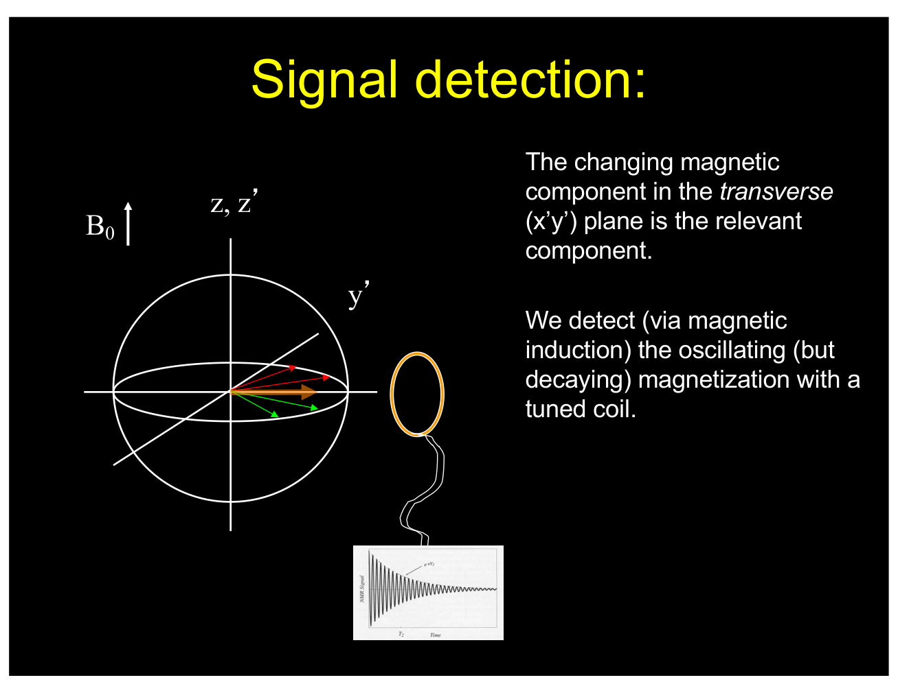

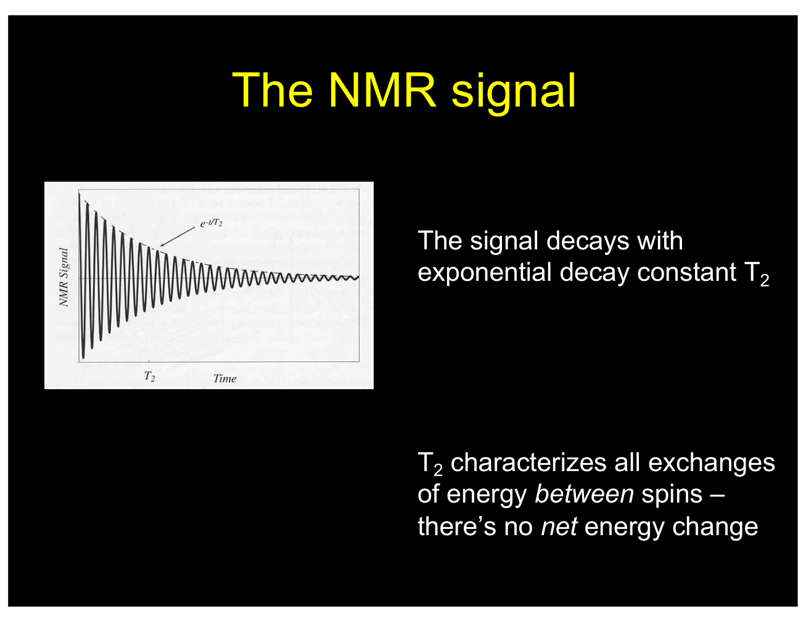

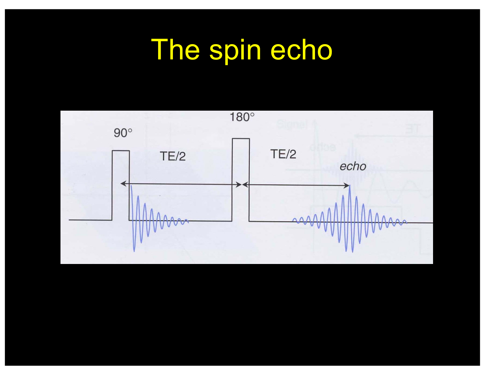

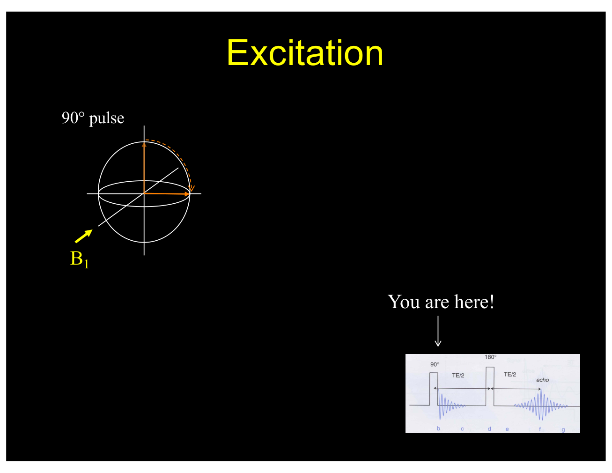

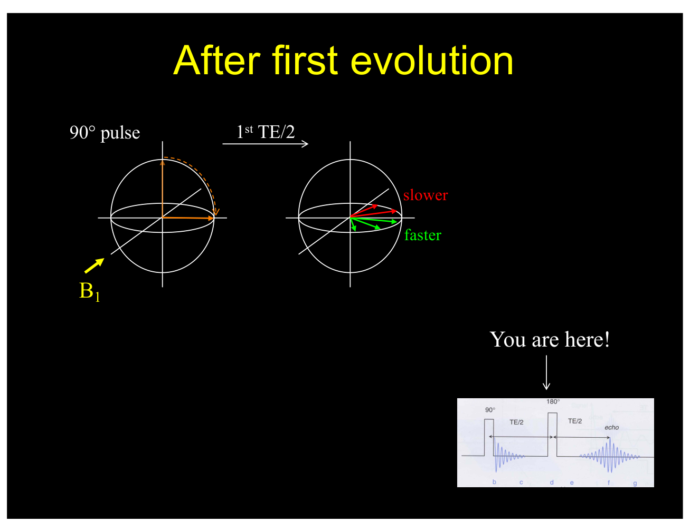

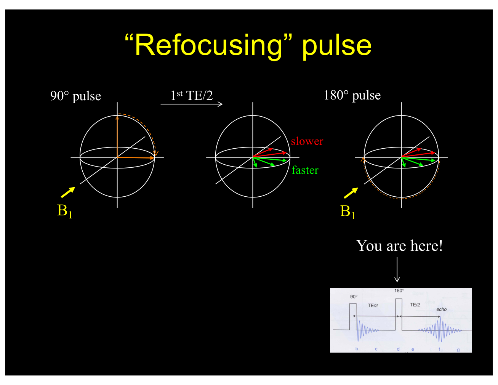

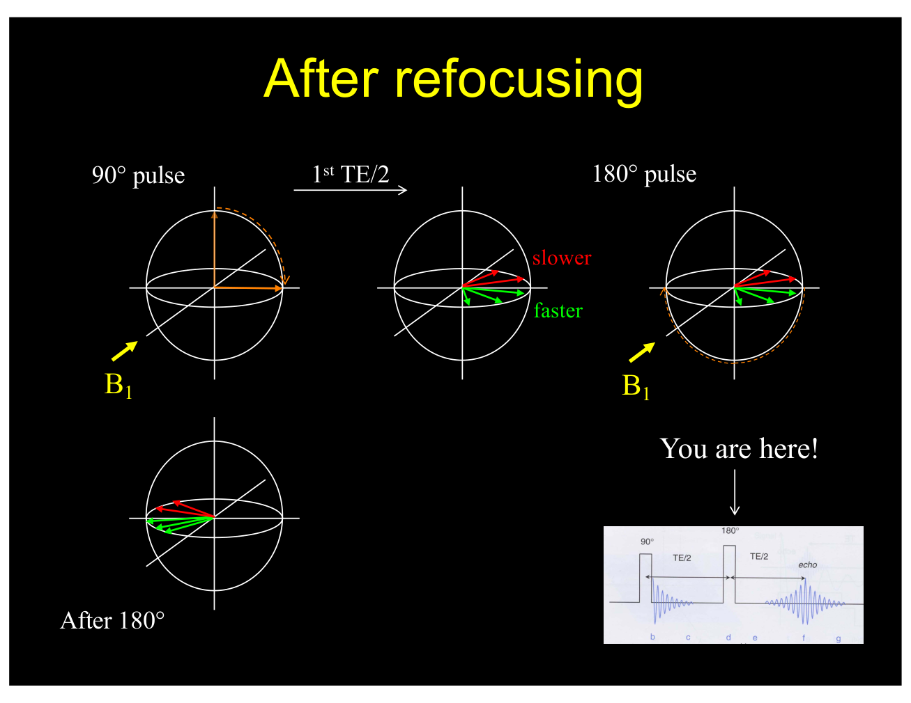

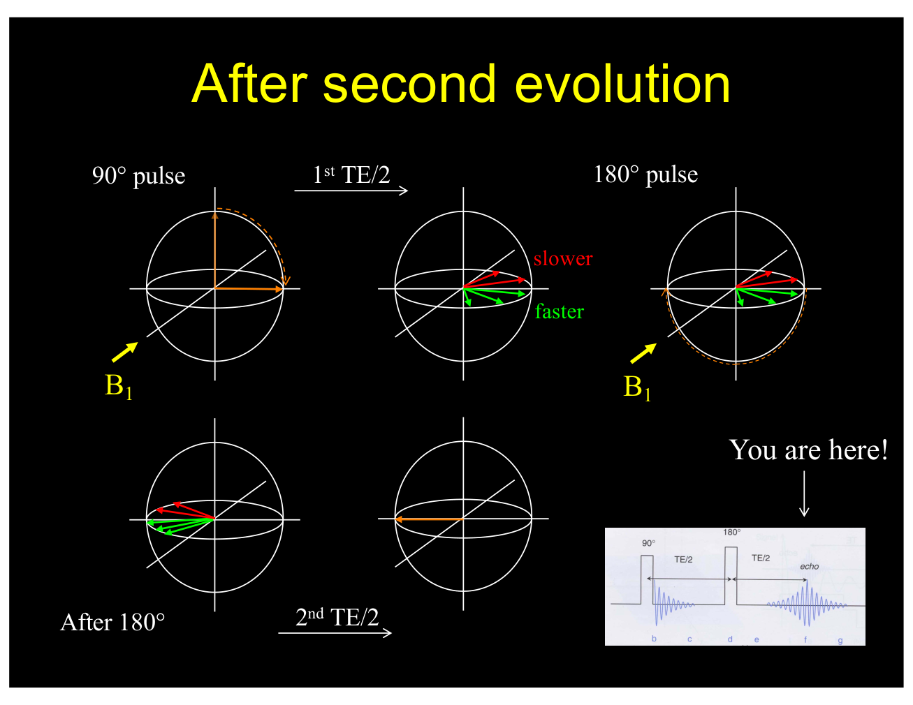

**Figure 1.3. Signal detection and the spin-echo sequence.** How a receive coil detects transverse magnetization and how a 180-degree pulse refocuses reversible phase dispersion. Source pages 9-16 are grouped because they teach one local mechanism or diagnostic comparison. Key source labels and terms include: Signal detection:; The changing magnetic; component in the transverse; (x'y') plane is the relevant; component.; We detect (via magnetic; The NMR signal; The signal decays with.

This figure should be read as a sequence inside Chapter 1, not as an isolated picture. It begins
with signal detection: and ends with after second evolution, so the reader can follow how the
local idea changes across the source panels. The retained source-backed panels are used here
because the original annotations are part of the evidence: the reader needs the labels, axes,
arrows, image examples, and comparison tags to see why the mechanism matters.

The practical lesson is how a receive coil detects transverse magnetization and how a 180-degree
pulse refocuses reversible phase dispersion. In a scanner context, the important move is to
translate what is drawn into an acquisition consequence: which gradient is acting, which echo or
reference data are being trusted, which bandwidth or timing choice is limiting, or which image
pattern would appear during quality control.

For Figure 1.3, use the panels as a local reasoning test. If they show a temporal sequence, ask
what physical quantity is being conserved, reversed, accelerated, or lost. If they show images,
compare the same anatomical region across the named conditions before making a protocol
conclusion. That habit prevents a common fMRI error: treating the label signal detection and the
spin-echo sequence as a diagnosis before checking the visual evidence.

## Relaxation mechanisms and tissue constants

Relaxation mechanisms and tissue constants is the local bridge between the course vocabulary and
a self-study explanation. The relevant source ideas include Longitudinal relaxation time (T1);
AKA spin-lattice relaxation; T1 processes re-establish a thermal; equilibrium.; The energy from
the spins goes into; vibrations/rotations/translations of whole; Molecular origins of
relaxation; Image-only teaching panel 19; Approximate T1 and T2 values at 3 T; T2 (ms) T1 (ms);
White matter 60 800; Gray matter 80 1200. Taken together, they should be read as one argument
about separate T1, T2, T2-star, diffusion, and chemical-shift contributions. The textbook
version therefore slows the slide sequence down: first define the measured or manipulated
quantity, then state what changes it, and only then connect the change to image appearance or
fMRI interpretation.

In this part of nmr signal formation, the central discipline is to separate mechanism from
display. A pulse sequence diagram, a k-space grid, or a brain image is not merely a picture of a
result; it encodes a chain of causes. For relaxation mechanisms and tissue constants, that chain
starts with the controlled scanner quantity, passes through spin phase or signal weighting, and
ends as a spatial pattern, time-series change, or acquisition tradeoff. If the chain is left
implicit, the same term can be memorized without being understood.

A useful way to study relaxation mechanisms and tissue constants is to ask three questions for
every equation or panel. What quantity is deliberately controlled in Chapter 1's local sequence
or example? What uncontrolled physical or biological quantity can perturb it? What image-space
or time-series signature would reveal the problem? These questions keep the mathematics
connected to practical fMRI, where protocol choices are judged by SNR, temporal stability,
distortion, dropout, timing, and interpretability rather than by elegance alone.

The source pages named Longitudinal relaxation time (T1), Molecular origins of relaxation,
Image-only teaching panel 19, Approximate T1 and T2 values at 3 T, Diffusion, T2 and T2*, and
related panels also show why MRI explanations often require several levels. At the microscopic
level, spins precess, relax, dephase, or refocus. At the sequence level, RF pulses and gradients
impose timing and spatial encoding. At the reconstruction level, Fourier relationships convert
sampled signals into images. At the experimental level, subject motion, physiology, hardware
stability, and human factors determine whether the image series supports a defensible fMRI
interpretation.

For practice, the reader should be able to restate relaxation mechanisms and tissue constants
without using slide shorthand. The restatement should include the relevant variables, the
direction of the effect, and the likely failure mode. A good explanation is specific enough to
predict what would happen if the field strength, gradient area, echo spacing, flip angle, coil
sensitivity, motion state, or nuisance measurement changed.

## Figure 1.4. Relaxation mechanisms, tissue constants, and chemical shift

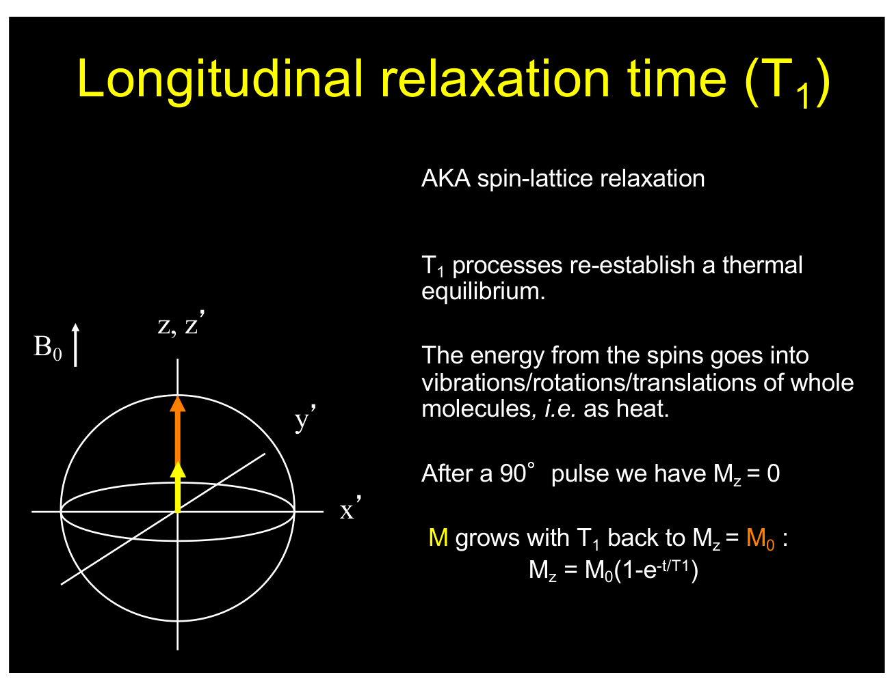

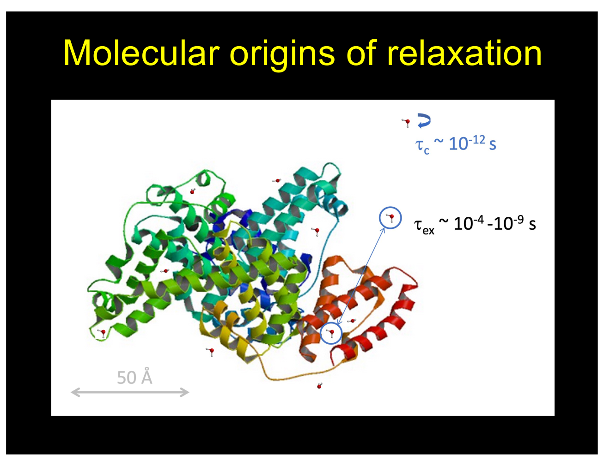

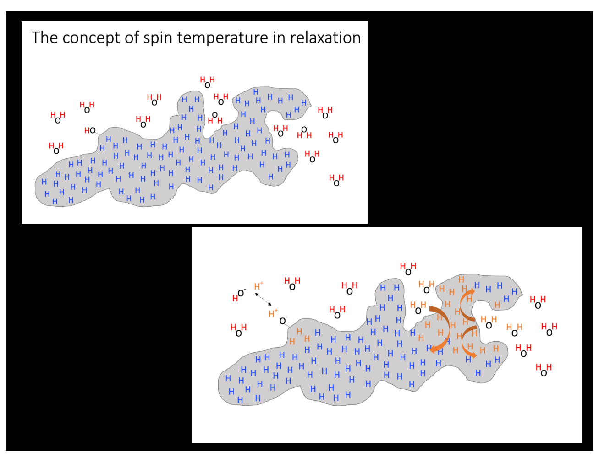

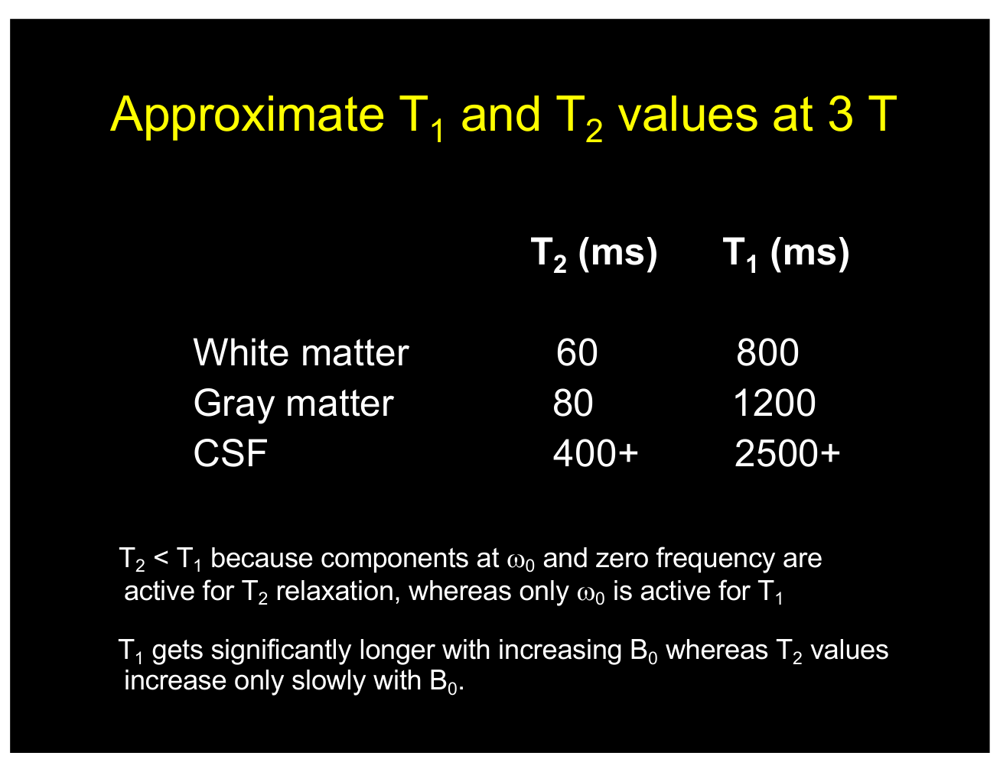

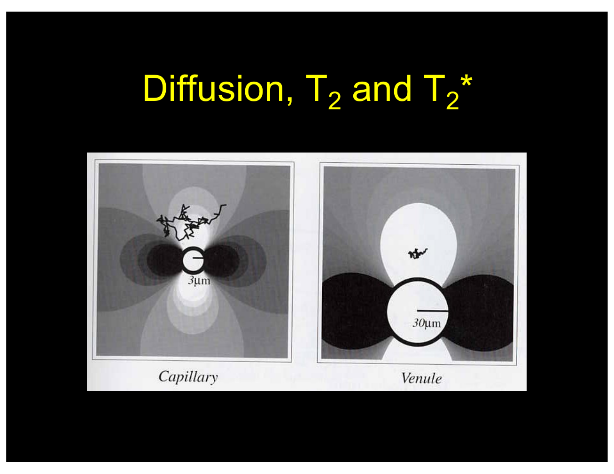

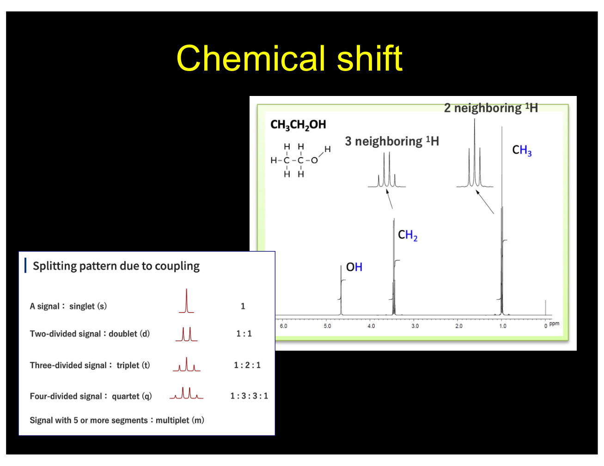

**Figure 1.4. Relaxation mechanisms, tissue constants, and chemical shift.** T1, T2, spin temperature, tissue values, diffusion, T2-star, and chemical shift as distinct signal mechanisms. Source pages 17-22 are grouped because they teach one local mechanism or diagnostic comparison. Key source labels and terms include: Longitudinal relaxation time (T1); AKA spin-lattice relaxation; T1 processes re-establish a thermal; equilibrium.; The energy from the spins goes into; vibrations/rotations/translations of whole; Molecular origins of relaxation; Image-only teaching panel 19.

This figure should be read as a sequence inside Chapter 1, not as an isolated picture. It begins
with longitudinal relaxation time (t1) and ends with chemical shift, so the reader can follow
how the local idea changes across the source panels. The retained source-backed panels are used
here because the original annotations are part of the evidence: the reader needs the labels,
axes, arrows, image examples, and comparison tags to see why the mechanism matters.

The practical lesson is t1, t2, spin temperature, tissue values, diffusion, t2-star, and
chemical shift as distinct signal mechanisms. In a scanner context, the important move is to
translate what is drawn into an acquisition consequence: which gradient is acting, which echo or
reference data are being trusted, which bandwidth or timing choice is limiting, or which image
pattern would appear during quality control.

For Figure 1.4, use the panels as a local reasoning test. If they show a temporal sequence, ask
what physical quantity is being conserved, reversed, accelerated, or lost. If they show images,
compare the same anatomical region across the named conditions before making a protocol
conclusion. That habit prevents a common fMRI error: treating the label relaxation mechanisms,
tissue constants, and chemical shift as a diagnosis before checking the visual evidence.

## External learning resources

External learning resources is the local bridge between the course vocabulary and a self-study
explanation. The relevant source ideas include Bonus videos; How MRI works; NMR spectroscopy for
visual learners. Taken together, they should be read as one argument about preserve the optional
video resources as back-matter references. The textbook version therefore slows the slide
sequence down: first define the measured or manipulated quantity, then state what changes it,
and only then connect the change to image appearance or fMRI interpretation.

In this part of nmr signal formation, the central discipline is to separate mechanism from
display. A pulse sequence diagram, a k-space grid, or a brain image is not merely a picture of a
result; it encodes a chain of causes. For external learning resources, that chain starts with
the controlled scanner quantity, passes through spin phase or signal weighting, and ends as a
spatial pattern, time-series change, or acquisition tradeoff. If the chain is left implicit, the
same term can be memorized without being understood.

A useful way to study external learning resources is to ask three questions for every equation
or panel. What quantity is deliberately controlled in Chapter 1's local sequence or example?
What uncontrolled physical or biological quantity can perturb it? What image-space or time-
series signature would reveal the problem? These questions keep the mathematics connected to
practical fMRI, where protocol choices are judged by SNR, temporal stability, distortion,
dropout, timing, and interpretability rather than by elegance alone.

The source pages named Bonus videos also show why MRI explanations often require several levels.
At the microscopic level, spins precess, relax, dephase, or refocus. At the sequence level, RF
pulses and gradients impose timing and spatial encoding. At the reconstruction level, Fourier
relationships convert sampled signals into images. At the experimental level, subject motion,
physiology, hardware stability, and human factors determine whether the image series supports a
defensible fMRI interpretation.

For practice, the reader should be able to restate external learning resources without using
slide shorthand. The restatement should include the relevant variables, the direction of the
effect, and the likely failure mode. A good explanation is specific enough to predict what would
happen if the field strength, gradient area, echo spacing, flip angle, coil sensitivity, motion
state, or nuisance measurement changed.

### Chapter Summary

Chapter 1 used pages 1-23 to develop build the physical vocabulary for precession, excitation,
relaxation, spin echoes, and chemical shift. The main lesson is cumulative: the reader should
move from vocabulary to mechanism, from mechanism to protocol choice, and from protocol choice
to image or time-series consequences.

### Key Terms

Magnetization, Larmor, precession, excitation, rotating, frame, Signal, detection, echo, Relaxation.

### Review Questions

1. Explain how magnetization, larmor precession, and signal strength affects a practical fMRI decision.
2. Describe one way a visual panel in Chapter 1 changes the interpretation of the prose.
3. Name one acquisition parameter from this chapter and predict a tradeoff if it is changed.
4. Distinguish a mechanism-level explanation from an image-appearance description.
5. Identify one quality-control sign that would make you revisit this chapter before scanning more data.

# Chapter 2. Scanner Hardware and Receive Fields

This chapter covers source pages 24-30 and turns them into a self-study sequence about translate
the physics vocabulary into the scanner components that polarize, excite, encode, and receive
signal. The chapter is organized by mechanism and scanning consequence, not by slide order
alone, so figures appear where they support the local explanation.

## System components

System components is the local bridge between the course vocabulary and a self-study
explanation. The relevant source ideas include Day One; Afternoon; MRI scanner basics; Main MRI
components; 3 T magnet to polarize the; subject; 3-axis gradient coils to; encode spatial info.;
(max. 80 mT/m); Image-only teaching panel 26; Gradient coil. Taken together, they should be read
as one argument about identify magnet, gradient, RF, and room hardware roles. The textbook
version therefore slows the slide sequence down: first define the measured or manipulated
quantity, then state what changes it, and only then connect the change to image appearance or
fMRI interpretation.

In this part of scanner hardware and receive fields, the central discipline is to separate
mechanism from display. A pulse sequence diagram, a k-space grid, or a brain image is not merely
a picture of a result; it encodes a chain of causes. For system components, that chain starts
with the controlled scanner quantity, passes through spin phase or signal weighting, and ends as
a spatial pattern, time-series change, or acquisition tradeoff. If the chain is left implicit,
the same term can be memorized without being understood.

A useful way to study system components is to ask three questions for every equation or panel.
What quantity is deliberately controlled in Chapter 2's local sequence or example? What
uncontrolled physical or biological quantity can perturb it? What image-space or time-series
signature would reveal the problem? These questions keep the mathematics connected to practical
fMRI, where protocol choices are judged by SNR, temporal stability, distortion, dropout, timing,
and interpretability rather than by elegance alone.

The source pages named Day One, Main MRI components, Image-only teaching panel 26, Gradient coil
also show why MRI explanations often require several levels. At the microscopic level, spins
precess, relax, dephase, or refocus. At the sequence level, RF pulses and gradients impose
timing and spatial encoding. At the reconstruction level, Fourier relationships convert sampled
signals into images. At the experimental level, subject motion, physiology, hardware stability,
and human factors determine whether the image series supports a defensible fMRI interpretation.

For practice, the reader should be able to restate system components without using slide
shorthand. The restatement should include the relevant variables, the direction of the effect,
and the likely failure mode. A good explanation is specific enough to predict what would happen
if the field strength, gradient area, echo spacing, flip angle, coil sensitivity, motion state,
or nuisance measurement changed.

## Figure 2.1. Scanner components and gradient hardware

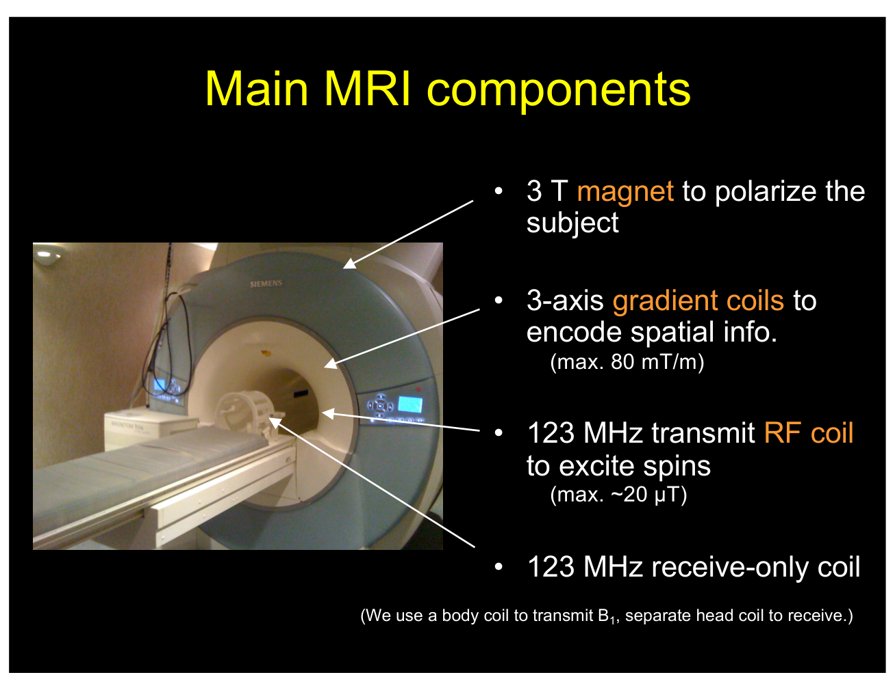

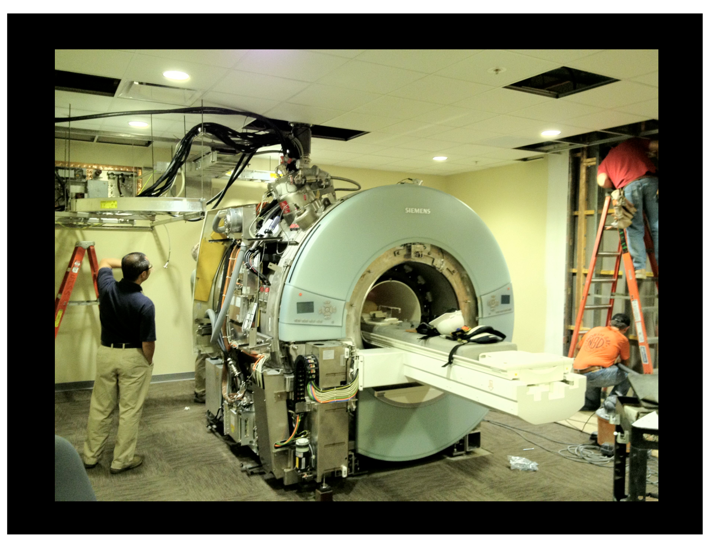

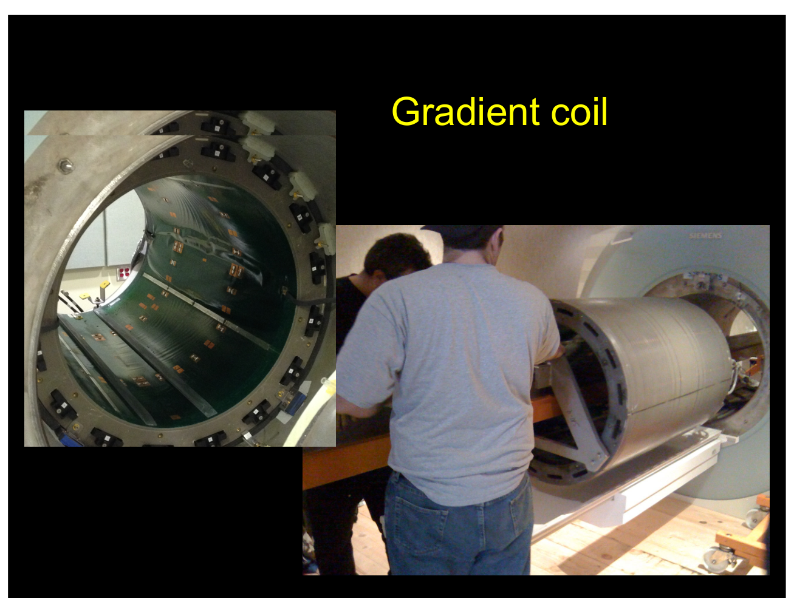

**Figure 2.1. Scanner components and gradient hardware.** The physical system that polarizes, excites, spatially encodes, and houses the participant. Source pages 25-27 are grouped because they teach one local mechanism or diagnostic comparison. Key source labels and terms include: Main MRI components; 3 T magnet to polarize the; subject; 3-axis gradient coils to; encode spatial info.; (max. 80 mT/m); Image-only teaching panel 26; Gradient coil.

This figure should be read as a sequence inside Chapter 2, not as an isolated picture. It begins
with main mri components and ends with gradient coil, so the reader can follow how the local
idea changes across the source panels. The retained source-backed panels are used here because
the original annotations are part of the evidence: the reader needs the labels, axes, arrows,
image examples, and comparison tags to see why the mechanism matters.

The practical lesson is the physical system that polarizes, excites, spatially encodes, and
houses the participant. In a scanner context, the important move is to translate what is drawn
into an acquisition consequence: which gradient is acting, which echo or reference data are
being trusted, which bandwidth or timing choice is limiting, or which image pattern would appear
during quality control.

For Figure 2.1, use the panels as a local reasoning test. If they show a temporal sequence, ask
what physical quantity is being conserved, reversed, accelerated, or lost. If they show images,
compare the same anatomical region across the named conditions before making a protocol
conclusion. That habit prevents a common fMRI error: treating the label scanner components and
gradient hardware as a diagnosis before checking the visual evidence.

## Receive arrays and spatial sensitivity

Receive arrays and spatial sensitivity is the local bridge between the course vocabulary and a
self-study explanation. The relevant source ideas include Receive coil arrays; From Kaza et al.
JMRI (2011); 32-channel coil; Bottom half only, from underneath with cover removed; Receive
field heterogeneity. Taken together, they should be read as one argument about explain why
multi-channel coils improve sensitivity but introduce receive-field structure. The textbook
version therefore slows the slide sequence down: first define the measured or manipulated
quantity, then state what changes it, and only then connect the change to image appearance or
fMRI interpretation.

In this part of scanner hardware and receive fields, the central discipline is to separate
mechanism from display. A pulse sequence diagram, a k-space grid, or a brain image is not merely
a picture of a result; it encodes a chain of causes. For receive arrays and spatial sensitivity,
that chain starts with the controlled scanner quantity, passes through spin phase or signal
weighting, and ends as a spatial pattern, time-series change, or acquisition tradeoff. If the
chain is left implicit, the same term can be memorized without being understood.

A useful way to study receive arrays and spatial sensitivity is to ask three questions for every
equation or panel. What quantity is deliberately controlled in Chapter 2's local sequence or
example? What uncontrolled physical or biological quantity can perturb it? What image-space or
time-series signature would reveal the problem? These questions keep the mathematics connected
to practical fMRI, where protocol choices are judged by SNR, temporal stability, distortion,
dropout, timing, and interpretability rather than by elegance alone.

The source pages named Receive coil arrays, 32-channel coil, Receive field heterogeneity also
show why MRI explanations often require several levels. At the microscopic level, spins precess,
relax, dephase, or refocus. At the sequence level, RF pulses and gradients impose timing and
spatial encoding. At the reconstruction level, Fourier relationships convert sampled signals
into images. At the experimental level, subject motion, physiology, hardware stability, and
human factors determine whether the image series supports a defensible fMRI interpretation.

For practice, the reader should be able to restate receive arrays and spatial sensitivity
without using slide shorthand. The restatement should include the relevant variables, the
direction of the effect, and the likely failure mode. A good explanation is specific enough to
predict what would happen if the field strength, gradient area, echo spacing, flip angle, coil
sensitivity, motion state, or nuisance measurement changed.

## Figure 2.2. Receive arrays and receive-field heterogeneity

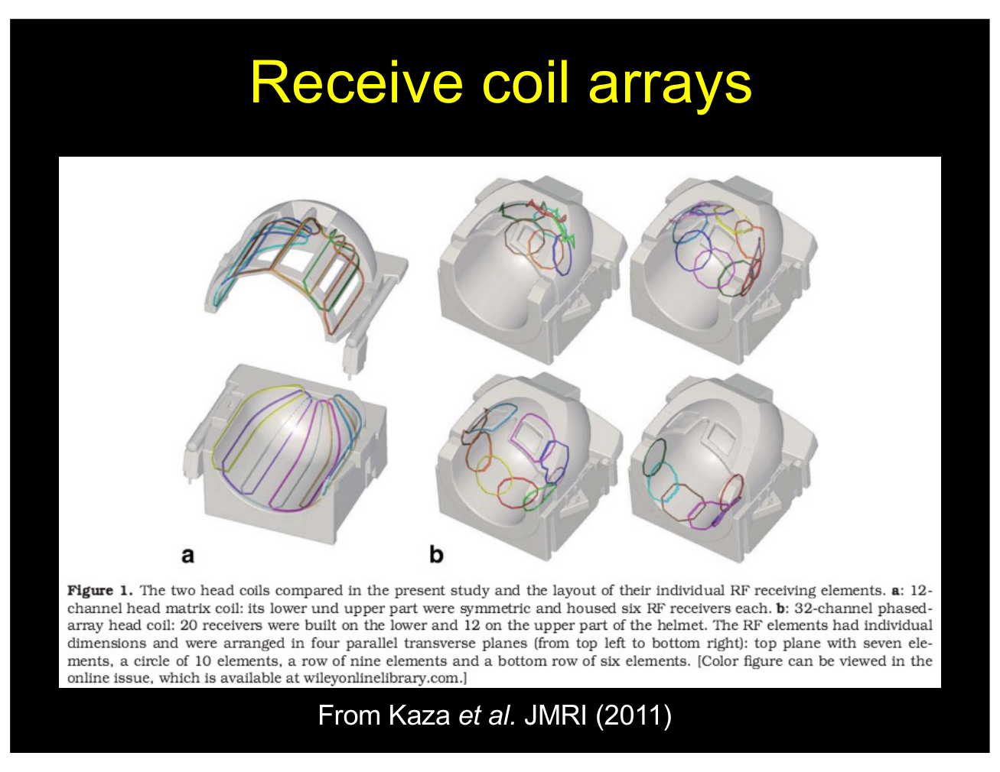

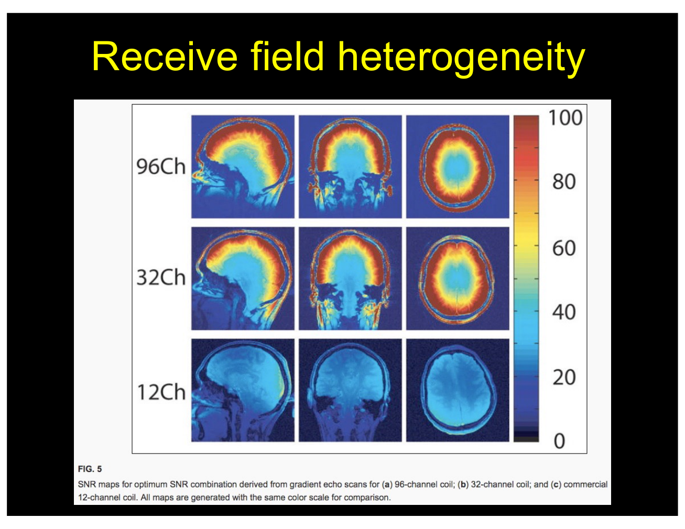

**Figure 2.2. Receive arrays and receive-field heterogeneity.** Why phased-array coils are powerful and why spatial receive sensitivity matters. Source pages 28-30 are grouped because they teach one local mechanism or diagnostic comparison. Key source labels and terms include: Receive coil arrays; From Kaza et al. JMRI (2011); 32-channel coil; Bottom half only, from underneath with cover removed; Receive field heterogeneity.

This figure should be read as a sequence inside Chapter 2, not as an isolated picture. It begins
with receive coil arrays and ends with receive field heterogeneity, so the reader can follow how
the local idea changes across the source panels. The retained source-backed panels are used here
because the original annotations are part of the evidence: the reader needs the labels, axes,
arrows, image examples, and comparison tags to see why the mechanism matters.

The practical lesson is why phased-array coils are powerful and why spatial receive sensitivity
matters. In a scanner context, the important move is to translate what is drawn into an
acquisition consequence: which gradient is acting, which echo or reference data are being
trusted, which bandwidth or timing choice is limiting, or which image pattern would appear
during quality control.

For Figure 2.2, use the panels as a local reasoning test. If they show a temporal sequence, ask
what physical quantity is being conserved, reversed, accelerated, or lost. If they show images,
compare the same anatomical region across the named conditions before making a protocol
conclusion. That habit prevents a common fMRI error: treating the label receive arrays and
receive-field heterogeneity as a diagnosis before checking the visual evidence.

### Chapter Summary

Chapter 2 used pages 24-30 to develop translate the physics vocabulary into the scanner
components that polarize, excite, encode, and receive signal. The main lesson is cumulative: the
reader should move from vocabulary to mechanism, from mechanism to protocol choice, and from
protocol choice to image or time-series consequences.

### Key Terms

System, components, Receive, arrays, spatial.

### Review Questions

1. Explain how system components affects a practical fMRI decision.
2. Describe one way a visual panel in Chapter 2 changes the interpretation of the prose.
3. Name one acquisition parameter from this chapter and predict a tradeoff if it is changed.
4. Distinguish a mechanism-level explanation from an image-appearance description.
5. Identify one quality-control sign that would make you revisit this chapter before scanning more data.

# Chapter 3. Fourier Thinking, Gradients, and K-space

This chapter covers source pages 31-85 and turns them into a self-study sequence about develop
the mathematical and practical path from frequency analysis to two-dimensional mri. The chapter
is organized by mechanism and scanning consequence, not by slide order alone, so figures appear
where they support the local explanation.

## Fourier pairs and frequency analysis

Fourier pairs and frequency analysis is the local bridge between the course vocabulary and a
self-study explanation. The relevant source ideas include Day Two; Morning; Fundamentals of MRI;
Conjugate variables:; Conjugate variables are related through; a Fourier transform:; Frequency
(Hz, or s-1) Û time (s); Space (cm) Û k-space (cm-1); F.T.; Fourier transform:; The analysis of
frequency content; The FT can determine the frequency content of. Taken together, they should be
read as one argument about turn waves into spectra and introduce reciprocal variables. The
textbook version therefore slows the slide sequence down: first define the measured or
manipulated quantity, then state what changes it, and only then connect the change to image
appearance or fMRI interpretation.

In this part of fourier thinking, gradients, and k-space, the central discipline is to separate
mechanism from display. A pulse sequence diagram, a k-space grid, or a brain image is not merely
a picture of a result; it encodes a chain of causes. For fourier pairs and frequency analysis,
that chain starts with the controlled scanner quantity, passes through spin phase or signal
weighting, and ends as a spatial pattern, time-series change, or acquisition tradeoff. If the
chain is left implicit, the same term can be memorized without being understood.

A useful way to study fourier pairs and frequency analysis is to ask three questions for every
equation or panel. What quantity is deliberately controlled in Chapter 3's local sequence or
example? What uncontrolled physical or biological quantity can perturb it? What image-space or
time-series signature would reveal the problem? These questions keep the mathematics connected
to practical fMRI, where protocol choices are judged by SNR, temporal stability, distortion,
dropout, timing, and interpretability rather than by elegance alone.

The source pages named Day Two, Conjugate variables:, Fourier transform:, The FT can determine
the frequency content of, Image-only teaching panel 35, and related panels also show why MRI
explanations often require several levels. At the microscopic level, spins precess, relax,
dephase, or refocus. At the sequence level, RF pulses and gradients impose timing and spatial
encoding. At the reconstruction level, Fourier relationships convert sampled signals into
images. At the experimental level, subject motion, physiology, hardware stability, and human
factors determine whether the image series supports a defensible fMRI interpretation.

For practice, the reader should be able to restate fourier pairs and frequency analysis without
using slide shorthand. The restatement should include the relevant variables, the direction of
the effect, and the likely failure mode. A good explanation is specific enough to predict what
would happen if the field strength, gradient area, echo spacing, flip angle, coil sensitivity,
motion state, or nuisance measurement changed.

## Figure 3.1. Fourier transform intuition and useful pairs

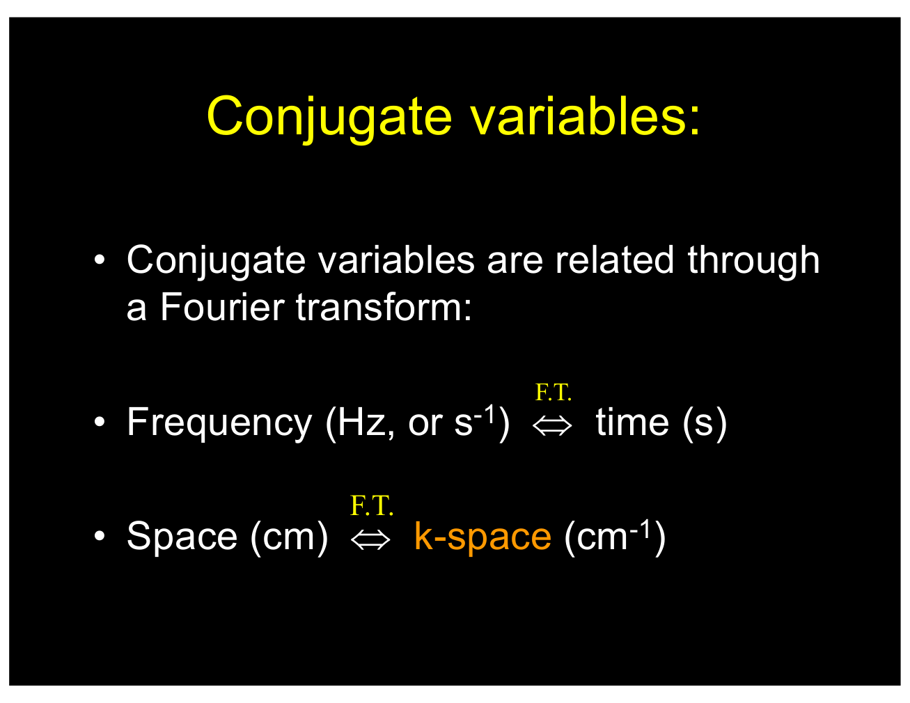

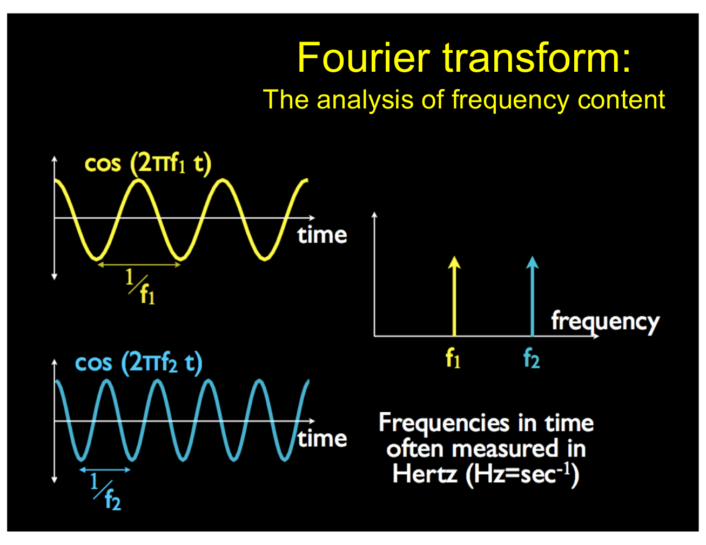

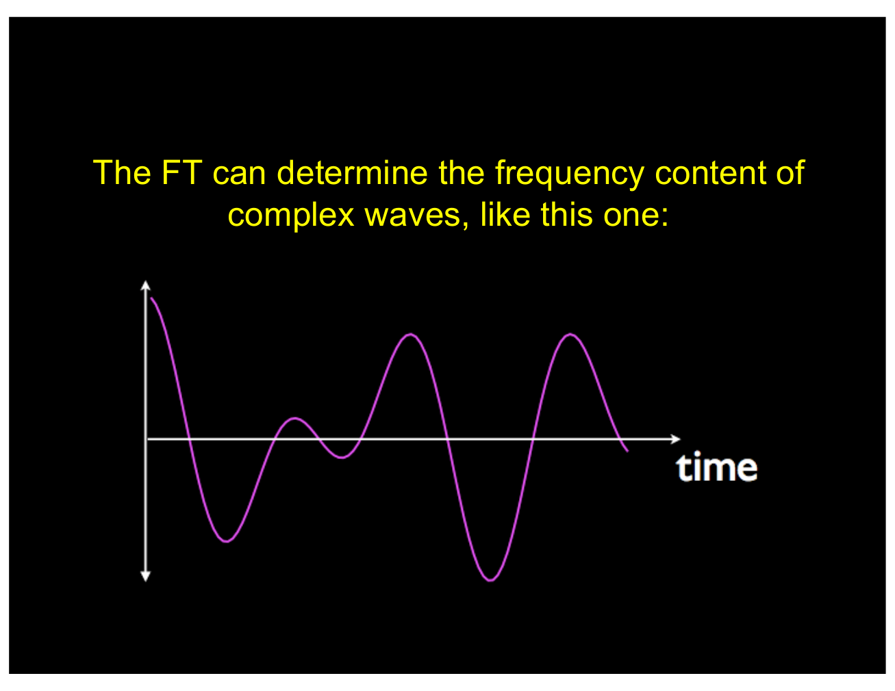

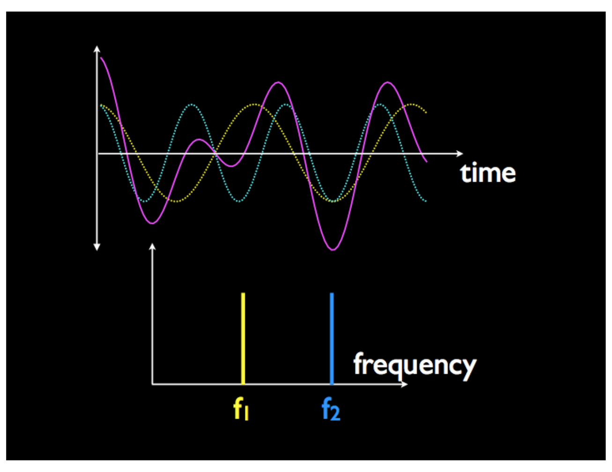

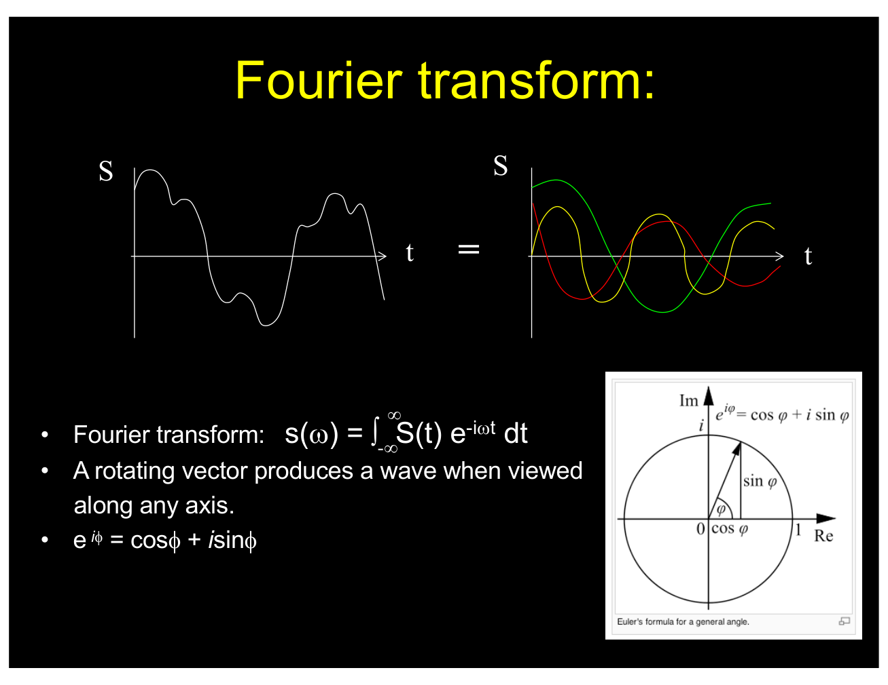

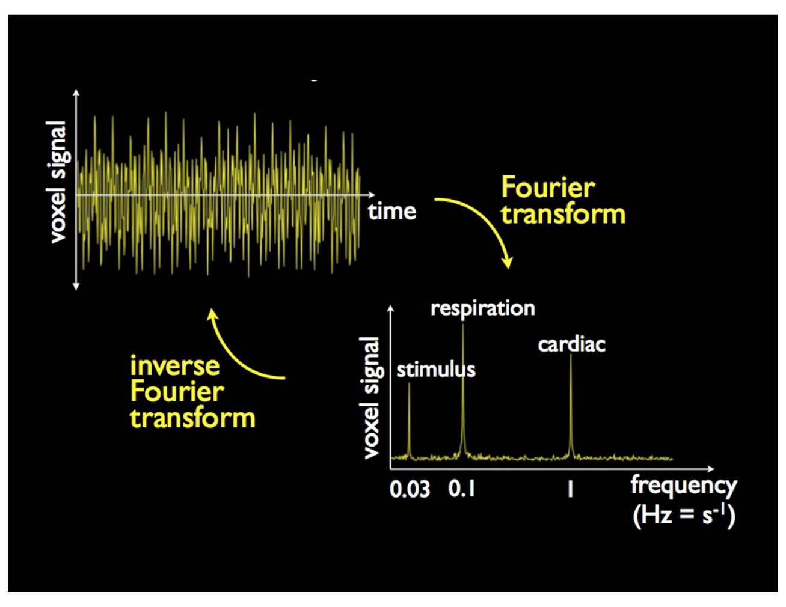

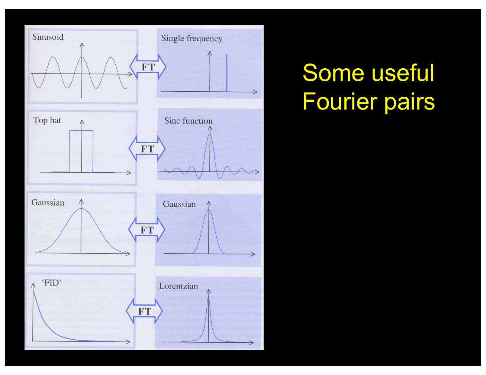

**Figure 3.1. Fourier transform intuition and useful pairs.** Frequency analysis, conjugate variables, and visual Fourier pairs used later for k-space. Source pages 32-38 are grouped because they teach one local mechanism or diagnostic comparison. Key source labels and terms include: Conjugate variables:; Conjugate variables are related through; a Fourier transform:; Frequency (Hz, or s-1) Û time (s); Space (cm) Û k-space (cm-1); F.T.; Fourier transform:; The analysis of frequency content.

This figure should be read as a sequence inside Chapter 3, not as an isolated picture. It begins
with conjugate variables: and ends with some useful, so the reader can follow how the local idea
changes across the source panels. The retained source-backed panels are used here because the
original annotations are part of the evidence: the reader needs the labels, axes, arrows, image
examples, and comparison tags to see why the mechanism matters.

The practical lesson is frequency analysis, conjugate variables, and visual fourier pairs used
later for k-space. In a scanner context, the important move is to translate what is drawn into
an acquisition consequence: which gradient is acting, which echo or reference data are being
trusted, which bandwidth or timing choice is limiting, or which image pattern would appear
during quality control.

For Figure 3.1, use the panels as a local reasoning test. If they show a temporal sequence, ask
what physical quantity is being conserved, reversed, accelerated, or lost. If they show images,
compare the same anatomical region across the named conditions before making a protocol
conclusion. That habit prevents a common fMRI error: treating the label fourier transform
intuition and useful pairs as a diagnosis before checking the visual evidence.

## Gradients as spatial encoders

Gradients as spatial encoders is the local bridge between the course vocabulary and a self-study
explanation. The relevant source ideas include Magnetic field gradient:; Start with the Larmor
equation:; w0 = gB0; Add a gradient Gx along the x; direction:; wx = g (B0 + Gx x); One-
dimensional MRI:; x1x2 ……............ xn; omega1omega2 ……........... omegan; Fourier transform
of the signal:; x1x2 ……….….. xn; s(w). Taken together, they should be read as one argument about
use the Larmor equation to make position affect frequency. The textbook version therefore slows
the slide sequence down: first define the measured or manipulated quantity, then state what
changes it, and only then connect the change to image appearance or fMRI interpretation.

In this part of fourier thinking, gradients, and k-space, the central discipline is to separate
mechanism from display. A pulse sequence diagram, a k-space grid, or a brain image is not merely
a picture of a result; it encodes a chain of causes. For gradients as spatial encoders, that
chain starts with the controlled scanner quantity, passes through spin phase or signal
weighting, and ends as a spatial pattern, time-series change, or acquisition tradeoff. If the
chain is left implicit, the same term can be memorized without being understood.

A useful way to study gradients as spatial encoders is to ask three questions for every equation
or panel. What quantity is deliberately controlled in Chapter 3's local sequence or example?
What uncontrolled physical or biological quantity can perturb it? What image-space or time-
series signature would reveal the problem? These questions keep the mathematics connected to
practical fMRI, where protocol choices are judged by SNR, temporal stability, distortion,
dropout, timing, and interpretability rather than by elegance alone.

The source pages named Magnetic field gradient:, One-dimensional MRI:, Fourier transform of the
signal:, Other 1D Projections:, The first MRI also show why MRI explanations often require
several levels. At the microscopic level, spins precess, relax, dephase, or refocus. At the
sequence level, RF pulses and gradients impose timing and spatial encoding. At the
reconstruction level, Fourier relationships convert sampled signals into images. At the
experimental level, subject motion, physiology, hardware stability, and human factors determine
whether the image series supports a defensible fMRI interpretation.

For practice, the reader should be able to restate gradients as spatial encoders without using
slide shorthand. The restatement should include the relevant variables, the direction of the
effect, and the likely failure mode. A good explanation is specific enough to predict what would
happen if the field strength, gradient area, echo spacing, flip angle, coil sensitivity, motion
state, or nuisance measurement changed.

## Figure 3.2. Gradients as one-dimensional spatial encoders

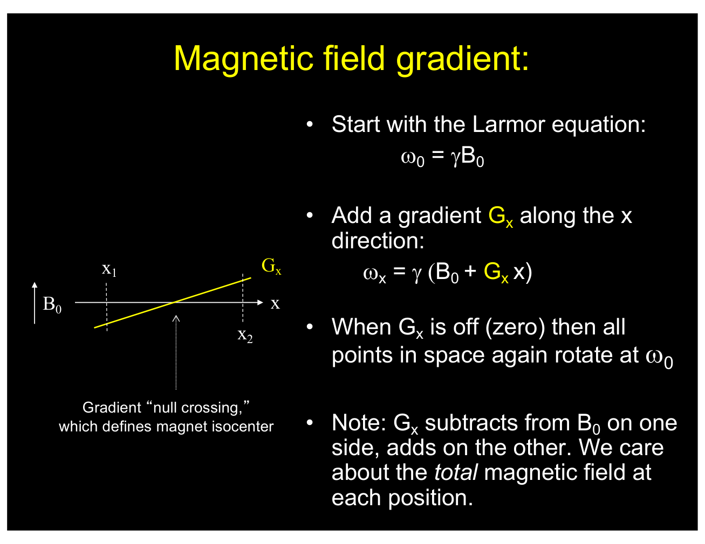

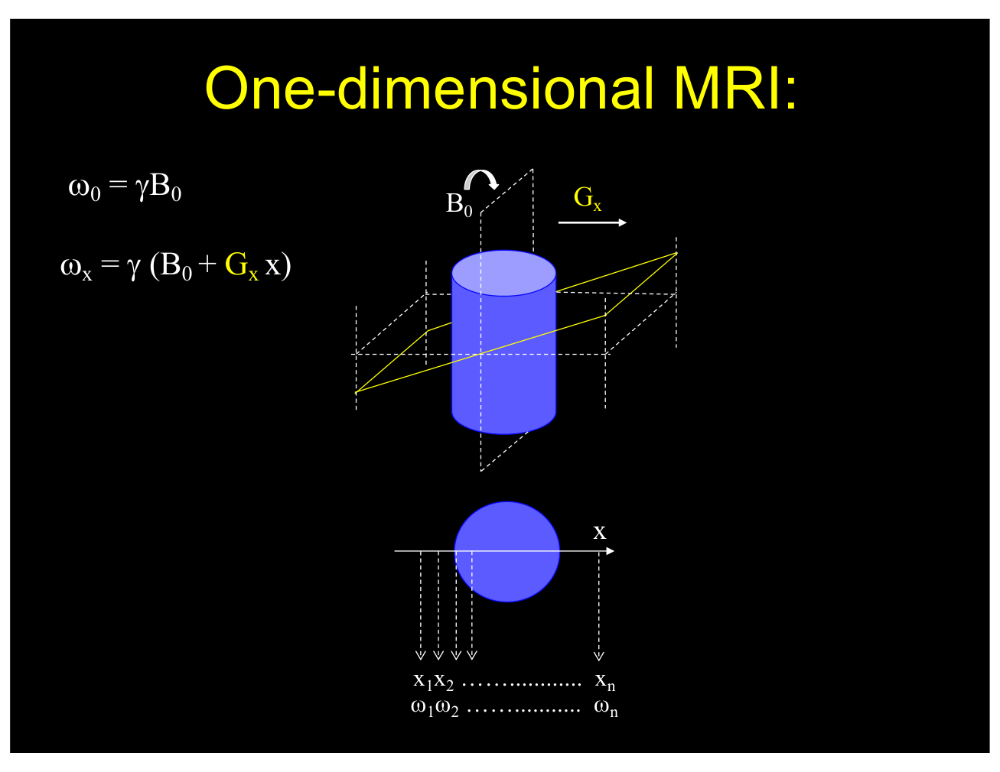

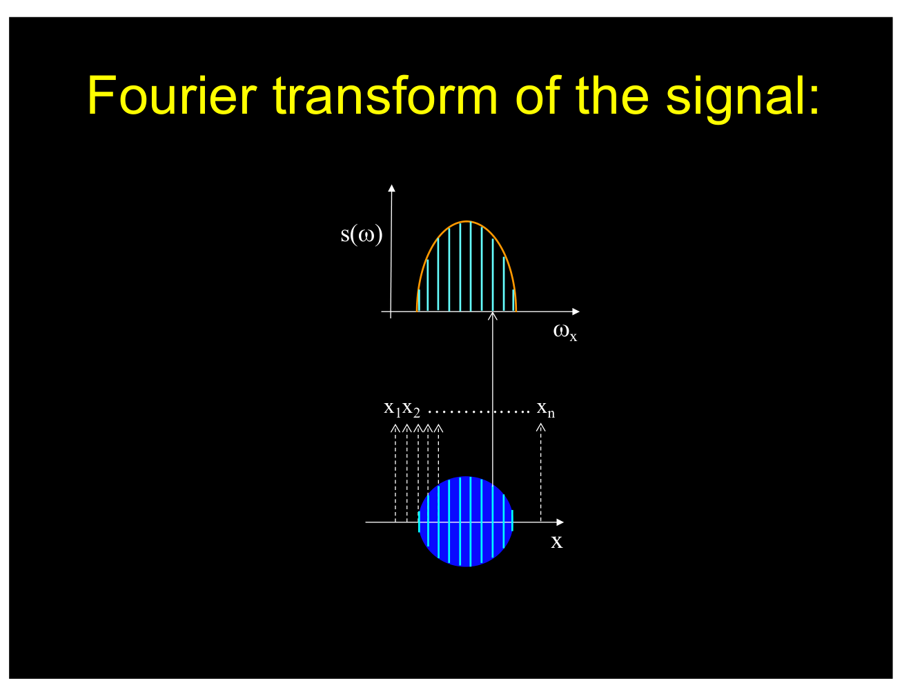

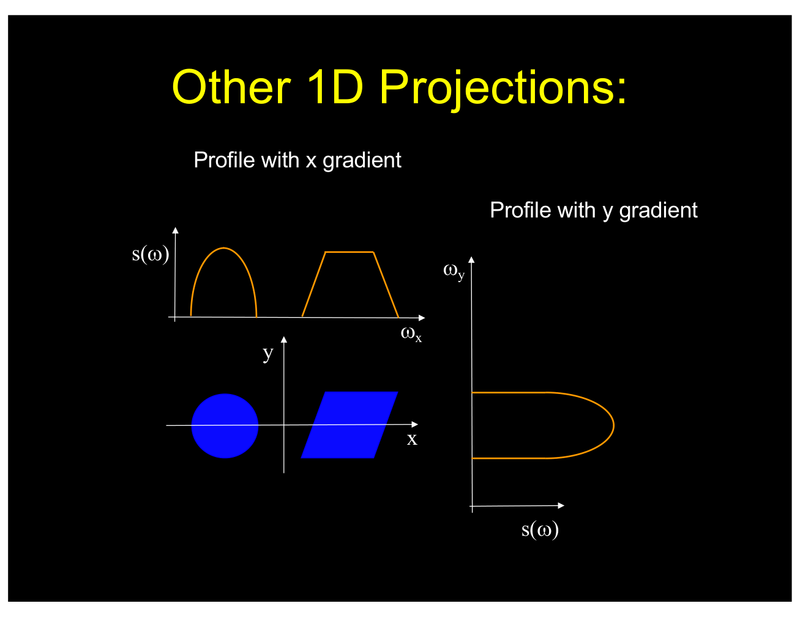

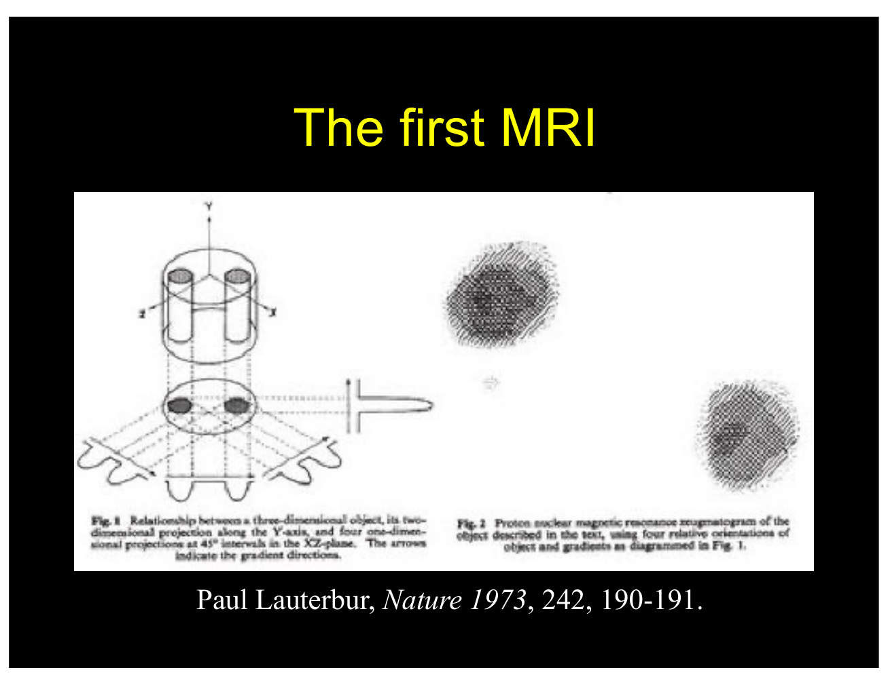

**Figure 3.2. Gradients as one-dimensional spatial encoders.** The Larmor equation with a gradient and the historical bridge to projection imaging. Source pages 39-43 are grouped because they teach one local mechanism or diagnostic comparison. Key source labels and terms include: Magnetic field gradient:; Start with the Larmor equation:; w0 = gB0; Add a gradient Gx along the x; direction:; wx = g (B0 + Gx x); One-dimensional MRI:; x1x2 ……............ xn.

This figure should be read as a sequence inside Chapter 3, not as an isolated picture. It begins
with magnetic field gradient: and ends with the first mri, so the reader can follow how the
local idea changes across the source panels. The retained source-backed panels are used here
because the original annotations are part of the evidence: the reader needs the labels, axes,
arrows, image examples, and comparison tags to see why the mechanism matters.

The practical lesson is the larmor equation with a gradient and the historical bridge to
projection imaging. In a scanner context, the important move is to translate what is drawn into
an acquisition consequence: which gradient is acting, which echo or reference data are being
trusted, which bandwidth or timing choice is limiting, or which image pattern would appear
during quality control.

For Figure 3.2, use the panels as a local reasoning test. If they show a temporal sequence, ask
what physical quantity is being conserved, reversed, accelerated, or lost. If they show images,
compare the same anatomical region across the named conditions before making a protocol
conclusion. That habit prevents a common fMRI error: treating the label gradients as one-
dimensional spatial encoders as a diagnosis before checking the visual evidence.

## Slice selection

Slice selection is the local bridge between the course vocabulary and a self-study explanation.
The relevant source ideas include Slice selection; Recall that the Fourier transform of a sinc;
function is a square (or top hat) and vice versa; Instead of using an on-off (square) RF pulse;
for excitation, if we use a sinc-shaped RF; pulse then we can select a square "notch" of;
frequencies centered about the frequency of; If the sinc-modulated RF pulse is; played out while
a gradient is on along; z, the notch of frequencies Deltan; corresponds to a spatial notch of
width; Dz. This is a slice, of thickness Dz.. Taken together, they should be read as one
argument about combine a selective RF pulse with a gradient and refocusing lobe. The textbook
version therefore slows the slide sequence down: first define the measured or manipulated
quantity, then state what changes it, and only then connect the change to image appearance or
fMRI interpretation.

In this part of fourier thinking, gradients, and k-space, the central discipline is to separate
mechanism from display. A pulse sequence diagram, a k-space grid, or a brain image is not merely
a picture of a result; it encodes a chain of causes. For slice selection, that chain starts with
the controlled scanner quantity, passes through spin phase or signal weighting, and ends as a
spatial pattern, time-series change, or acquisition tradeoff. If the chain is left implicit, the
same term can be memorized without being understood.

A useful way to study slice selection is to ask three questions for every equation or panel.
What quantity is deliberately controlled in Chapter 3's local sequence or example? What
uncontrolled physical or biological quantity can perturb it? What image-space or time-series
signature would reveal the problem? These questions keep the mathematics connected to practical
fMRI, where protocol choices are judged by SNR, temporal stability, distortion, dropout, timing,
and interpretability rather than by elegance alone.

The source pages named Slice selection, - Recall that the Fourier transform of a sinc, If the
sinc-modulated RF pulse is, Slice thickness:, Slice selection also needs a refocusing also show
why MRI explanations often require several levels. At the microscopic level, spins precess,
relax, dephase, or refocus. At the sequence level, RF pulses and gradients impose timing and
spatial encoding. At the reconstruction level, Fourier relationships convert sampled signals
into images. At the experimental level, subject motion, physiology, hardware stability, and
human factors determine whether the image series supports a defensible fMRI interpretation.

For practice, the reader should be able to restate slice selection without using slide
shorthand. The restatement should include the relevant variables, the direction of the effect,
and the likely failure mode. A good explanation is specific enough to predict what would happen
if the field strength, gradient area, echo spacing, flip angle, coil sensitivity, motion state,
or nuisance measurement changed.

## Figure 3.3. Slice selection with a sinc RF pulse

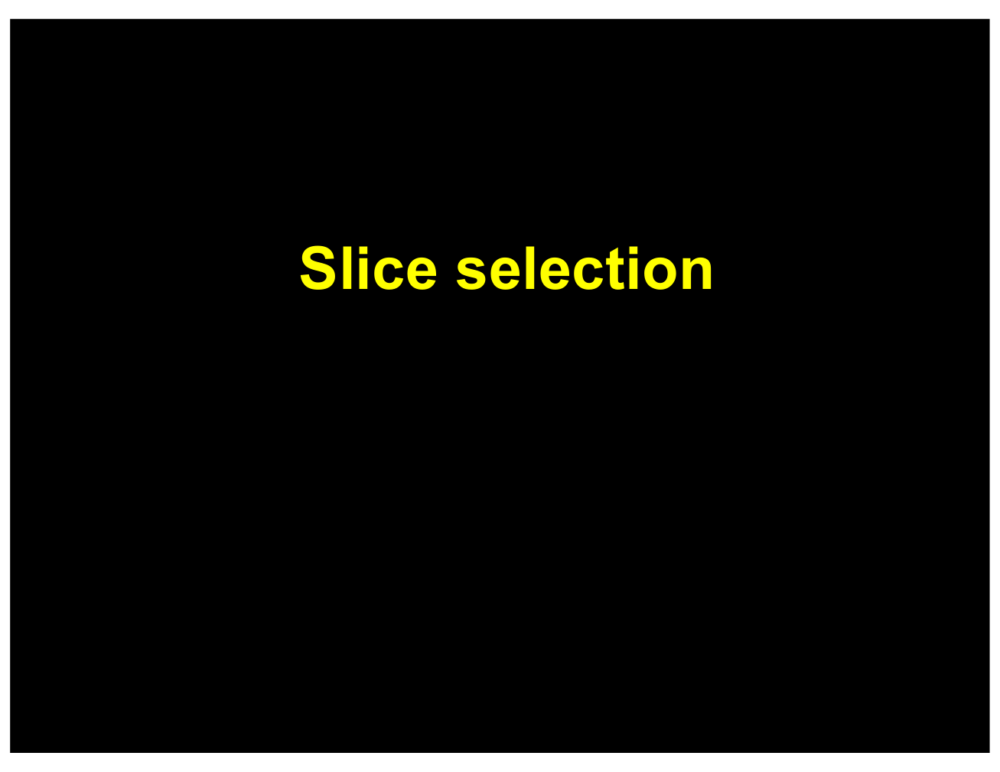

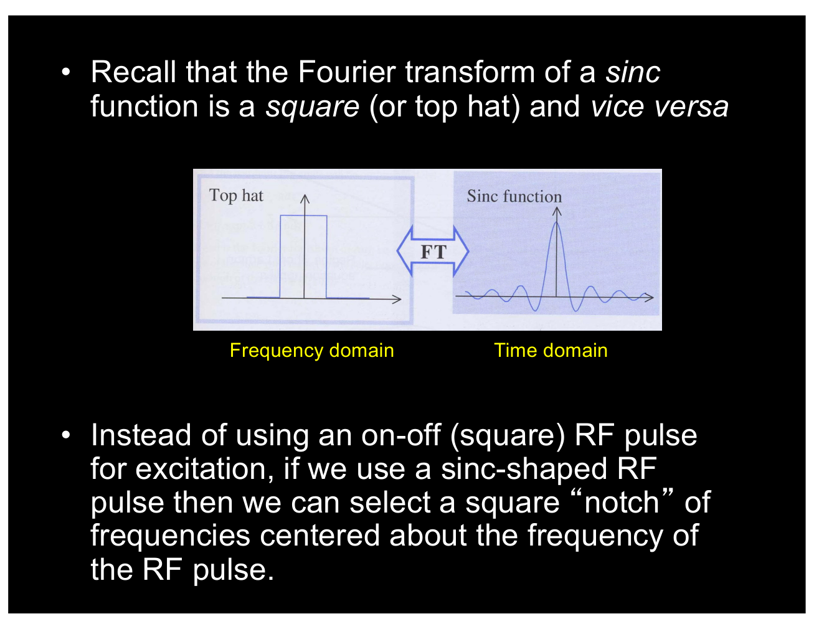

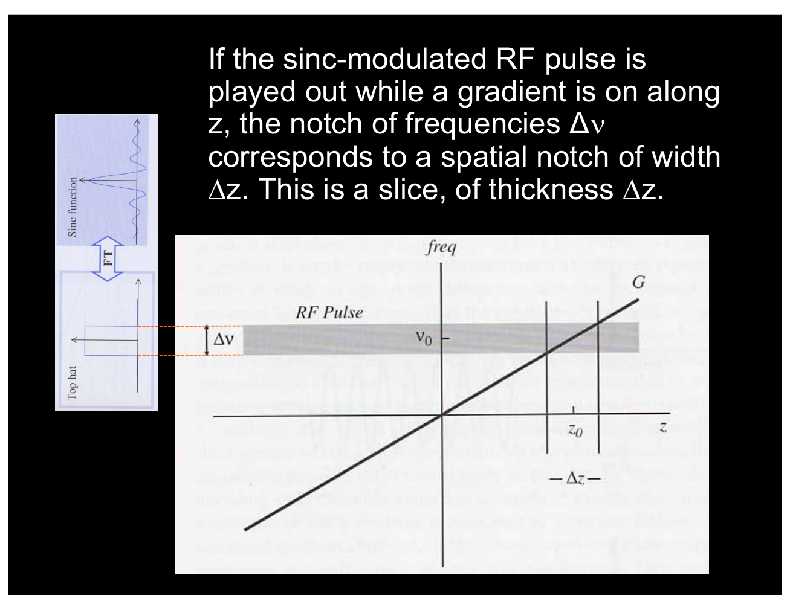

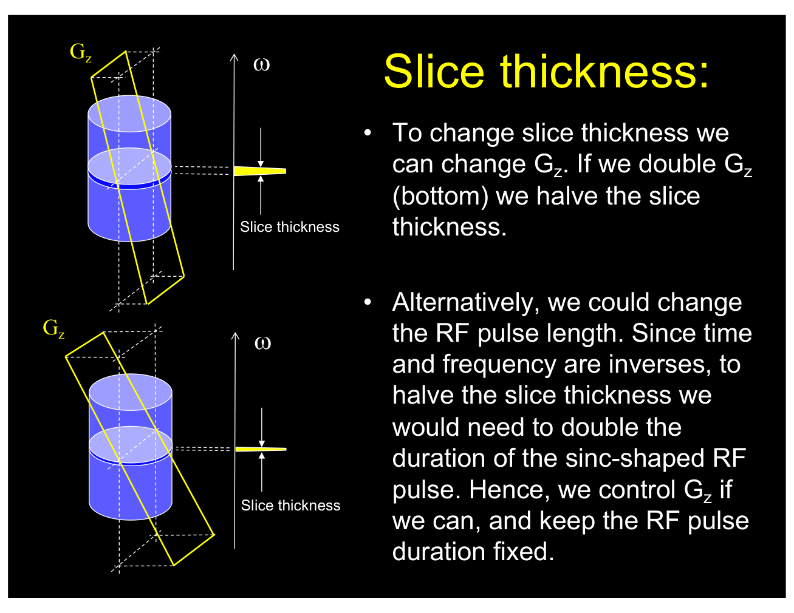

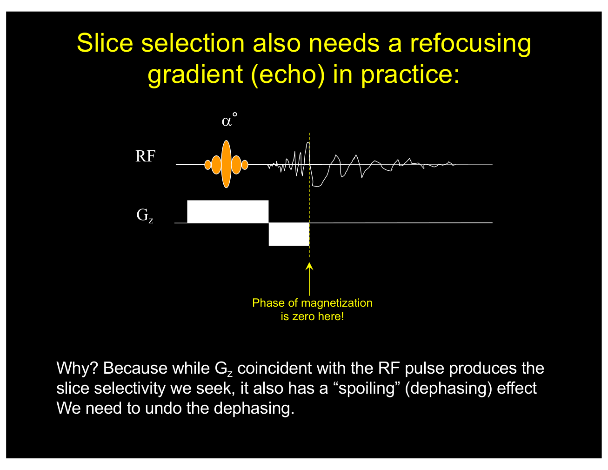

**Figure 3.3. Slice selection with a sinc RF pulse.** How RF bandwidth and z-gradient strength define slice thickness and require refocusing. Source pages 44-48 are grouped because they teach one local mechanism or diagnostic comparison. Key source labels and terms include: Slice selection; Recall that the Fourier transform of a sinc; function is a square (or top hat) and vice versa; Instead of using an on-off (square) RF pulse; for excitation, if we use a sinc-shaped RF; pulse then we can select a square "notch" of; frequencies centered about the frequency of; If the sinc-modulated RF pulse is.

This figure should be read as a sequence inside Chapter 3, not as an isolated picture. It begins
with slice selection and ends with slice selection also needs a refocusing, so the reader can
follow how the local idea changes across the source panels. The retained source-backed panels
are used here because the original annotations are part of the evidence: the reader needs the
labels, axes, arrows, image examples, and comparison tags to see why the mechanism matters.

The practical lesson is how rf bandwidth and z-gradient strength define slice thickness and
require refocusing. In a scanner context, the important move is to translate what is drawn into
an acquisition consequence: which gradient is acting, which echo or reference data are being
trusted, which bandwidth or timing choice is limiting, or which image pattern would appear
during quality control.

For Figure 3.3, use the panels as a local reasoning test. If they show a temporal sequence, ask
what physical quantity is being conserved, reversed, accelerated, or lost. If they show images,
compare the same anatomical region across the named conditions before making a protocol
conclusion. That habit prevents a common fMRI error: treating the label slice selection with a
sinc rf pulse as a diagnosis before checking the visual evidence.

## Gradient echoes and reversible dephasing

Gradient echoes and reversible dephasing is the local bridge between the course vocabulary and a
self-study explanation. The relevant source ideas include Gradient echo for readout:; The
dephasing effect of; gradient 1 can be undone by; reversing the direction of the; gradient 2;
After 1:; w0 = 0; wx1 = - g Gx x1; wx2 = g Gx x2; GRE considerations:; Acquiring the rephasing
plus the dephasing; magnetization (segments 2 + 3) provides ~sqrt(2). Taken together, they
should be read as one argument about show how gradient area moves phase out and back. The
textbook version therefore slows the slide sequence down: first define the measured or
manipulated quantity, then state what changes it, and only then connect the change to image
appearance or fMRI interpretation.

In this part of fourier thinking, gradients, and k-space, the central discipline is to separate
mechanism from display. A pulse sequence diagram, a k-space grid, or a brain image is not merely
a picture of a result; it encodes a chain of causes. For gradient echoes and reversible
dephasing, that chain starts with the controlled scanner quantity, passes through spin phase or
signal weighting, and ends as a spatial pattern, time-series change, or acquisition tradeoff. If
the chain is left implicit, the same term can be memorized without being understood.

A useful way to study gradient echoes and reversible dephasing is to ask three questions for
every equation or panel. What quantity is deliberately controlled in Chapter 3's local sequence
or example? What uncontrolled physical or biological quantity can perturb it? What image-space
or time-series signature would reveal the problem? These questions keep the mathematics
connected to practical fMRI, where protocol choices are judged by SNR, temporal stability,
distortion, dropout, timing, and interpretability rather than by elegance alone.

The source pages named Gradient echo for readout:, After 1:, After 1:, After 1:, GRE
considerations: also show why MRI explanations often require several levels. At the microscopic
level, spins precess, relax, dephase, or refocus. At the sequence level, RF pulses and gradients
impose timing and spatial encoding. At the reconstruction level, Fourier relationships convert
sampled signals into images. At the experimental level, subject motion, physiology, hardware
stability, and human factors determine whether the image series supports a defensible fMRI
interpretation.

For practice, the reader should be able to restate gradient echoes and reversible dephasing
without using slide shorthand. The restatement should include the relevant variables, the
direction of the effect, and the likely failure mode. A good explanation is specific enough to
predict what would happen if the field strength, gradient area, echo spacing, flip angle, coil
sensitivity, motion state, or nuisance measurement changed.

## Figure 3.4. Gradient echoes and reversible phase dispersion

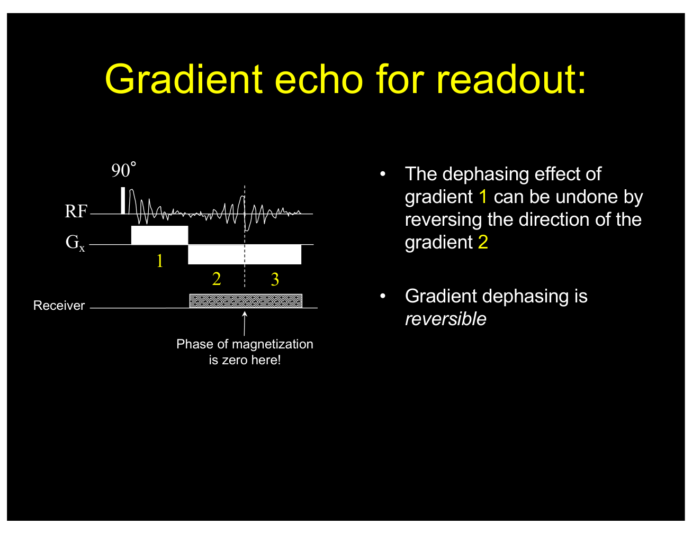

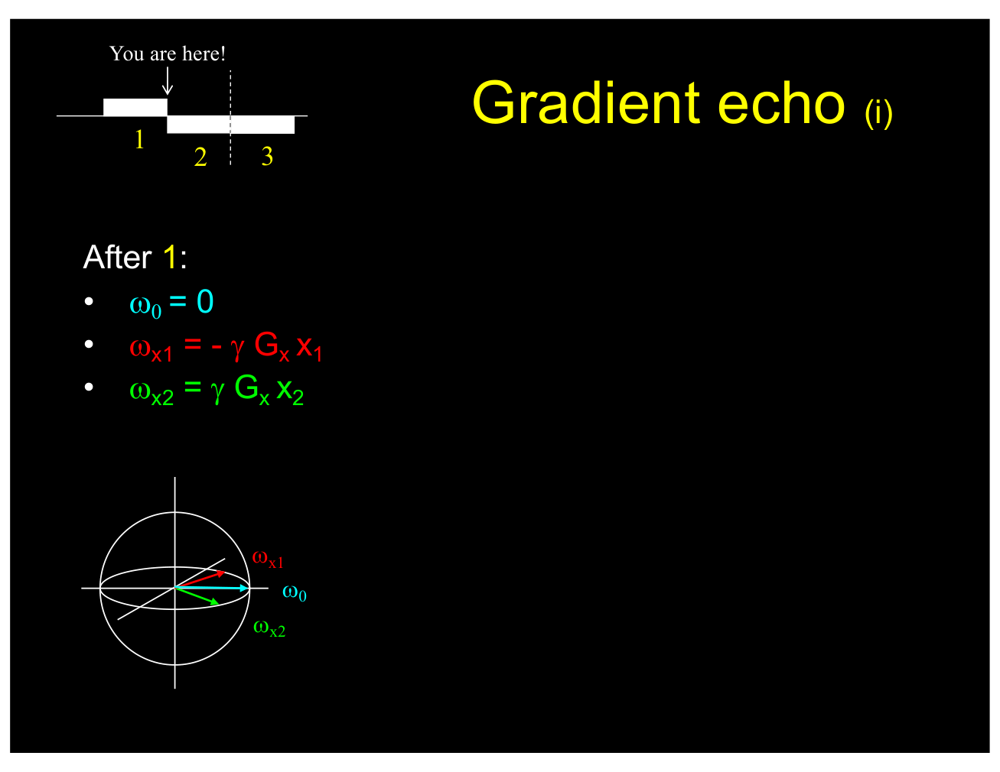

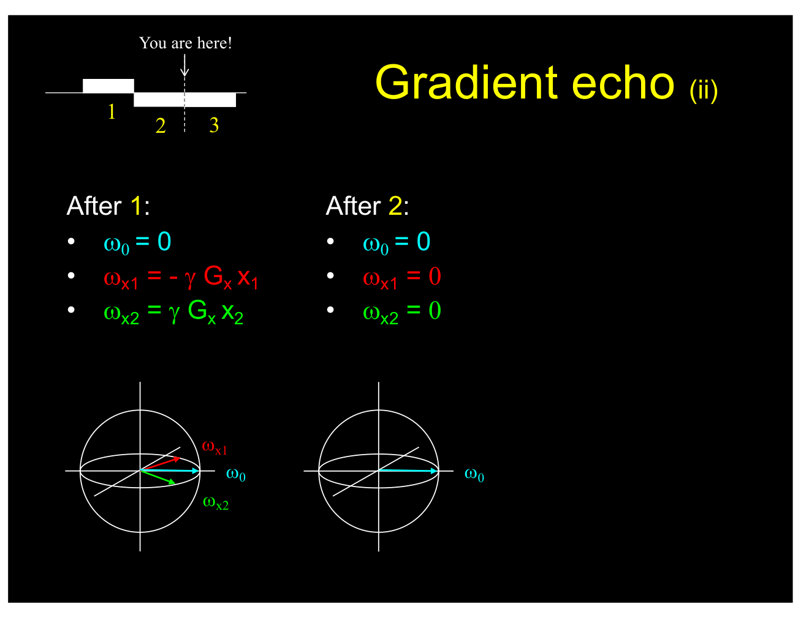

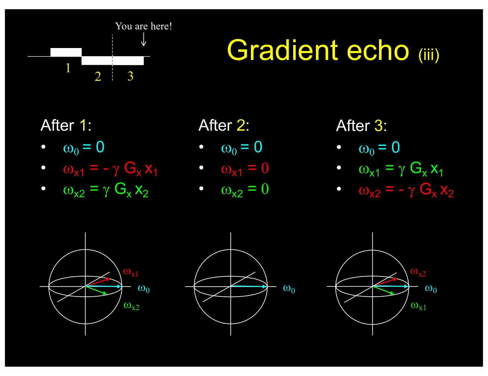

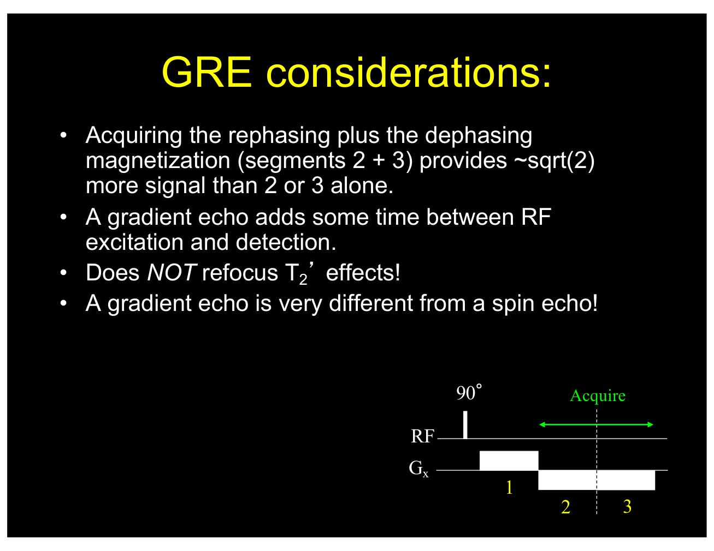

**Figure 3.4. Gradient echoes and reversible phase dispersion.** The timing logic that dephases and rephases spins under a readout gradient. Source pages 49-53 are grouped because they teach one local mechanism or diagnostic comparison. Key source labels and terms include: Gradient echo for readout:; The dephasing effect of; gradient 1 can be undone by; reversing the direction of the; gradient 2; After 1:; w0 = 0; wx1 = - g Gx x1.

This figure should be read as a sequence inside Chapter 3, not as an isolated picture. It begins
with gradient echo for readout: and ends with gre considerations:, so the reader can follow how
the local idea changes across the source panels. The retained source-backed panels are used here
because the original annotations are part of the evidence: the reader needs the labels, axes,
arrows, image examples, and comparison tags to see why the mechanism matters.

The practical lesson is the timing logic that dephases and rephases spins under a readout
gradient. In a scanner context, the important move is to translate what is drawn into an
acquisition consequence: which gradient is acting, which echo or reference data are being
trusted, which bandwidth or timing choice is limiting, or which image pattern would appear
during quality control.

For Figure 3.4, use the panels as a local reasoning test. If they show a temporal sequence, ask
what physical quantity is being conserved, reversed, accelerated, or lost. If they show images,
compare the same anatomical region across the named conditions before making a protocol
conclusion. That habit prevents a common fMRI error: treating the label gradient echoes and
reversible phase dispersion as a diagnosis before checking the visual evidence.

## K-space definitions

K-space definitions is the local bridge between the course vocabulary and a self-study
explanation. The relevant source ideas include K-space:; A useful pictorial representation of;
imaging pulse sequences; Take the 2D FT of a random image, we get its; representation in
reciprocal (k) space:; Fourier transforms for the x and kx dimensions:; y and ky can be
transformed analogously.; We will return to this seemingly arbitrary set of equations in a
moment.; But first…..; "Signal"; Image; Reconsider a frequency encoding gradient:. Taken
together, they should be read as one argument about connect gradient time integrals to k-space
coordinates. The textbook version therefore slows the slide sequence down: first define the
measured or manipulated quantity, then state what changes it, and only then connect the change
to image appearance or fMRI interpretation.

In this part of fourier thinking, gradients, and k-space, the central discipline is to separate
mechanism from display. A pulse sequence diagram, a k-space grid, or a brain image is not merely
a picture of a result; it encodes a chain of causes. For k-space definitions, that chain starts
with the controlled scanner quantity, passes through spin phase or signal weighting, and ends as
a spatial pattern, time-series change, or acquisition tradeoff. If the chain is left implicit,
the same term can be memorized without being understood.

A useful way to study k-space definitions is to ask three questions for every equation or panel.
What quantity is deliberately controlled in Chapter 3's local sequence or example? What
uncontrolled physical or biological quantity can perturb it? What image-space or time-series
signature would reveal the problem? These questions keep the mathematics connected to practical
fMRI, where protocol choices are judged by SNR, temporal stability, distortion, dropout, timing,
and interpretability rather than by elegance alone.

The source pages named K-space:, Take the 2D FT of a random image, we get its, Fourier
transforms for the x and kx dimensions:, Reconsider a frequency encoding gradient:, The MR
signal under Gx:, and related panels also show why MRI explanations often require several
levels. At the microscopic level, spins precess, relax, dephase, or refocus. At the sequence
level, RF pulses and gradients impose timing and spatial encoding. At the reconstruction level,
Fourier relationships convert sampled signals into images. At the experimental level, subject
motion, physiology, hardware stability, and human factors determine whether the image series
supports a defensible fMRI interpretation.

For practice, the reader should be able to restate k-space definitions without using slide
shorthand. The restatement should include the relevant variables, the direction of the effect,
and the likely failure mode. A good explanation is specific enough to predict what would happen
if the field strength, gradient area, echo spacing, flip angle, coil sensitivity, motion state,
or nuisance measurement changed.

## Figure 3.5. K-space as the Fourier representation of the image

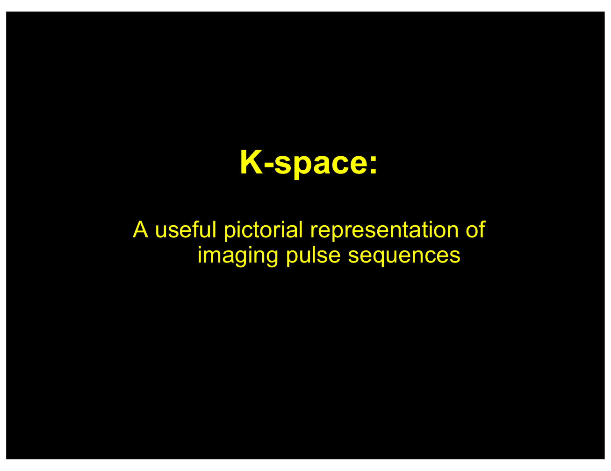

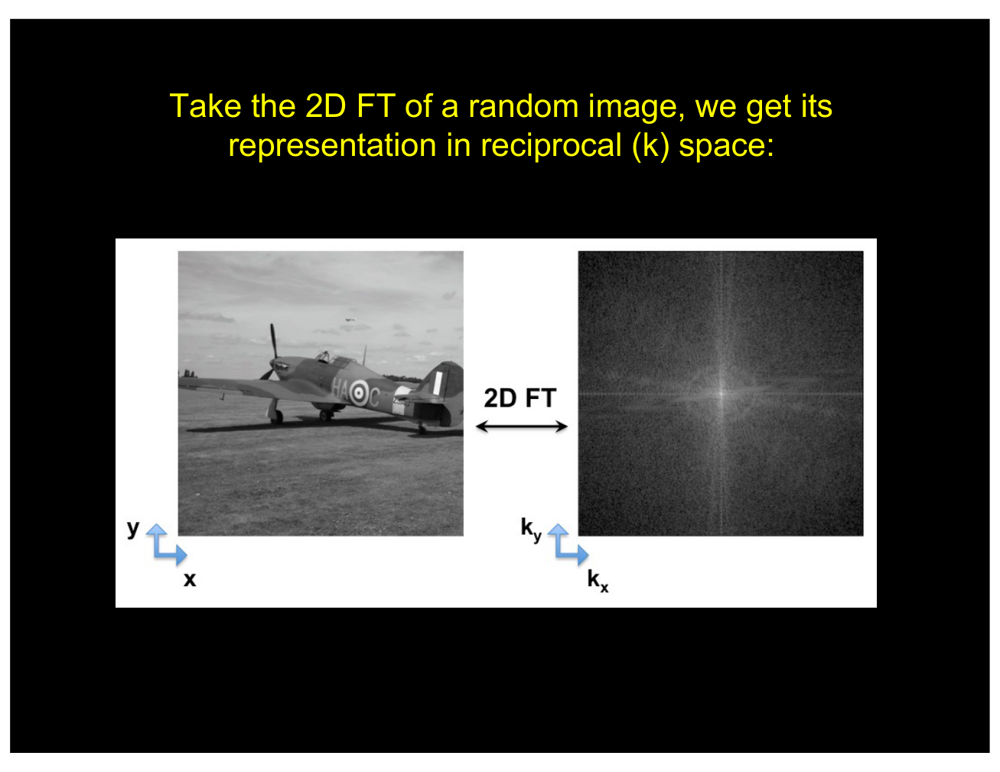

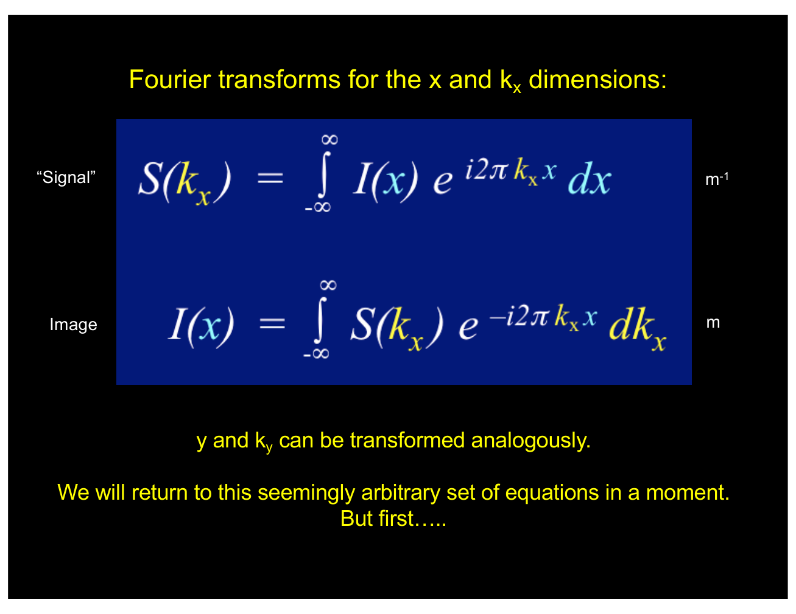

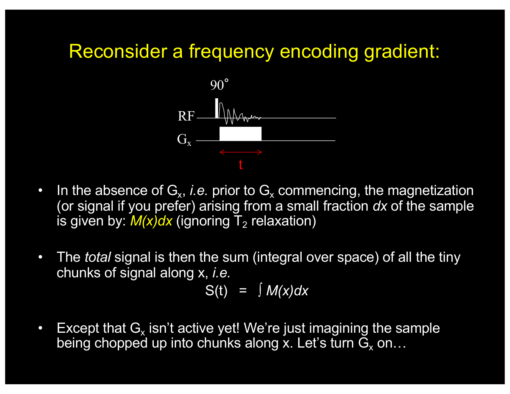

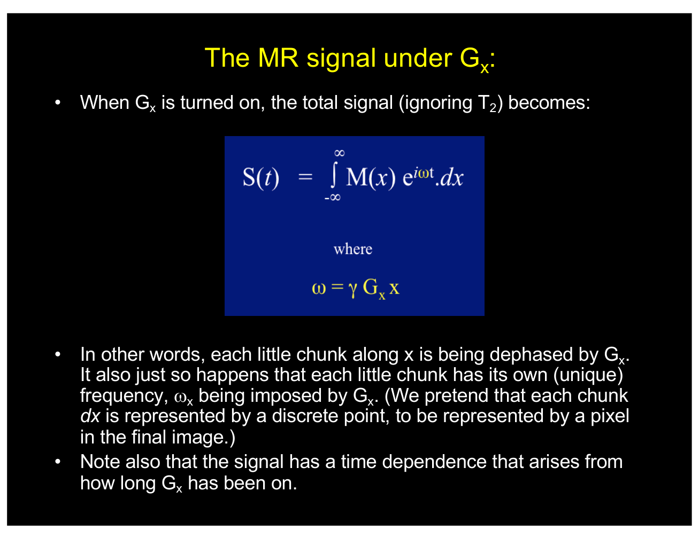

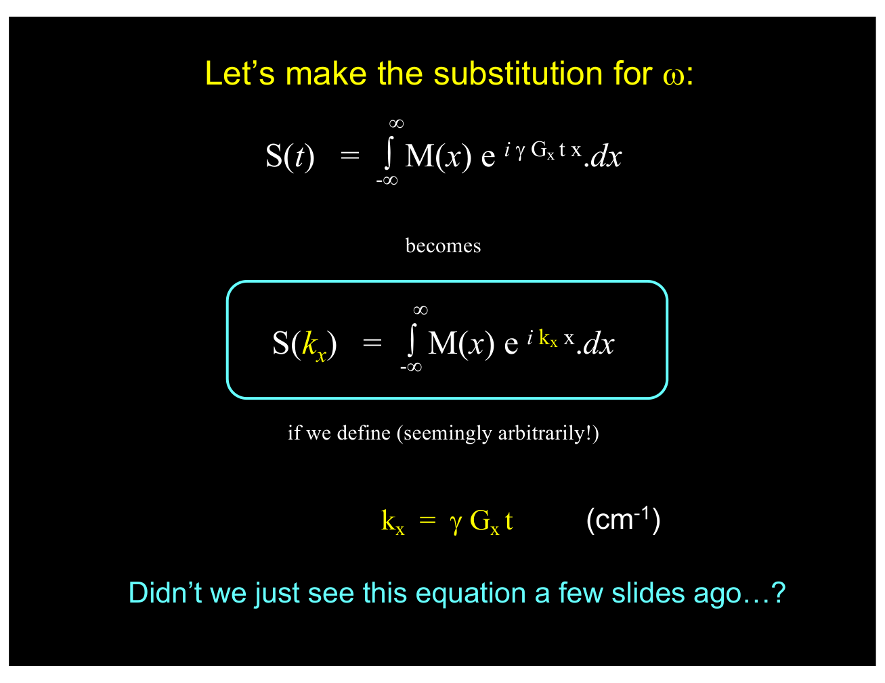

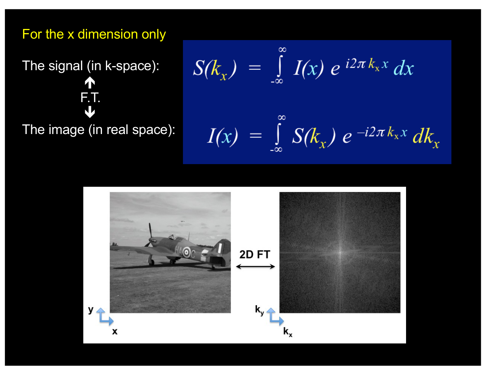

**Figure 3.5. K-space as the Fourier representation of the image.** From the image Fourier transform to kx as gamma times gradient area. Source pages 54-60 are grouped because they teach one local mechanism or diagnostic comparison. Key source labels and terms include: K-space:; A useful pictorial representation of; imaging pulse sequences; Take the 2D FT of a random image, we get its; representation in reciprocal (k) space:; Fourier transforms for the x and kx dimensions:; y and ky can be transformed analogously.; We will return to this seemingly arbitrary set of equations in a moment..

This figure should be read as a sequence inside Chapter 3, not as an isolated picture. It begins
with k-space: and ends with for the x dimension only, so the reader can follow how the local
idea changes across the source panels. The retained source-backed panels are used here because
the original annotations are part of the evidence: the reader needs the labels, axes, arrows,
image examples, and comparison tags to see why the mechanism matters.

The practical lesson is from the image fourier transform to kx as gamma times gradient area. In
a scanner context, the important move is to translate what is drawn into an acquisition
consequence: which gradient is acting, which echo or reference data are being trusted, which
bandwidth or timing choice is limiting, or which image pattern would appear during quality
control.

For Figure 3.5, use the panels as a local reasoning test. If they show a temporal sequence, ask
what physical quantity is being conserved, reversed, accelerated, or lost. If they show images,
compare the same anatomical region across the named conditions before making a protocol
conclusion. That habit prevents a common fMRI error: treating the label k-space as the fourier
representation of the image as a diagnosis before checking the visual evidence.

## Figure 3.6. Gradient area as a k-space trajectory

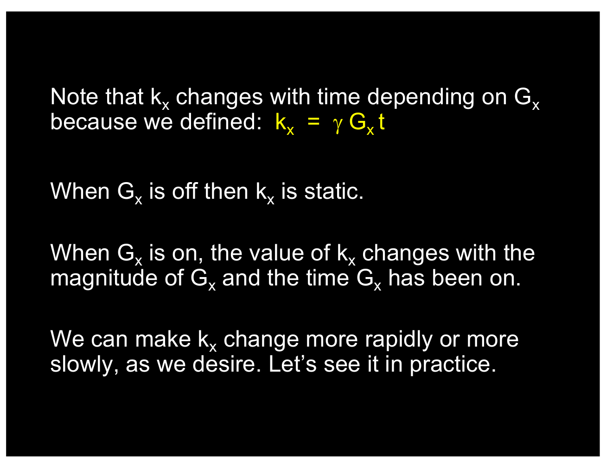

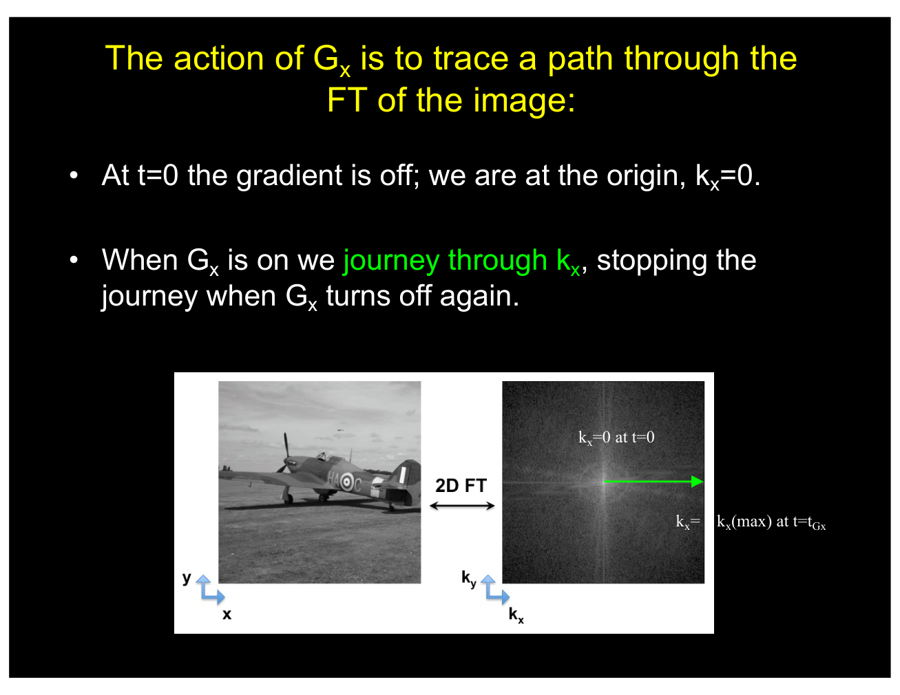

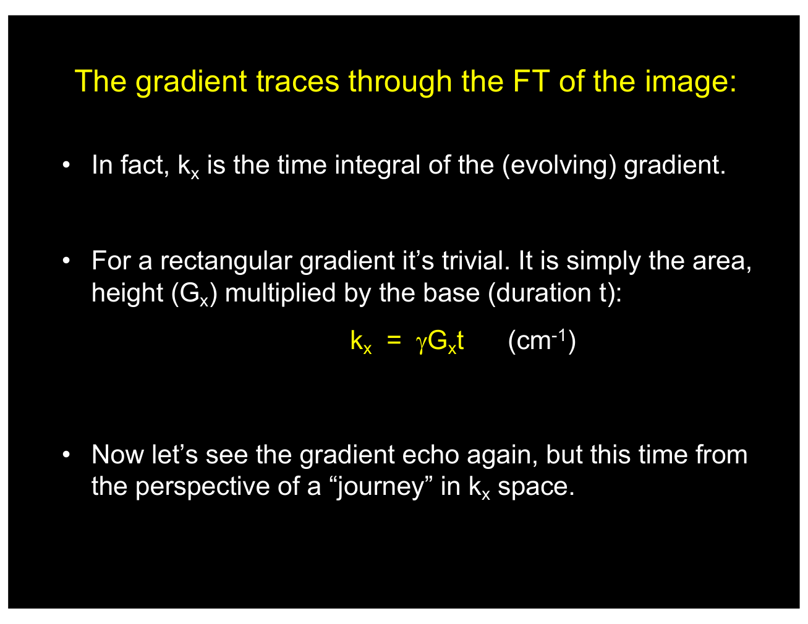

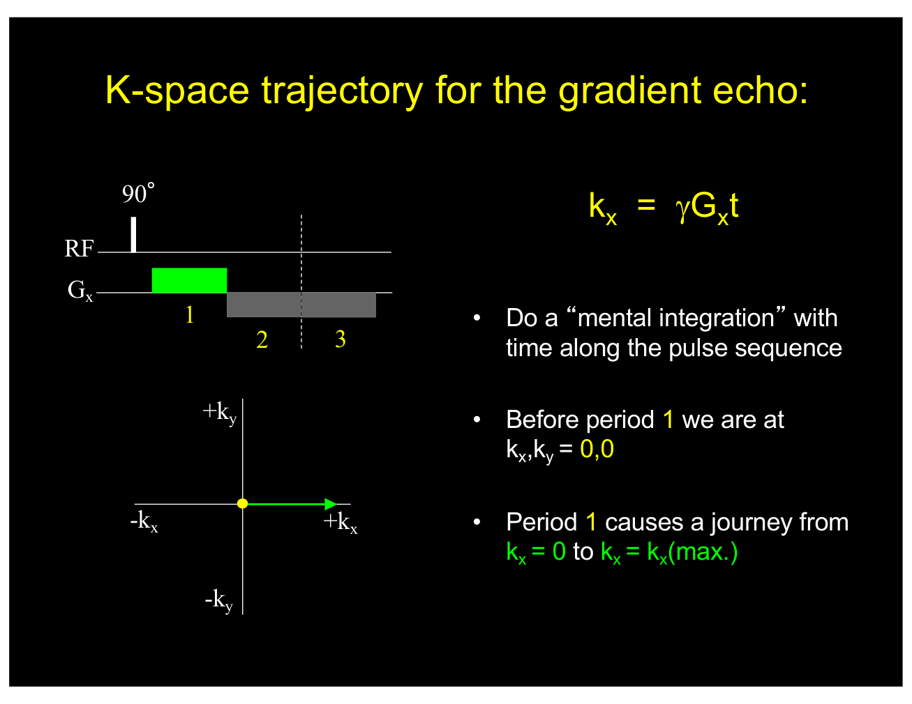

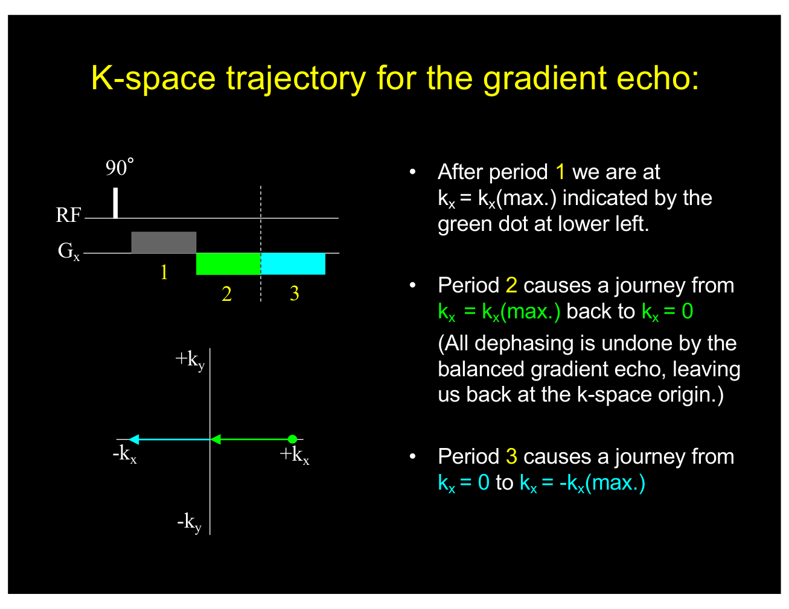

**Figure 3.6. Gradient area as a k-space trajectory.** Mental integration of pulse-sequence gradients into motion through k-space. Source pages 61-65 are grouped because they teach one local mechanism or diagnostic comparison. Key source labels and terms include: Note that kx changes with time depending on Gx; because we defined: kx = g Gx t; When Gx is off then kx is static.; When Gx is on, the value of kx changes with the; magnitude of Gx and the time Gx has been on.; We can make kx change more rapidly or more; The action of Gx is to trace a path through the; FT of the image:.

This figure should be read as a sequence inside Chapter 3, not as an isolated picture. It begins
with note that kx changes with time depending on gx and ends with -, so the reader can follow
how the local idea changes across the source panels. The retained source-backed panels are used
here because the original annotations are part of the evidence: the reader needs the labels,
axes, arrows, image examples, and comparison tags to see why the mechanism matters.

The practical lesson is mental integration of pulse-sequence gradients into motion through
k-space. In a scanner context, the important move is to translate what is drawn into an
acquisition consequence: which gradient is acting, which echo or reference data are being
trusted, which bandwidth or timing choice is limiting, or which image pattern would appear
during quality control.

For Figure 3.6, use the panels as a local reasoning test. If they show a temporal sequence, ask
what physical quantity is being conserved, reversed, accelerated, or lost. If they show images,
compare the same anatomical region across the named conditions before making a protocol
conclusion. That habit prevents a common fMRI error: treating the label gradient area as a
k-space trajectory as a diagnosis before checking the visual evidence.

## Phase encoding and two-dimensional imaging

Phase encoding and two-dimensional imaging is the local bridge between the course vocabulary and
a self-study explanation. The relevant source ideas include Phase encoding as seen in 2D
k-space; Consider a second gradient episode, Gy in the pulse sequence; below. We call this the
phase encoding gradient because we will; encode spatial information as phase in y.; S(t) =
integral M(y) e i g Gy t y.dy; becomes; S(ky) = integral M(y) e i ky y.dy; where; ky = g Gy t;
90 degrees; How would we do this?; The green lines hit 16x16 points on this 2D k-space grid,.
Taken together, they should be read as one argument about fill a matrix of k-space samples and
reconstruct an image. The textbook version therefore slows the slide sequence down: first define
the measured or manipulated quantity, then state what changes it, and only then connect the
change to image appearance or fMRI interpretation.

In this part of fourier thinking, gradients, and k-space, the central discipline is to separate
mechanism from display. A pulse sequence diagram, a k-space grid, or a brain image is not merely
a picture of a result; it encodes a chain of causes. For phase encoding and two-dimensional
imaging, that chain starts with the controlled scanner quantity, passes through spin phase or
signal weighting, and ends as a spatial pattern, time-series change, or acquisition tradeoff. If
the chain is left implicit, the same term can be memorized without being understood.

A useful way to study phase encoding and two-dimensional imaging is to ask three questions for
every equation or panel. What quantity is deliberately controlled in Chapter 3's local sequence
or example? What uncontrolled physical or biological quantity can perturb it? What image-space
or time-series signature would reveal the problem? These questions keep the mathematics
connected to practical fMRI, where protocol choices are judged by SNR, temporal stability,
distortion, dropout, timing, and interpretability rather than by elegance alone.

The source pages named Phase encoding as seen in 2D k-space, S(t) = integral M(y) e i g Gy t
y.dy, RF, How would we do this?, Image-only teaching panel 70, and related panels also show why
MRI explanations often require several levels. At the microscopic level, spins precess, relax,
dephase, or refocus. At the sequence level, RF pulses and gradients impose timing and spatial
encoding. At the reconstruction level, Fourier relationships convert sampled signals into
images. At the experimental level, subject motion, physiology, hardware stability, and human
factors determine whether the image series supports a defensible fMRI interpretation.

For practice, the reader should be able to restate phase encoding and two-dimensional imaging
without using slide shorthand. The restatement should include the relevant variables, the
direction of the effect, and the likely failure mode. A good explanation is specific enough to
predict what would happen if the field strength, gradient area, echo spacing, flip angle, coil
sensitivity, motion state, or nuisance measurement changed.

## Figure 3.7. Phase encoding and two-dimensional k-space filling

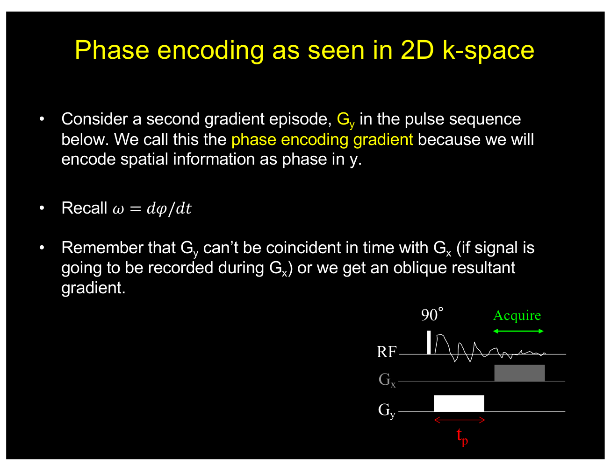

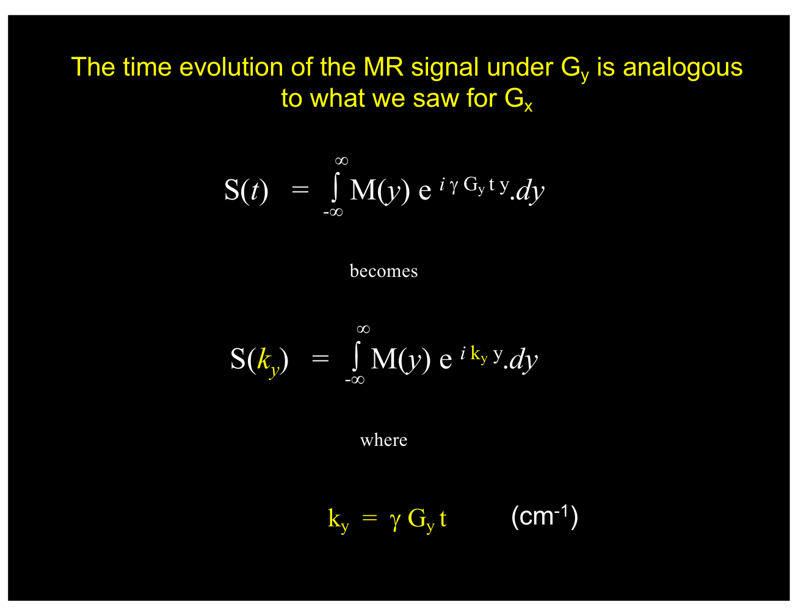

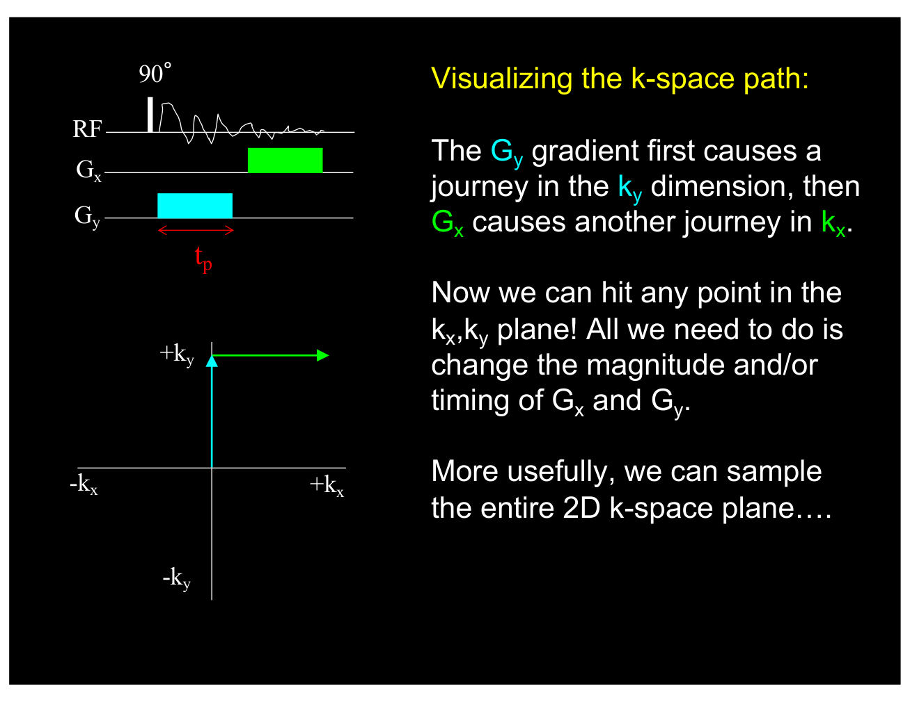

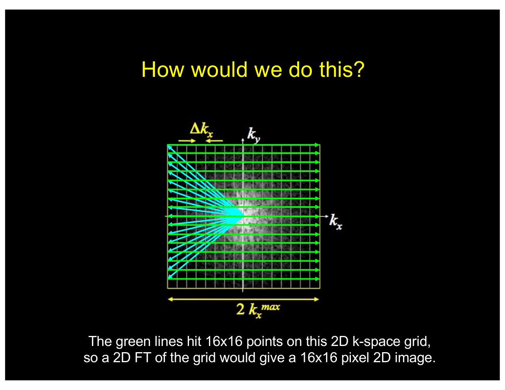

**Figure 3.7. Phase encoding and two-dimensional k-space filling.** How Gy selects a ky line and Gx reads across kx. Source pages 66-69 are grouped because they teach one local mechanism or diagnostic comparison. Key source labels and terms include: Phase encoding as seen in 2D k-space; Consider a second gradient episode, Gy in the pulse sequence; below. We call this the phase encoding gradient because we will; encode spatial information as phase in y.; S(t) = integral M(y) e i g Gy t y.dy; becomes; S(ky) = integral M(y) e i ky y.dy; where.

This figure should be read as a sequence inside Chapter 3, not as an isolated picture. It begins
with phase encoding as seen in 2d k-space and ends with how would we do this?, so the reader can
follow how the local idea changes across the source panels. The retained source-backed panels
are used here because the original annotations are part of the evidence: the reader needs the
labels, axes, arrows, image examples, and comparison tags to see why the mechanism matters.

The practical lesson is how gy selects a ky line and gx reads across kx. In a scanner context,
the important move is to translate what is drawn into an acquisition consequence: which gradient
is acting, which echo or reference data are being trusted, which bandwidth or timing choice is
limiting, or which image pattern would appear during quality control.

For Figure 3.7, use the panels as a local reasoning test. If they show a temporal sequence, ask
what physical quantity is being conserved, reversed, accelerated, or lost. If they show images,
compare the same anatomical region across the named conditions before making a protocol
conclusion. That habit prevents a common fMRI error: treating the label phase encoding and two-
dimensional k-space filling as a diagnosis before checking the visual evidence.

## Figure 3.8. A full gradient-echo sequence samples a 2D matrix

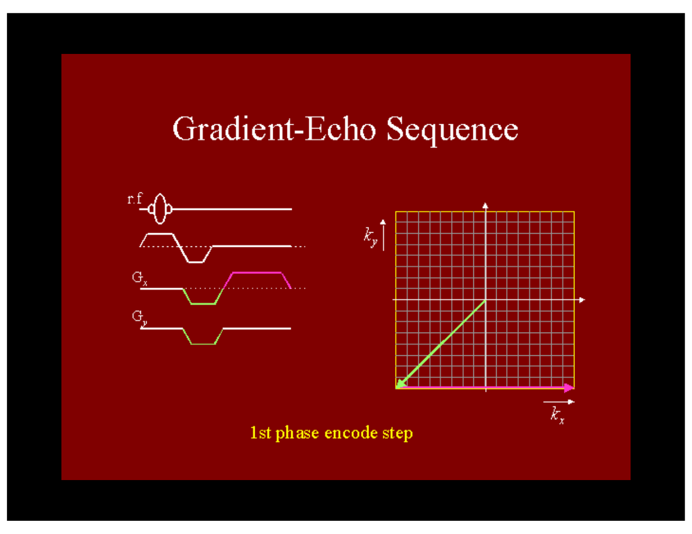

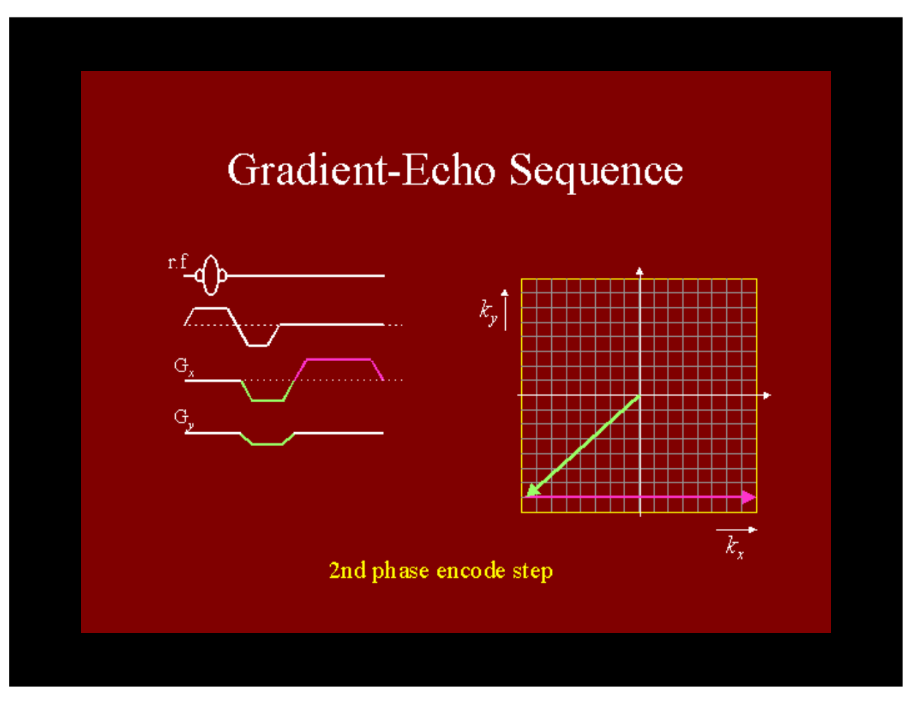

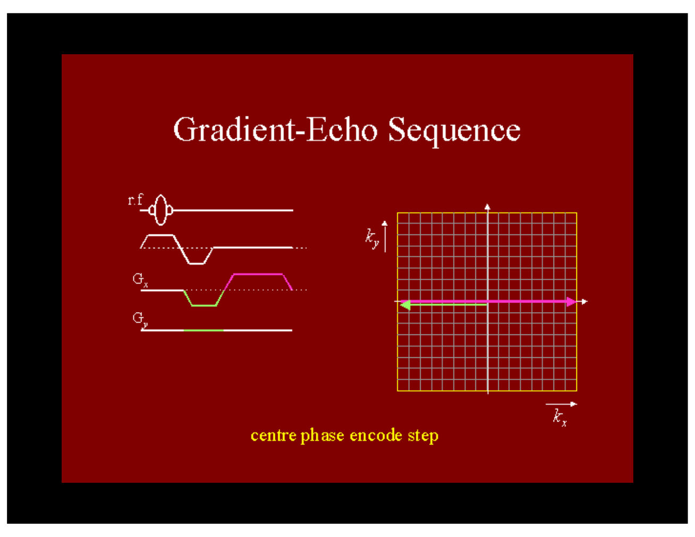

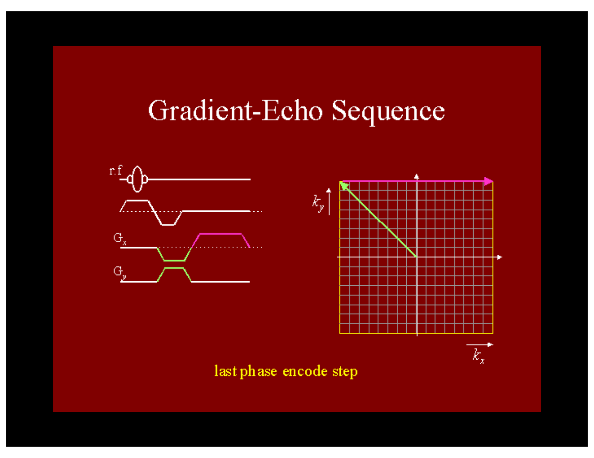

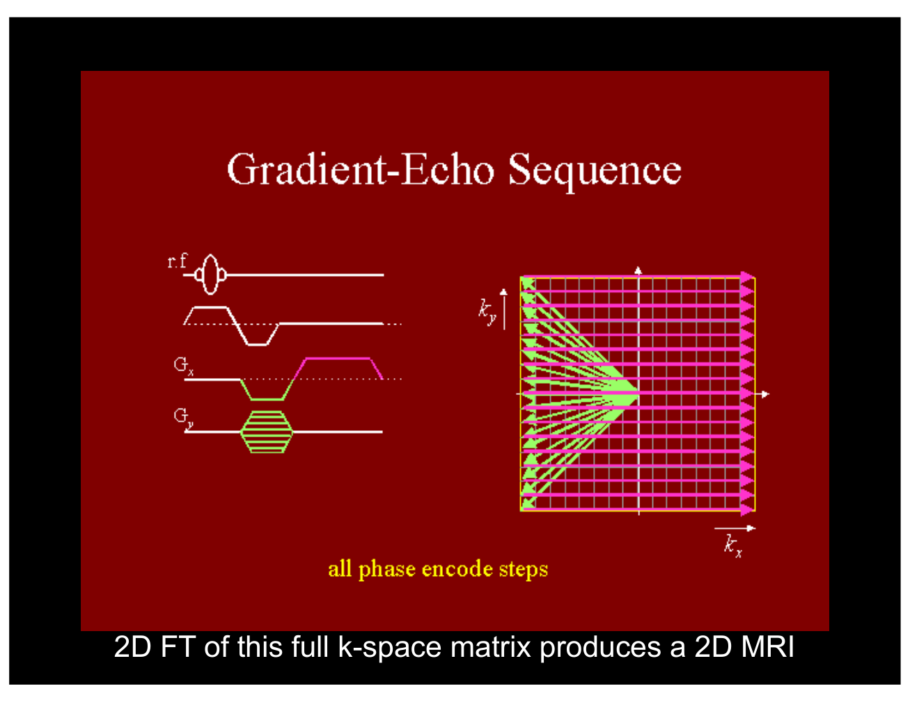

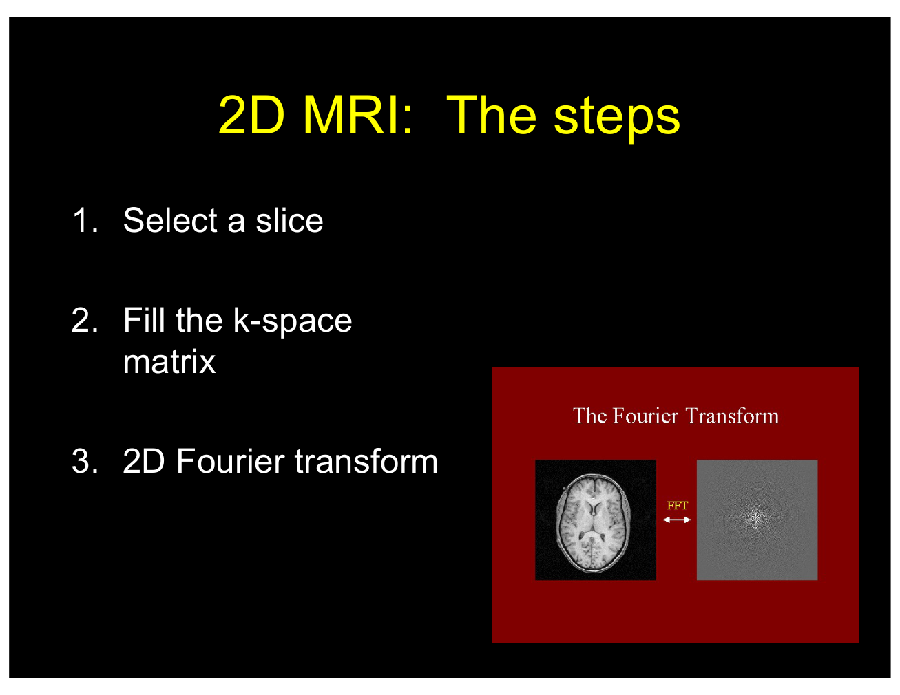

**Figure 3.8. A full gradient-echo sequence samples a 2D matrix.** The repeated phase-encoding steps that fill k-space before a 2D Fourier transform. Source pages 70-75 are grouped because they teach one local mechanism or diagnostic comparison. Key source labels and terms include: Image-only teaching panel 70; Image-only teaching panel 71; Image-only teaching panel 72; Image-only teaching panel 73; 2D FT of this full k-space matrix produces a 2D MRI; 2D MRI: The steps; 1. Select a slice; 2. Fill the k-space.

This figure should be read as a sequence inside Chapter 3, not as an isolated picture. It begins
with image-only teaching panel 70 and ends with 2d mri: the steps, so the reader can follow how
the local idea changes across the source panels. The retained source-backed panels are used here
because the original annotations are part of the evidence: the reader needs the labels, axes,
arrows, image examples, and comparison tags to see why the mechanism matters.

The practical lesson is the repeated phase-encoding steps that fill k-space before a 2d fourier
transform. In a scanner context, the important move is to translate what is drawn into an
acquisition consequence: which gradient is acting, which echo or reference data are being
trusted, which bandwidth or timing choice is limiting, or which image pattern would appear
during quality control.

For Figure 3.8, use the panels as a local reasoning test. If they show a temporal sequence, ask
what physical quantity is being conserved, reversed, accelerated, or lost. If they show images,
compare the same anatomical region across the named conditions before making a protocol
conclusion. That habit prevents a common fMRI error: treating the label a full gradient-echo
sequence samples a 2d matrix as a diagnosis before checking the visual evidence.

## Spatial-frequency interpretation

Spatial-frequency interpretation is the local bridge between the course vocabulary and a self-
study explanation. The relevant source ideas include The k parameter is simply the time-integral
of a gradient; multiplied by a coefficient, g/2p :; We can now see that in MRI, the conjugate
variable for; space is the gradient area. So, if we know what gradients; are being applied, we
can easily relate them to the image; we will obtain!; Space; K-space; Putting it all together:
2D MRI; What can we tell from k-space?; We need a full k-space; matrix for the complete. Taken
together, they should be read as one argument about interpret low- and high-frequency k-space
content. The textbook version therefore slows the slide sequence down: first define the measured
or manipulated quantity, then state what changes it, and only then connect the change to image
appearance or fMRI interpretation.

In this part of fourier thinking, gradients, and k-space, the central discipline is to separate
mechanism from display. A pulse sequence diagram, a k-space grid, or a brain image is not merely
a picture of a result; it encodes a chain of causes. For spatial-frequency interpretation, that
chain starts with the controlled scanner quantity, passes through spin phase or signal
weighting, and ends as a spatial pattern, time-series change, or acquisition tradeoff. If the
chain is left implicit, the same term can be memorized without being understood.

A useful way to study spatial-frequency interpretation is to ask three questions for every
equation or panel. What quantity is deliberately controlled in Chapter 3's local sequence or
example? What uncontrolled physical or biological quantity can perturb it? What image-space or
time-series signature would reveal the problem? These questions keep the mathematics connected
to practical fMRI, where protocol choices are judged by SNR, temporal stability, distortion,
dropout, timing, and interpretability rather than by elegance alone.

The source pages named The k parameter is simply the time-integral of a gradient, Space, What
can we tell from k-space?, Image-only teaching panel 79, Reduced resolution, and related panels
also show why MRI explanations often require several levels. At the microscopic level, spins
precess, relax, dephase, or refocus. At the sequence level, RF pulses and gradients impose
timing and spatial encoding. At the reconstruction level, Fourier relationships convert sampled
signals into images. At the experimental level, subject motion, physiology, hardware stability,
and human factors determine whether the image series supports a defensible fMRI interpretation.

For practice, the reader should be able to restate spatial-frequency interpretation without
using slide shorthand. The restatement should include the relevant variables, the direction of
the effect, and the likely failure mode. A good explanation is specific enough to predict what
would happen if the field strength, gradient area, echo spacing, flip angle, coil sensitivity,
motion state, or nuisance measurement changed.

## Figure 3.9. Spatial frequency, resolution, and k-space content

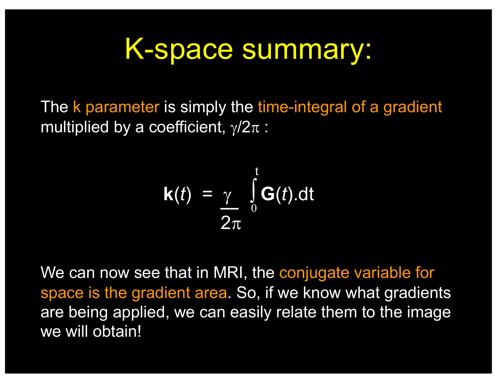

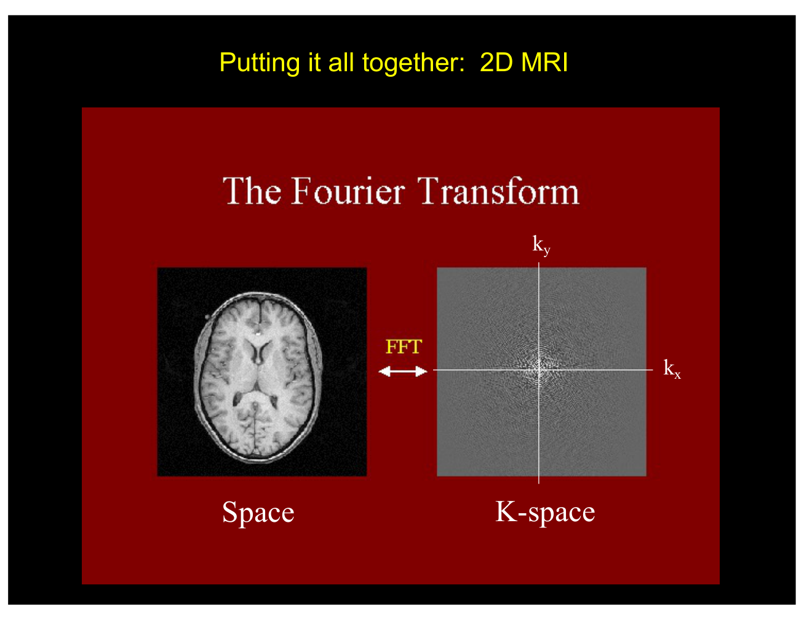

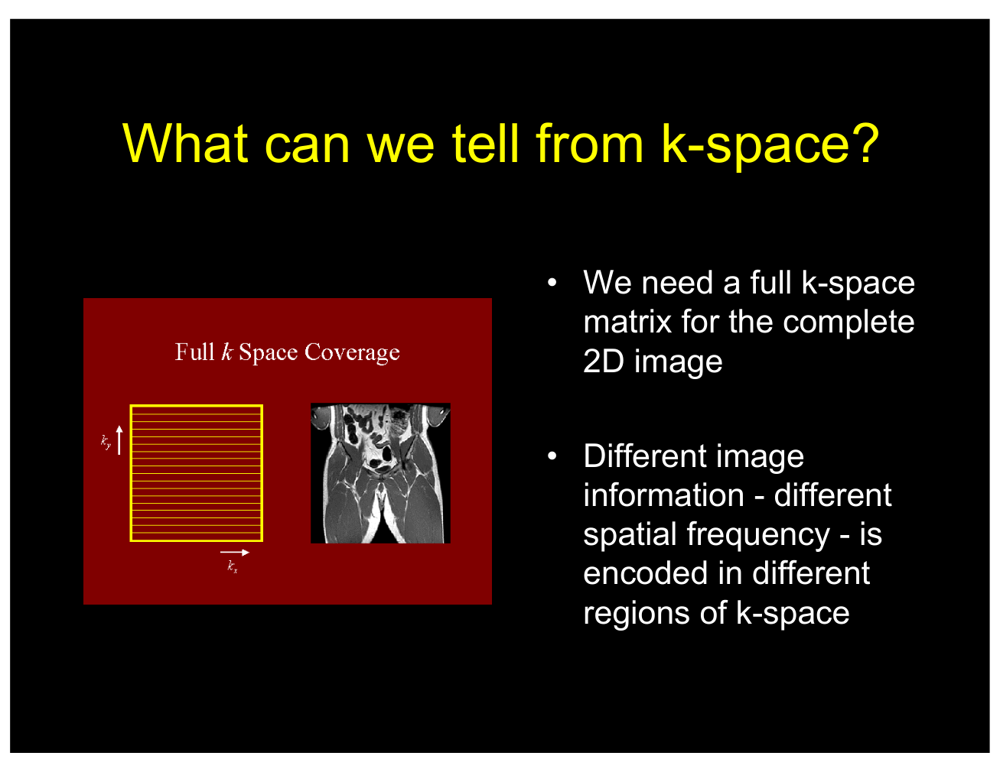

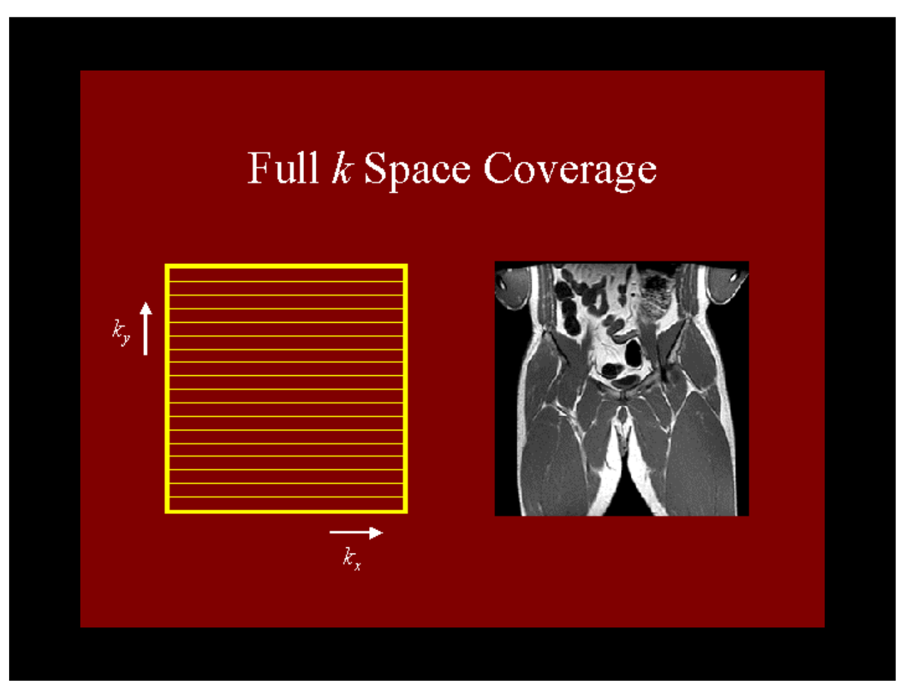

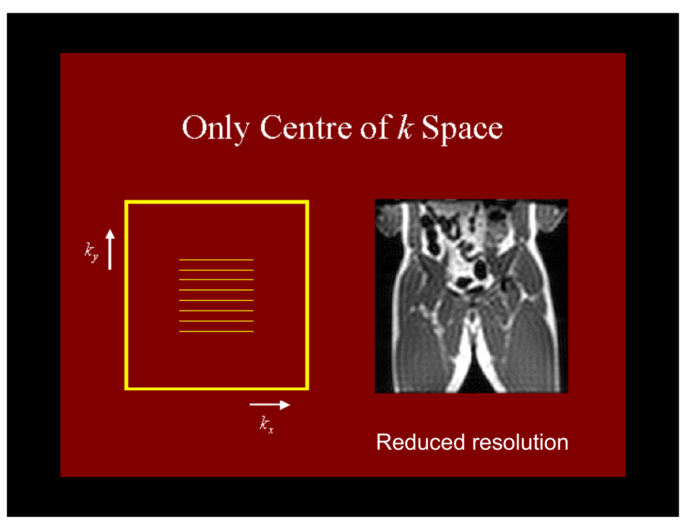

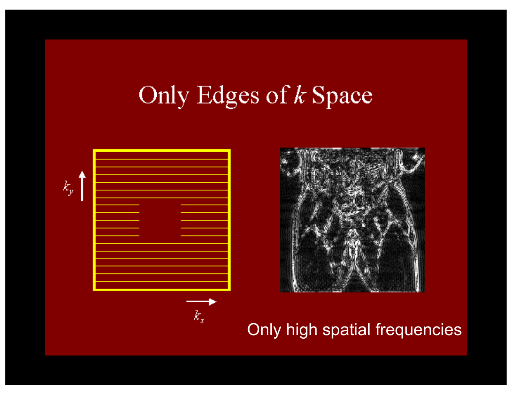

**Figure 3.9. Spatial frequency, resolution, and k-space content.** The image consequences of central versus peripheral k-space. Source pages 76-81 are grouped because they teach one local mechanism or diagnostic comparison. Key source labels and terms include: The k parameter is simply the time-integral of a gradient; multiplied by a coefficient, g/2p :; We can now see that in MRI, the conjugate variable for; space is the gradient area. So, if we know what gradients; are being applied, we can easily relate them to the image; we will obtain!; Space; K-space.

This figure should be read as a sequence inside Chapter 3, not as an isolated picture. It begins
with the k parameter is simply the time-integral of a gradient and ends with only high spatial
frequencies, so the reader can follow how the local idea changes across the source panels. The
retained source-backed panels are used here because the original annotations are part of the
evidence: the reader needs the labels, axes, arrows, image examples, and comparison tags to see
why the mechanism matters.

The practical lesson is the image consequences of central versus peripheral k-space. In a
scanner context, the important move is to translate what is drawn into an acquisition
consequence: which gradient is acting, which echo or reference data are being trusted, which
bandwidth or timing choice is limiting, or which image pattern would appear during quality
control.

For Figure 3.9, use the panels as a local reasoning test. If they show a temporal sequence, ask
what physical quantity is being conserved, reversed, accelerated, or lost. If they show images,
compare the same anatomical region across the named conditions before making a protocol
conclusion. That habit prevents a common fMRI error: treating the label spatial frequency,
resolution, and k-space content as a diagnosis before checking the visual evidence.

## Artifact previews and stimulation limits

Artifact previews and stimulation limits is the local bridge between the course vocabulary and a
self-study explanation. The relevant source ideas include Day Two; Afternoon; MRI basics;
Aliasing; Truncation artifact; (Gibbs ringing); Stimulus limits; Relative areas of effective
current loops produced by gradient switching.; An effective current loop is induced in the plane
perpendicular to the; switched gradient axis.. Taken together, they should be read as one
argument about link aliasing, truncation, and gradient switching to practical limits. The
textbook version therefore slows the slide sequence down: first define the measured or
manipulated quantity, then state what changes it, and only then connect the change to image
appearance or fMRI interpretation.

In this part of fourier thinking, gradients, and k-space, the central discipline is to separate
mechanism from display. A pulse sequence diagram, a k-space grid, or a brain image is not merely
a picture of a result; it encodes a chain of causes. For artifact previews and stimulation
limits, that chain starts with the controlled scanner quantity, passes through spin phase or
signal weighting, and ends as a spatial pattern, time-series change, or acquisition tradeoff. If
the chain is left implicit, the same term can be memorized without being understood.

A useful way to study artifact previews and stimulation limits is to ask three questions for
every equation or panel. What quantity is deliberately controlled in Chapter 3's local sequence
or example? What uncontrolled physical or biological quantity can perturb it? What image-space
or time-series signature would reveal the problem? These questions keep the mathematics
connected to practical fMRI, where protocol choices are judged by SNR, temporal stability,
distortion, dropout, timing, and interpretability rather than by elegance alone.

The source pages named Day Two, Aliasing, Truncation artifact, Stimulus limits also show why MRI
explanations often require several levels. At the microscopic level, spins precess, relax,
dephase, or refocus. At the sequence level, RF pulses and gradients impose timing and spatial
encoding. At the reconstruction level, Fourier relationships convert sampled signals into
images. At the experimental level, subject motion, physiology, hardware stability, and human
factors determine whether the image series supports a defensible fMRI interpretation.

For practice, the reader should be able to restate artifact previews and stimulation limits
without using slide shorthand. The restatement should include the relevant variables, the
direction of the effect, and the likely failure mode. A good explanation is specific enough to
predict what would happen if the field strength, gradient area, echo spacing, flip angle, coil
sensitivity, motion state, or nuisance measurement changed.

## Figure 3.10. Early MRI artifact concepts and stimulation limits

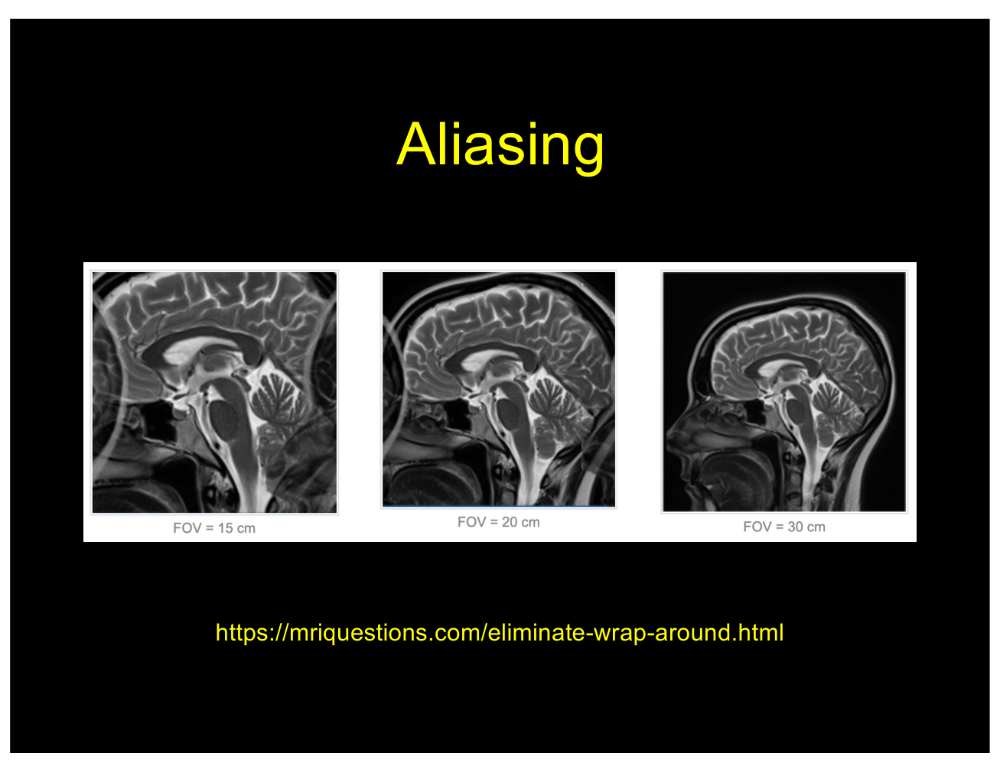

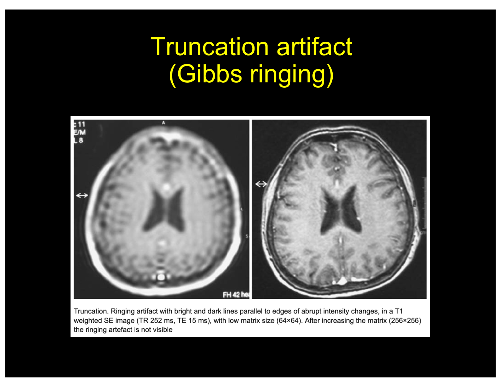

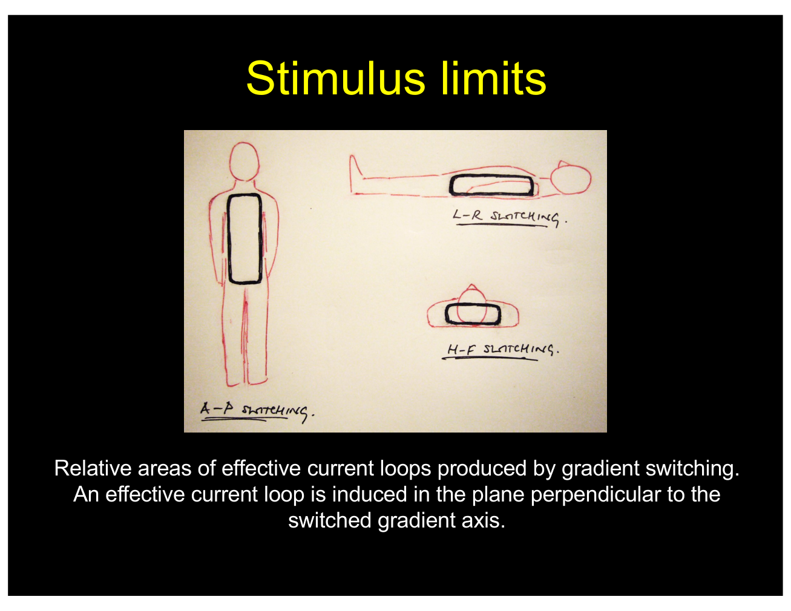

**Figure 3.10. Early MRI artifact concepts and stimulation limits.** Wrap-around, Gibbs ringing, and gradient-switching current-loop limits. Source pages 83-85 are grouped because they teach one local mechanism or diagnostic comparison. Key source labels and terms include: Aliasing; Truncation artifact; (Gibbs ringing); Stimulus limits; Relative areas of effective current loops produced by gradient switching.; An effective current loop is induced in the plane perpendicular to the; switched gradient axis..

This figure should be read as a sequence inside Chapter 3, not as an isolated picture. It begins
with aliasing and ends with stimulus limits, so the reader can follow how the local idea changes
across the source panels. The retained source-backed panels are used here because the original
annotations are part of the evidence: the reader needs the labels, axes, arrows, image examples,
and comparison tags to see why the mechanism matters.

The practical lesson is wrap-around, gibbs ringing, and gradient-switching current-loop limits.
In a scanner context, the important move is to translate what is drawn into an acquisition
consequence: which gradient is acting, which echo or reference data are being trusted, which
bandwidth or timing choice is limiting, or which image pattern would appear during quality
control.

For Figure 3.10, use the panels as a local reasoning test. If they show a temporal sequence, ask
what physical quantity is being conserved, reversed, accelerated, or lost. If they show images,
compare the same anatomical region across the named conditions before making a protocol
conclusion. That habit prevents a common fMRI error: treating the label early mri artifact
concepts and stimulation limits as a diagnosis before checking the visual evidence.

### Chapter Summary

Chapter 3 used pages 31-85 to develop develop the mathematical and practical path from frequency
analysis to two-dimensional mri. The main lesson is cumulative: the reader should move from
vocabulary to mechanism, from mechanism to protocol choice, and from protocol choice to image or
time-series consequences.

### Key Terms

Fourier, pairs, frequency, Gradients, spatial, encoders, Slice, selection, Gradient, echoes.

### Review Questions

1. Explain how fourier pairs and frequency analysis affects a practical fMRI decision.
2. Describe one way a visual panel in Chapter 3 changes the interpretation of the prose.
3. Name one acquisition parameter from this chapter and predict a tradeoff if it is changed.
4. Distinguish a mechanism-level explanation from an image-appearance description.
5. Identify one quality-control sign that would make you revisit this chapter before scanning more data.

# Chapter 4. EPI Fundamentals and Classic Artifacts

This chapter covers source pages 86-124 and turns them into a self-study sequence about explain
why epi is fast, why it is vulnerable, and how its characteristic artifacts arise. The chapter
is organized by mechanism and scanning consequence, not by slide order alone, so figures appear
where they support the local explanation.

## Echo-planar k-space traversal

Echo-planar k-space traversal is the local bridge between the course vocabulary and a self-study
explanation. The relevant source ideas include Day Three; Morning; Introduction to EPI; K-space
for EPI:; A multiple gradient echo; sequence; The first four-and-a-half echoes of; a 16-echo
"train," for the 16x16; k-space matrix above:; The three "classic" EPI artifacts:; Ghosting -
The appearance of (hopefully) faint replica; images in the phase encoding dimension.. Taken
together, they should be read as one argument about frame EPI as a multiple-gradient-echo
readout. The textbook version therefore slows the slide sequence down: first define the measured
or manipulated quantity, then state what changes it, and only then connect the change to image
appearance or fMRI interpretation.

In this part of epi fundamentals and classic artifacts, the central discipline is to separate
mechanism from display. A pulse sequence diagram, a k-space grid, or a brain image is not merely
a picture of a result; it encodes a chain of causes. For echo-planar k-space traversal, that
chain starts with the controlled scanner quantity, passes through spin phase or signal
weighting, and ends as a spatial pattern, time-series change, or acquisition tradeoff. If the
chain is left implicit, the same term can be memorized without being understood.

A useful way to study echo-planar k-space traversal is to ask three questions for every equation
or panel. What quantity is deliberately controlled in Chapter 4's local sequence or example?
What uncontrolled physical or biological quantity can perturb it? What image-space or time-
series signature would reveal the problem? These questions keep the mathematics connected to
practical fMRI, where protocol choices are judged by SNR, temporal stability, distortion,
dropout, timing, and interpretability rather than by elegance alone.

The source pages named Day Three, K-space for EPI:, The three "classic" EPI artifacts: also show
why MRI explanations often require several levels. At the microscopic level, spins precess,
relax, dephase, or refocus. At the sequence level, RF pulses and gradients impose timing and
spatial encoding. At the reconstruction level, Fourier relationships convert sampled signals
into images. At the experimental level, subject motion, physiology, hardware stability, and
human factors determine whether the image series supports a defensible fMRI interpretation.

For practice, the reader should be able to restate echo-planar k-space traversal without using
slide shorthand. The restatement should include the relevant variables, the direction of the
effect, and the likely failure mode. A good explanation is specific enough to predict what would
happen if the field strength, gradient area, echo spacing, flip angle, coil sensitivity, motion
state, or nuisance measurement changed.

## Figure 4.1. EPI readout and Nyquist ghost formation

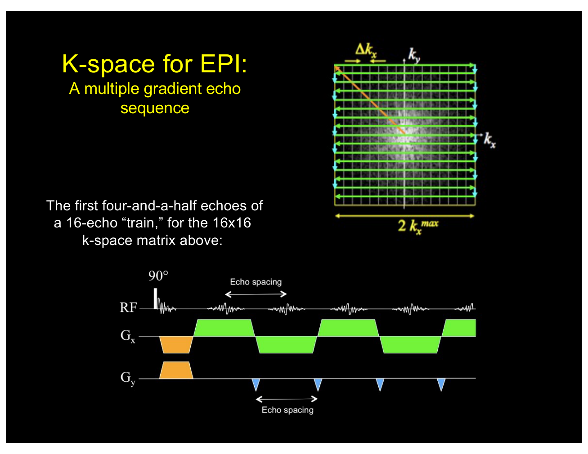

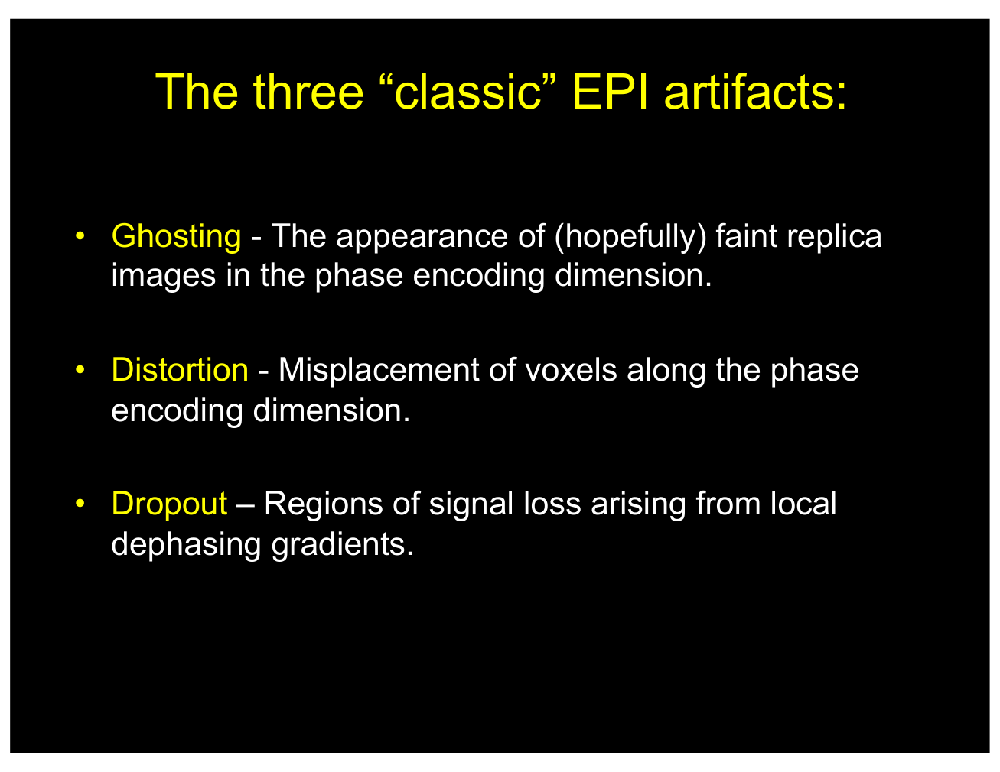

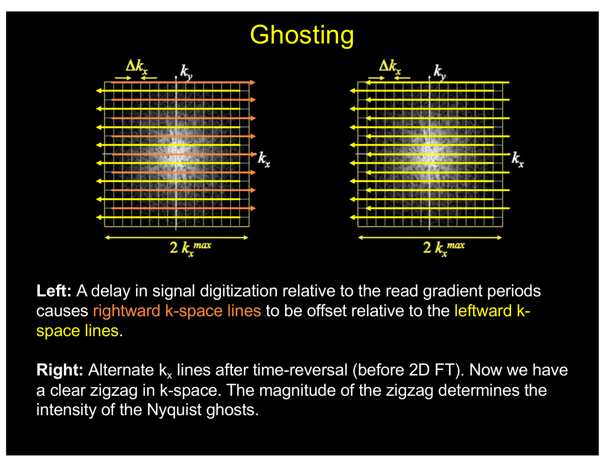

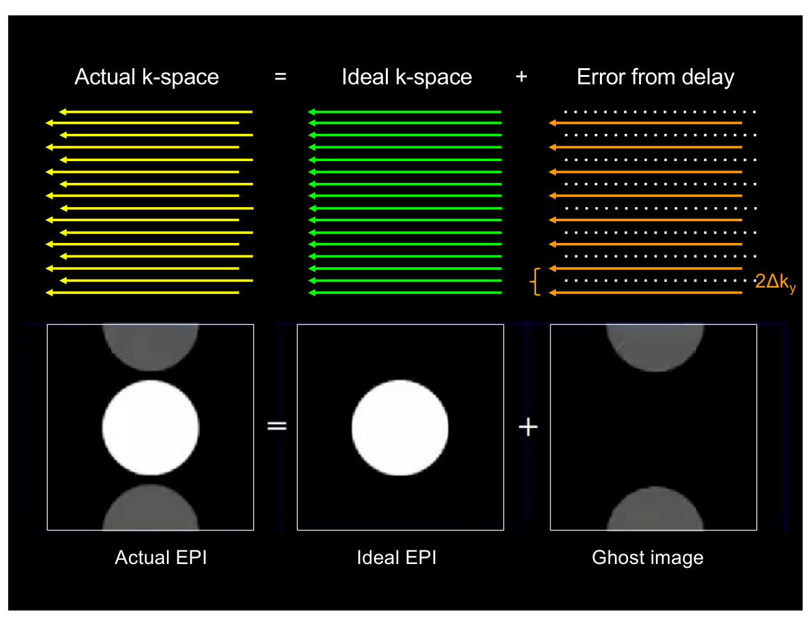

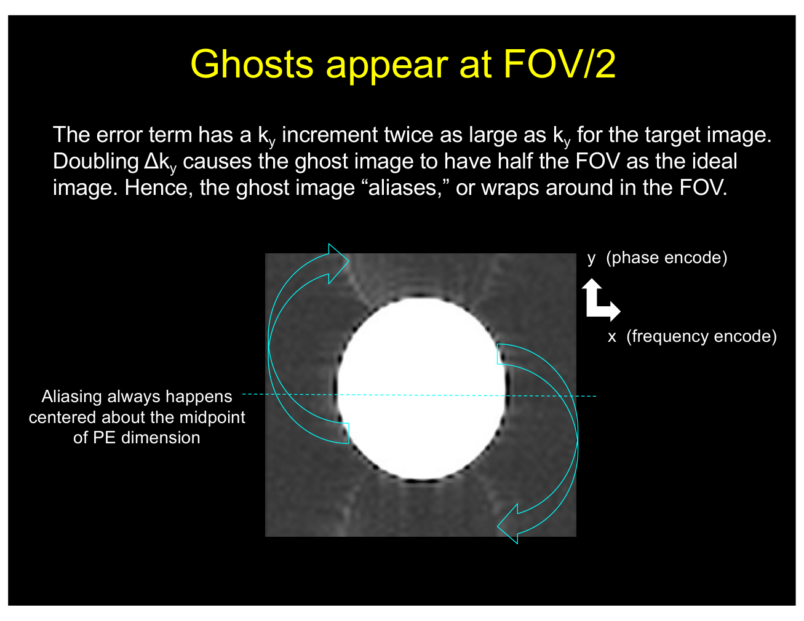

**Figure 4.1. EPI readout and Nyquist ghost formation.** Alternating readout polarity, timing delay, and the FOV/2 ghost. Source pages 87-88, 90-92 are grouped because they teach one local mechanism or diagnostic comparison. Key source labels and terms include: K-space for EPI:; A multiple gradient echo; sequence; The first four-and-a-half echoes of; a 16-echo "train," for the 16x16; k-space matrix above:; The three "classic" EPI artifacts:; Ghosting - The appearance of (hopefully) faint replica.

This figure should be read as a sequence inside Chapter 4, not as an isolated picture. It begins
with k-space for epi: and ends with ghosts appear at fov/2, so the reader can follow how the
local idea changes across the source panels. The retained source-backed panels are used here
because the original annotations are part of the evidence: the reader needs the labels, axes,
arrows, image examples, and comparison tags to see why the mechanism matters.

The practical lesson is alternating readout polarity, timing delay, and the fov/2 ghost. In a
scanner context, the important move is to translate what is drawn into an acquisition
consequence: which gradient is acting, which echo or reference data are being trusted, which
bandwidth or timing choice is limiting, or which image pattern would appear during quality
control.

For Figure 4.1, use the panels as a local reasoning test. If they show a temporal sequence, ask
what physical quantity is being conserved, reversed, accelerated, or lost. If they show images,
compare the same anatomical region across the named conditions before making a protocol
conclusion. That habit prevents a common fMRI error: treating the label epi readout and nyquist
ghost formation as a diagnosis before checking the visual evidence.

## Ghosting mechanisms

Ghosting mechanisms is the local bridge between the course vocabulary and a self-study
explanation. The relevant source ideas include Ghosting; Left: A delay in signal digitization
relative to the read gradient periods; causes rightward k-space lines to be offset relative to
the leftward k-; space lines.; Right: Alternate kx lines after time-reversal (before 2D FT). Now
we have; a clear zigzag in k-space. The magnitude of the zigzag determines the; Actual k-space =
Ideal k-space + Error from delay; Actual EPI Ideal EPI Ghost image; 2Deltaky; Ghosts appear at
FOV/2; The error term has a ky increment twice as large as ky for the target image.; Doubling
Deltaky causes the ghost image to have half the FOV as the ideal. Taken together, they should be
read as one argument about derive the FOV/2 ghost and show common sources. The textbook version
therefore slows the slide sequence down: first define the measured or manipulated quantity, then
state what changes it, and only then connect the change to image appearance or fMRI
interpretation.

In this part of epi fundamentals and classic artifacts, the central discipline is to separate
mechanism from display. A pulse sequence diagram, a k-space grid, or a brain image is not merely
a picture of a result; it encodes a chain of causes. For ghosting mechanisms, that chain starts
with the controlled scanner quantity, passes through spin phase or signal weighting, and ends as
a spatial pattern, time-series change, or acquisition tradeoff. If the chain is left implicit,
the same term can be memorized without being understood.

A useful way to study ghosting mechanisms is to ask three questions for every equation or panel.
What quantity is deliberately controlled in Chapter 4's local sequence or example? What
uncontrolled physical or biological quantity can perturb it? What image-space or time-series
signature would reveal the problem? These questions keep the mathematics connected to practical
fMRI, where protocol choices are judged by SNR, temporal stability, distortion, dropout, timing,
and interpretability rather than by elegance alone.

The source pages named Ghosting, Ghosting, Actual k-space = Ideal k-space + Error from delay,
Ghosts appear at FOV/2, Where are the ghosts?, and related panels also show why MRI explanations
often require several levels. At the microscopic level, spins precess, relax, dephase, or
refocus. At the sequence level, RF pulses and gradients impose timing and spatial encoding. At
the reconstruction level, Fourier relationships convert sampled signals into images. At the
experimental level, subject motion, physiology, hardware stability, and human factors determine
whether the image series supports a defensible fMRI interpretation.

For practice, the reader should be able to restate ghosting mechanisms without using slide
shorthand. The restatement should include the relevant variables, the direction of the effect,
and the likely failure mode. A good explanation is specific enough to predict what would happen
if the field strength, gradient area, echo spacing, flip angle, coil sensitivity, motion state,
or nuisance measurement changed.

## Figure 4.2. Ghost examples and fat-related ghost sources

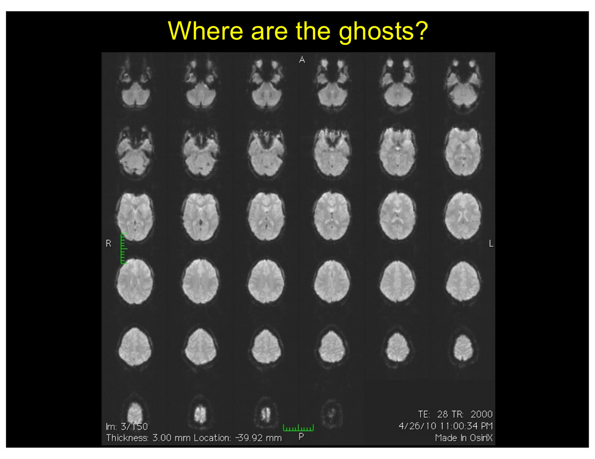

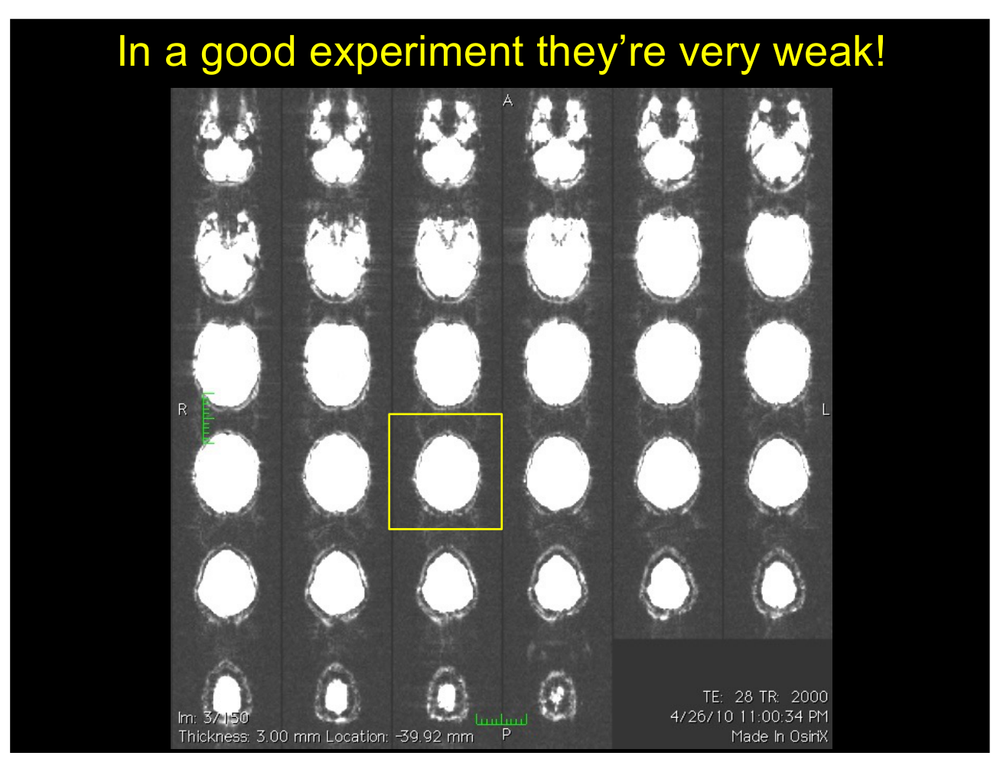

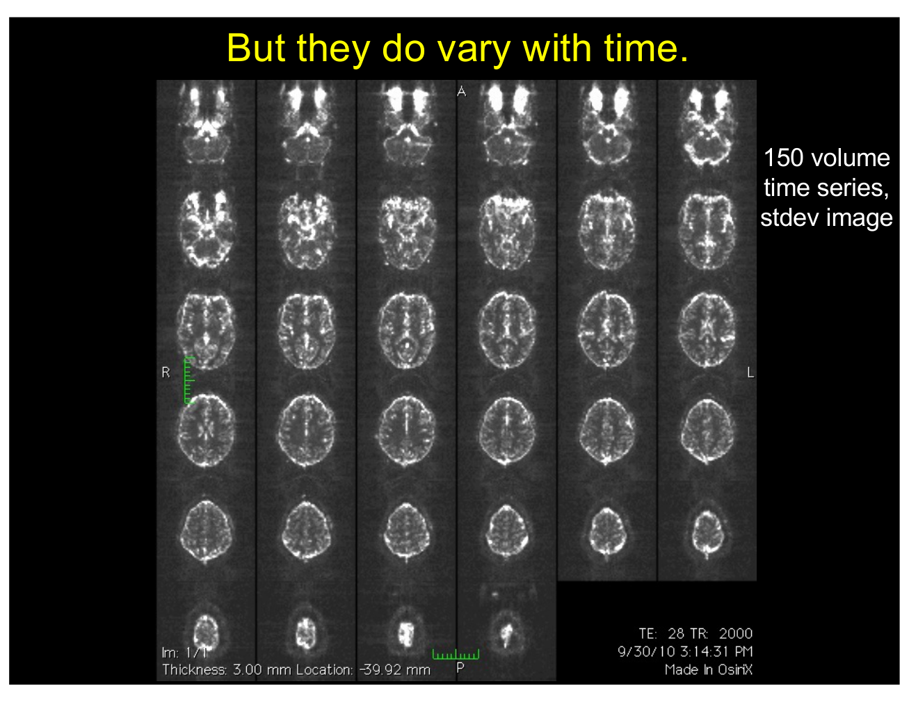

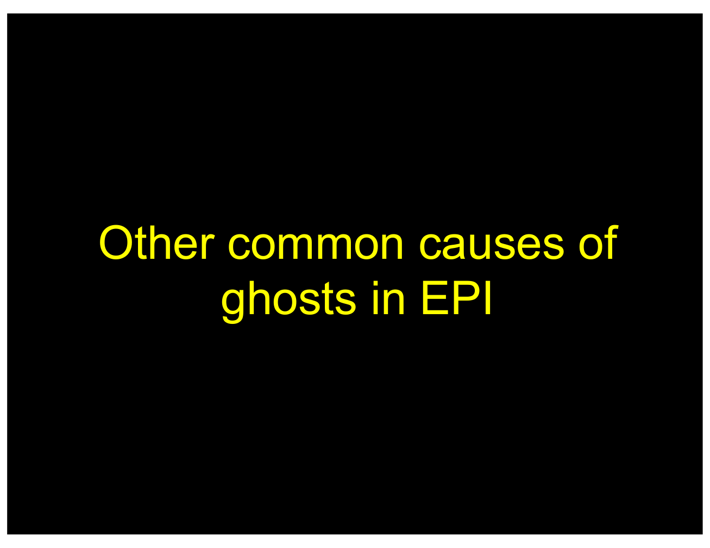

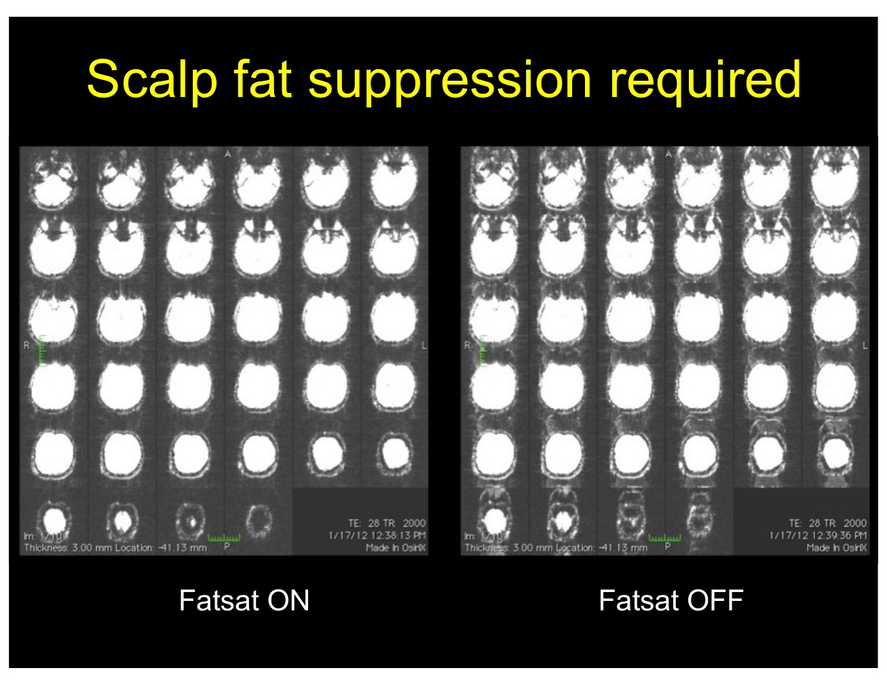

**Figure 4.2. Ghost examples and fat-related ghost sources.** Where ghosts appear, why they are weak in good data, and why fat suppression matters. Source pages 93-97 are grouped because they teach one local mechanism or diagnostic comparison. Key source labels and terms include: Where are the ghosts?; In a good experiment they're very weak!; But they do vary with time.; 150 volume; time series,; stdev image; Other common causes of; ghosts in EPI.

This figure should be read as a sequence inside Chapter 4, not as an isolated picture. It begins
with where are the ghosts? and ends with scalp fat suppression required, so the reader can
follow how the local idea changes across the source panels. The retained source-backed panels
are used here because the original annotations are part of the evidence: the reader needs the
labels, axes, arrows, image examples, and comparison tags to see why the mechanism matters.

The practical lesson is where ghosts appear, why they are weak in good data, and why fat
suppression matters. In a scanner context, the important move is to translate what is drawn into
an acquisition consequence: which gradient is acting, which echo or reference data are being
trusted, which bandwidth or timing choice is limiting, or which image pattern would appear
during quality control.

For Figure 4.2, use the panels as a local reasoning test. If they show a temporal sequence, ask
what physical quantity is being conserved, reversed, accelerated, or lost. If they show images,
compare the same anatomical region across the named conditions before making a protocol
conclusion. That habit prevents a common fMRI error: treating the label ghost examples and fat-
related ghost sources as a diagnosis before checking the visual evidence.

## Chemical shift and ramp sampling

Chemical shift and ramp sampling is the local bridge between the course vocabulary and a self-
study explanation. The relevant source ideas include Origin of the chemical shift; (Shielding is
defined relative to tetramethysilane (TMS), a symmetric molecule.); Electrons in motion around
a; molecule generate a magnetic field; that opposes B0. This shielding; varies by position
around the; Chemical shifts; Lipids; 1 ppm = 123 Hz @ 2.9 T; Ramp sampling; Gread; Dkread. Taken
together, they should be read as one argument about connect resonance offsets and read-gradient
timing to ghost risk. The textbook version therefore slows the slide sequence down: first define
the measured or manipulated quantity, then state what changes it, and only then connect the
change to image appearance or fMRI interpretation.

In this part of epi fundamentals and classic artifacts, the central discipline is to separate
mechanism from display. A pulse sequence diagram, a k-space grid, or a brain image is not merely
a picture of a result; it encodes a chain of causes. For chemical shift and ramp sampling, that
chain starts with the controlled scanner quantity, passes through spin phase or signal
weighting, and ends as a spatial pattern, time-series change, or acquisition tradeoff. If the
chain is left implicit, the same term can be memorized without being understood.

A useful way to study chemical shift and ramp sampling is to ask three questions for every
equation or panel. What quantity is deliberately controlled in Chapter 4's local sequence or
example? What uncontrolled physical or biological quantity can perturb it? What image-space or
time-series signature would reveal the problem? These questions keep the mathematics connected
to practical fMRI, where protocol choices are judged by SNR, temporal stability, distortion,
dropout, timing, and interpretability rather than by elegance alone.

The source pages named Origin of the chemical shift, Chemical shifts, Ramp sampling, Ramp
sampling: going too fast also show why MRI explanations often require several levels. At the
microscopic level, spins precess, relax, dephase, or refocus. At the sequence level, RF pulses
and gradients impose timing and spatial encoding. At the reconstruction level, Fourier
relationships convert sampled signals into images. At the experimental level, subject motion,
physiology, hardware stability, and human factors determine whether the image series supports a
defensible fMRI interpretation.

For practice, the reader should be able to restate chemical shift and ramp sampling without
using slide shorthand. The restatement should include the relevant variables, the direction of
the effect, and the likely failure mode. A good explanation is specific enough to predict what
would happen if the field strength, gradient area, echo spacing, flip angle, coil sensitivity,
motion state, or nuisance measurement changed.

## Figure 4.3. Chemical shift and ramp-sampling timing

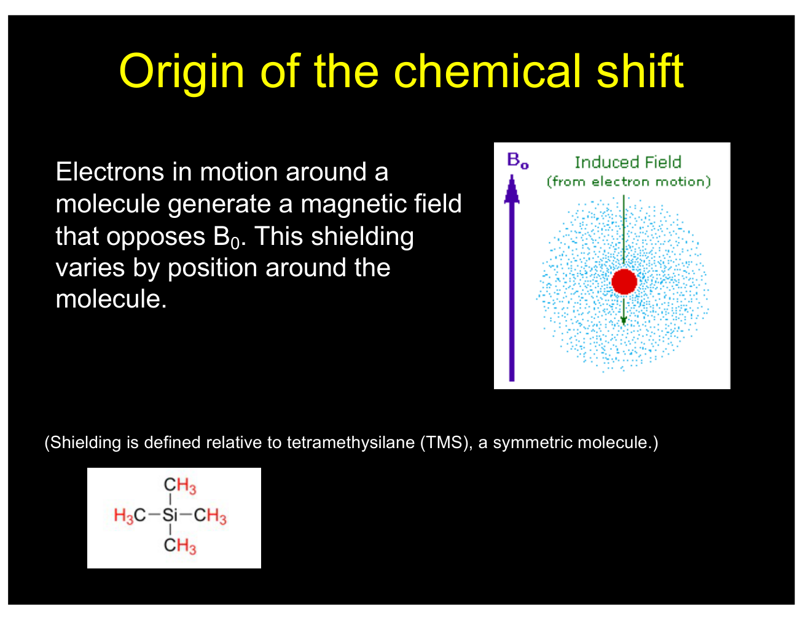

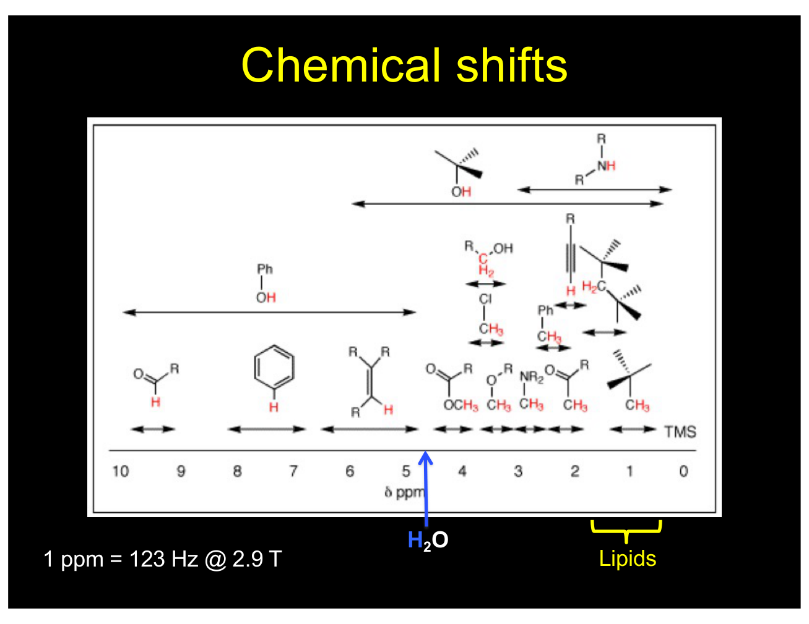

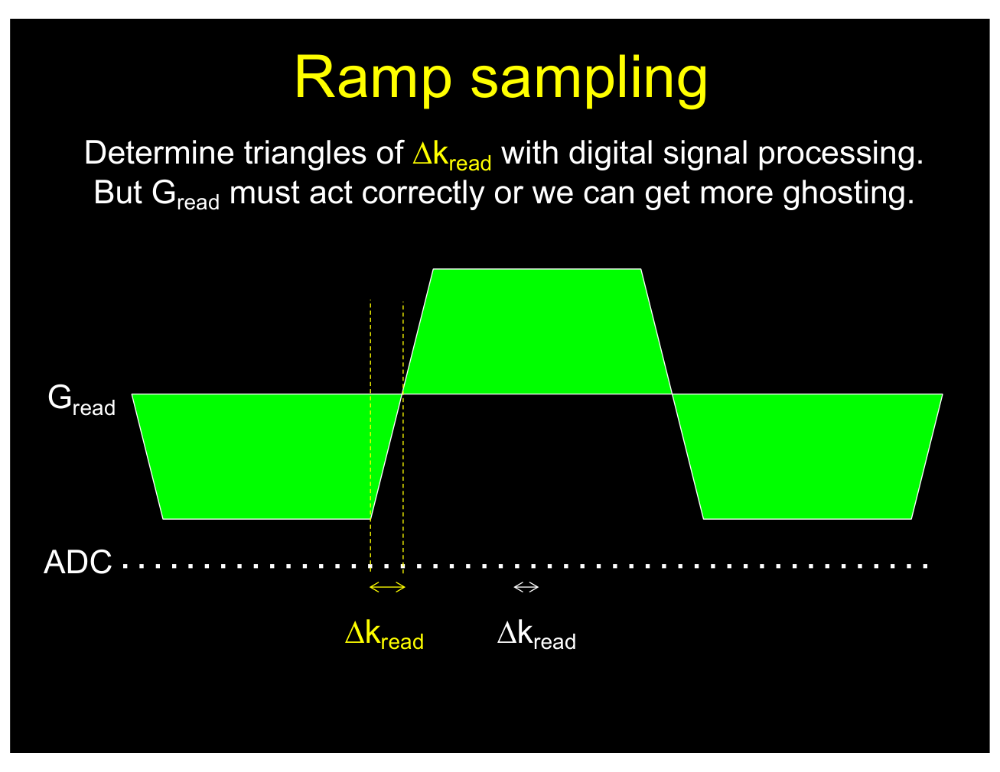

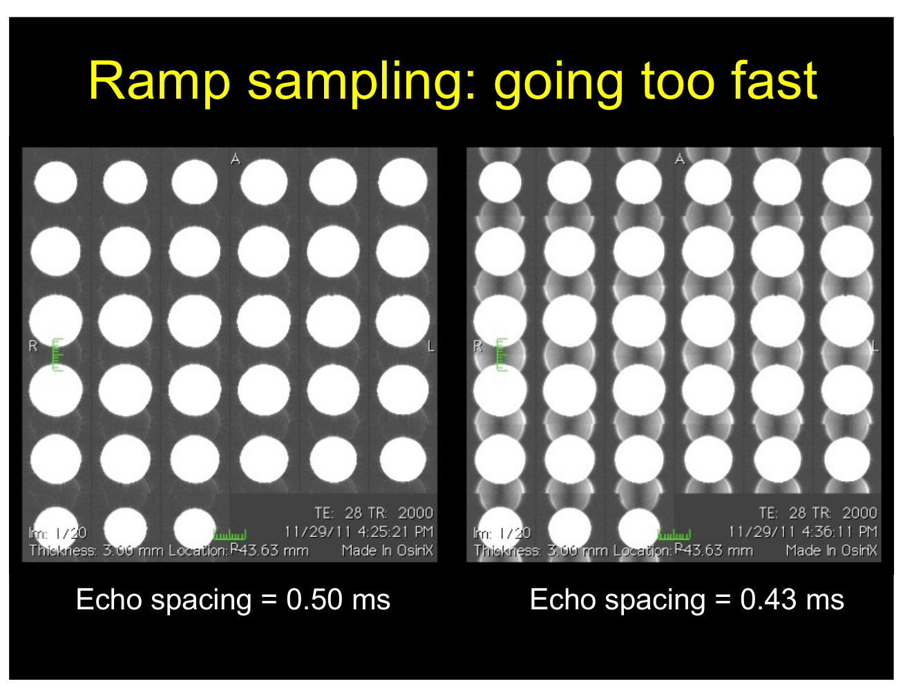

**Figure 4.3. Chemical shift and ramp-sampling timing.** Shielding, water-lipid frequency offsets, ADC timing, and echo-spacing pressure. Source pages 98-101 are grouped because they teach one local mechanism or diagnostic comparison. Key source labels and terms include: Origin of the chemical shift; (Shielding is defined relative to tetramethysilane (TMS), a symmetric molecule.); Electrons in motion around a; molecule generate a magnetic field; that opposes B0. This shielding; varies by position around the; Chemical shifts; Lipids.

This figure should be read as a sequence inside Chapter 4, not as an isolated picture. It begins
with origin of the chemical shift and ends with ramp sampling: going too fast, so the reader can
follow how the local idea changes across the source panels. The retained source-backed panels
are used here because the original annotations are part of the evidence: the reader needs the
labels, axes, arrows, image examples, and comparison tags to see why the mechanism matters.

The practical lesson is shielding, water-lipid frequency offsets, adc timing, and echo-spacing
pressure. In a scanner context, the important move is to translate what is drawn into an
acquisition consequence: which gradient is acting, which echo or reference data are being
trusted, which bandwidth or timing choice is limiting, or which image pattern would appear
during quality control.

For Figure 4.3, use the panels as a local reasoning test. If they show a temporal sequence, ask
what physical quantity is being conserved, reversed, accelerated, or lost. If they show images,
compare the same anatomical region across the named conditions before making a protocol
conclusion. That habit prevents a common fMRI error: treating the label chemical shift and ramp-
sampling timing as a diagnosis before checking the visual evidence.

## Distortion and bandwidth

Distortion and bandwidth is the local bridge between the course vocabulary and a self-study
explanation. The relevant source ideas include Distortion; Arises in the phase-encoded
dimension, and is a result of; the relatively slow sampling in that dimension.; Dt = 8 micros;
Dtesp = 0.5 ms; Bandwith in EPI; Frequency encoding axis:; BW = (1/Dt)/Npixels; Typically
2000-2600 Hz/pixel; BW ~ 15 Hz/pixel; BW ~ 30 Hz/pixel; BW ~ 2000 Hz/pixel. Taken together, they
should be read as one argument about explain phase-encoding displacement and direction
reversals. The textbook version therefore slows the slide sequence down: first define the
measured or manipulated quantity, then state what changes it, and only then connect the change
to image appearance or fMRI interpretation.

In this part of epi fundamentals and classic artifacts, the central discipline is to separate
mechanism from display. A pulse sequence diagram, a k-space grid, or a brain image is not merely
a picture of a result; it encodes a chain of causes. For distortion and bandwidth, that chain
starts with the controlled scanner quantity, passes through spin phase or signal weighting, and
ends as a spatial pattern, time-series change, or acquisition tradeoff. If the chain is left
implicit, the same term can be memorized without being understood.

A useful way to study distortion and bandwidth is to ask three questions for every equation or
panel. What quantity is deliberately controlled in Chapter 4's local sequence or example? What
uncontrolled physical or biological quantity can perturb it? What image-space or time-series
signature would reveal the problem? These questions keep the mathematics connected to practical
fMRI, where protocol choices are judged by SNR, temporal stability, distortion, dropout, timing,
and interpretability rather than by elegance alone.

The source pages named Distortion, Distortion, Bandwith in EPI, Distortion, A-P versus P-A phase
encoding also show why MRI explanations often require several levels. At the microscopic level,
spins precess, relax, dephase, or refocus. At the sequence level, RF pulses and gradients impose
timing and spatial encoding. At the reconstruction level, Fourier relationships convert sampled
signals into images. At the experimental level, subject motion, physiology, hardware stability,
and human factors determine whether the image series supports a defensible fMRI interpretation.

For practice, the reader should be able to restate distortion and bandwidth without using slide
shorthand. The restatement should include the relevant variables, the direction of the effect,
and the likely failure mode. A good explanation is specific enough to predict what would happen
if the field strength, gradient area, echo spacing, flip angle, coil sensitivity, motion state,
or nuisance measurement changed.

## Figure 4.4. EPI distortion and phase-encoding bandwidth

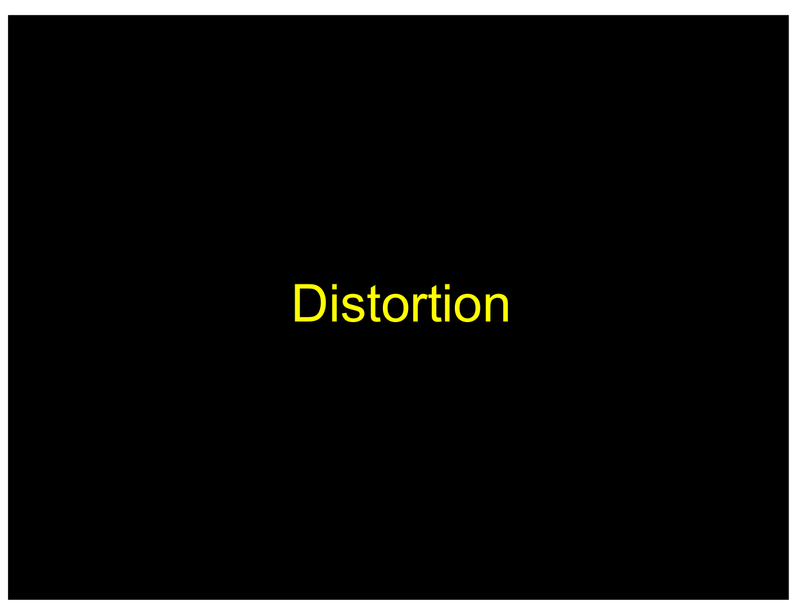

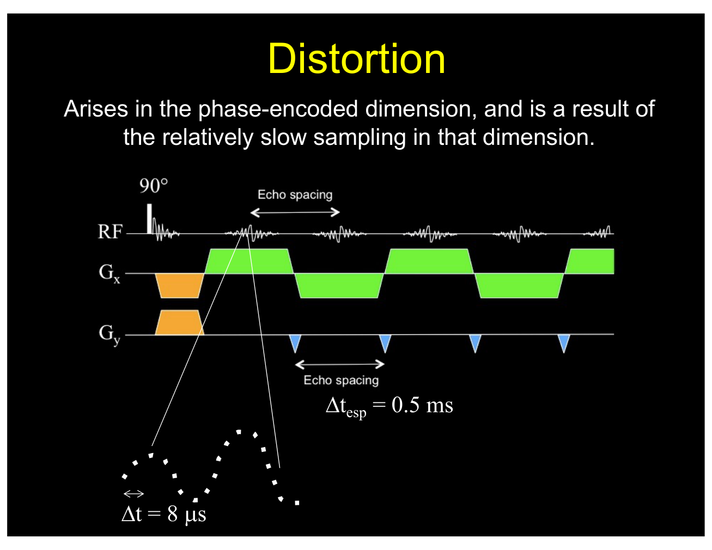

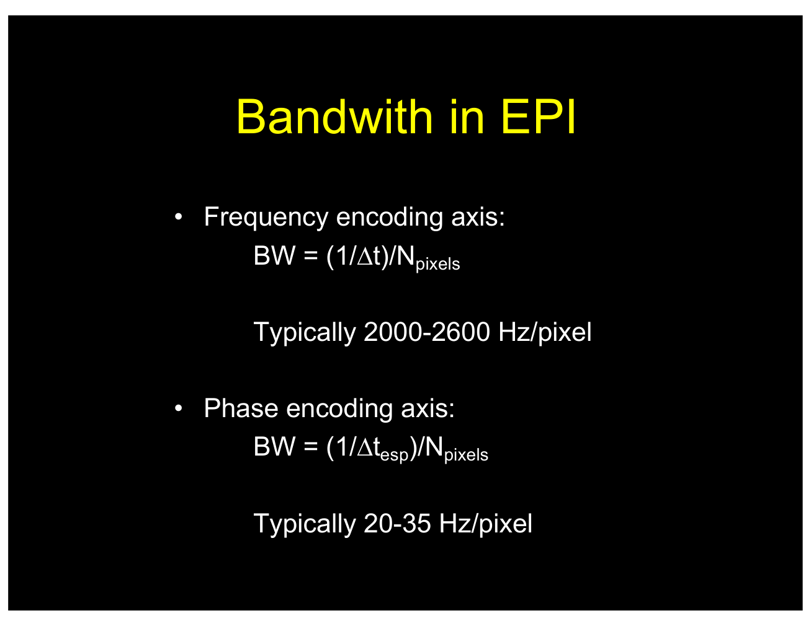

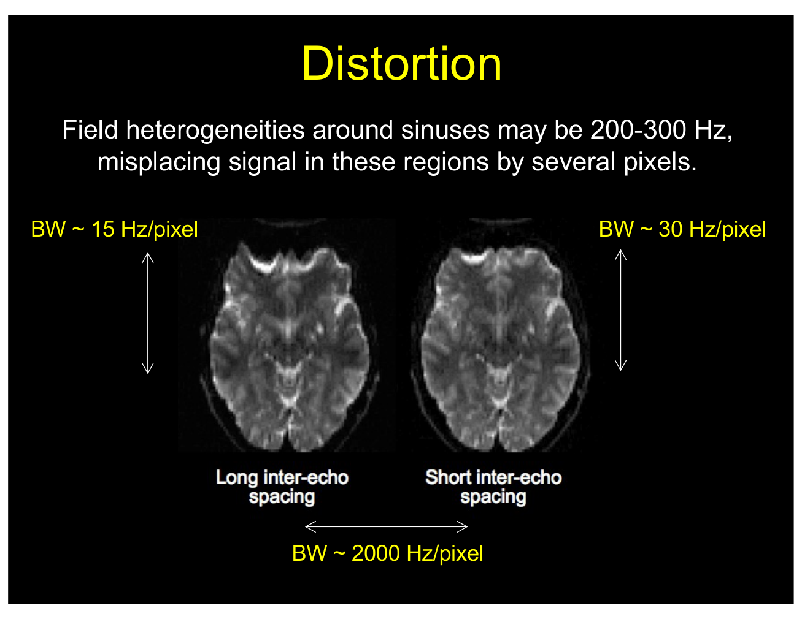

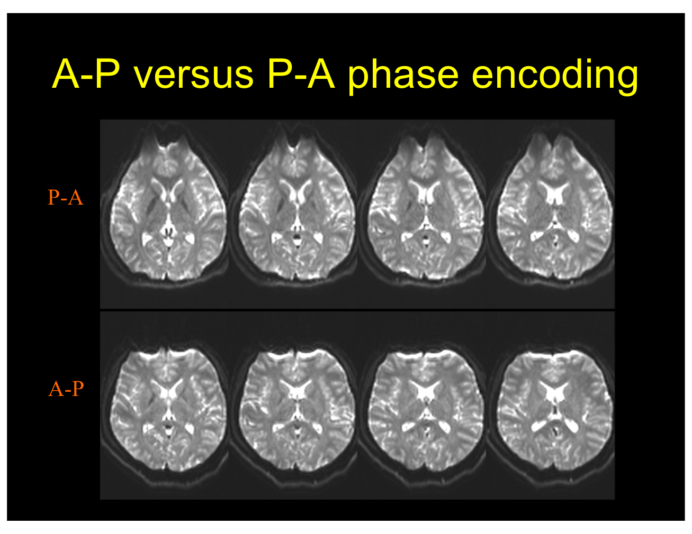

**Figure 4.4. EPI distortion and phase-encoding bandwidth.** Slow phase-encoding sampling, bandwidth, and the AP/PA diagnostic reversal. Source pages 102-106 are grouped because they teach one local mechanism or diagnostic comparison. Key source labels and terms include: Distortion; Arises in the phase-encoded dimension, and is a result of; the relatively slow sampling in that dimension.; Dt = 8 micros; Dtesp = 0.5 ms; Bandwith in EPI; Frequency encoding axis:; BW = (1/Dt)/Npixels.

This figure should be read as a sequence inside Chapter 4, not as an isolated picture. It begins
with distortion and ends with a-p versus p-a phase encoding, so the reader can follow how the
local idea changes across the source panels. The retained source-backed panels are used here
because the original annotations are part of the evidence: the reader needs the labels, axes,
arrows, image examples, and comparison tags to see why the mechanism matters.

The practical lesson is slow phase-encoding sampling, bandwidth, and the ap/pa diagnostic
reversal. In a scanner context, the important move is to translate what is drawn into an
acquisition consequence: which gradient is acting, which echo or reference data are being
trusted, which bandwidth or timing choice is limiting, or which image pattern would appear
during quality control.

For Figure 4.4, use the panels as a local reasoning test. If they show a temporal sequence, ask
what physical quantity is being conserved, reversed, accelerated, or lost. If they show images,
compare the same anatomical region across the named conditions before making a protocol
conclusion. That habit prevents a common fMRI error: treating the label epi distortion and
phase-encoding bandwidth as a diagnosis before checking the visual evidence.

## Dropout and slice timing

Dropout and slice timing is the local bridge between the course vocabulary and a self-study
explanation. The relevant source ideas include Dropout; Signal dropout; Not strictly an EPI
issue,* there would be dropout for any; gradient echo sequence at the same TE.; * But signal
decay in-plane during EPI readout makes it worse.; Thinner slices produce less dropout; Two thin
slices > one thick slice; Multi-slice EPI: slice order; Ascending; Descending; Interleaved;
DESC. Taken together, they should be read as one argument about separate susceptibility dropout
from slice-order artifacts. The textbook version therefore slows the slide sequence down: first
define the measured or manipulated quantity, then state what changes it, and only then connect
the change to image appearance or fMRI interpretation.

In this part of epi fundamentals and classic artifacts, the central discipline is to separate
mechanism from display. A pulse sequence diagram, a k-space grid, or a brain image is not merely
a picture of a result; it encodes a chain of causes. For dropout and slice timing, that chain
starts with the controlled scanner quantity, passes through spin phase or signal weighting, and
ends as a spatial pattern, time-series change, or acquisition tradeoff. If the chain is left
implicit, the same term can be memorized without being understood.

A useful way to study dropout and slice timing is to ask three questions for every equation or
panel. What quantity is deliberately controlled in Chapter 4's local sequence or example? What
uncontrolled physical or biological quantity can perturb it? What image-space or time-series
signature would reveal the problem? These questions keep the mathematics connected to practical
fMRI, where protocol choices are judged by SNR, temporal stability, distortion, dropout, timing,
and interpretability rather than by elegance alone.

The source pages named Dropout, Signal dropout, Thinner slices produce less dropout, Two thin
slices > one thick slice, Multi-slice EPI: slice order, and related panels also show why MRI
explanations often require several levels. At the microscopic level, spins precess, relax,
dephase, or refocus. At the sequence level, RF pulses and gradients impose timing and spatial
encoding. At the reconstruction level, Fourier relationships convert sampled signals into
images. At the experimental level, subject motion, physiology, hardware stability, and human
factors determine whether the image series supports a defensible fMRI interpretation.

For practice, the reader should be able to restate dropout and slice timing without using slide
shorthand. The restatement should include the relevant variables, the direction of the effect,
and the likely failure mode. A good explanation is specific enough to predict what would happen
if the field strength, gradient area, echo spacing, flip angle, coil sensitivity, motion state,
or nuisance measurement changed.

## Figure 4.5. Dropout, slice thickness, and slice order

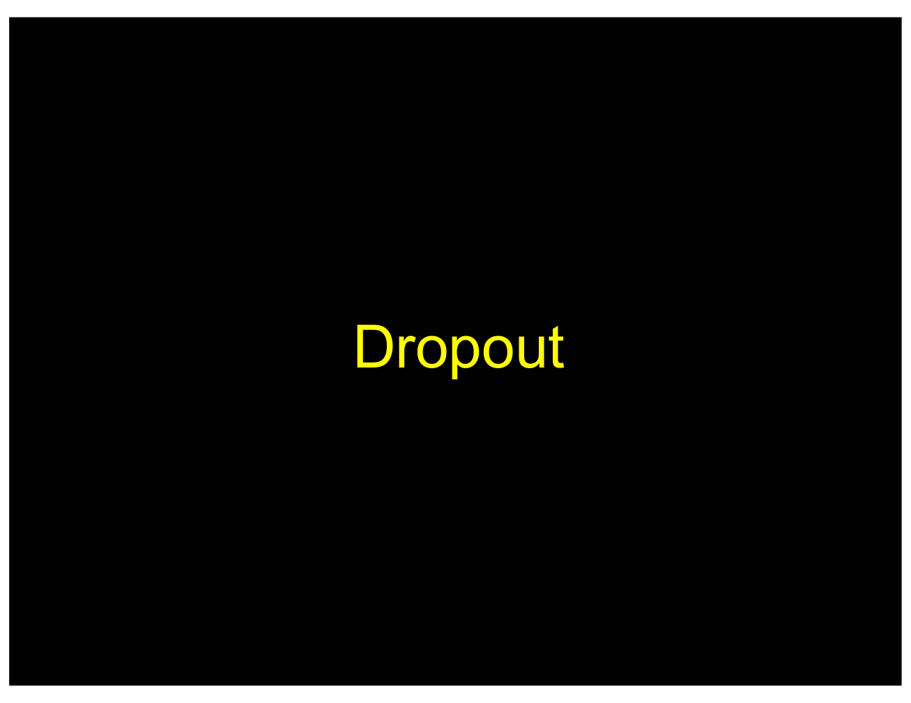

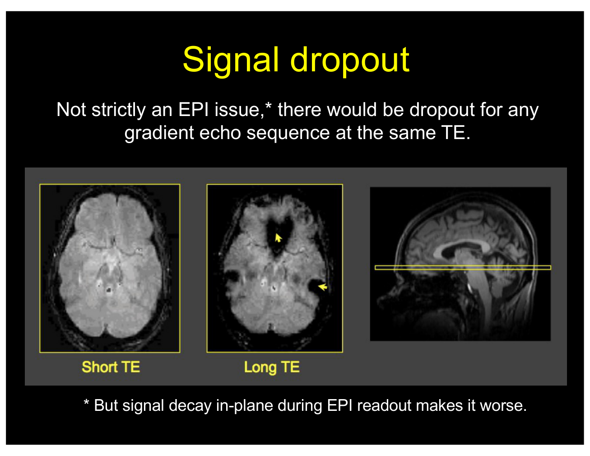

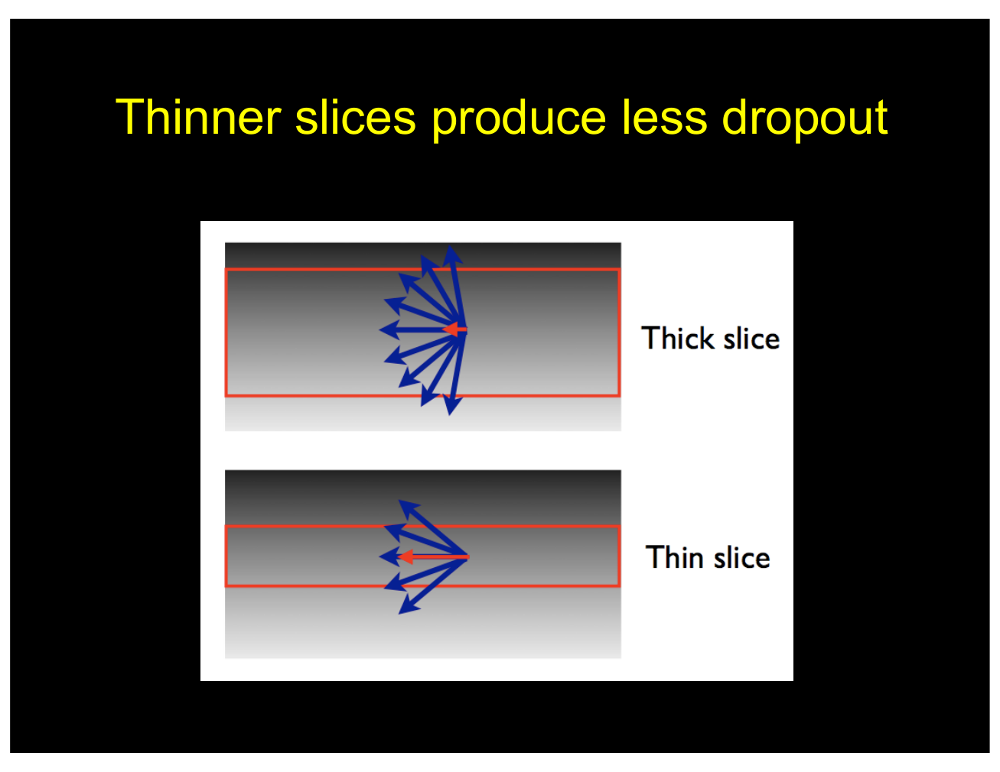

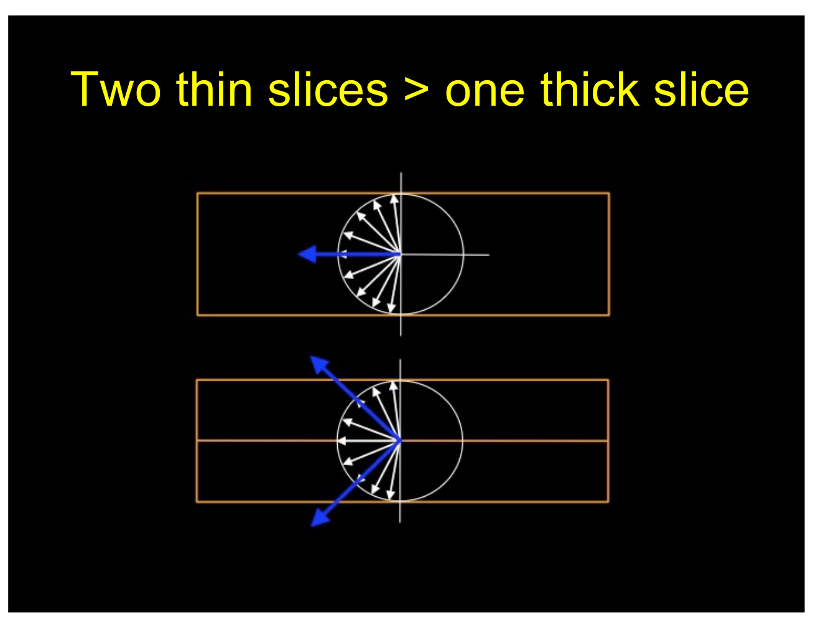

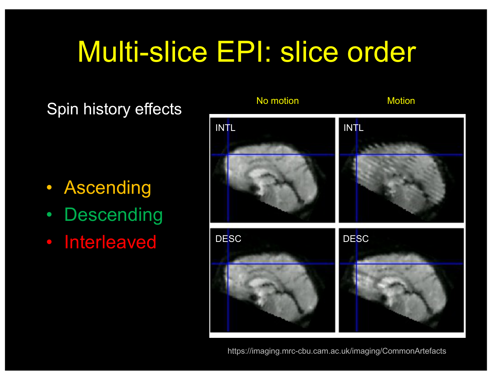

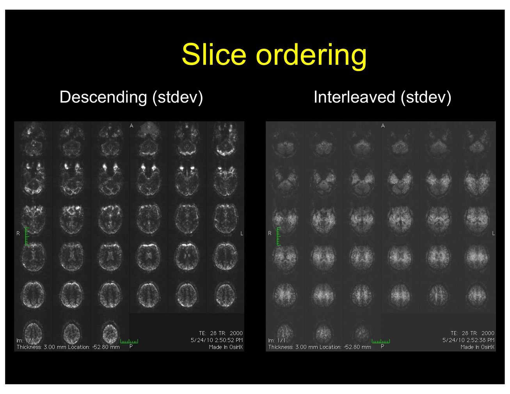

**Figure 4.5. Dropout, slice thickness, and slice order.** Susceptibility-related signal loss and practical effects of slice acquisition order. Source pages 107-112 are grouped because they teach one local mechanism or diagnostic comparison. Key source labels and terms include: Dropout; Signal dropout; Not strictly an EPI issue,* there would be dropout for any; gradient echo sequence at the same TE.; * But signal decay in-plane during EPI readout makes it worse.; Thinner slices produce less dropout; Two thin slices > one thick slice; Multi-slice EPI: slice order.

This figure should be read as a sequence inside Chapter 4, not as an isolated picture. It begins
with dropout and ends with descending (stdev) interleaved (stdev), so the reader can follow how
the local idea changes across the source panels. The retained source-backed panels are used here
because the original annotations are part of the evidence: the reader needs the labels, axes,
arrows, image examples, and comparison tags to see why the mechanism matters.

The practical lesson is susceptibility-related signal loss and practical effects of slice
acquisition order. In a scanner context, the important move is to translate what is drawn into
an acquisition consequence: which gradient is acting, which echo or reference data are being
trusted, which bandwidth or timing choice is limiting, or which image pattern would appear
during quality control.

For Figure 4.5, use the panels as a local reasoning test. If they show a temporal sequence, ask
what physical quantity is being conserved, reversed, accelerated, or lost. If they show images,
compare the same anatomical region across the named conditions before making a protocol
conclusion. That habit prevents a common fMRI error: treating the label dropout, slice
thickness, and slice order as a diagnosis before checking the visual evidence.

## Real EPI sequence anatomy

Real EPI sequence anatomy is the local bridge between the course vocabulary and a self-study
explanation. The relevant source ideas include A real EPI pulse sequence; EPI: crusher
gradients; Fat signal crusher gradients; Spurious water crusher gradients; EPI: slice select,
k-space; N/2 ghost correction echoes; Gradient echo train; (to sample 2D k-space); Slice
selection; Good EPI; Good axial EPI; g-fmri-artifacts-good-axial.html. Taken together, they
should be read as one argument about read a practical sequence diagram and quality images. The
textbook version therefore slows the slide sequence down: first define the measured or
manipulated quantity, then state what changes it, and only then connect the change to image
appearance or fMRI interpretation.

In this part of epi fundamentals and classic artifacts, the central discipline is to separate
mechanism from display. A pulse sequence diagram, a k-space grid, or a brain image is not merely
a picture of a result; it encodes a chain of causes. For real epi sequence anatomy, that chain
starts with the controlled scanner quantity, passes through spin phase or signal weighting, and
ends as a spatial pattern, time-series change, or acquisition tradeoff. If the chain is left
implicit, the same term can be memorized without being understood.

A useful way to study real epi sequence anatomy is to ask three questions for every equation or
panel. What quantity is deliberately controlled in Chapter 4's local sequence or example? What
uncontrolled physical or biological quantity can perturb it? What image-space or time-series
signature would reveal the problem? These questions keep the mathematics connected to practical
fMRI, where protocol choices are judged by SNR, temporal stability, distortion, dropout, timing,
and interpretability rather than by elegance alone.

The source pages named https://practicalfmri.blogspot.com/2012/07/physics-for-understanding-
fmri.html, EPI: crusher gradients, EPI: slice select, k-space, Good EPI, TSNR image also show
why MRI explanations often require several levels. At the microscopic level, spins precess,
relax, dephase, or refocus. At the sequence level, RF pulses and gradients impose timing and
spatial encoding. At the reconstruction level, Fourier relationships convert sampled signals
into images. At the experimental level, subject motion, physiology, hardware stability, and
human factors determine whether the image series supports a defensible fMRI interpretation.

For practice, the reader should be able to restate real epi sequence anatomy without using slide
shorthand. The restatement should include the relevant variables, the direction of the effect,
and the likely failure mode. A good explanation is specific enough to predict what would happen
if the field strength, gradient area, echo spacing, flip angle, coil sensitivity, motion state,
or nuisance measurement changed.

## Figure 4.6. Real EPI sequence anatomy and quality images

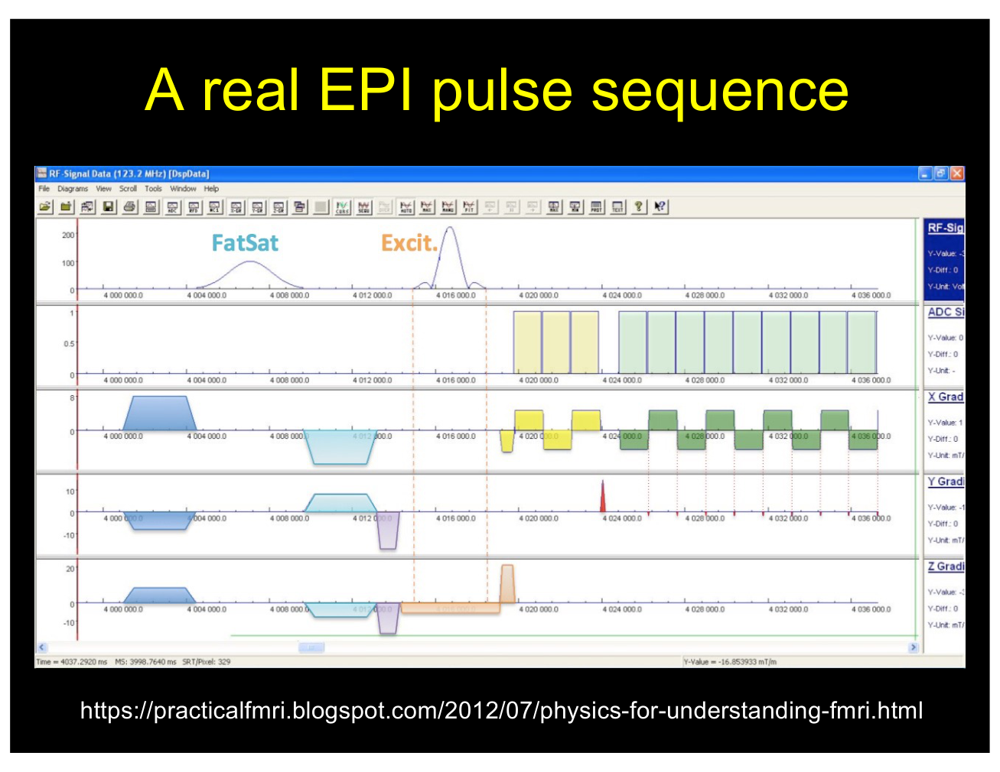

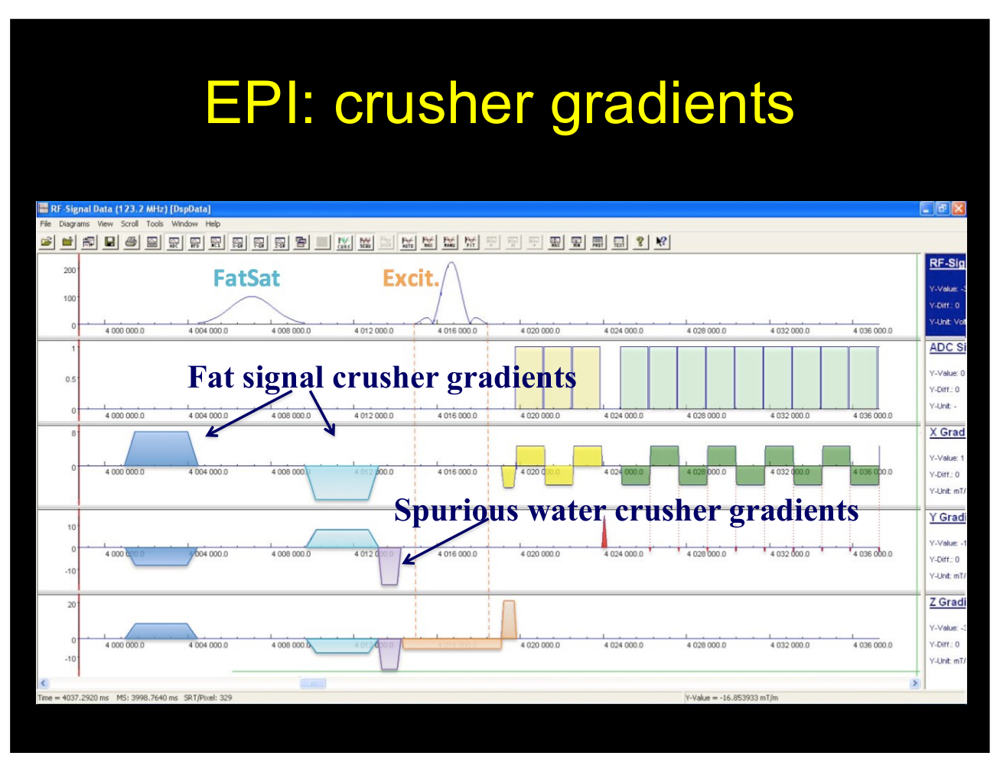

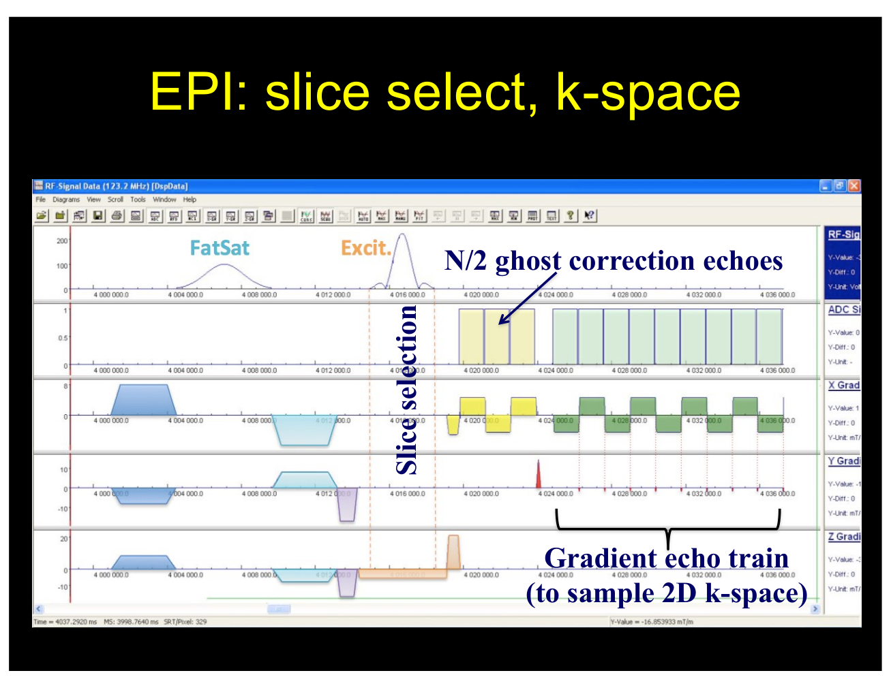

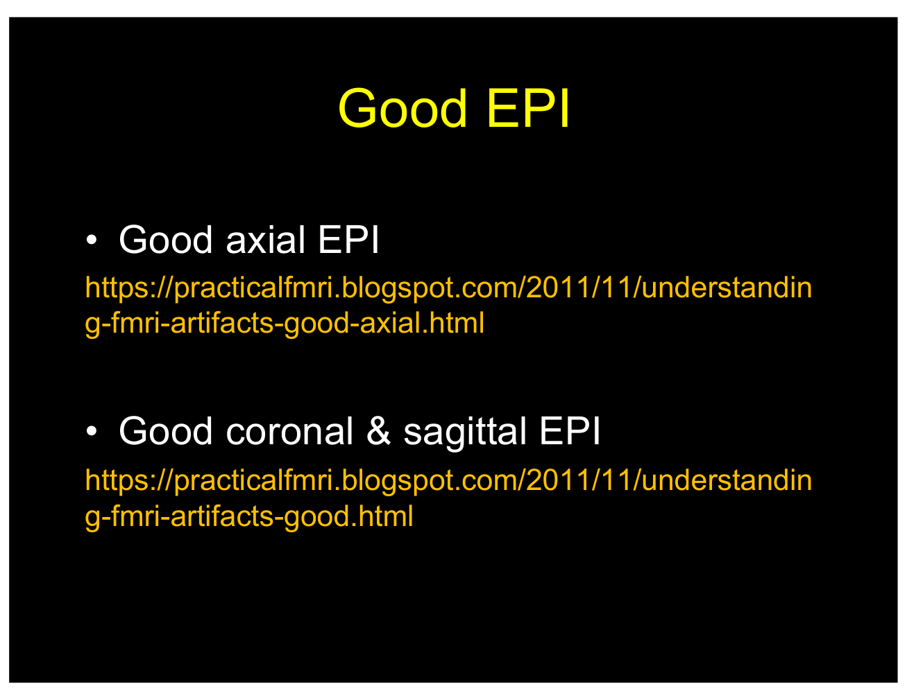

**Figure 4.6. Real EPI sequence anatomy and quality images.** Crusher gradients, slice selection, echo trains, TSNR, and standard deviation images. Source pages 114-118 are grouped because they teach one local mechanism or diagnostic comparison. Key source labels and terms include: A real EPI pulse sequence; EPI: crusher gradients; Fat signal crusher gradients; Spurious water crusher gradients; EPI: slice select, k-space; N/2 ghost correction echoes; Gradient echo train; (to sample 2D k-space).

This figure should be read as a sequence inside Chapter 4, not as an isolated picture. It begins
with https://practicalfmri.blogspot.com/2012/07/physics-for-understanding-fmri.html and ends
with tsnr image, so the reader can follow how the local idea changes across the source panels.
The retained source-backed panels are used here because the original annotations are part of the
evidence: the reader needs the labels, axes, arrows, image examples, and comparison tags to see
why the mechanism matters.

The practical lesson is crusher gradients, slice selection, echo trains, tsnr, and standard
deviation images. In a scanner context, the important move is to translate what is drawn into an
acquisition consequence: which gradient is acting, which echo or reference data are being
trusted, which bandwidth or timing choice is limiting, or which image pattern would appear
during quality control.

For Figure 4.6, use the panels as a local reasoning test. If they show a temporal sequence, ask
what physical quantity is being conserved, reversed, accelerated, or lost. If they show images,
compare the same anatomical region across the named conditions before making a protocol
conclusion. That habit prevents a common fMRI error: treating the label real epi sequence
anatomy and quality images as a diagnosis before checking the visual evidence.

## Motion, susceptibility, and phase

Motion, susceptibility, and phase is the local bridge between the course vocabulary and a self-
study explanation. The relevant source ideas include The brain is always moving!; Magnetic
susceptibility; Magnetic susceptibility, c; The tendency of a material to magnetize when
exposed; to a magnetic field; Interaction of electrons with the magnetic field; Variations in c
cause intrinsic, static magnetic field; gradients in parts of the brain; Interfaces, especially
air-bone-brain, create strong; magnetic field gradients across parts of the brain; A map of MR
image phase shows the problem; T2* relaxation. Taken together, they should be read as one
argument about connect moving anatomy and air-tissue interfaces to EPI behavior. The textbook
version therefore slows the slide sequence down: first define the measured or manipulated
quantity, then state what changes it, and only then connect the change to image appearance or
fMRI interpretation.

In this part of epi fundamentals and classic artifacts, the central discipline is to separate
mechanism from display. A pulse sequence diagram, a k-space grid, or a brain image is not merely
a picture of a result; it encodes a chain of causes. For motion, susceptibility, and phase, that
chain starts with the controlled scanner quantity, passes through spin phase or signal
weighting, and ends as a spatial pattern, time-series change, or acquisition tradeoff. If the
chain is left implicit, the same term can be memorized without being understood.

A useful way to study motion, susceptibility, and phase is to ask three questions for every
equation or panel. What quantity is deliberately controlled in Chapter 4's local sequence or
example? What uncontrolled physical or biological quantity can perturb it? What image-space or
time-series signature would reveal the problem? These questions keep the mathematics connected
to practical fMRI, where protocol choices are judged by SNR, temporal stability, distortion,
dropout, timing, and interpretability rather than by elegance alone.

The source pages named The brain is always moving!, Magnetic susceptibility, Magnetic
susceptibility, c, Interfaces, especially air-bone-brain, create strong, A map of MR image phase
shows the problem, and related panels also show why MRI explanations often require several
levels. At the microscopic level, spins precess, relax, dephase, or refocus. At the sequence
level, RF pulses and gradients impose timing and spatial encoding. At the reconstruction level,
Fourier relationships convert sampled signals into images. At the experimental level, subject
motion, physiology, hardware stability, and human factors determine whether the image series
supports a defensible fMRI interpretation.

For practice, the reader should be able to restate motion, susceptibility, and phase without
using slide shorthand. The restatement should include the relevant variables, the direction of
the effect, and the likely failure mode. A good explanation is specific enough to predict what
would happen if the field strength, gradient area, echo spacing, flip angle, coil sensitivity,
motion state, or nuisance measurement changed.

## Figure 4.7. Movement, susceptibility, and phase in EPI

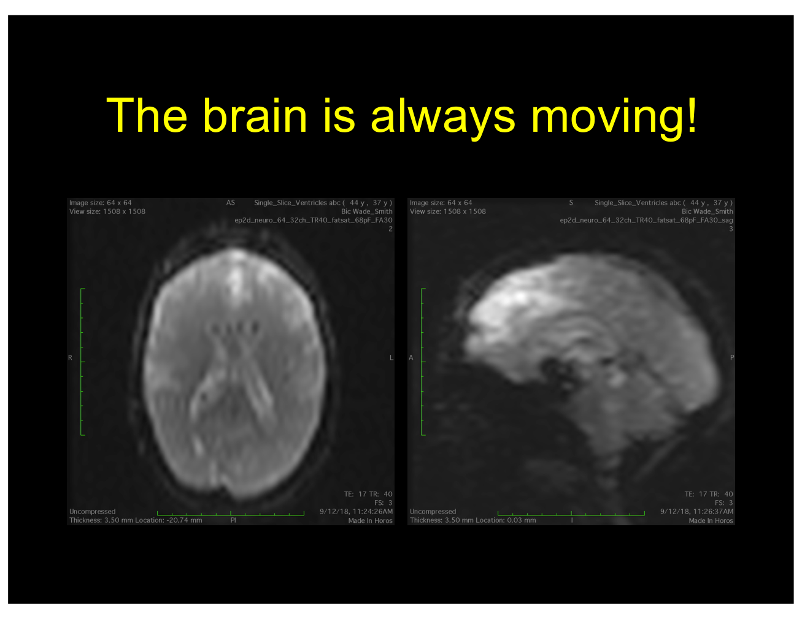

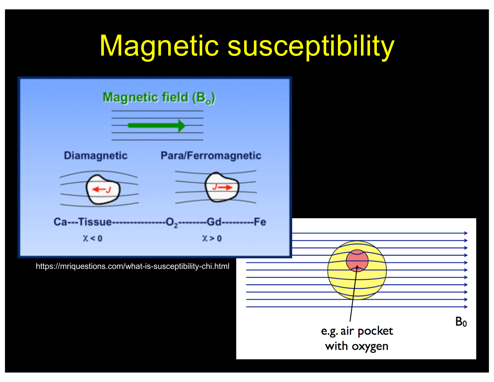

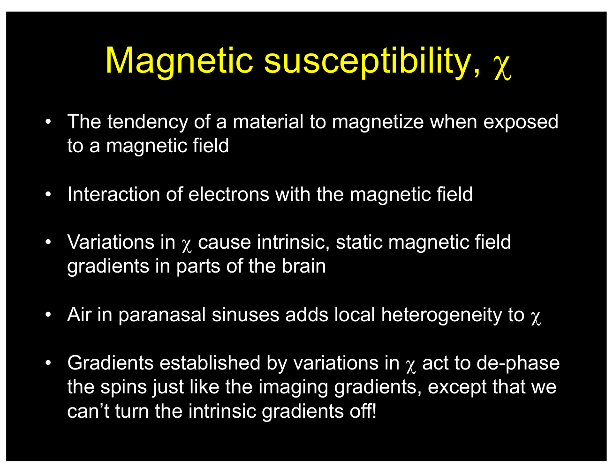

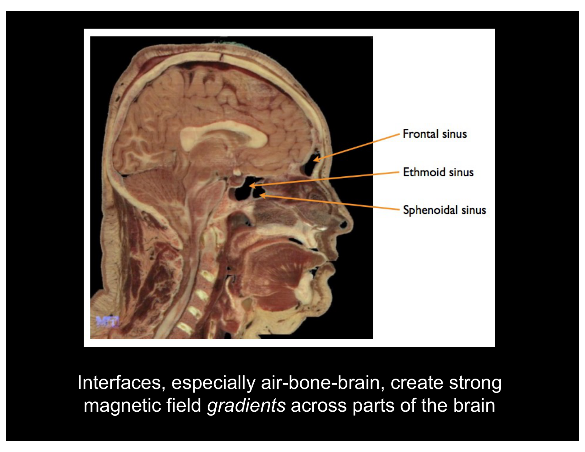

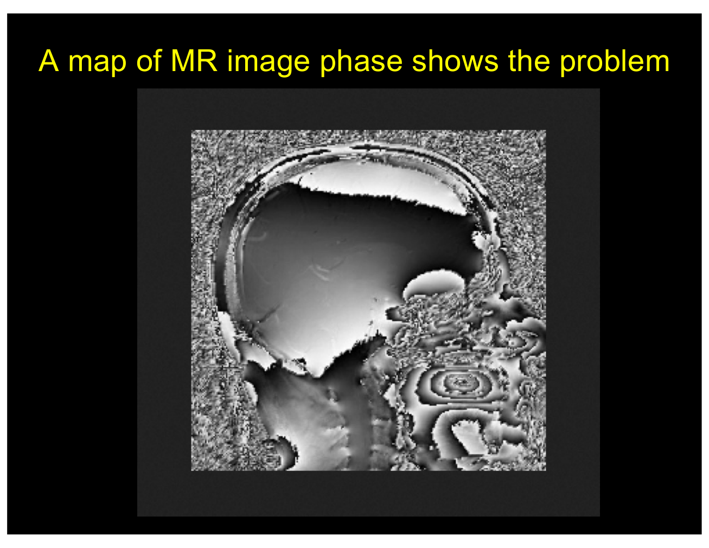

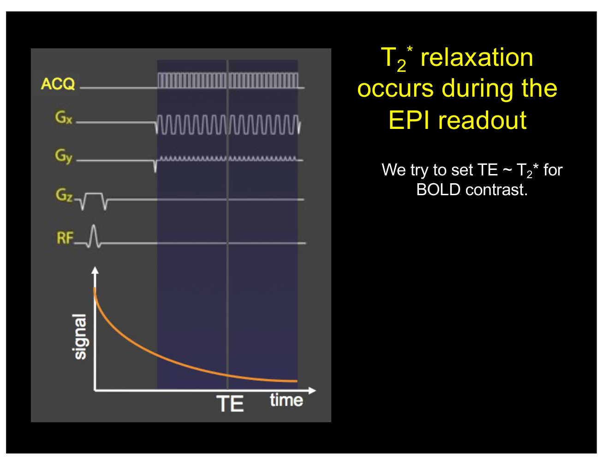

**Figure 4.7. Movement, susceptibility, and phase in EPI.** Always-moving brains, susceptibility interfaces, phase maps, and T2-star loss during readout. Source pages 119-124 are grouped because they teach one local mechanism or diagnostic comparison. Key source labels and terms include: The brain is always moving!; Magnetic susceptibility; Magnetic susceptibility, c; The tendency of a material to magnetize when exposed; to a magnetic field; Interaction of electrons with the magnetic field; Variations in c cause intrinsic, static magnetic field; gradients in parts of the brain.

This figure should be read as a sequence inside Chapter 4, not as an isolated picture. It begins
with the brain is always moving! and ends with t2* relaxation, so the reader can follow how the
local idea changes across the source panels. The retained source-backed panels are used here
because the original annotations are part of the evidence: the reader needs the labels, axes,
arrows, image examples, and comparison tags to see why the mechanism matters.

The practical lesson is always-moving brains, susceptibility interfaces, phase maps, and t2-star
loss during readout. In a scanner context, the important move is to translate what is drawn into
an acquisition consequence: which gradient is acting, which echo or reference data are being
trusted, which bandwidth or timing choice is limiting, or which image pattern would appear
during quality control.

For Figure 4.7, use the panels as a local reasoning test. If they show a temporal sequence, ask
what physical quantity is being conserved, reversed, accelerated, or lost. If they show images,
compare the same anatomical region across the named conditions before making a protocol
conclusion. That habit prevents a common fMRI error: treating the label movement,
susceptibility, and phase in epi as a diagnosis before checking the visual evidence.

### Chapter Summary

Chapter 4 used pages 86-124 to develop explain why epi is fast, why it is vulnerable, and how
its characteristic artifacts arise. The main lesson is cumulative: the reader should move from
vocabulary to mechanism, from mechanism to protocol choice, and from protocol choice to image or
time-series consequences.

### Key Terms

Echo, planar, space, Ghosting, mechanisms, Chemical, shift, ramp, Distortion, bandwidth.

### Review Questions

1. Explain how echo-planar k-space traversal affects a practical fMRI decision.
2. Describe one way a visual panel in Chapter 4 changes the interpretation of the prose.
3. Name one acquisition parameter from this chapter and predict a tradeoff if it is changed.
4. Distinguish a mechanism-level explanation from an image-appearance description.
5. Identify one quality-control sign that would make you revisit this chapter before scanning more data.

# Chapter 5. Flip Angle, Inflow, and Receive-field Motion Effects

This chapter covers source pages 125-139 and turns them into a self-study sequence about show
how choices and hardware sensitivity fields convert physiology and motion into time-series
structure. The chapter is organized by mechanism and scanning consequence, not by slide order
alone, so figures appear where they support the local explanation.

## Spin history and inflow

Spin history and inflow is the local bridge between the course vocabulary and a self-study
explanation. The relevant source ideas include Day Three; Afternoon; Introduction to EPI; Flip
angle effects: spin history; With flow, the apparent T1 for blood decreases.; Duyn et al. (1994)
& Frahm; et al. (1994) showed that; blood inflow plays a major; role in GRE-based functional; FA
& inflow effects in fMRI; 3 T, TR=1000 ms; Visual stimulation. Taken together, they should be
read as one argument about interpret flip-angle effects on BOLD amplitude, timing, SNR, and
temporal SNR. The textbook version therefore slows the slide sequence down: first define the
measured or manipulated quantity, then state what changes it, and only then connect the change
to image appearance or fMRI interpretation.

In this part of flip angle, inflow, and receive-field motion effects, the central discipline is
to separate mechanism from display. A pulse sequence diagram, a k-space grid, or a brain image
is not merely a picture of a result; it encodes a chain of causes. For spin history and inflow,
that chain starts with the controlled scanner quantity, passes through spin phase or signal
weighting, and ends as a spatial pattern, time-series change, or acquisition tradeoff. If the
chain is left implicit, the same term can be memorized without being understood.

A useful way to study spin history and inflow is to ask three questions for every equation or
panel. What quantity is deliberately controlled in Chapter 5's local sequence or example? What
uncontrolled physical or biological quantity can perturb it? What image-space or time-series
signature would reveal the problem? These questions keep the mathematics connected to practical
fMRI, where protocol choices are judged by SNR, temporal stability, distortion, dropout, timing,
and interpretability rather than by elegance alone.

The source pages named Day Three, Flip angle effects: spin history, FA & inflow effects in fMRI,
FA: SNR and temporal SNR, FA = 20 degrees, and related panels also show why MRI explanations
often require several levels. At the microscopic level, spins precess, relax, dephase, or
refocus. At the sequence level, RF pulses and gradients impose timing and spatial encoding. At
the reconstruction level, Fourier relationships convert sampled signals into images. At the
experimental level, subject motion, physiology, hardware stability, and human factors determine
whether the image series supports a defensible fMRI interpretation.

For practice, the reader should be able to restate spin history and inflow without using slide
shorthand. The restatement should include the relevant variables, the direction of the effect,
and the likely failure mode. A good explanation is specific enough to predict what would happen
if the field strength, gradient area, echo spacing, flip angle, coil sensitivity, motion state,
or nuisance measurement changed.

## Figure 5.1. Flip angle, inflow, SNR, and temporal SNR

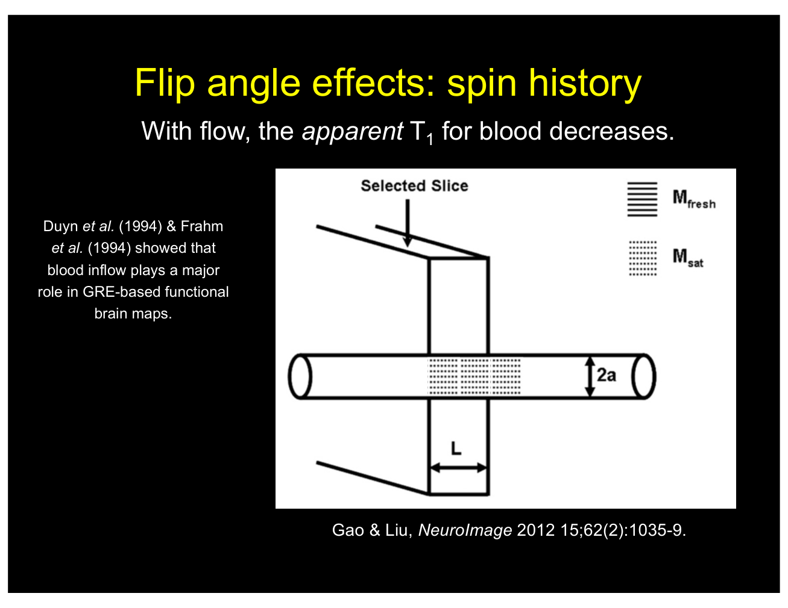

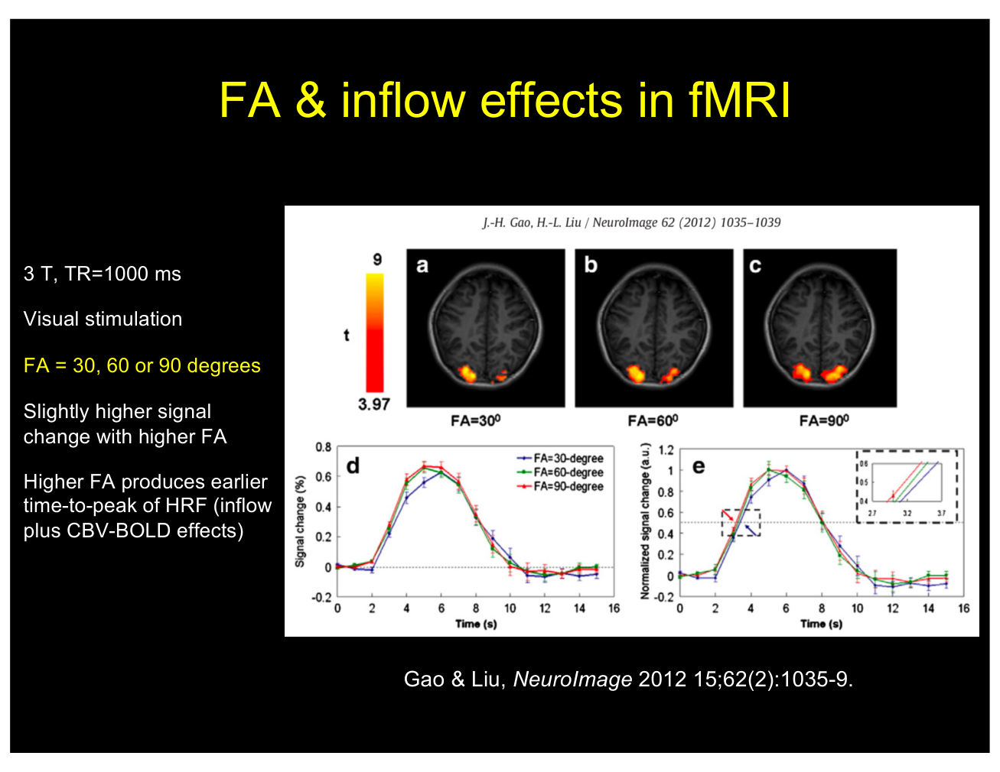

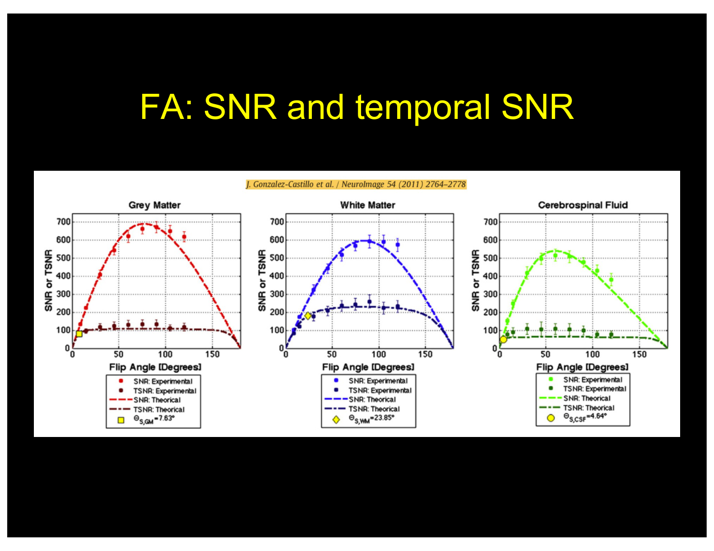

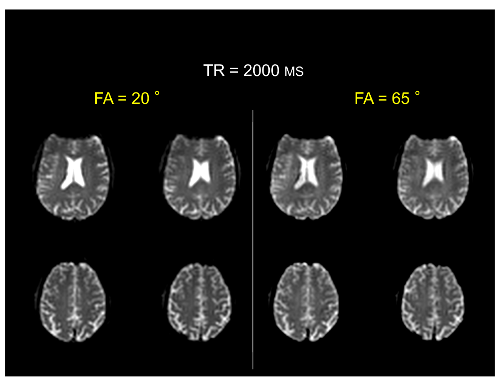

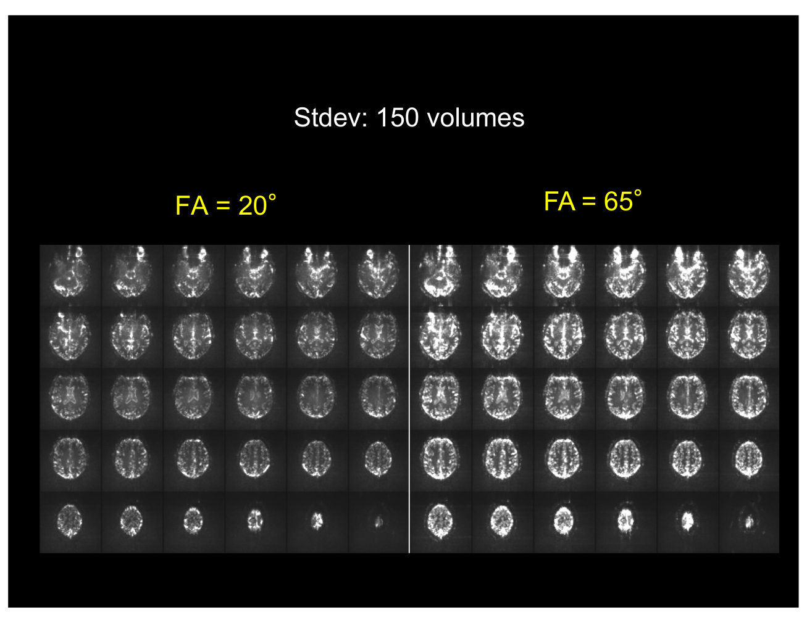

**Figure 5.1. Flip angle, inflow, SNR, and temporal SNR.** Spin-history effects, visual stimulation examples, and SNR-versus-tSNR comparisons. Source pages 126-130 are grouped because they teach one local mechanism or diagnostic comparison. Key source labels and terms include: Flip angle effects: spin history; With flow, the apparent T1 for blood decreases.; Duyn et al. (1994) & Frahm; et al. (1994) showed that; blood inflow plays a major; role in GRE-based functional; FA & inflow effects in fMRI; 3 T, TR=1000 ms.

This figure should be read as a sequence inside Chapter 5, not as an isolated picture. It begins
with flip angle effects: spin history and ends with fa = 20 degrees, so the reader can follow
how the local idea changes across the source panels. The retained source-backed panels are used
here because the original annotations are part of the evidence: the reader needs the labels,
axes, arrows, image examples, and comparison tags to see why the mechanism matters.

The practical lesson is spin-history effects, visual stimulation examples, and snr-versus-tsnr
comparisons. In a scanner context, the important move is to translate what is drawn into an
acquisition consequence: which gradient is acting, which echo or reference data are being
trusted, which bandwidth or timing choice is limiting, or which image pattern would appear
during quality control.

For Figure 5.1, use the panels as a local reasoning test. If they show a temporal sequence, ask
what physical quantity is being conserved, reversed, accelerated, or lost. If they show images,
compare the same anatomical region across the named conditions before making a protocol
conclusion. That habit prevents a common fMRI error: treating the label flip angle, inflow, snr,
and temporal snr as a diagnosis before checking the visual evidence.

## Receive bias and motion correction

Receive bias and motion correction is the local bridge between the course vocabulary and a self-
study explanation. The relevant source ideas include Receive bias field effects; (aka RFC-MoCo
effect); "Even after perfect rigid-body alignment (motion correction), the signal; time-course
in a given brain structure will be modulated by the motion of; that structure through the steep
sensitivity gradient."; L Wald, NeuroImage 2012;62(2):1221-9.; Rx field contrast "staining";
Before motion correction; Homogeneous Rx coil; After perfect motion correction; Heterogeneous Rx
coil. Taken together, they should be read as one argument about explain why perfect rigid
realignment can still leave signal modulation. The textbook version therefore slows the slide
sequence down: first define the measured or manipulated quantity, then state what changes it,
and only then connect the change to image appearance or fMRI interpretation.

In this part of flip angle, inflow, and receive-field motion effects, the central discipline is
to separate mechanism from display. A pulse sequence diagram, a k-space grid, or a brain image
is not merely a picture of a result; it encodes a chain of causes. For receive bias and motion
correction, that chain starts with the controlled scanner quantity, passes through spin phase or
signal weighting, and ends as a spatial pattern, time-series change, or acquisition tradeoff. If
the chain is left implicit, the same term can be memorized without being understood.

A useful way to study receive bias and motion correction is to ask three questions for every
equation or panel. What quantity is deliberately controlled in Chapter 5's local sequence or
example? What uncontrolled physical or biological quantity can perturb it? What image-space or
time-series signature would reveal the problem? These questions keep the mathematics connected
to practical fMRI, where protocol choices are judged by SNR, temporal stability, distortion,
dropout, timing, and interpretability rather than by elegance alone.

The source pages named Receive bias field effects, (aka RFC-MoCo effect), Before motion
correction, After perfect motion correction, Before motion correction, and related panels also
show why MRI explanations often require several levels. At the microscopic level, spins precess,
relax, dephase, or refocus. At the sequence level, RF pulses and gradients impose timing and
spatial encoding. At the reconstruction level, Fourier relationships convert sampled signals
into images. At the experimental level, subject motion, physiology, hardware stability, and
human factors determine whether the image series supports a defensible fMRI interpretation.

For practice, the reader should be able to restate receive bias and motion correction without
using slide shorthand. The restatement should include the relevant variables, the direction of
the effect, and the likely failure mode. A good explanation is specific enough to predict what
would happen if the field strength, gradient area, echo spacing, flip angle, coil sensitivity,
motion state, or nuisance measurement changed.

## Figure 5.2. Receive-field motion effects before and after realignment

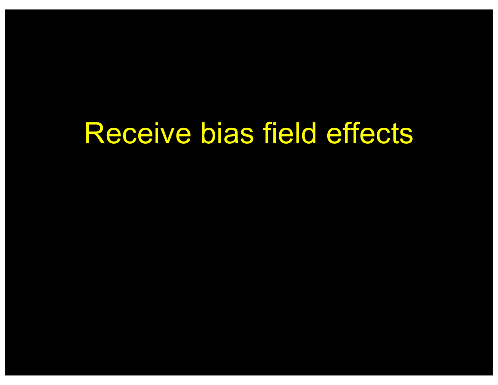

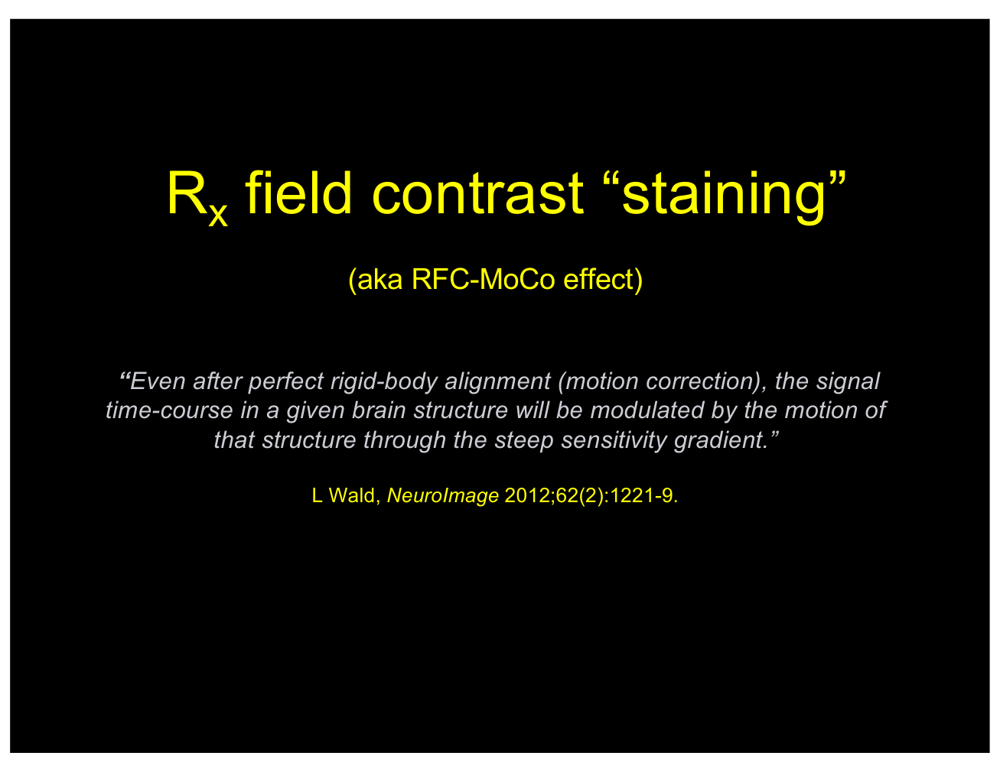

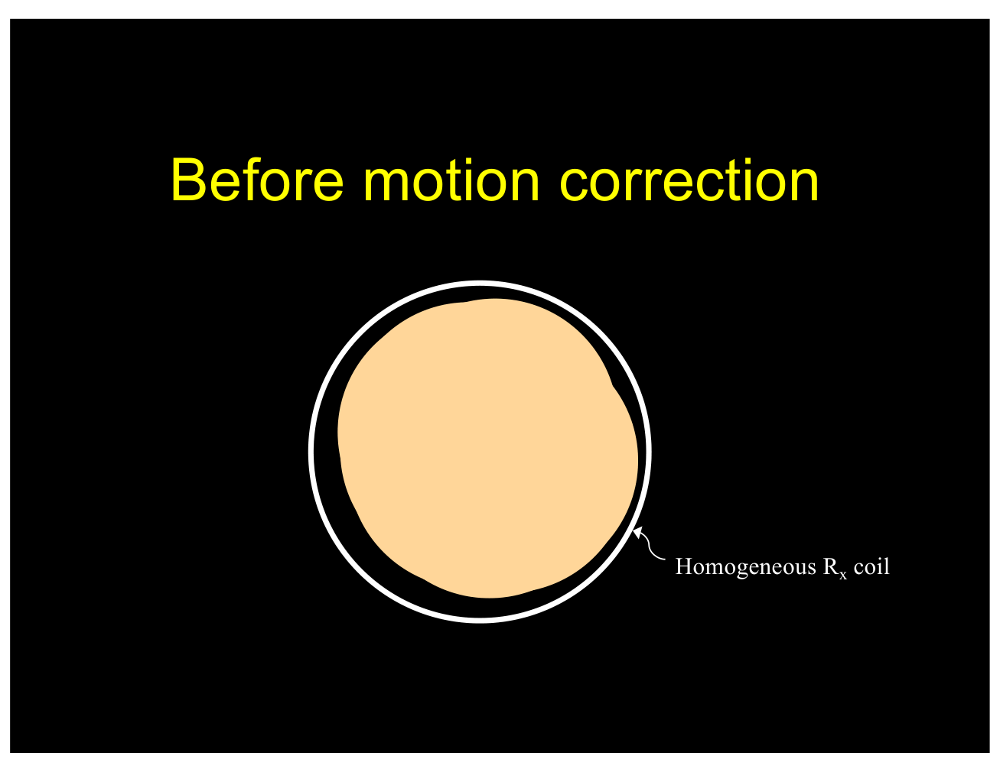

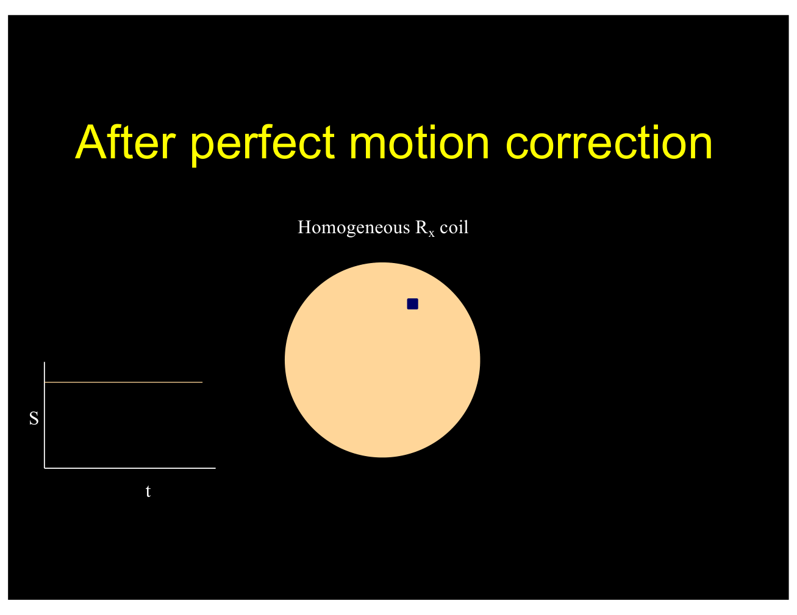

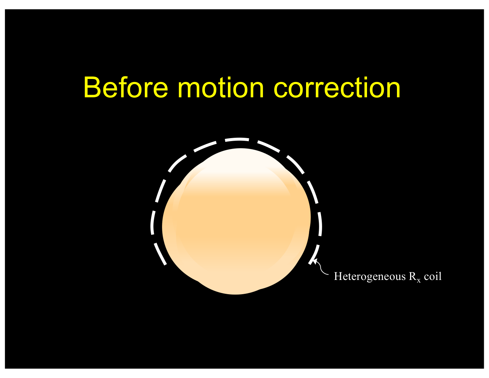

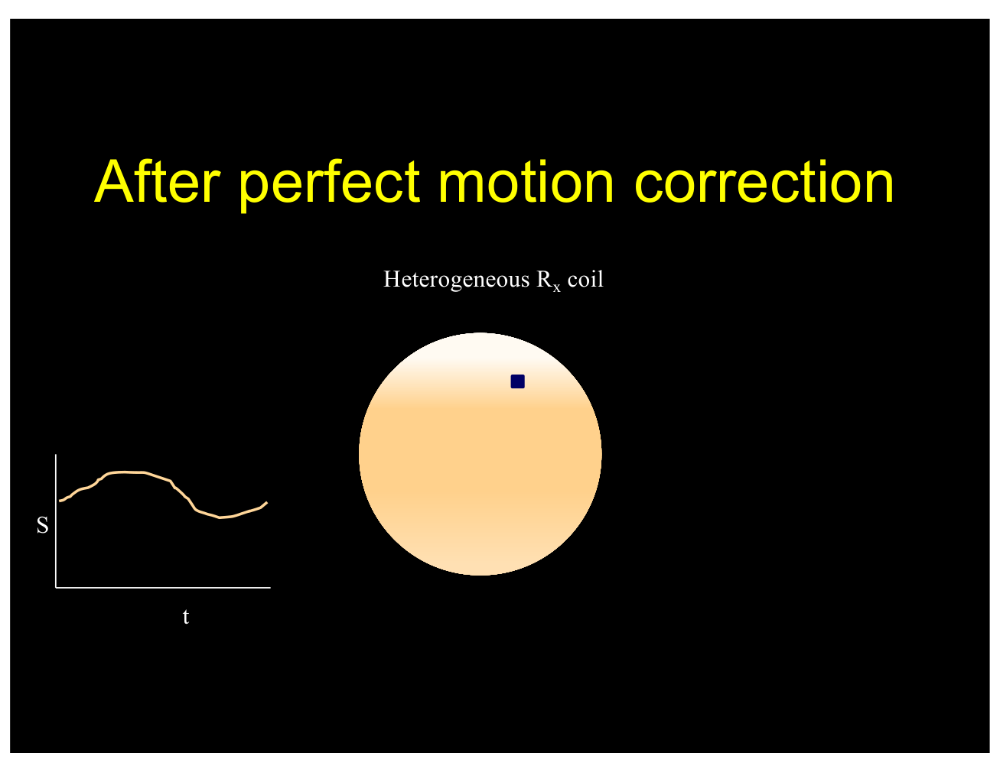

**Figure 5.2. Receive-field motion effects before and after realignment.** Why receive heterogeneity survives motion correction as signal modulation. Source pages 131-136 are grouped because they teach one local mechanism or diagnostic comparison. Key source labels and terms include: Receive bias field effects; (aka RFC-MoCo effect); "Even after perfect rigid-body alignment (motion correction), the signal; time-course in a given brain structure will be modulated by the motion of; that structure through the steep sensitivity gradient."; L Wald, NeuroImage 2012;62(2):1221-9.; Rx field contrast "staining"; Before motion correction.

This figure should be read as a sequence inside Chapter 5, not as an isolated picture. It begins
with receive bias field effects and ends with after perfect motion correction, so the reader can
follow how the local idea changes across the source panels. The retained source-backed panels
are used here because the original annotations are part of the evidence: the reader needs the
labels, axes, arrows, image examples, and comparison tags to see why the mechanism matters.

The practical lesson is why receive heterogeneity survives motion correction as signal
modulation. In a scanner context, the important move is to translate what is drawn into an
acquisition consequence: which gradient is acting, which echo or reference data are being
trusted, which bandwidth or timing choice is limiting, or which image pattern would appear
during quality control.

For Figure 5.2, use the panels as a local reasoning test. If they show a temporal sequence, ask
what physical quantity is being conserved, reversed, accelerated, or lost. If they show images,
compare the same anatomical region across the named conditions before making a protocol
conclusion. That habit prevents a common fMRI error: treating the label receive-field motion
effects before and after realignment as a diagnosis before checking the visual evidence.

## Magnitude and mitigation of receive-field effects

Magnitude and mitigation of receive-field effects is the local bridge between the course
vocabulary and a self-study explanation. The relevant source ideas include How big is the
effect?; DeltaS (%); Birdcage 12ch; Sheltraw & Inglis 2012; arXiv:1210.3633; 1 mm translation in
y; 32-ch coil; simulations; Sheltraw & Inglis, Proc ISMRM 2013; 3352; "Anchoring" during volume
realignment; Rx contrast may dominate anatomical contrast, driving volreg cost function;
Normalize by the Rx bias field; Hartwig et al. Proc ISMRM 3628 (2011); Raw 32ch Prescan
normalized. Taken together, they should be read as one argument about compare coil dependence
and anchoring strategies. The textbook version therefore slows the slide sequence down: first
define the measured or manipulated quantity, then state what changes it, and only then connect
the change to image appearance or fMRI interpretation.

In this part of flip angle, inflow, and receive-field motion effects, the central discipline is
to separate mechanism from display. A pulse sequence diagram, a k-space grid, or a brain image
is not merely a picture of a result; it encodes a chain of causes. For magnitude and mitigation
of receive-field effects, that chain starts with the controlled scanner quantity, passes through
spin phase or signal weighting, and ends as a spatial pattern, time-series change, or
acquisition tradeoff. If the chain is left implicit, the same term can be memorized without
being understood.

A useful way to study magnitude and mitigation of receive-field effects is to ask three
questions for every equation or panel. What quantity is deliberately controlled in Chapter 5's
local sequence or example? What uncontrolled physical or biological quantity can perturb it?
What image-space or time-series signature would reveal the problem? These questions keep the
mathematics connected to practical fMRI, where protocol choices are judged by SNR, temporal
stability, distortion, dropout, timing, and interpretability rather than by elegance alone.

The source pages named How big is the effect?, DeltaS (%), "Anchoring" during volume realignment
also show why MRI explanations often require several levels. At the microscopic level, spins
precess, relax, dephase, or refocus. At the sequence level, RF pulses and gradients impose
timing and spatial encoding. At the reconstruction level, Fourier relationships convert sampled
signals into images. At the experimental level, subject motion, physiology, hardware stability,
and human factors determine whether the image series supports a defensible fMRI interpretation.

For practice, the reader should be able to restate magnitude and mitigation of receive-field
effects without using slide shorthand. The restatement should include the relevant variables,
the direction of the effect, and the likely failure mode. A good explanation is specific enough
to predict what would happen if the field strength, gradient area, echo spacing, flip angle,
coil sensitivity, motion state, or nuisance measurement changed.

## Figure 5.3. Magnitude and mitigation of receive-field coupling

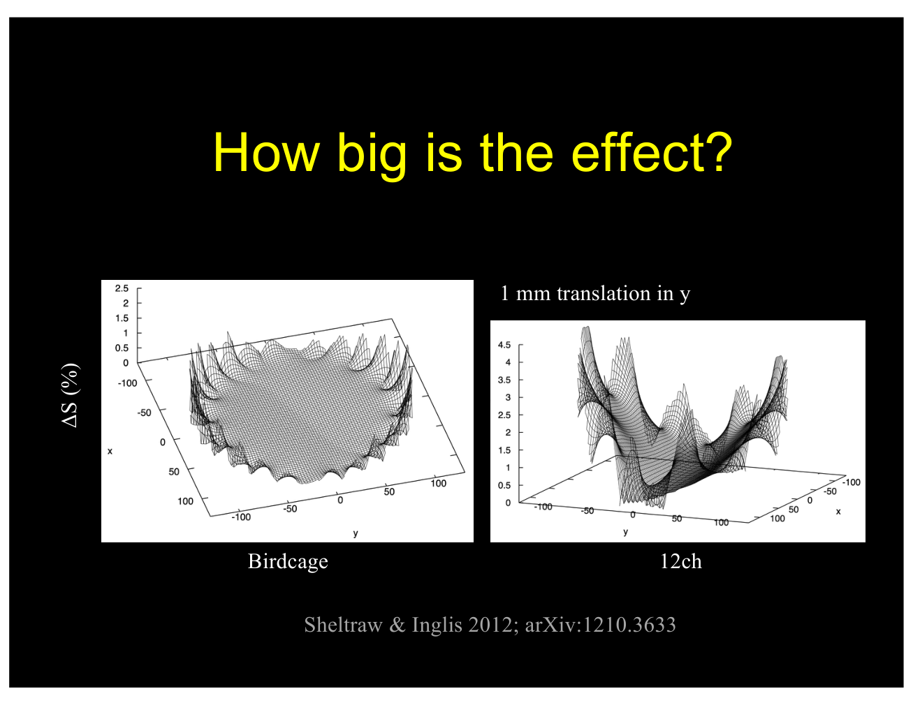

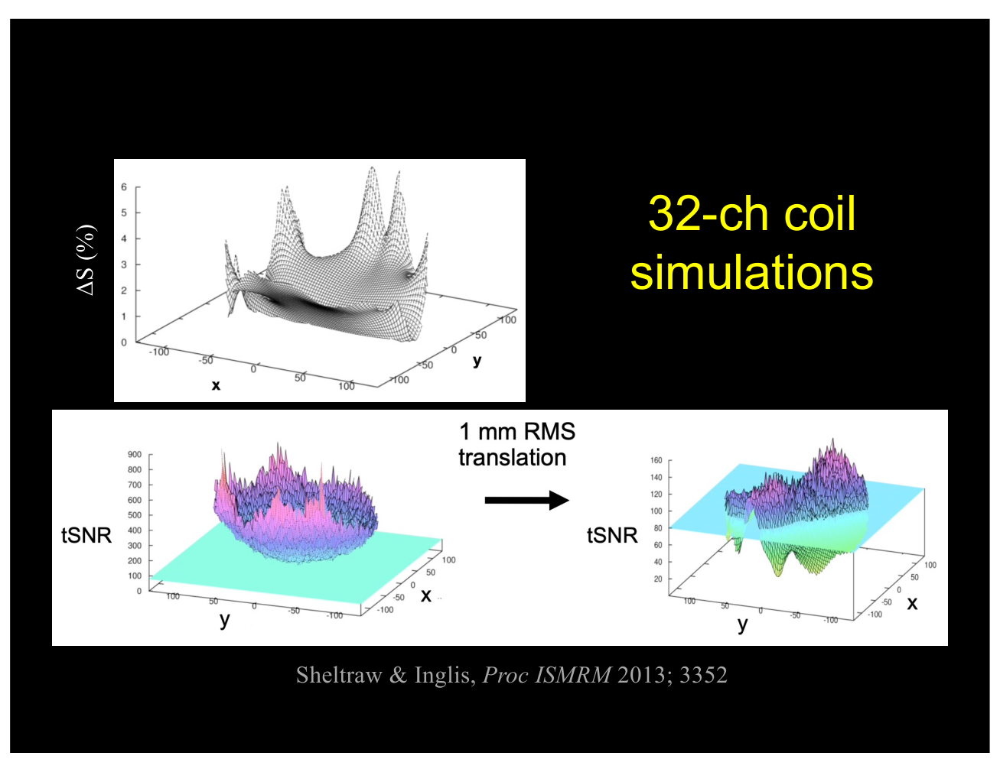

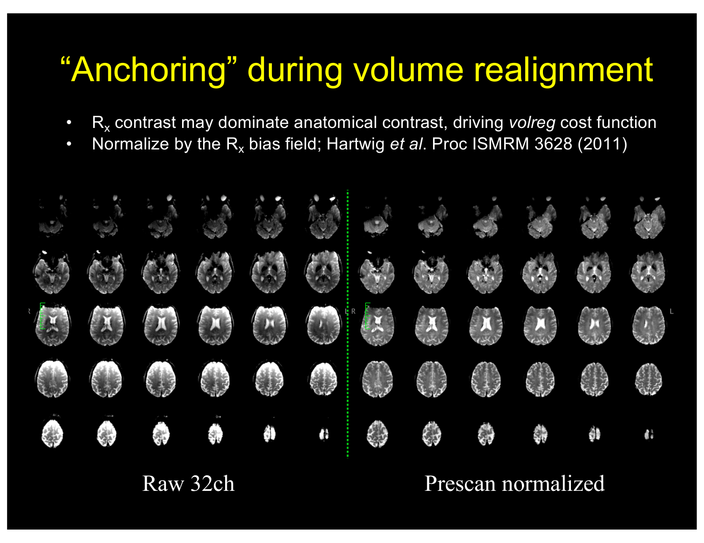

**Figure 5.3. Magnitude and mitigation of receive-field coupling.** Coil-dependent signal change and anchoring strategies for volume realignment. Source pages 137-139 are grouped because they teach one local mechanism or diagnostic comparison. Key source labels and terms include: How big is the effect?; DeltaS (%); Birdcage 12ch; Sheltraw & Inglis 2012; arXiv:1210.3633; 1 mm translation in y; 32-ch coil; simulations; Sheltraw & Inglis, Proc ISMRM 2013; 3352.

This figure should be read as a sequence inside Chapter 5, not as an isolated picture. It begins
with how big is the effect? and ends with "anchoring" during volume realignment, so the reader
can follow how the local idea changes across the source panels. The retained source-backed
panels are used here because the original annotations are part of the evidence: the reader needs
the labels, axes, arrows, image examples, and comparison tags to see why the mechanism matters.

The practical lesson is coil-dependent signal change and anchoring strategies for volume
realignment. In a scanner context, the important move is to translate what is drawn into an
acquisition consequence: which gradient is acting, which echo or reference data are being
trusted, which bandwidth or timing choice is limiting, or which image pattern would appear
during quality control.

For Figure 5.3, use the panels as a local reasoning test. If they show a temporal sequence, ask
what physical quantity is being conserved, reversed, accelerated, or lost. If they show images,
compare the same anatomical region across the named conditions before making a protocol
conclusion. That habit prevents a common fMRI error: treating the label magnitude and mitigation
of receive-field coupling as a diagnosis before checking the visual evidence.

### Chapter Summary

Chapter 5 used pages 125-139 to develop show how choices and hardware sensitivity fields convert
physiology and motion into time-series structure. The main lesson is cumulative: the reader
should move from vocabulary to mechanism, from mechanism to protocol choice, and from protocol
choice to image or time-series consequences.

### Key Terms

Spin, history, inflow, Receive, bias, motion, Magnitude, mitigation, receive.

### Review Questions

1. Explain how spin history and inflow affects a practical fMRI decision.
2. Describe one way a visual panel in Chapter 5 changes the interpretation of the prose.
3. Name one acquisition parameter from this chapter and predict a tradeoff if it is changed.
4. Distinguish a mechanism-level explanation from an image-appearance description.
5. Identify one quality-control sign that would make you revisit this chapter before scanning more data.

# Chapter 6. Partial Fourier EPI

This chapter covers source pages 140-158 and turns them into a self-study sequence about
evaluate partial fourier as an acceleration strategy with asymmetric consequences for te,
slices, smoothing, and dropout. The chapter is organized by mechanism and scanning consequence,
not by slide order alone, so figures appear where they support the local explanation.

## Conjugate symmetry and reconstruction

Conjugate symmetry and reconstruction is the local bridge between the course vocabulary and a
self-study explanation. The relevant source ideas include Day Four; Morning; Advanced EPI; Full
k-space; Partial Fourier EPI; Partial Fourier EPI:; a - ib; a + ib; Conjugate symmetry in
k-space; Reconstruct omitted portion; Several ways to do this. We use the Siemens default: zero-
fill the missing; portion prior to 2D FT.. Taken together, they should be read as one argument
about establish why a portion of k-space can be omitted. The textbook version therefore slows
the slide sequence down: first define the measured or manipulated quantity, then state what
changes it, and only then connect the change to image appearance or fMRI interpretation.

In this part of partial fourier epi, the central discipline is to separate mechanism from
display. A pulse sequence diagram, a k-space grid, or a brain image is not merely a picture of a
result; it encodes a chain of causes. For conjugate symmetry and reconstruction, that chain
starts with the controlled scanner quantity, passes through spin phase or signal weighting, and
ends as a spatial pattern, time-series change, or acquisition tradeoff. If the chain is left
implicit, the same term can be memorized without being understood.

A useful way to study conjugate symmetry and reconstruction is to ask three questions for every
equation or panel. What quantity is deliberately controlled in Chapter 6's local sequence or
example? What uncontrolled physical or biological quantity can perturb it? What image-space or
time-series signature would reveal the problem? These questions keep the mathematics connected
to practical fMRI, where protocol choices are judged by SNR, temporal stability, distortion,
dropout, timing, and interpretability rather than by elegance alone.

The source pages named Day Four, Full k-space, Partial Fourier EPI, Partial Fourier EPI:, a -
ib, and related panels also show why MRI explanations often require several levels. At the
microscopic level, spins precess, relax, dephase, or refocus. At the sequence level, RF pulses
and gradients impose timing and spatial encoding. At the reconstruction level, Fourier
relationships convert sampled signals into images. At the experimental level, subject motion,
physiology, hardware stability, and human factors determine whether the image series supports a
defensible fMRI interpretation.

For practice, the reader should be able to restate conjugate symmetry and reconstruction without
using slide shorthand. The restatement should include the relevant variables, the direction of
the effect, and the likely failure mode. A good explanation is specific enough to predict what
would happen if the field strength, gradient area, echo spacing, flip angle, coil sensitivity,
motion state, or nuisance measurement changed.

## Figure 6.1. Partial Fourier from conjugate symmetry to reconstruction

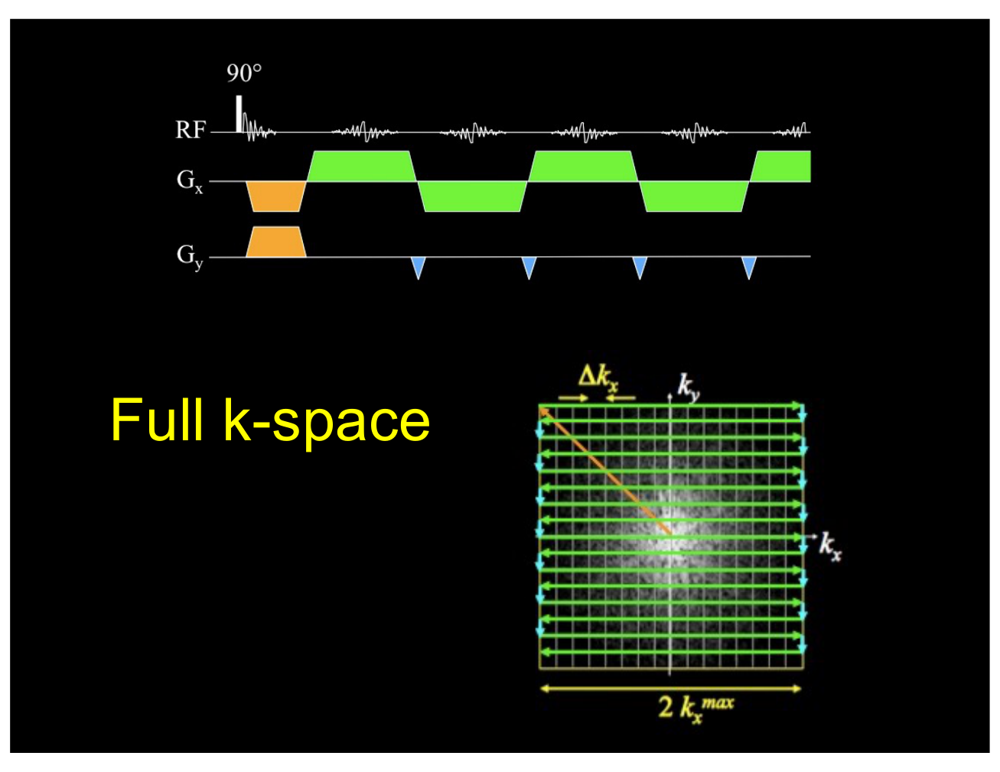

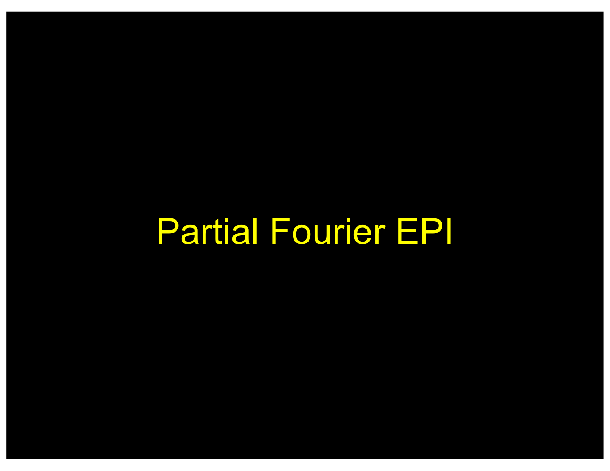

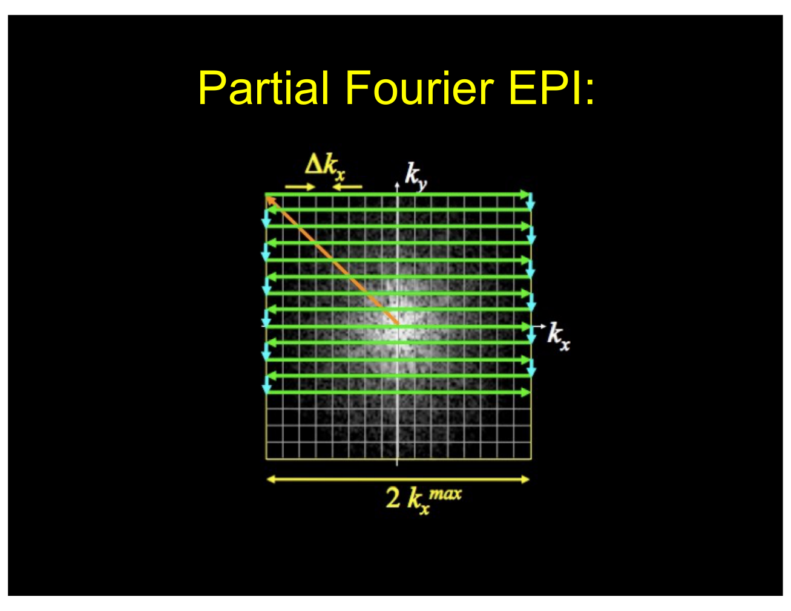

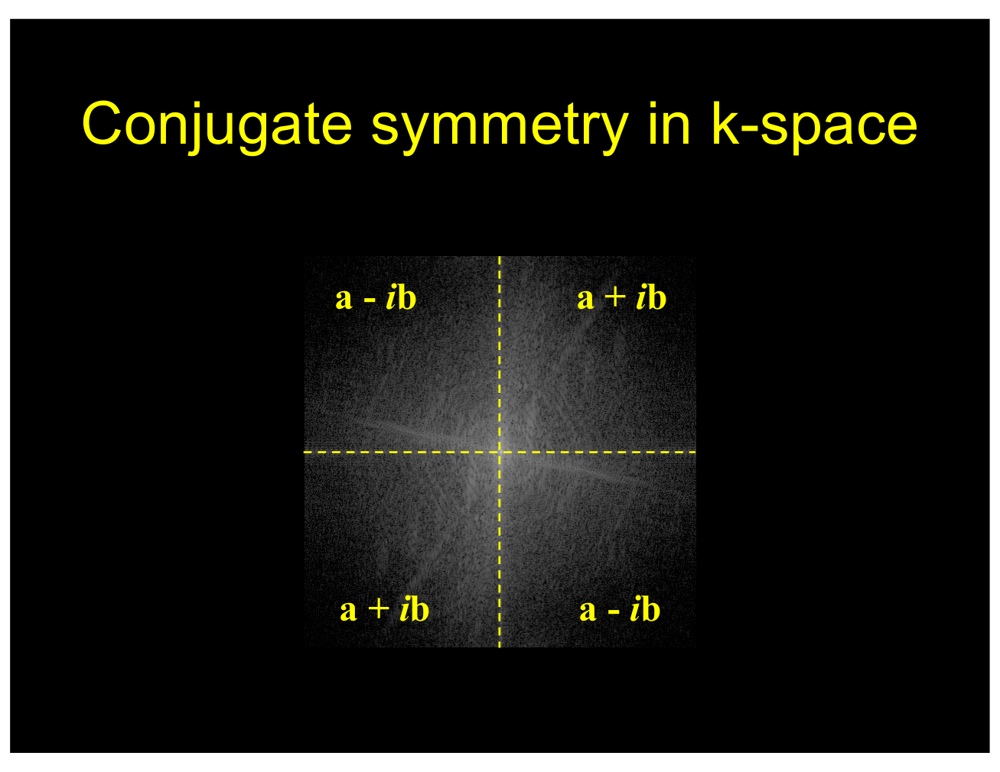

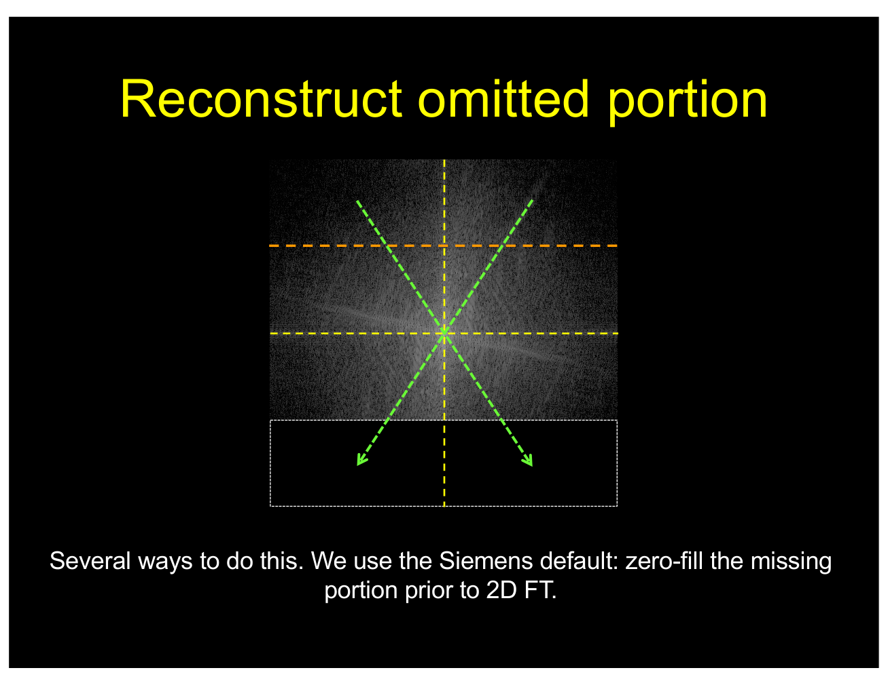

**Figure 6.1. Partial Fourier from conjugate symmetry to reconstruction.** Why k-space symmetry permits omission and what zero filling does. Source pages 141-145 are grouped because they teach one local mechanism or diagnostic comparison. Key source labels and terms include: Full k-space; Partial Fourier EPI; Partial Fourier EPI:; a - ib; a + ib; Conjugate symmetry in k-space; Reconstruct omitted portion; Several ways to do this. We use the Siemens default: zero-fill the missing.

This figure should be read as a sequence inside Chapter 6, not as an isolated picture. It begins
with full k-space and ends with reconstruct omitted portion, so the reader can follow how the
local idea changes across the source panels. The retained source-backed panels are used here
because the original annotations are part of the evidence: the reader needs the labels, axes,
arrows, image examples, and comparison tags to see why the mechanism matters.

The practical lesson is why k-space symmetry permits omission and what zero filling does. In a
scanner context, the important move is to translate what is drawn into an acquisition
consequence: which gradient is acting, which echo or reference data are being trusted, which
bandwidth or timing choice is limiting, or which image pattern would appear during quality
control.

For Figure 6.1, use the panels as a local reasoning test. If they show a temporal sequence, ask
what physical quantity is being conserved, reversed, accelerated, or lost. If they show images,
compare the same anatomical region across the named conditions before making a protocol
conclusion. That habit prevents a common fMRI error: treating the label partial fourier from
conjugate symmetry to reconstruction as a diagnosis before checking the visual evidence.

## Early versus late echo omission

Early versus late echo omission is the local bridge between the course vocabulary and a self-
study explanation. The relevant source ideas include We should be able to omit acquisition of
the; early or the late echoes, with different; experimental consequences.; Product EPI omits
early echoes. CMRR EPI; allows omission of late echoes as an option.; Omitting early echoes
allows a shorter TE,; Early Late; Omitting early echoes permits shorter TE. But we want; BOLD
contrast and need TE ~ T2* so omitting late echoes; should be preferred.; Partial Fourier speed
gains; (Siemens 3 T TRIO, TR=2000 ms). Taken together, they should be read as one argument about
compare the consequences of omitting early or late echoes. The textbook version therefore slows
the slide sequence down: first define the measured or manipulated quantity, then state what
changes it, and only then connect the change to image appearance or fMRI interpretation.

In this part of partial fourier epi, the central discipline is to separate mechanism from
display. A pulse sequence diagram, a k-space grid, or a brain image is not merely a picture of a
result; it encodes a chain of causes. For early versus late echo omission, that chain starts
with the controlled scanner quantity, passes through spin phase or signal weighting, and ends as
a spatial pattern, time-series change, or acquisition tradeoff. If the chain is left implicit,
the same term can be memorized without being understood.

A useful way to study early versus late echo omission is to ask three questions for every
equation or panel. What quantity is deliberately controlled in Chapter 6's local sequence or
example? What uncontrolled physical or biological quantity can perturb it? What image-space or
time-series signature would reveal the problem? These questions keep the mathematics connected
to practical fMRI, where protocol choices are judged by SNR, temporal stability, distortion,
dropout, timing, and interpretability rather than by elegance alone.

The source pages named We should be able to omit acquisition of the, Early Late, Partial Fourier
speed gains, Partial Fourier: more dropout?, Partial Fourier can increase dropout also show why
MRI explanations often require several levels. At the microscopic level, spins precess, relax,
dephase, or refocus. At the sequence level, RF pulses and gradients impose timing and spatial
encoding. At the reconstruction level, Fourier relationships convert sampled signals into
images. At the experimental level, subject motion, physiology, hardware stability, and human
factors determine whether the image series supports a defensible fMRI interpretation.

For practice, the reader should be able to restate early versus late echo omission without using
slide shorthand. The restatement should include the relevant variables, the direction of the
effect, and the likely failure mode. A good explanation is specific enough to predict what would
happen if the field strength, gradient area, echo spacing, flip angle, coil sensitivity, motion
state, or nuisance measurement changed.

## Figure 6.2. Early versus late echo omission

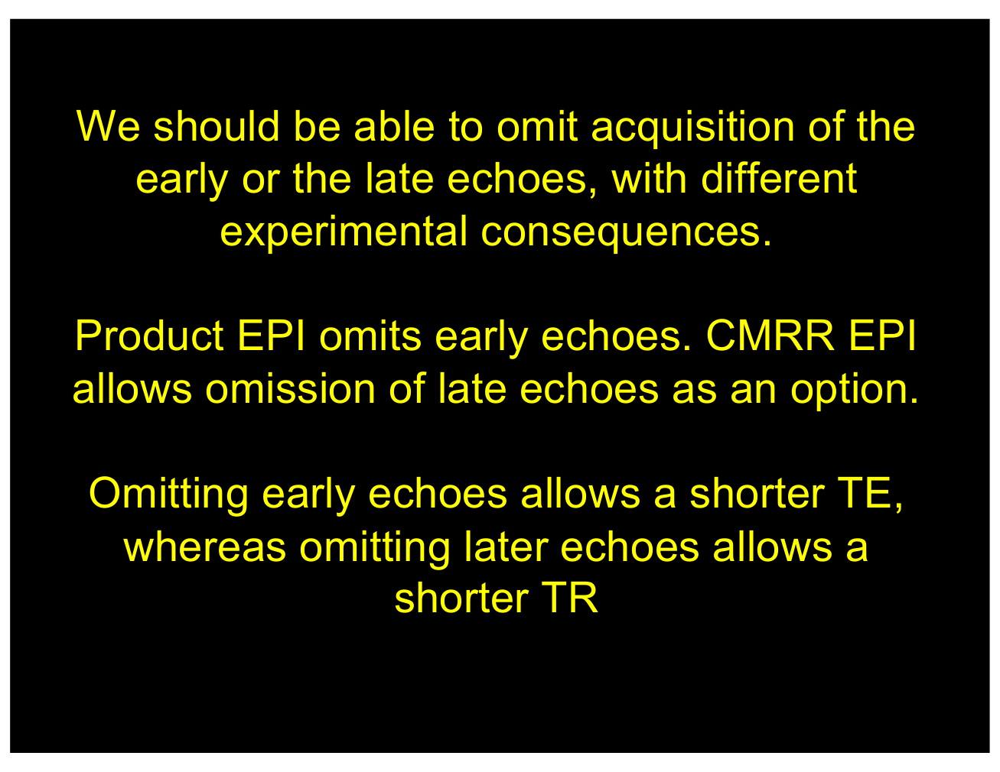

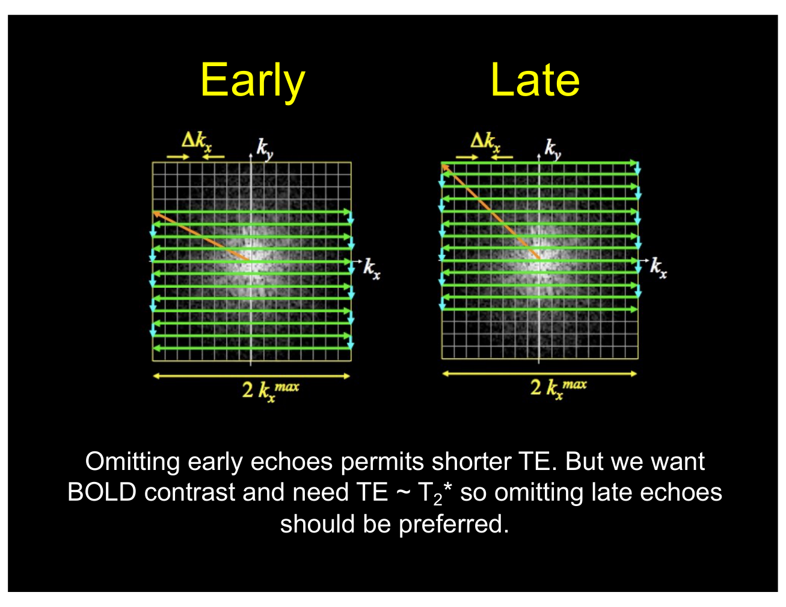

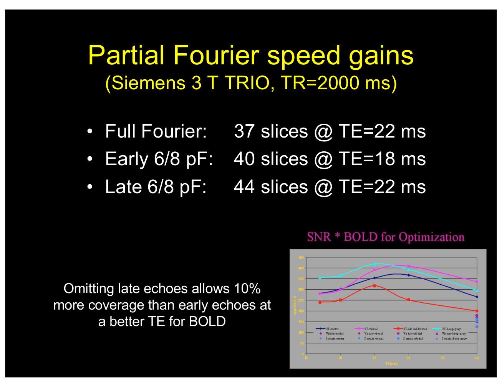

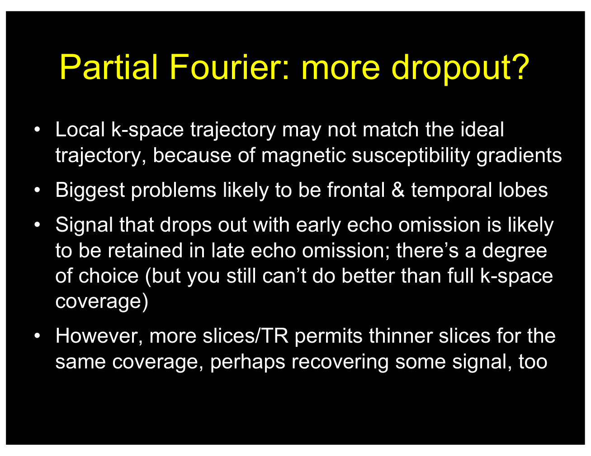

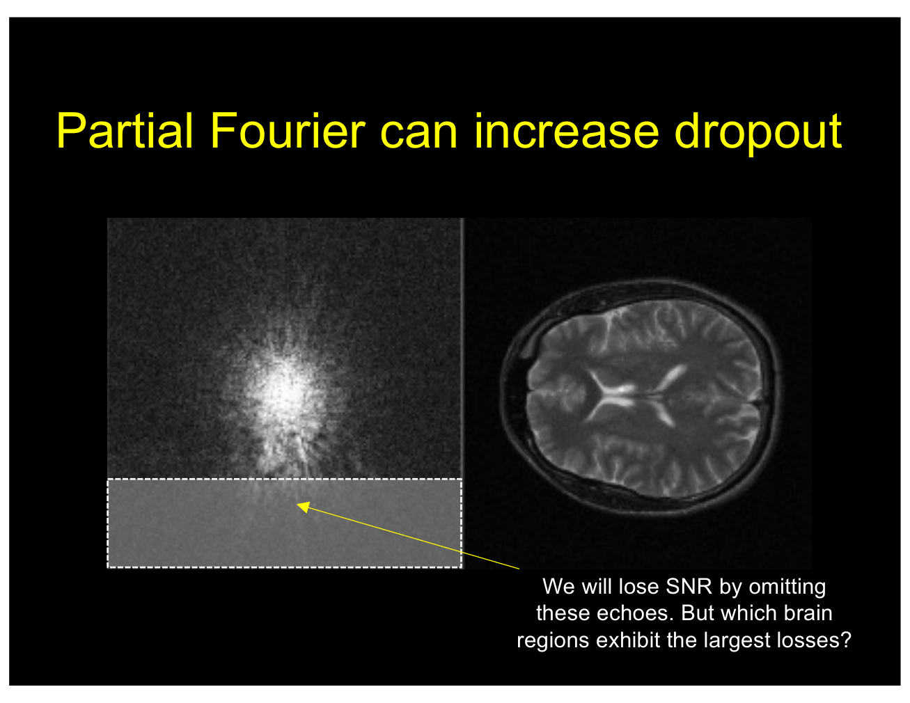

**Figure 6.2. Early versus late echo omission.** TE, slice coverage, and regional dropout consequences. Source pages 146-150 are grouped because they teach one local mechanism or diagnostic comparison. Key source labels and terms include: We should be able to omit acquisition of the; early or the late echoes, with different; experimental consequences.; Product EPI omits early echoes. CMRR EPI; allows omission of late echoes as an option.; Omitting early echoes allows a shorter TE,; Early Late; Omitting early echoes permits shorter TE. But we want.

This figure should be read as a sequence inside Chapter 6, not as an isolated picture. It begins
with we should be able to omit acquisition of the and ends with partial fourier can increase
dropout, so the reader can follow how the local idea changes across the source panels. The
retained source-backed panels are used here because the original annotations are part of the
evidence: the reader needs the labels, axes, arrows, image examples, and comparison tags to see
why the mechanism matters.

The practical lesson is te, slice coverage, and regional dropout consequences. In a scanner
context, the important move is to translate what is drawn into an acquisition consequence: which
gradient is acting, which echo or reference data are being trusted, which bandwidth or timing
choice is limiting, or which image pattern would appear during quality control.

For Figure 6.2, use the panels as a local reasoning test. If they show a temporal sequence, ask
what physical quantity is being conserved, reversed, accelerated, or lost. If they show images,
compare the same anatomical region across the named conditions before making a protocol
conclusion. That habit prevents a common fMRI error: treating the label early versus late echo
omission as a diagnosis before checking the visual evidence.

## Image consequences and protocol tradeoffs

Image consequences and protocol tradeoffs is the local bridge between the course vocabulary and
a self-study explanation. The relevant source ideas include Partial Fourier EPI; Full k-space
Early 6/8ths Late 6/8ths; Full k-space; Early 6/8ths partial Fourier; Late 6/8ths partial
Fourier; Partial Fourier and PE direction; Omit late echoes to get the most slices in TR; P-A or
A-P phase encoding gives a degree of; control over the regions that drop out; Set phase encode
direction and define "late; echoes" based on the regions of extra dropout; Early Late. Taken
together, they should be read as one argument about integrate dropout, smoothing, phase-encoding
direction, and pros/cons. The textbook version therefore slows the slide sequence down: first
define the measured or manipulated quantity, then state what changes it, and only then connect
the change to image appearance or fMRI interpretation.

In this part of partial fourier epi, the central discipline is to separate mechanism from
display. A pulse sequence diagram, a k-space grid, or a brain image is not merely a picture of a
result; it encodes a chain of causes. For image consequences and protocol tradeoffs, that chain
starts with the controlled scanner quantity, passes through spin phase or signal weighting, and
ends as a spatial pattern, time-series change, or acquisition tradeoff. If the chain is left
implicit, the same term can be memorized without being understood.

A useful way to study image consequences and protocol tradeoffs is to ask three questions for
every equation or panel. What quantity is deliberately controlled in Chapter 6's local sequence
or example? What uncontrolled physical or biological quantity can perturb it? What image-space
or time-series signature would reveal the problem? These questions keep the mathematics
connected to practical fMRI, where protocol choices are judged by SNR, temporal stability,
distortion, dropout, timing, and interpretability rather than by elegance alone.

The source pages named Partial Fourier EPI, Full k-space, Early 6/8ths partial Fourier, Late
6/8ths partial Fourier, Partial Fourier and PE direction, and related panels also show why MRI
explanations often require several levels. At the microscopic level, spins precess, relax,
dephase, or refocus. At the sequence level, RF pulses and gradients impose timing and spatial
encoding. At the reconstruction level, Fourier relationships convert sampled signals into
images. At the experimental level, subject motion, physiology, hardware stability, and human
factors determine whether the image series supports a defensible fMRI interpretation.

For practice, the reader should be able to restate image consequences and protocol tradeoffs
without using slide shorthand. The restatement should include the relevant variables, the
direction of the effect, and the likely failure mode. A good explanation is specific enough to
predict what would happen if the field strength, gradient area, echo spacing, flip angle, coil
sensitivity, motion state, or nuisance measurement changed.

## Figure 6.3. Partial Fourier image consequences

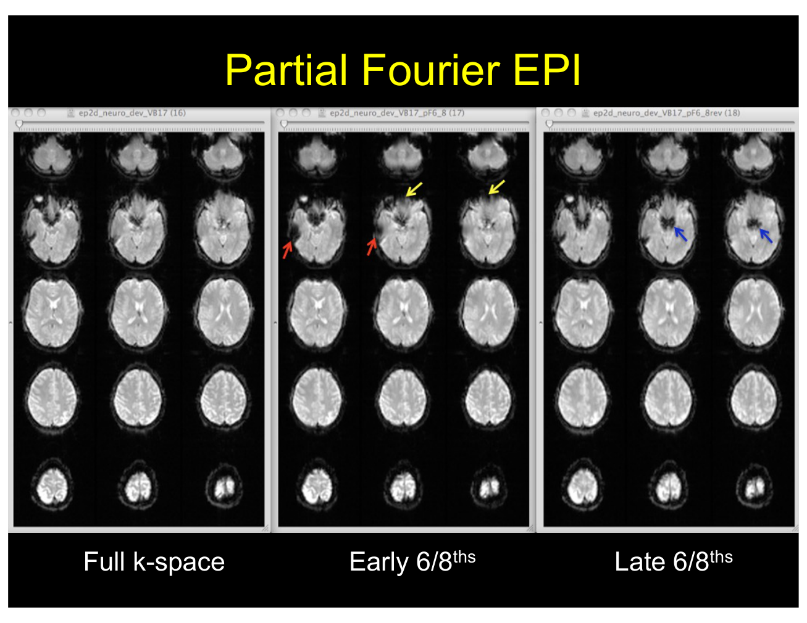

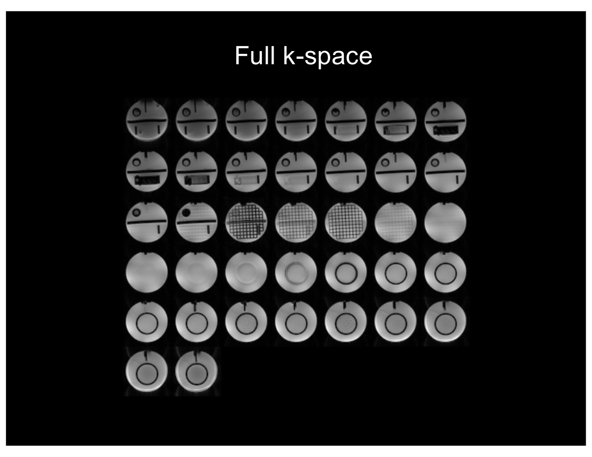

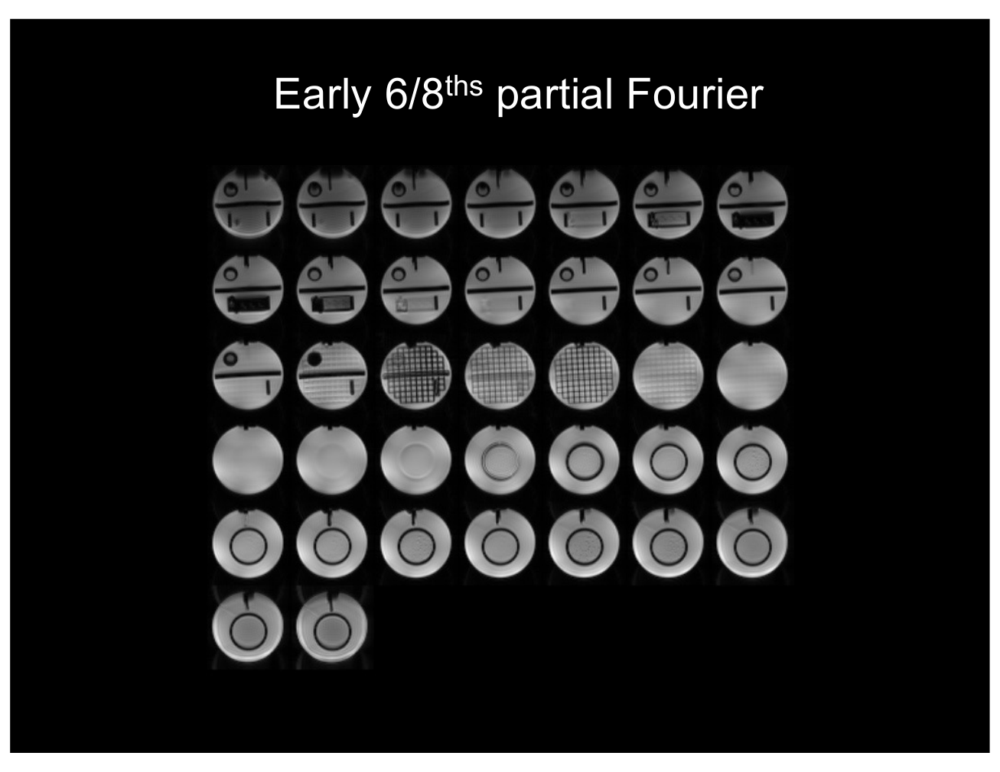

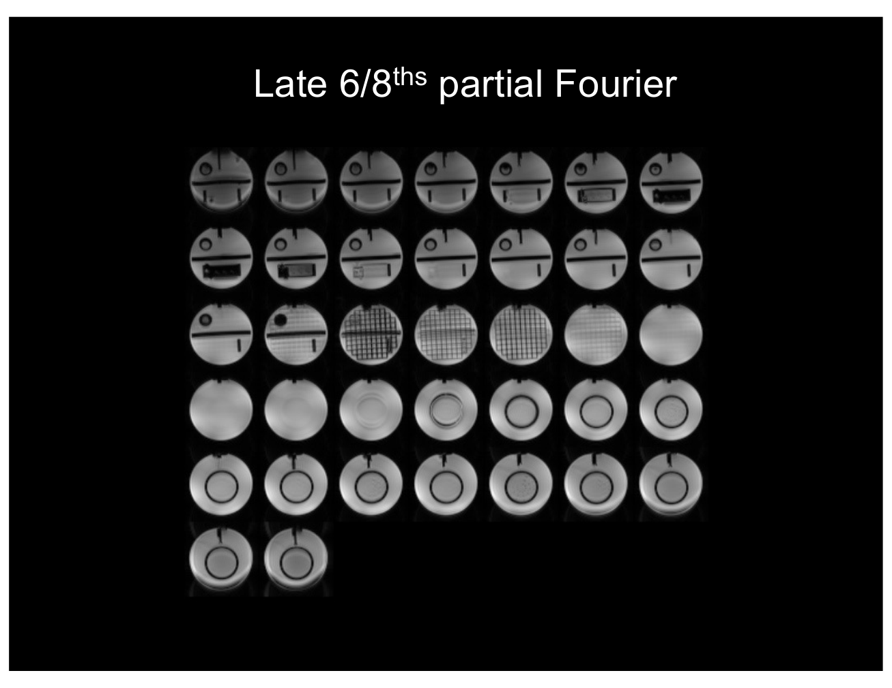

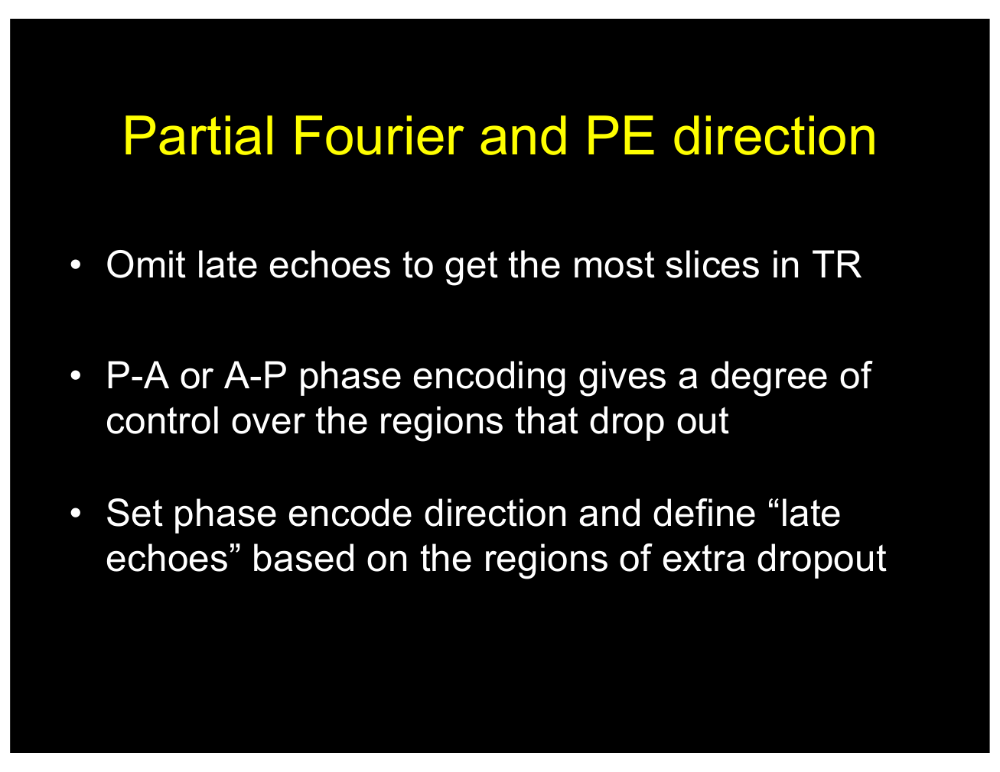

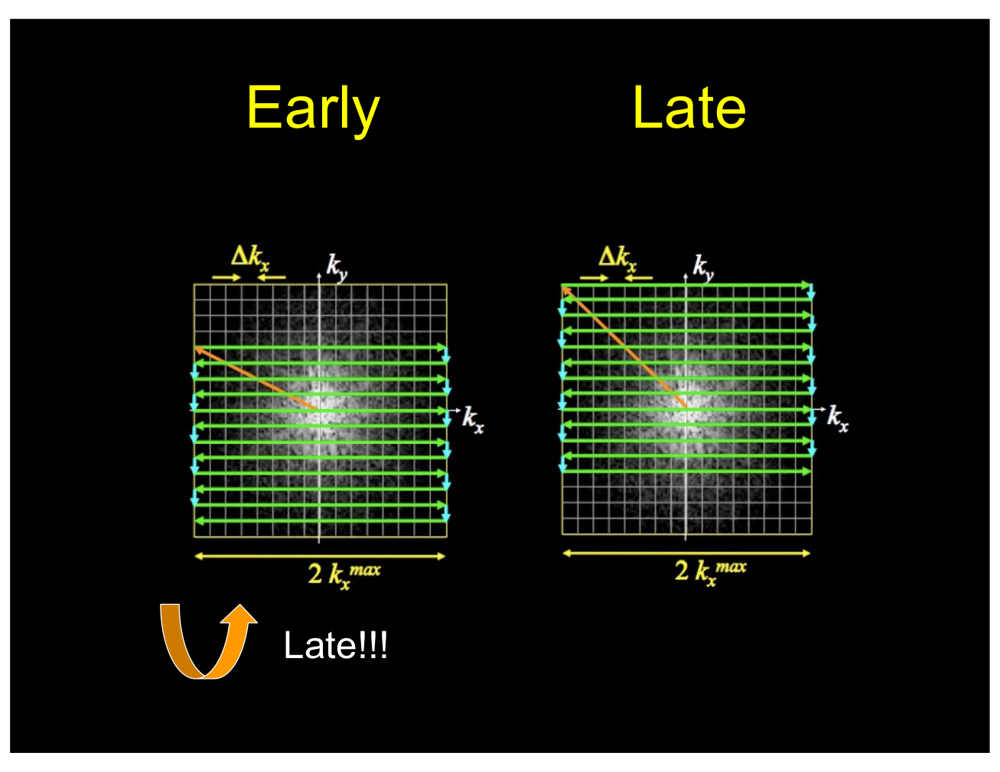

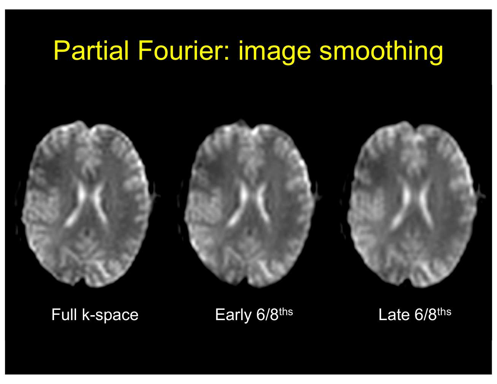

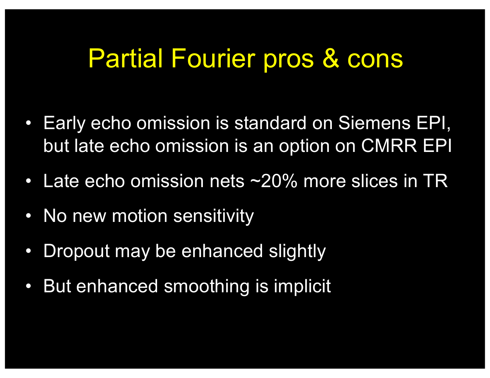

**Figure 6.3. Partial Fourier image consequences.** Full, early, and late partial Fourier images, PE direction, smoothing, and pros/cons. Source pages 151-158 are grouped because they teach one local mechanism or diagnostic comparison. Key source labels and terms include: Partial Fourier EPI; Full k-space Early 6/8ths Late 6/8ths; Full k-space; Early 6/8ths partial Fourier; Late 6/8ths partial Fourier; Partial Fourier and PE direction; Omit late echoes to get the most slices in TR; P-A or A-P phase encoding gives a degree of.

This figure should be read as a sequence inside Chapter 6, not as an isolated picture. It begins
with partial fourier epi and ends with partial fourier pros & cons, so the reader can follow how
the local idea changes across the source panels. The retained source-backed panels are used here
because the original annotations are part of the evidence: the reader needs the labels, axes,
arrows, image examples, and comparison tags to see why the mechanism matters.

The practical lesson is full, early, and late partial fourier images, pe direction, smoothing,
and pros/cons. In a scanner context, the important move is to translate what is drawn into an
acquisition consequence: which gradient is acting, which echo or reference data are being
trusted, which bandwidth or timing choice is limiting, or which image pattern would appear
during quality control.

For Figure 6.3, use the panels as a local reasoning test. If they show a temporal sequence, ask
what physical quantity is being conserved, reversed, accelerated, or lost. If they show images,
compare the same anatomical region across the named conditions before making a protocol
conclusion. That habit prevents a common fMRI error: treating the label partial fourier image
consequences as a diagnosis before checking the visual evidence.

### Chapter Summary

Chapter 6 used pages 140-158 to develop evaluate partial fourier as an acceleration strategy
with asymmetric consequences for te, slices, smoothing, and dropout. The main lesson is
cumulative: the reader should move from vocabulary to mechanism, from mechanism to protocol
choice, and from protocol choice to image or time-series consequences.

### Key Terms

Conjugate, symmetry, reconstruction, Early, versus, late, Image, consequences, protocol.

### Review Questions

1. Explain how conjugate symmetry and reconstruction affects a practical fMRI decision.
2. Describe one way a visual panel in Chapter 6 changes the interpretation of the prose.
3. Name one acquisition parameter from this chapter and predict a tradeoff if it is changed.
4. Distinguish a mechanism-level explanation from an image-appearance description.
5. Identify one quality-control sign that would make you revisit this chapter before scanning more data.

# Chapter 7. Parallel Imaging with GRAPPA

This chapter covers source pages 159-168 and turns them into a self-study sequence about explain
how coil arrays and calibration data support accelerated phase encoding, and why motion can
corrupt the result. The chapter is organized by mechanism and scanning consequence, not by slide
order alone, so figures appear where they support the local explanation.

## R=2 trajectories and calibration

R=2 trajectories and calibration is the local bridge between the course vocabulary and a self-
study explanation. The relevant source ideas include In-plane acceleration; (GRAPPA); R=2
k-space trajectory:; Image-only teaching panel 161; 32-channel coil; Bottom half only, from
underneath with cover removed; GRAPPA scheme (R=2); ACS1 … ACS2 … EPI1 … EPI2 … EPI3
..............… EPIN; The ACS make up a reference data set; The omitted k-space lines from each
accelerated (under-. Taken together, they should be read as one argument about connect skipped
k-space lines, coil arrays, and ACS data. The textbook version therefore slows the slide
sequence down: first define the measured or manipulated quantity, then state what changes it,
and only then connect the change to image appearance or fMRI interpretation.

In this part of parallel imaging with grappa, the central discipline is to separate mechanism
from display. A pulse sequence diagram, a k-space grid, or a brain image is not merely a picture
of a result; it encodes a chain of causes. For r=2 trajectories and calibration, that chain
starts with the controlled scanner quantity, passes through spin phase or signal weighting, and
ends as a spatial pattern, time-series change, or acquisition tradeoff. If the chain is left
implicit, the same term can be memorized without being understood.

A useful way to study r=2 trajectories and calibration is to ask three questions for every
equation or panel. What quantity is deliberately controlled in Chapter 7's local sequence or
example? What uncontrolled physical or biological quantity can perturb it? What image-space or
time-series signature would reveal the problem? These questions keep the mathematics connected
to practical fMRI, where protocol choices are judged by SNR, temporal stability, distortion,
dropout, timing, and interpretability rather than by elegance alone.

The source pages named In-plane acceleration, R=2 k-space trajectory:, Image-only teaching panel
161, 32-channel coil, GRAPPA scheme (R=2) also show why MRI explanations often require several
levels. At the microscopic level, spins precess, relax, dephase, or refocus. At the sequence
level, RF pulses and gradients impose timing and spatial encoding. At the reconstruction level,
Fourier relationships convert sampled signals into images. At the experimental level, subject
motion, physiology, hardware stability, and human factors determine whether the image series
supports a defensible fMRI interpretation.

For practice, the reader should be able to restate r=2 trajectories and calibration without
using slide shorthand. The restatement should include the relevant variables, the direction of
the effect, and the likely failure mode. A good explanation is specific enough to predict what
would happen if the field strength, gradient area, echo spacing, flip angle, coil sensitivity,
motion state, or nuisance measurement changed.

## Figure 7.1. GRAPPA acceleration and calibration data

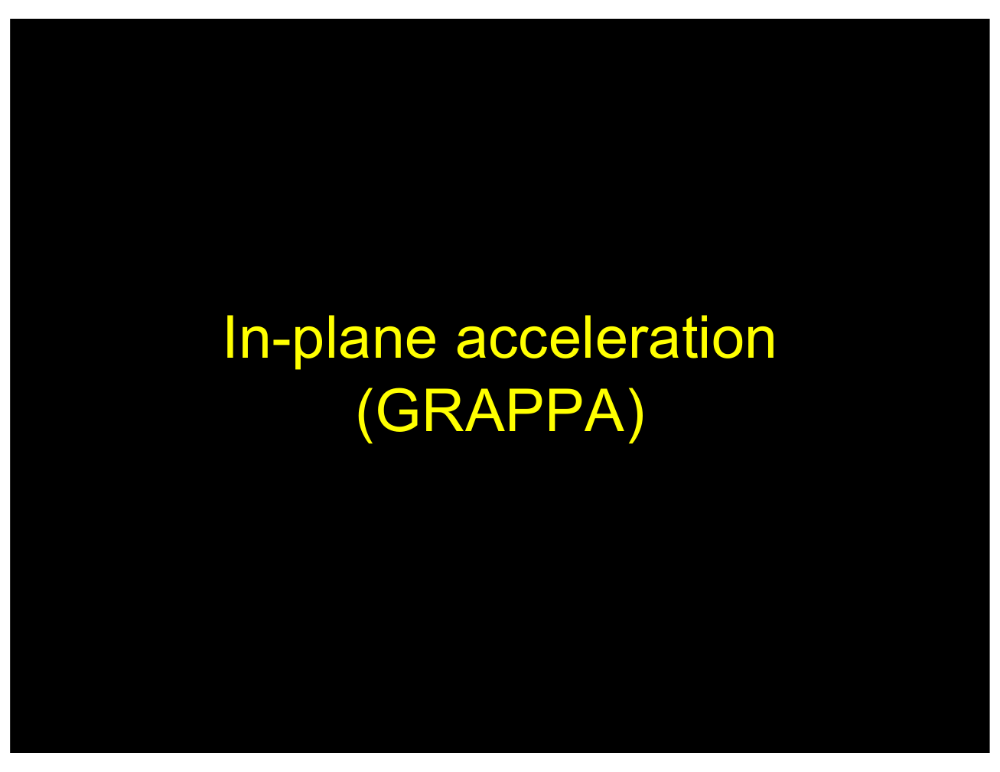

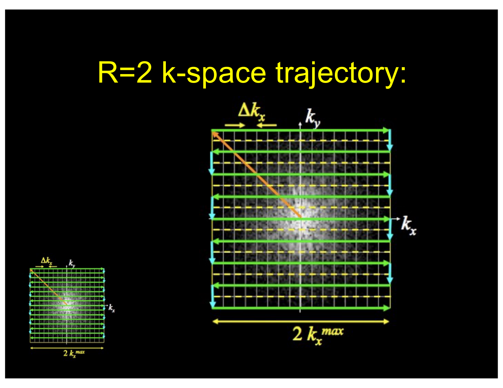

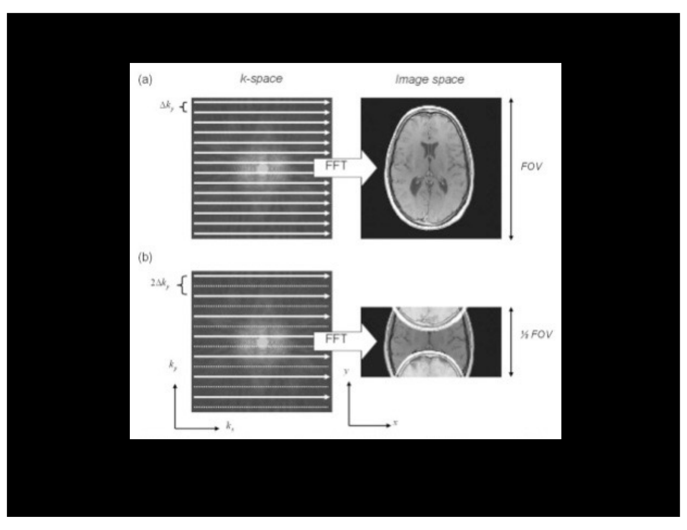

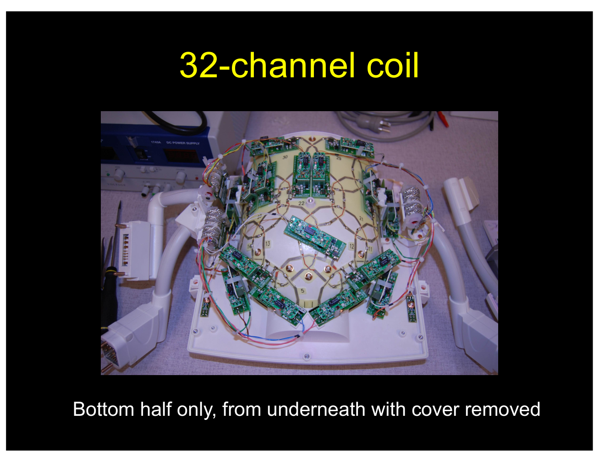

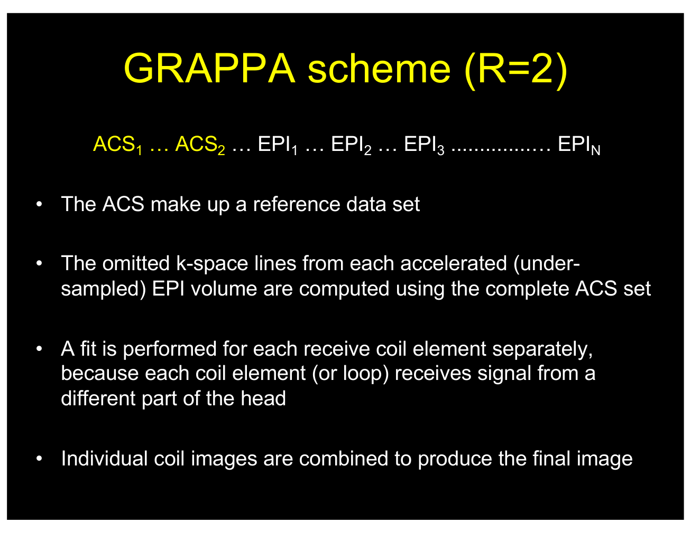

**Figure 7.1. GRAPPA acceleration and calibration data.** R=2 trajectories, receive-array requirements, and ACS-based reconstruction. Source pages 159-163 are grouped because they teach one local mechanism or diagnostic comparison. Key source labels and terms include: In-plane acceleration; (GRAPPA); R=2 k-space trajectory:; Image-only teaching panel 161; 32-channel coil; Bottom half only, from underneath with cover removed; GRAPPA scheme (R=2); ACS1 … ACS2 … EPI1 … EPI2 … EPI3 ..............… EPIN.

This figure should be read as a sequence inside Chapter 7, not as an isolated picture. It begins
with in-plane acceleration and ends with grappa scheme (r=2), so the reader can follow how the
local idea changes across the source panels. The retained source-backed panels are used here
because the original annotations are part of the evidence: the reader needs the labels, axes,
arrows, image examples, and comparison tags to see why the mechanism matters.

The practical lesson is r=2 trajectories, receive-array requirements, and acs-based
reconstruction. In a scanner context, the important move is to translate what is drawn into an
acquisition consequence: which gradient is acting, which echo or reference data are being
trusted, which bandwidth or timing choice is limiting, or which image pattern would appear
during quality control.

For Figure 7.1, use the panels as a local reasoning test. If they show a temporal sequence, ask
what physical quantity is being conserved, reversed, accelerated, or lost. If they show images,
compare the same anatomical region across the named conditions before making a protocol
conclusion. That habit prevents a common fMRI error: treating the label grappa acceleration and
calibration data as a diagnosis before checking the visual evidence.

## Motion sensitivity

Motion sensitivity is the local bridge between the course vocabulary and a self-study
explanation. The relevant source ideas include GRAPPA motion sensitivity; ACS used to
reconstruct all the under-sampled; time series; Motion during the ACS affects all data!!!;
Motion after the ACS generates a mismatch; between the ACS and the current EPI volume; ACS1 …
ACS2 … EPI1 … EPI2 … EPI3 ............ EPIN-1 … EPI N; Motion corruption of; reference data;
Mismatch of reference data; with the time series; No motion Motion during ACS Motion after ACS.
Taken together, they should be read as one argument about distinguish ACS corruption from later
reference mismatch. The textbook version therefore slows the slide sequence down: first define
the measured or manipulated quantity, then state what changes it, and only then connect the
change to image appearance or fMRI interpretation.

In this part of parallel imaging with grappa, the central discipline is to separate mechanism
from display. A pulse sequence diagram, a k-space grid, or a brain image is not merely a picture
of a result; it encodes a chain of causes. For motion sensitivity, that chain starts with the
controlled scanner quantity, passes through spin phase or signal weighting, and ends as a
spatial pattern, time-series change, or acquisition tradeoff. If the chain is left implicit, the
same term can be memorized without being understood.

A useful way to study motion sensitivity is to ask three questions for every equation or panel.
What quantity is deliberately controlled in Chapter 7's local sequence or example? What
uncontrolled physical or biological quantity can perturb it? What image-space or time-series
signature would reveal the problem? These questions keep the mathematics connected to practical
fMRI, where protocol choices are judged by SNR, temporal stability, distortion, dropout, timing,
and interpretability rather than by elegance alone.

The source pages named GRAPPA motion sensitivity, ACS1 … ACS2 … EPI1 … EPI2 … EPI3 ............
EPIN-1 … EPI N, GRAPPA motion sensitivity also show why MRI explanations often require several
levels. At the microscopic level, spins precess, relax, dephase, or refocus. At the sequence
level, RF pulses and gradients impose timing and spatial encoding. At the reconstruction level,
Fourier relationships convert sampled signals into images. At the experimental level, subject
motion, physiology, hardware stability, and human factors determine whether the image series
supports a defensible fMRI interpretation.

For practice, the reader should be able to restate motion sensitivity without using slide
shorthand. The restatement should include the relevant variables, the direction of the effect,
and the likely failure mode. A good explanation is specific enough to predict what would happen
if the field strength, gradient area, echo spacing, flip angle, coil sensitivity, motion state,
or nuisance measurement changed.

## Figure 7.2. GRAPPA motion sensitivity and tradeoffs

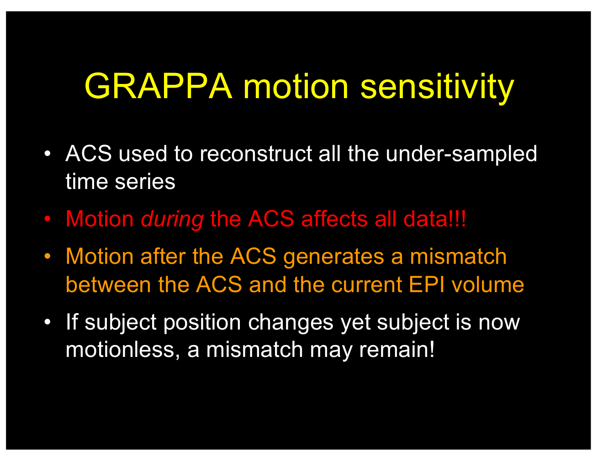

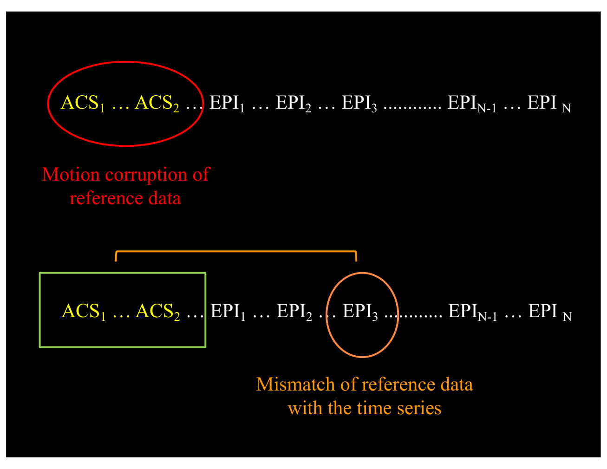

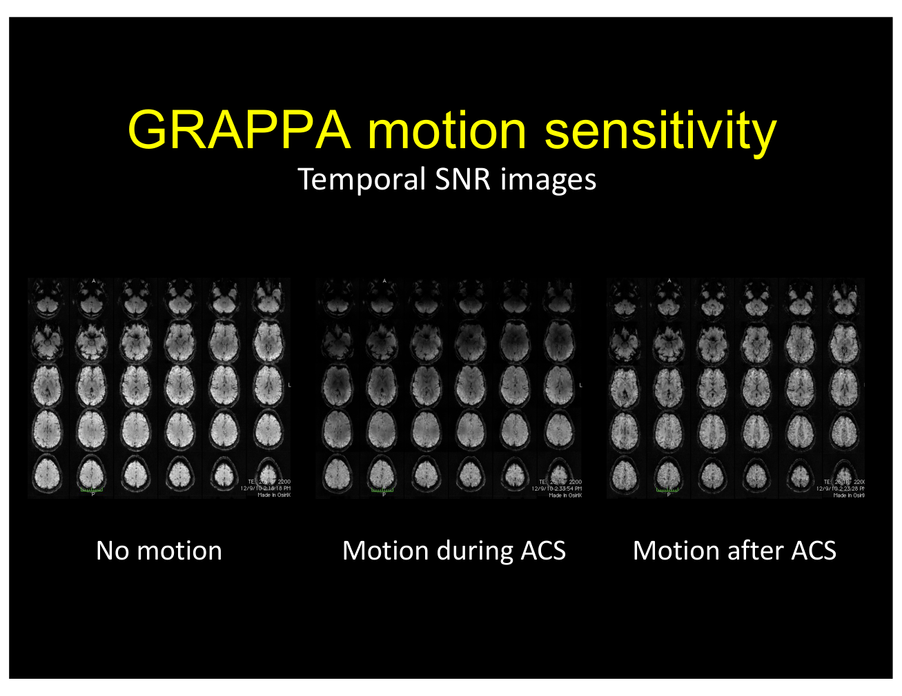

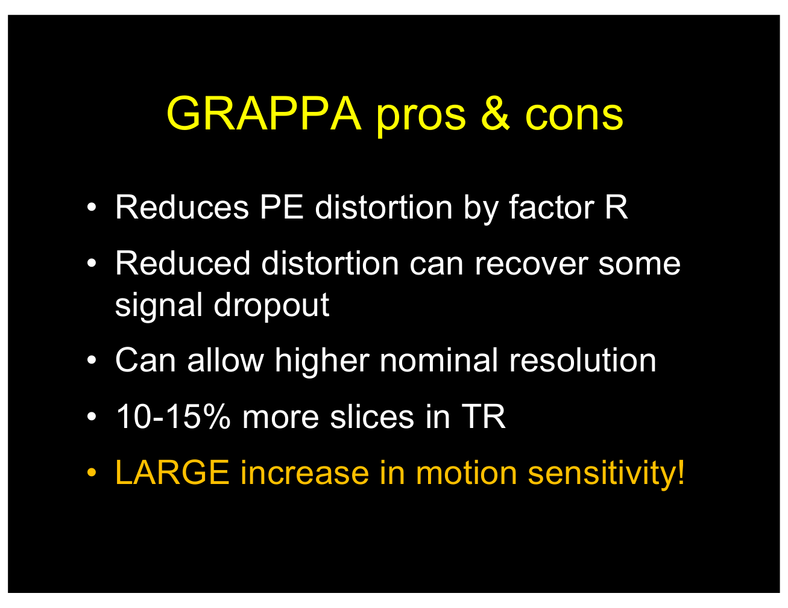

**Figure 7.2. GRAPPA motion sensitivity and tradeoffs.** Motion during ACS versus after ACS and the practical gains and costs of GRAPPA. Source pages 164-167 are grouped because they teach one local mechanism or diagnostic comparison. Key source labels and terms include: GRAPPA motion sensitivity; ACS used to reconstruct all the under-sampled; time series; Motion during the ACS affects all data!!!; Motion after the ACS generates a mismatch; between the ACS and the current EPI volume; ACS1 … ACS2 … EPI1 … EPI2 … EPI3 ............ EPIN-1 … EPI N; Motion corruption of.

This figure should be read as a sequence inside Chapter 7, not as an isolated picture. It begins
with grappa motion sensitivity and ends with grappa pros & cons, so the reader can follow how
the local idea changes across the source panels. The retained source-backed panels are used here
because the original annotations are part of the evidence: the reader needs the labels, axes,
arrows, image examples, and comparison tags to see why the mechanism matters.

The practical lesson is motion during acs versus after acs and the practical gains and costs of
grappa. In a scanner context, the important move is to translate what is drawn into an
acquisition consequence: which gradient is acting, which echo or reference data are being
trusted, which bandwidth or timing choice is limiting, or which image pattern would appear
during quality control.

For Figure 7.2, use the panels as a local reasoning test. If they show a temporal sequence, ask
what physical quantity is being conserved, reversed, accelerated, or lost. If they show images,
compare the same anatomical region across the named conditions before making a protocol
conclusion. That habit prevents a common fMRI error: treating the label grappa motion
sensitivity and tradeoffs as a diagnosis before checking the visual evidence.

## Protocol consequences

Protocol consequences is the local bridge between the course vocabulary and a self-study
explanation. The relevant source ideas include GRAPPA pros & cons; Reduces PE distortion by
factor R; Reduced distortion can recover some; signal dropout; Can allow higher nominal
resolution; 10-15% more slices in TR; Further information; Partial Fourier versus GRAPPA for;
increasing EPI slice coverage; versus-grappa-for.html. Taken together, they should be read as
one argument about weigh reduced distortion against SNR and motion cost. The textbook version
therefore slows the slide sequence down: first define the measured or manipulated quantity, then
state what changes it, and only then connect the change to image appearance or fMRI
interpretation.

In this part of parallel imaging with grappa, the central discipline is to separate mechanism
from display. A pulse sequence diagram, a k-space grid, or a brain image is not merely a picture
of a result; it encodes a chain of causes. For protocol consequences, that chain starts with the
controlled scanner quantity, passes through spin phase or signal weighting, and ends as a
spatial pattern, time-series change, or acquisition tradeoff. If the chain is left implicit, the
same term can be memorized without being understood.

A useful way to study protocol consequences is to ask three questions for every equation or
panel. What quantity is deliberately controlled in Chapter 7's local sequence or example? What
uncontrolled physical or biological quantity can perturb it? What image-space or time-series
signature would reveal the problem? These questions keep the mathematics connected to practical
fMRI, where protocol choices are judged by SNR, temporal stability, distortion, dropout, timing,
and interpretability rather than by elegance alone.

The source pages named GRAPPA pros & cons, Further information also show why MRI explanations
often require several levels. At the microscopic level, spins precess, relax, dephase, or
refocus. At the sequence level, RF pulses and gradients impose timing and spatial encoding. At
the reconstruction level, Fourier relationships convert sampled signals into images. At the
experimental level, subject motion, physiology, hardware stability, and human factors determine
whether the image series supports a defensible fMRI interpretation.

For practice, the reader should be able to restate protocol consequences without using slide
shorthand. The restatement should include the relevant variables, the direction of the effect,
and the likely failure mode. A good explanation is specific enough to predict what would happen
if the field strength, gradient area, echo spacing, flip angle, coil sensitivity, motion state,
or nuisance measurement changed.

### Chapter Summary

Chapter 7 used pages 159-168 to develop explain how coil arrays and calibration data support
accelerated phase encoding, and why motion can corrupt the result. The main lesson is
cumulative: the reader should move from vocabulary to mechanism, from mechanism to protocol
choice, and from protocol choice to image or time-series consequences.

### Key Terms

trajectories, calibration, Motion, sensitivity, Protocol, consequences.

### Review Questions

1. Explain how r=2 trajectories and calibration affects a practical fMRI decision.
2. Describe one way a visual panel in Chapter 7 changes the interpretation of the prose.
3. Name one acquisition parameter from this chapter and predict a tradeoff if it is changed.
4. Distinguish a mechanism-level explanation from an image-appearance description.
5. Identify one quality-control sign that would make you revisit this chapter before scanning more data.

# Chapter 8. Simultaneous Multi-slice and Multi-echo EPI

This chapter covers source pages 169-182 and turns them into a self-study sequence about extend
epi acceleration and signal modeling to slice multiplexing and multiple echo times. The chapter
is organized by mechanism and scanning consequence, not by slide order alone, so figures appear
where they support the local explanation.

## SMS requirements and reference data

SMS requirements and reference data is the local bridge between the course vocabulary and a
self-study explanation. The relevant source ideas include Simultaneous multi-slice; (SMS) EPI;
a.k.a. multi-band (MB) EPI; Requires a phased-array coil; Need lots of coil loops along the
slice axis; Acquire a set of "single band" reference EPIs; without acceleration, i.e. one multi-
slice set at a; time (takes SMS x TR to acquire); Then acquire time series using simultaneous
slice; Coils along the slice axis?; From Kaza et al. JMRI (2011); From: D Feinberg & K
Setsompop, JMR (2013). Taken together, they should be read as one argument about show why slice-
axis coil diversity and SBRef data matter. The textbook version therefore slows the slide
sequence down: first define the measured or manipulated quantity, then state what changes it,
and only then connect the change to image appearance or fMRI interpretation.

In this part of simultaneous multi-slice and multi-echo epi, the central discipline is to
separate mechanism from display. A pulse sequence diagram, a k-space grid, or a brain image is
not merely a picture of a result; it encodes a chain of causes. For sms requirements and
reference data, that chain starts with the controlled scanner quantity, passes through spin
phase or signal weighting, and ends as a spatial pattern, time-series change, or acquisition
tradeoff. If the chain is left implicit, the same term can be memorized without being
understood.

A useful way to study sms requirements and reference data is to ask three questions for every
equation or panel. What quantity is deliberately controlled in Chapter 8's local sequence or
example? What uncontrolled physical or biological quantity can perturb it? What image-space or
time-series signature would reveal the problem? These questions keep the mathematics connected
to practical fMRI, where protocol choices are judged by SNR, temporal stability, distortion,
dropout, timing, and interpretability rather than by elegance alone.

The source pages named Simultaneous multi-slice, - Requires a phased-array coil, Coils along the
slice axis?, From: D Feinberg & K Setsompop, JMR (2013), SMS-EPI pulse sequence, and related
panels also show why MRI explanations often require several levels. At the microscopic level,
spins precess, relax, dephase, or refocus. At the sequence level, RF pulses and gradients impose
timing and spatial encoding. At the reconstruction level, Fourier relationships convert sampled
signals into images. At the experimental level, subject motion, physiology, hardware stability,
and human factors determine whether the image series supports a defensible fMRI interpretation.

For practice, the reader should be able to restate sms requirements and reference data without
using slide shorthand. The restatement should include the relevant variables, the direction of
the effect, and the likely failure mode. A good explanation is specific enough to predict what
would happen if the field strength, gradient area, echo spacing, flip angle, coil sensitivity,
motion state, or nuisance measurement changed.

## Figure 8.1. SMS requirements, reference data, and pulse sequence

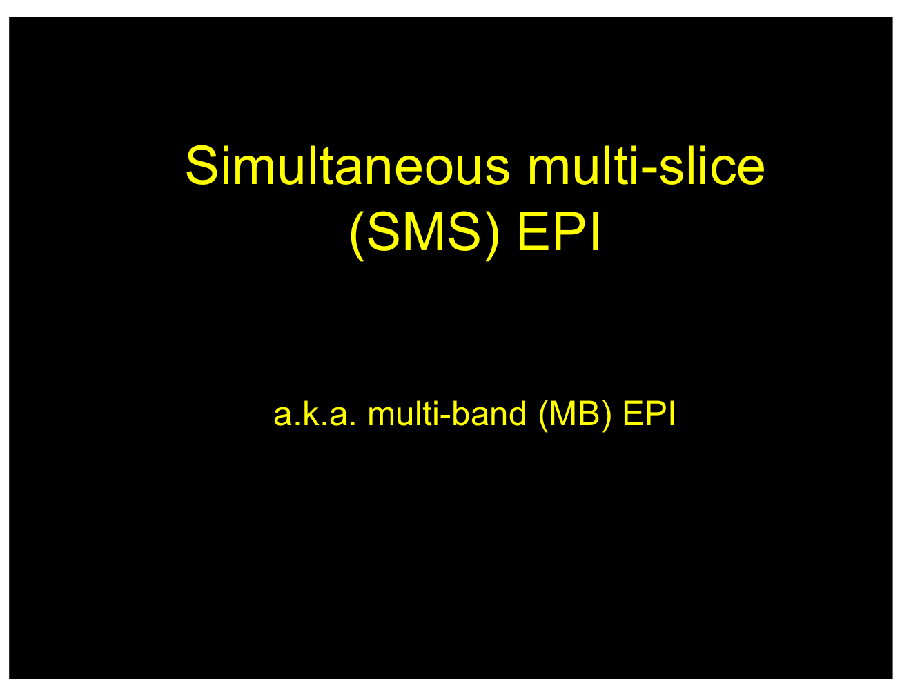

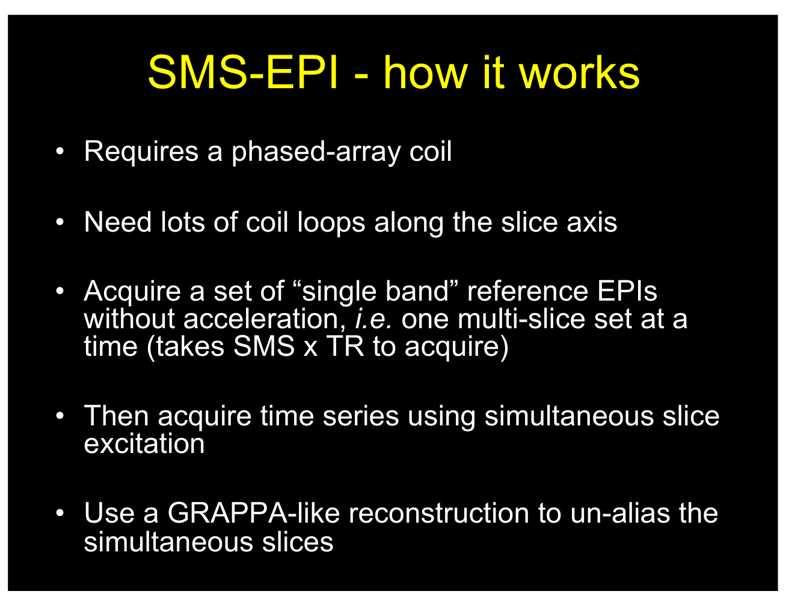

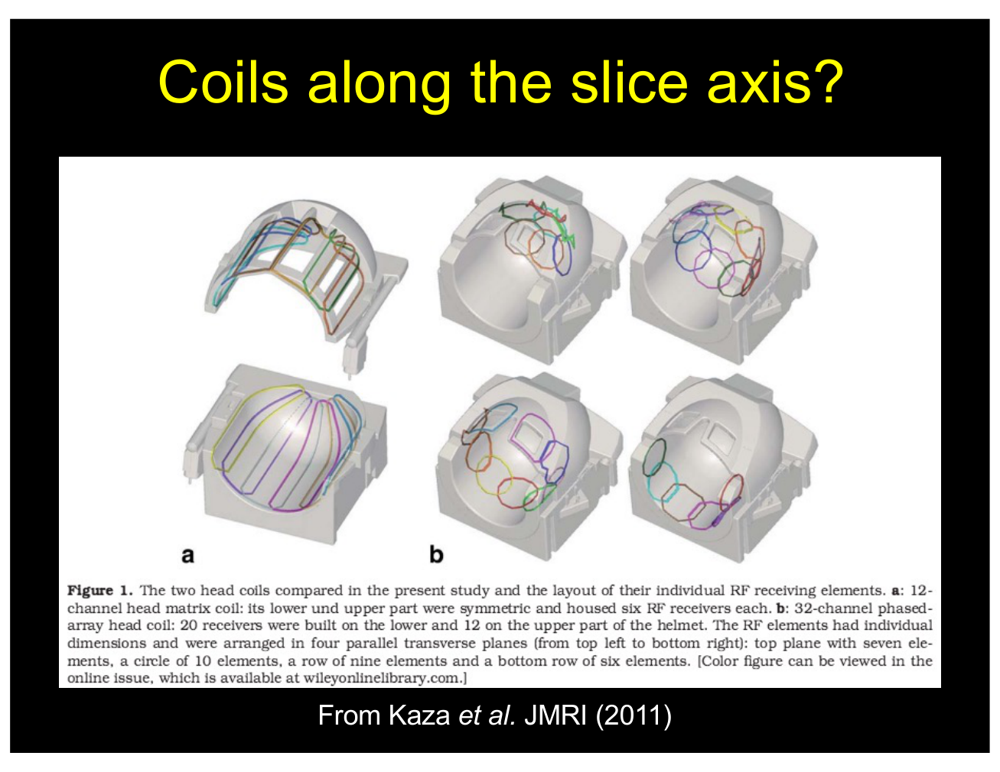

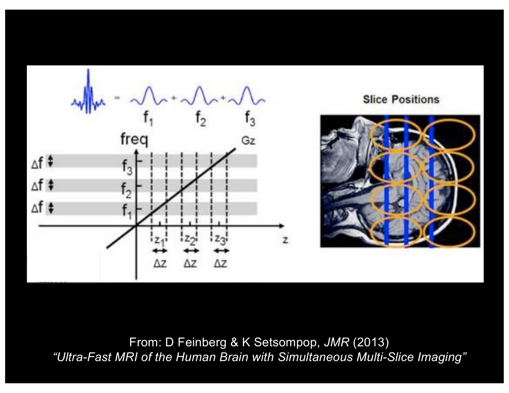

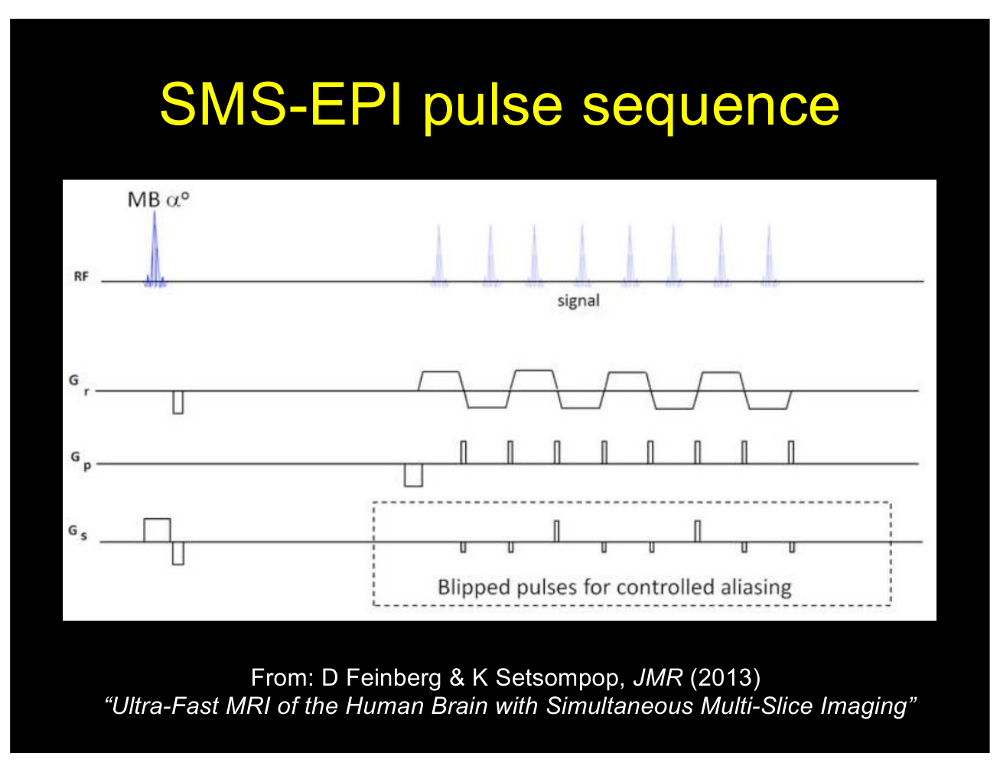

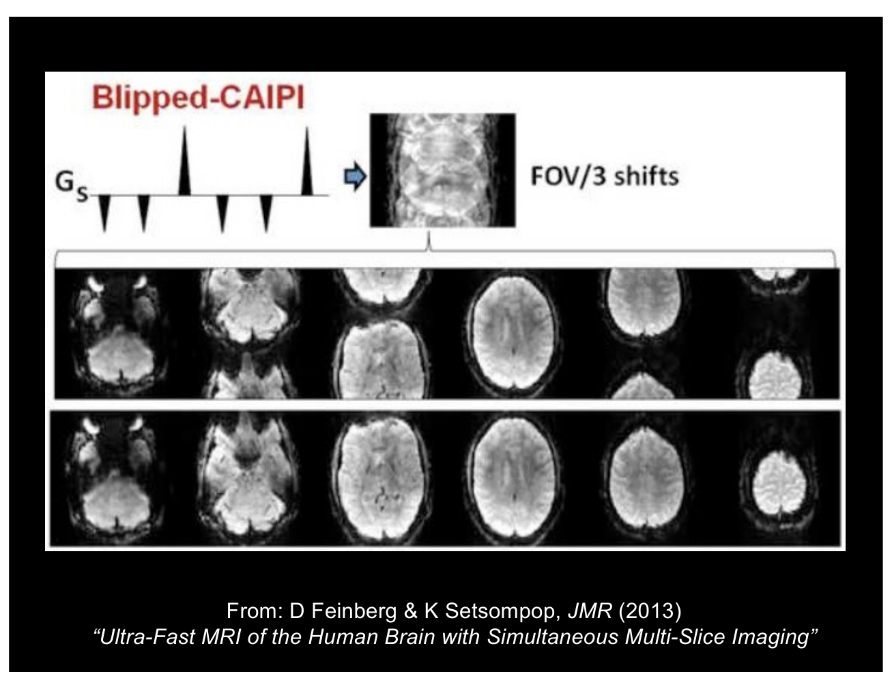

**Figure 8.1. SMS requirements, reference data, and pulse sequence.** Slice-axis coil diversity, SBRef data, and SMS pulse-sequence structure. Source pages 169-174 are grouped because they teach one local mechanism or diagnostic comparison. Key source labels and terms include: Simultaneous multi-slice; (SMS) EPI; a.k.a. multi-band (MB) EPI; Requires a phased-array coil; Need lots of coil loops along the slice axis; Acquire a set of "single band" reference EPIs; without acceleration, i.e. one multi-slice set at a; time (takes SMS x TR to acquire).

This figure should be read as a sequence inside Chapter 8, not as an isolated picture. It begins
with simultaneous multi-slice and ends with from: d feinberg & k setsompop, jmr (2013), so the
reader can follow how the local idea changes across the source panels. The retained source-
backed panels are used here because the original annotations are part of the evidence: the
reader needs the labels, axes, arrows, image examples, and comparison tags to see why the
mechanism matters.

The practical lesson is slice-axis coil diversity, sbref data, and sms pulse-sequence structure.
In a scanner context, the important move is to translate what is drawn into an acquisition
consequence: which gradient is acting, which echo or reference data are being trusted, which
bandwidth or timing choice is limiting, or which image pattern would appear during quality
control.

For Figure 8.1, use the panels as a local reasoning test. If they show a temporal sequence, ask
what physical quantity is being conserved, reversed, accelerated, or lost. If they show images,
compare the same anatomical region across the named conditions before making a protocol
conclusion. That habit prevents a common fMRI error: treating the label sms requirements,
reference data, and pulse sequence as a diagnosis before checking the visual evidence.

## SMS benefits and limits

SMS benefits and limits is the local bridge between the course vocabulary and a self-study
explanation. The relevant source ideas include EPI SMS=6; Some contrast differences due to
longer effective TR for EPI.; No intentional motion; Motion with SMS-EPI; TSNR images; MB=6, 2
mm voxels, TR=1300 ms; Motion during SBRef; Motion after SBRef; But even SMS has limits!; Voxels
below (2 mm)3 have low SNR; 1.5 mm resolution (partial brain coverage); is probably the
practical limit at 3 T. Taken together, they should be read as one argument about balance speed,
contrast, motion sensitivity, and practical resolution. The textbook version therefore slows the
slide sequence down: first define the measured or manipulated quantity, then state what changes
it, and only then connect the change to image appearance or fMRI interpretation.

In this part of simultaneous multi-slice and multi-echo epi, the central discipline is to
separate mechanism from display. A pulse sequence diagram, a k-space grid, or a brain image is
not merely a picture of a result; it encodes a chain of causes. For sms benefits and limits,
that chain starts with the controlled scanner quantity, passes through spin phase or signal
weighting, and ends as a spatial pattern, time-series change, or acquisition tradeoff. If the
chain is left implicit, the same term can be memorized without being understood.

A useful way to study sms benefits and limits is to ask three questions for every equation or
panel. What quantity is deliberately controlled in Chapter 8's local sequence or example? What
uncontrolled physical or biological quantity can perturb it? What image-space or time-series
signature would reveal the problem? These questions keep the mathematics connected to practical
fMRI, where protocol choices are judged by SNR, temporal stability, distortion, dropout, timing,
and interpretability rather than by elegance alone.

The source pages named EPI SMS=6, No intentional motion, But even SMS has limits! also show why
MRI explanations often require several levels. At the microscopic level, spins precess, relax,
dephase, or refocus. At the sequence level, RF pulses and gradients impose timing and spatial
encoding. At the reconstruction level, Fourier relationships convert sampled signals into
images. At the experimental level, subject motion, physiology, hardware stability, and human
factors determine whether the image series supports a defensible fMRI interpretation.

For practice, the reader should be able to restate sms benefits and limits without using slide
shorthand. The restatement should include the relevant variables, the direction of the effect,
and the likely failure mode. A good explanation is specific enough to predict what would happen
if the field strength, gradient area, echo spacing, flip angle, coil sensitivity, motion state,
or nuisance measurement changed.

## Figure 8.2. SMS image examples and limits

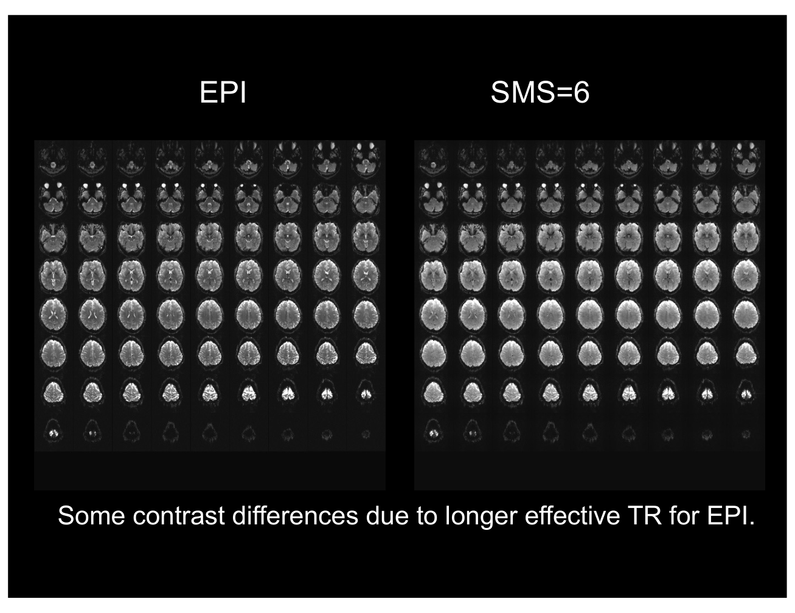

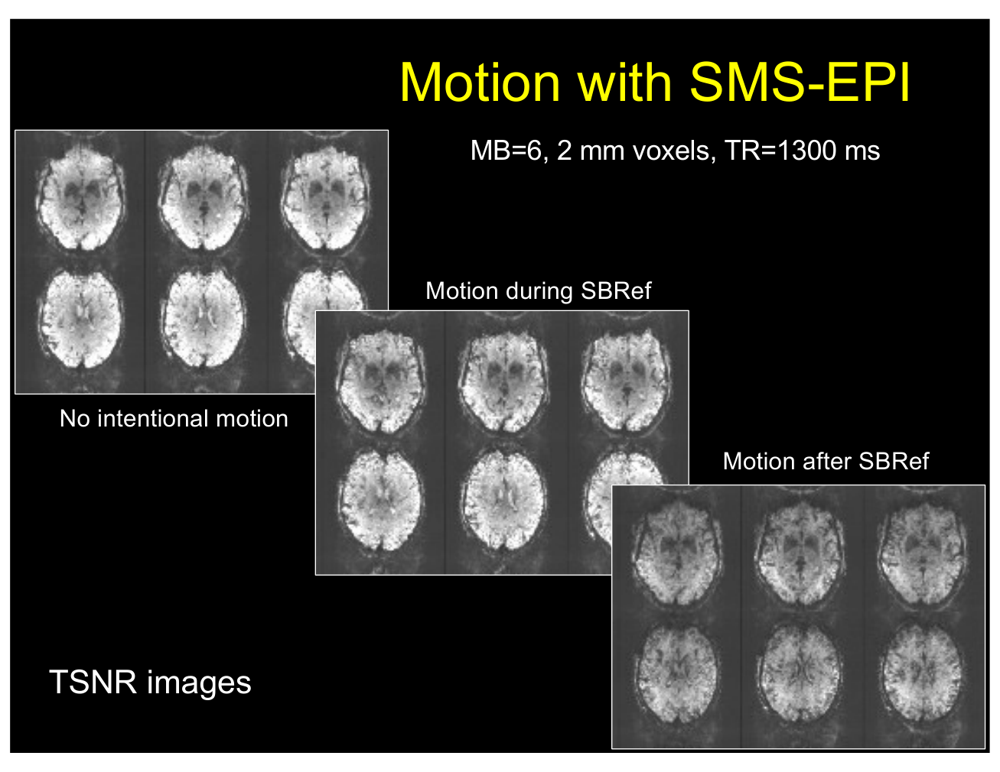

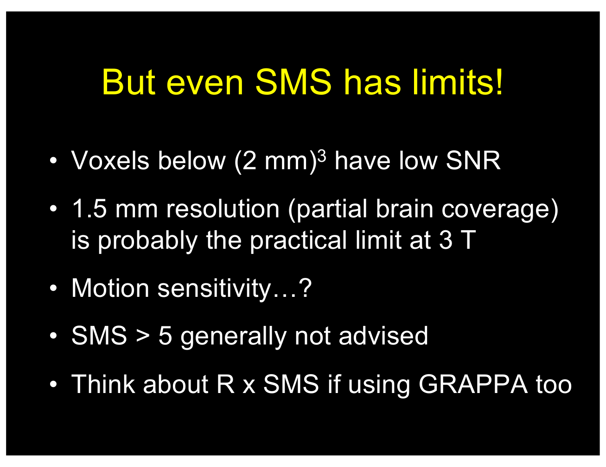

**Figure 8.2. SMS image examples and limits.** Contrast differences, SBRef motion, voxel-size limits, and practical MB factors. Source pages 175-177 are grouped because they teach one local mechanism or diagnostic comparison. Key source labels and terms include: EPI SMS=6; Some contrast differences due to longer effective TR for EPI.; No intentional motion; Motion with SMS-EPI; TSNR images; MB=6, 2 mm voxels, TR=1300 ms; Motion during SBRef; Motion after SBRef.

This figure should be read as a sequence inside Chapter 8, not as an isolated picture. It begins
with epi sms=6 and ends with but even sms has limits!, so the reader can follow how the local
idea changes across the source panels. The retained source-backed panels are used here because
the original annotations are part of the evidence: the reader needs the labels, axes, arrows,
image examples, and comparison tags to see why the mechanism matters.

The practical lesson is contrast differences, sbref motion, voxel-size limits, and practical mb
factors. In a scanner context, the important move is to translate what is drawn into an
acquisition consequence: which gradient is acting, which echo or reference data are being
trusted, which bandwidth or timing choice is limiting, or which image pattern would appear
during quality control.

For Figure 8.2, use the panels as a local reasoning test. If they show a temporal sequence, ask
what physical quantity is being conserved, reversed, accelerated, or lost. If they show images,
compare the same anatomical region across the named conditions before making a protocol
conclusion. That habit prevents a common fMRI error: treating the label sms image examples and
limits as a diagnosis before checking the visual evidence.

## Multi-echo acquisition and classification

Multi-echo acquisition and classification is the local bridge between the course vocabulary and
a self-study explanation. The relevant source ideas include Multi-echo EPI; Combine 2+ echoes to
boost SNR; Or use a model to classify BOLD from; non-BOLD signal changes; tedana: TE Dependent
ANAlysis; Weighted sum of echoes; Classify BOLD vs non-BOLD; ME-EPI pros & cons; Can boost
regional SNR; Can sometimes differentiate artifacts; Doesn't deal with a lot of physiology;
(e.g. blood gases) which cause real. Taken together, they should be read as one argument about
explain weighted echo combination and BOLD/non-BOLD separation. The textbook version therefore
slows the slide sequence down: first define the measured or manipulated quantity, then state
what changes it, and only then connect the change to image appearance or fMRI interpretation.

In this part of simultaneous multi-slice and multi-echo epi, the central discipline is to
separate mechanism from display. A pulse sequence diagram, a k-space grid, or a brain image is
not merely a picture of a result; it encodes a chain of causes. For multi-echo acquisition and
classification, that chain starts with the controlled scanner quantity, passes through spin
phase or signal weighting, and ends as a spatial pattern, time-series change, or acquisition
tradeoff. If the chain is left implicit, the same term can be memorized without being
understood.

A useful way to study multi-echo acquisition and classification is to ask three questions for
every equation or panel. What quantity is deliberately controlled in Chapter 8's local sequence
or example? What uncontrolled physical or biological quantity can perturb it? What image-space
or time-series signature would reveal the problem? These questions keep the mathematics
connected to practical fMRI, where protocol choices are judged by SNR, temporal stability,
distortion, dropout, timing, and interpretability rather than by elegance alone.

The source pages named Multi-echo EPI, Weighted sum of echoes, Classify BOLD vs non-BOLD,
Classify BOLD vs non-BOLD, ME-EPI pros & cons also show why MRI explanations often require
several levels. At the microscopic level, spins precess, relax, dephase, or refocus. At the
sequence level, RF pulses and gradients impose timing and spatial encoding. At the
reconstruction level, Fourier relationships convert sampled signals into images. At the
experimental level, subject motion, physiology, hardware stability, and human factors determine
whether the image series supports a defensible fMRI interpretation.

For practice, the reader should be able to restate multi-echo acquisition and classification
without using slide shorthand. The restatement should include the relevant variables, the
direction of the effect, and the likely failure mode. A good explanation is specific enough to
predict what would happen if the field strength, gradient area, echo spacing, flip angle, coil
sensitivity, motion state, or nuisance measurement changed.

## Figure 8.3. Multi-echo EPI and BOLD classification

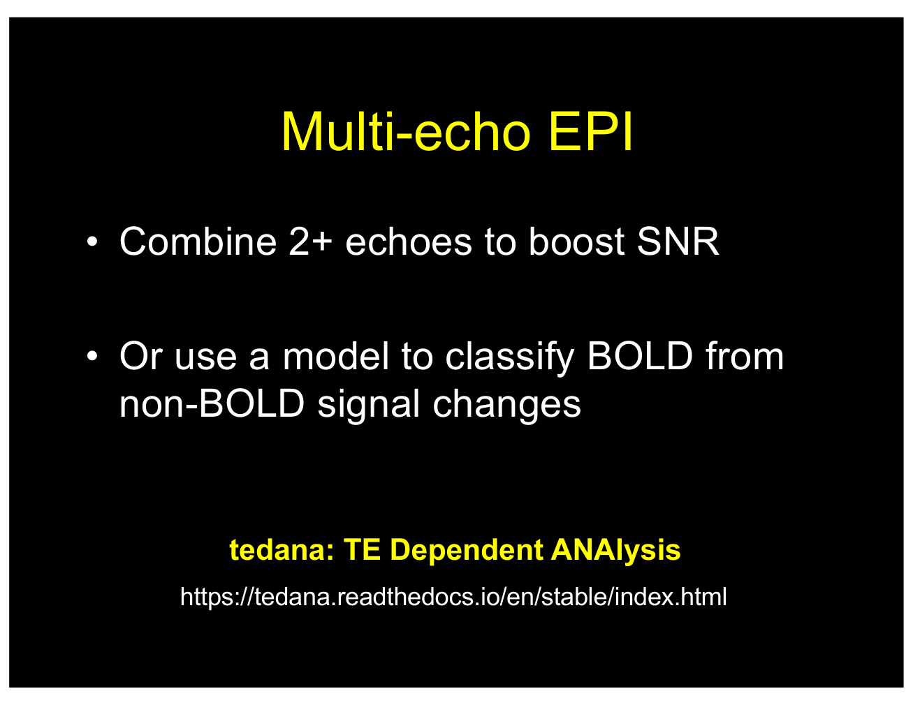

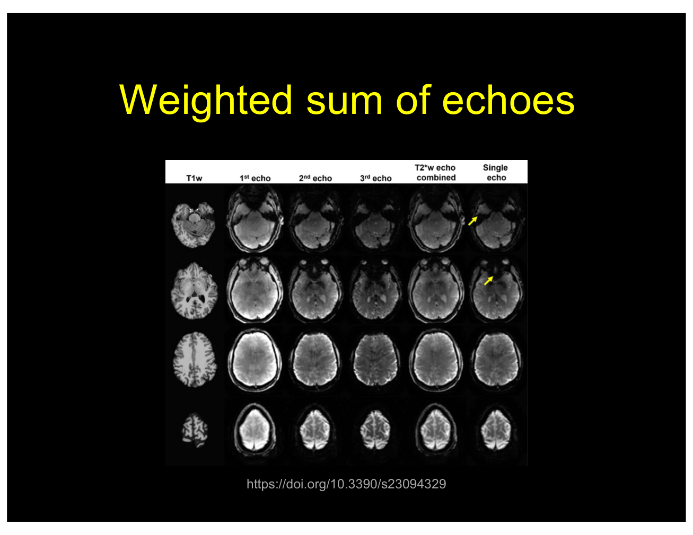

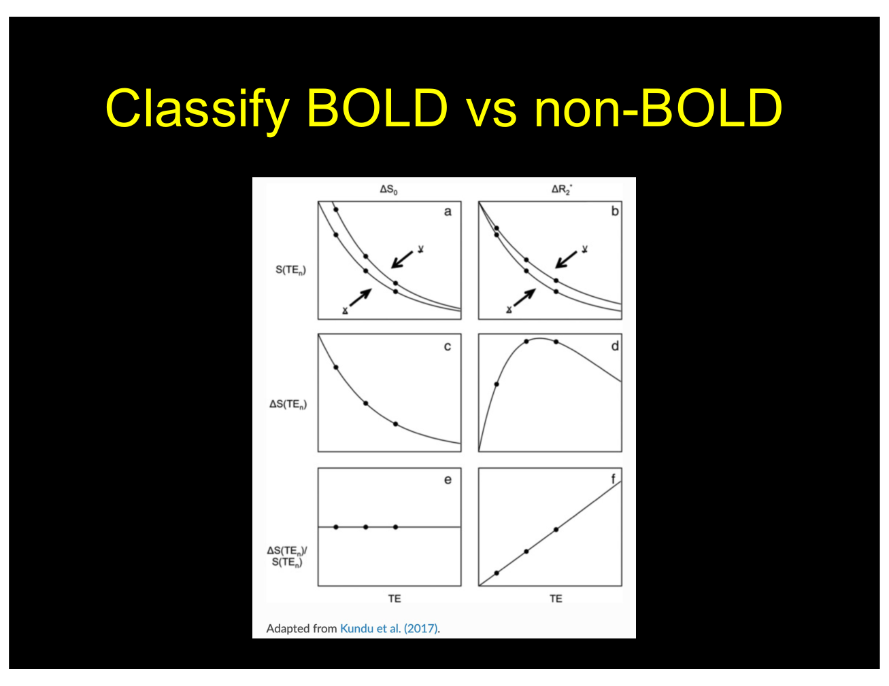

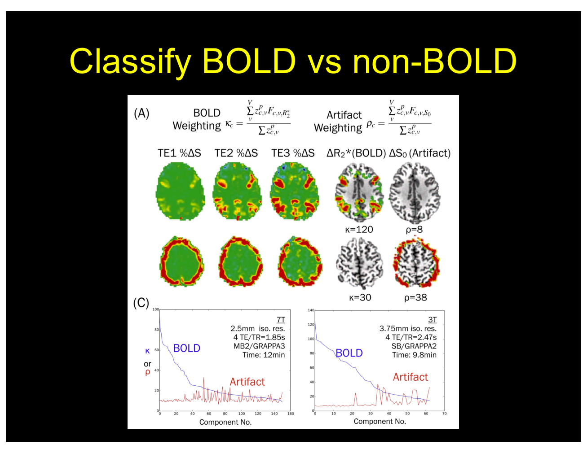

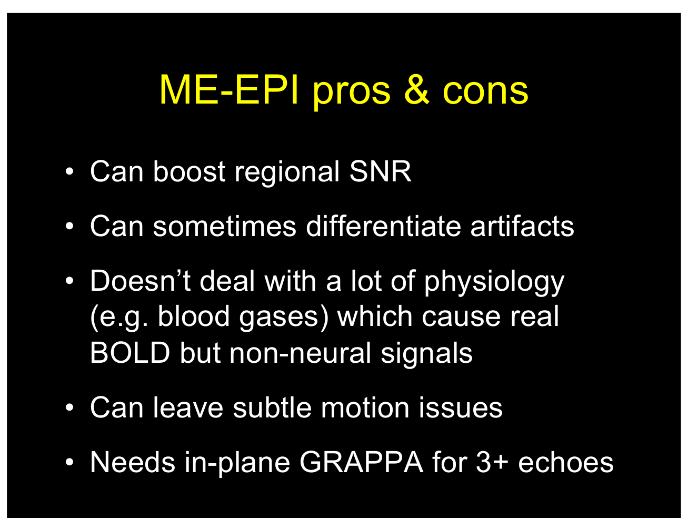

**Figure 8.3. Multi-echo EPI and BOLD classification.** Weighted echo summation, TE dependence, and BOLD/non-BOLD component classification. Source pages 178-182 are grouped because they teach one local mechanism or diagnostic comparison. Key source labels and terms include: Multi-echo EPI; Combine 2+ echoes to boost SNR; Or use a model to classify BOLD from; non-BOLD signal changes; tedana: TE Dependent ANAlysis; Weighted sum of echoes; Classify BOLD vs non-BOLD; ME-EPI pros & cons.

This figure should be read as a sequence inside Chapter 8, not as an isolated picture. It begins
with multi-echo epi and ends with me-epi pros & cons, so the reader can follow how the local
idea changes across the source panels. The retained source-backed panels are used here because
the original annotations are part of the evidence: the reader needs the labels, axes, arrows,
image examples, and comparison tags to see why the mechanism matters.

The practical lesson is weighted echo summation, te dependence, and bold/non-bold component
classification. In a scanner context, the important move is to translate what is drawn into an
acquisition consequence: which gradient is acting, which echo or reference data are being
trusted, which bandwidth or timing choice is limiting, or which image pattern would appear
during quality control.

For Figure 8.3, use the panels as a local reasoning test. If they show a temporal sequence, ask
what physical quantity is being conserved, reversed, accelerated, or lost. If they show images,
compare the same anatomical region across the named conditions before making a protocol
conclusion. That habit prevents a common fMRI error: treating the label multi-echo epi and bold
classification as a diagnosis before checking the visual evidence.

### Chapter Summary

Chapter 8 used pages 169-182 to develop extend epi acceleration and signal modeling to slice
multiplexing and multiple echo times. The main lesson is cumulative: the reader should move from
vocabulary to mechanism, from mechanism to protocol choice, and from protocol choice to image or
time-series consequences.

### Key Terms

requirements, reference, data, benefits, limits, Multi, echo, acquisition.

### Review Questions

1. Explain how sms requirements and reference data affects a practical fMRI decision.
2. Describe one way a visual panel in Chapter 8 changes the interpretation of the prose.
3. Name one acquisition parameter from this chapter and predict a tradeoff if it is changed.
4. Distinguish a mechanism-level explanation from an image-appearance description.
5. Identify one quality-control sign that would make you revisit this chapter before scanning more data.

# Chapter 9. Artifact Recognition and Practical Troubleshooting

This chapter covers source pages 183-214 and turns them into a self-study sequence about convert
artifact examples into a practical diagnostic vocabulary for fmri data inspection. The chapter
is organized by mechanism and scanning consequence, not by slide order alone, so figures appear
where they support the local explanation.

## FLEET and artifact-recognition mindset

FLEET and artifact-recognition mindset is the local bridge between the course vocabulary and a
self-study explanation. The relevant source ideas include Day Four; Afternoon; Advanced EPI;
FLEET: Fast Low-angle Excitation Echo-planar Technique; Polimeni et al. Magn Reson Med.
2016;75(2):665-679; Minimize time between ACS segments for each slice; Loop the ACS, then the
slices, using low FA to reduce spin history; Day Five; Morning; Artifacts and troubleshooting;
"There is no situation so bad that; you can't make it worse.". Taken together, they should be
read as one argument about connect calibration timing with the discipline of knowing good data.
The textbook version therefore slows the slide sequence down: first define the measured or
manipulated quantity, then state what changes it, and only then connect the change to image
appearance or fMRI interpretation.

In this part of artifact recognition and practical troubleshooting, the central discipline is to
separate mechanism from display. A pulse sequence diagram, a k-space grid, or a brain image is
not merely a picture of a result; it encodes a chain of causes. For fleet and artifact-
recognition mindset, that chain starts with the controlled scanner quantity, passes through spin
phase or signal weighting, and ends as a spatial pattern, time-series change, or acquisition
tradeoff. If the chain is left implicit, the same term can be memorized without being
understood.

A useful way to study fleet and artifact-recognition mindset is to ask three questions for every
equation or panel. What quantity is deliberately controlled in Chapter 9's local sequence or
example? What uncontrolled physical or biological quantity can perturb it? What image-space or
time-series signature would reveal the problem? These questions keep the mathematics connected
to practical fMRI, where protocol choices are judged by SNR, temporal stability, distortion,
dropout, timing, and interpretability rather than by elegance alone.

The source pages named Day Four, FLEET: Fast Low-angle Excitation Echo-planar Technique, Day
Five, "There is no situation so bad that, Artifact recognition, and related panels also show why
MRI explanations often require several levels. At the microscopic level, spins precess, relax,
dephase, or refocus. At the sequence level, RF pulses and gradients impose timing and spatial
encoding. At the reconstruction level, Fourier relationships convert sampled signals into
images. At the experimental level, subject motion, physiology, hardware stability, and human
factors determine whether the image series supports a defensible fMRI interpretation.

For practice, the reader should be able to restate fleet and artifact-recognition mindset
without using slide shorthand. The restatement should include the relevant variables, the
direction of the effect, and the likely failure mode. A good explanation is specific enough to
predict what would happen if the field strength, gradient area, echo spacing, flip angle, coil
sensitivity, motion state, or nuisance measurement changed.

## Figure 9.1. FLEET calibration timing

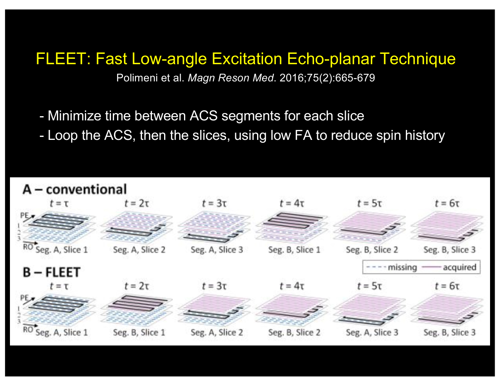

**Figure 9.1. FLEET calibration timing.** Low-angle excitation timing intended to reduce calibration inconsistency. Source pages 184 are grouped because they teach one local mechanism or diagnostic comparison. Key source labels and terms include: FLEET: Fast Low-angle Excitation Echo-planar Technique; Polimeni et al. Magn Reson Med. 2016;75(2):665-679; Minimize time between ACS segments for each slice; Loop the ACS, then the slices, using low FA to reduce spin history.

This figure should be read as a sequence inside Chapter 9, not as an isolated picture. It begins
with fleet: fast low-angle excitation echo-planar technique and ends with fleet: fast low-angle
excitation echo-planar technique, so the reader can follow how the local idea changes across the
source panels. The retained source-backed panels are used here because the original annotations
are part of the evidence: the reader needs the labels, axes, arrows, image examples, and
comparison tags to see why the mechanism matters.

The practical lesson is low-angle excitation timing intended to reduce calibration
inconsistency. In a scanner context, the important move is to translate what is drawn into an
acquisition consequence: which gradient is acting, which echo or reference data are being
trusted, which bandwidth or timing choice is limiting, or which image pattern would appear
during quality control.

For Figure 9.1, use the panels as a local reasoning test. If they show a temporal sequence, ask
what physical quantity is being conserved, reversed, accelerated, or lost. If they show images,
compare the same anatomical region across the named conditions before making a protocol
conclusion. That habit prevents a common fMRI error: treating the label fleet calibration timing
as a diagnosis before checking the visual evidence.

## Figure 9.2. Ghosting, background, and prescan-normalization examples

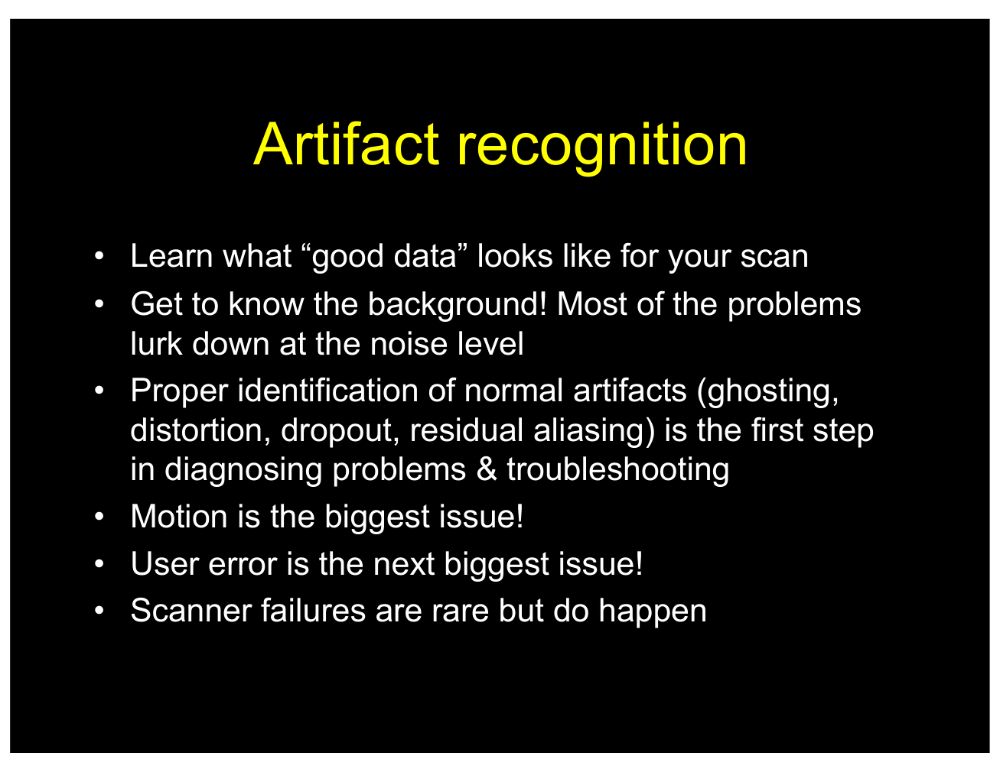

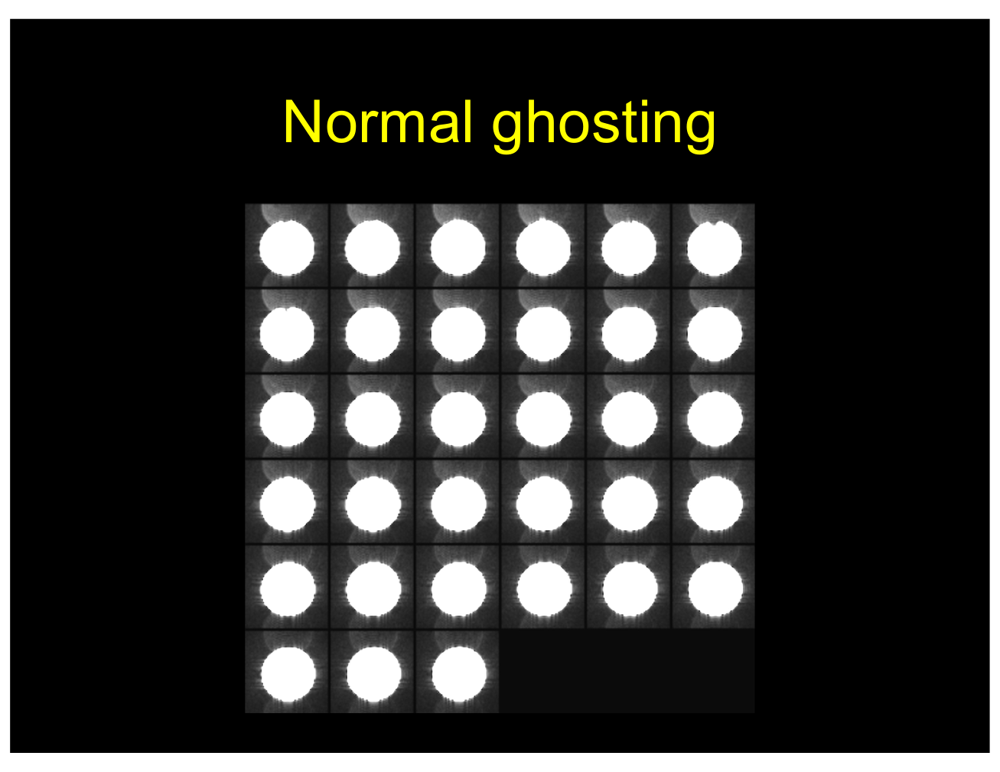

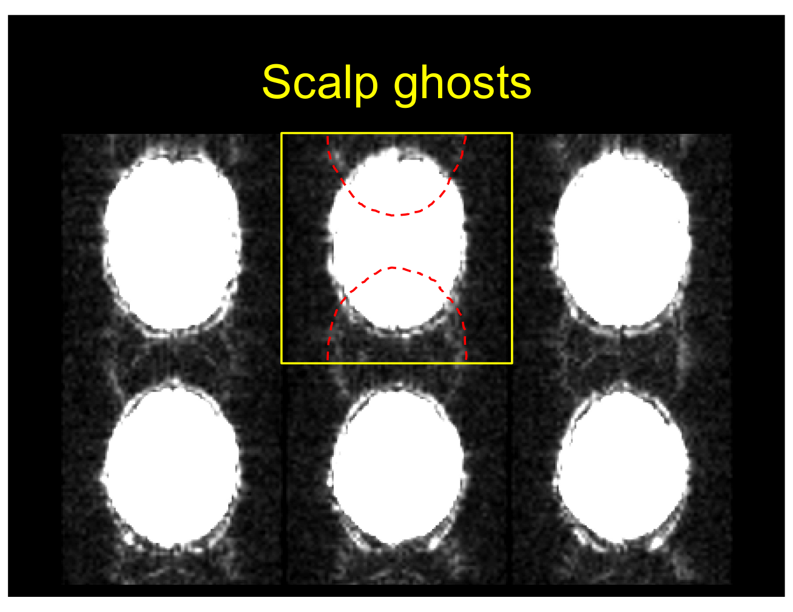

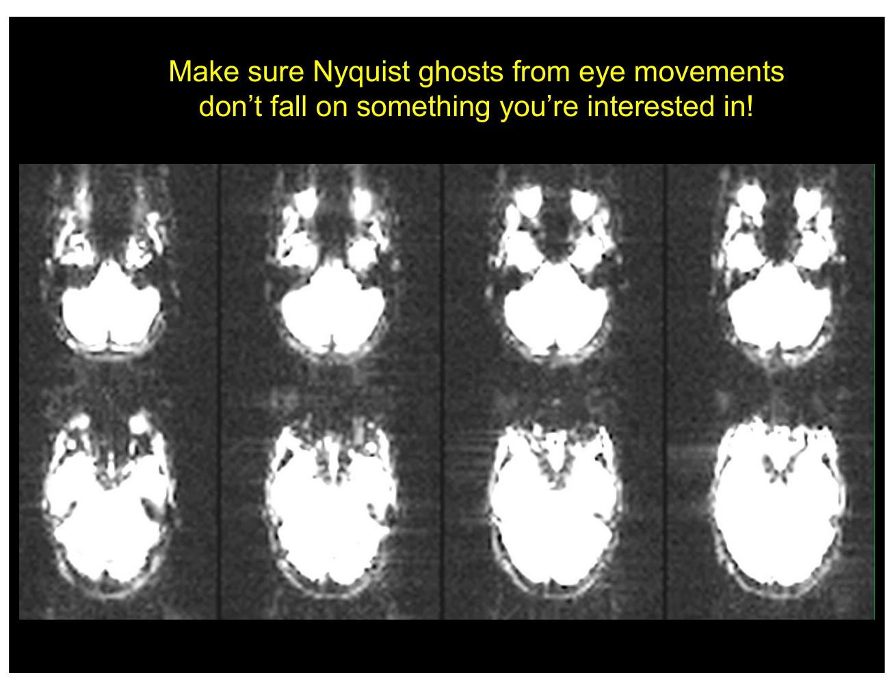

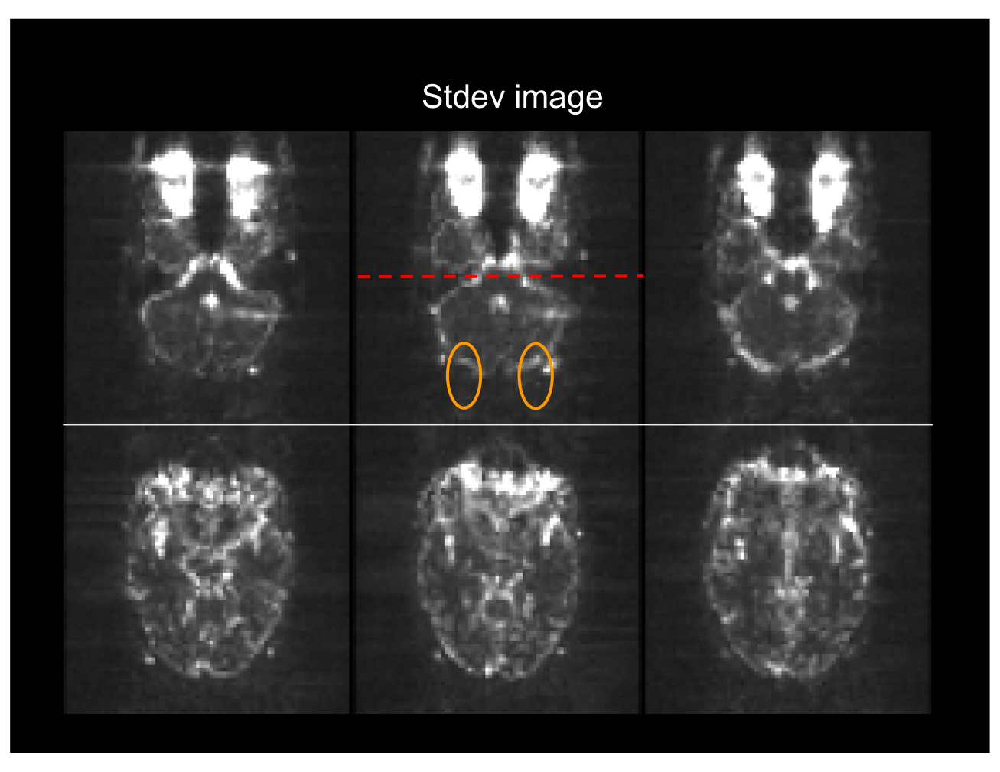

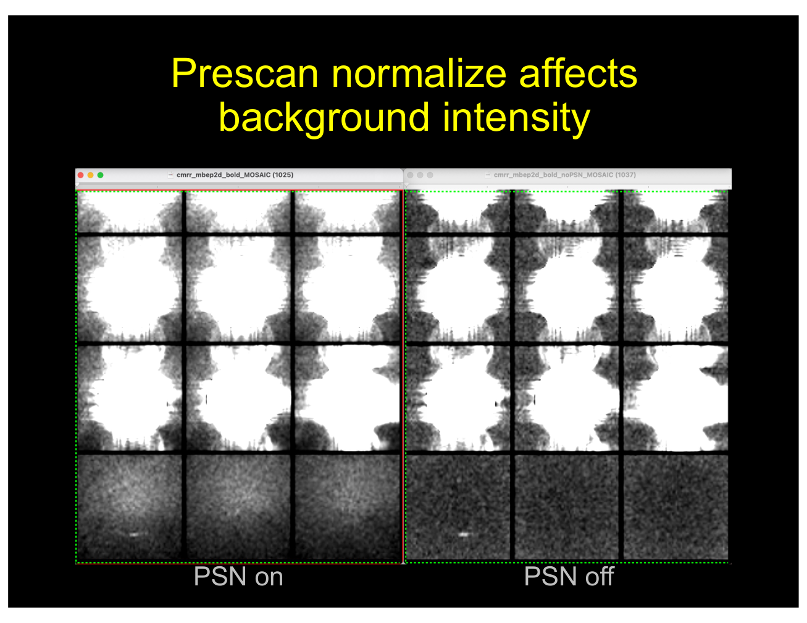

**Figure 9.2. Ghosting, background, and prescan-normalization examples.** Recognition strategy for normal ghosts, scalp ghosts, eye-motion ghosts, stdev images, and PSN effects. Source pages 187, 189-193 are grouped because they teach one local mechanism or diagnostic comparison. Key source labels and terms include: Artifact recognition; Learn what "good data" looks like for your scan; Get to know the background! Most of the problems; lurk down at the noise level; Proper identification of normal artifacts (ghosting,; distortion, dropout, residual aliasing) is the first step; Normal ghosting; Scalp ghosts.

This figure should be read as a sequence inside Chapter 9, not as an isolated picture. It begins
with artifact recognition and ends with prescan normalize affects, so the reader can follow how
the local idea changes across the source panels. The retained source-backed panels are used here
because the original annotations are part of the evidence: the reader needs the labels, axes,
arrows, image examples, and comparison tags to see why the mechanism matters.

The practical lesson is recognition strategy for normal ghosts, scalp ghosts, eye-motion ghosts,
stdev images, and psn effects. In a scanner context, the important move is to translate what is
drawn into an acquisition consequence: which gradient is acting, which echo or reference data
are being trusted, which bandwidth or timing choice is limiting, or which image pattern would
appear during quality control.

For Figure 9.2, use the panels as a local reasoning test. If they show a temporal sequence, ask
what physical quantity is being conserved, reversed, accelerated, or lost. If they show images,
compare the same anatomical region across the named conditions before making a protocol
conclusion. That habit prevents a common fMRI error: treating the label ghosting, background,
and prescan-normalization examples as a diagnosis before checking the visual evidence.

## Ghosting, background, and aliasing examples

Ghosting, background, and aliasing examples is the local bridge between the course vocabulary
and a self-study explanation. The relevant source ideas include Normal ghosting; Scalp ghosts;
Make sure Nyquist ghosts from eye movements; don't fall on something you're interested in!;
Stdev image; Prescan normalize affects; background intensity; PSN on PSN off; Residual aliasing
for GRAPPA; GRAPPA R=2 No GRAPPA; Residual aliasing for SMS; SMS = 3 No SMS. Taken together,
they should be read as one argument about recognize normal ghosts, scalp ghosts, PSN changes,
GRAPPA aliasing, and SMS aliasing. The textbook version therefore slows the slide sequence down:
first define the measured or manipulated quantity, then state what changes it, and only then
connect the change to image appearance or fMRI interpretation.

In this part of artifact recognition and practical troubleshooting, the central discipline is to
separate mechanism from display. A pulse sequence diagram, a k-space grid, or a brain image is
not merely a picture of a result; it encodes a chain of causes. For ghosting, background, and
aliasing examples, that chain starts with the controlled scanner quantity, passes through spin
phase or signal weighting, and ends as a spatial pattern, time-series change, or acquisition
tradeoff. If the chain is left implicit, the same term can be memorized without being
understood.

A useful way to study ghosting, background, and aliasing examples is to ask three questions for
every equation or panel. What quantity is deliberately controlled in Chapter 9's local sequence
or example? What uncontrolled physical or biological quantity can perturb it? What image-space
or time-series signature would reveal the problem? These questions keep the mathematics
connected to practical fMRI, where protocol choices are judged by SNR, temporal stability,
distortion, dropout, timing, and interpretability rather than by elegance alone.

The source pages named Normal ghosting, Scalp ghosts, Make sure Nyquist ghosts from eye
movements, Stdev image, Prescan normalize affects, and related panels also show why MRI
explanations often require several levels. At the microscopic level, spins precess, relax,
dephase, or refocus. At the sequence level, RF pulses and gradients impose timing and spatial
encoding. At the reconstruction level, Fourier relationships convert sampled signals into
images. At the experimental level, subject motion, physiology, hardware stability, and human
factors determine whether the image series supports a defensible fMRI interpretation.

For practice, the reader should be able to restate ghosting, background, and aliasing examples
without using slide shorthand. The restatement should include the relevant variables, the
direction of the effect, and the likely failure mode. A good explanation is specific enough to
predict what would happen if the field strength, gradient area, echo spacing, flip angle, coil
sensitivity, motion state, or nuisance measurement changed.

## Figure 9.3. Residual aliasing in accelerated EPI

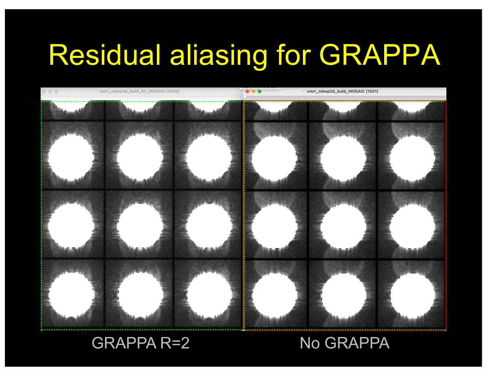

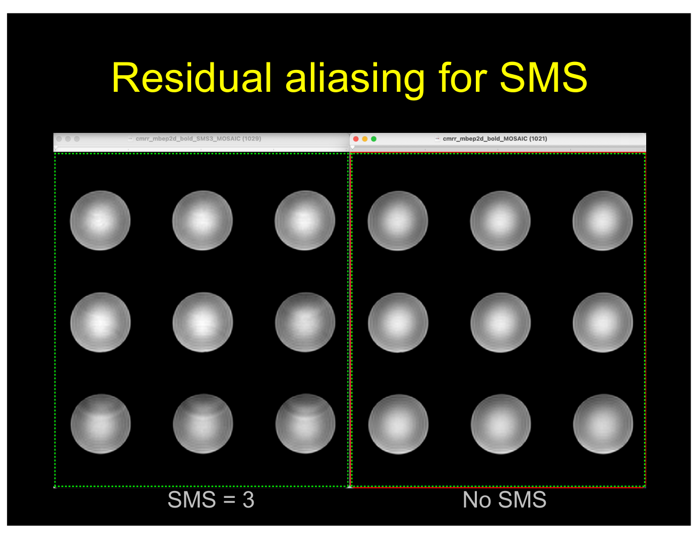

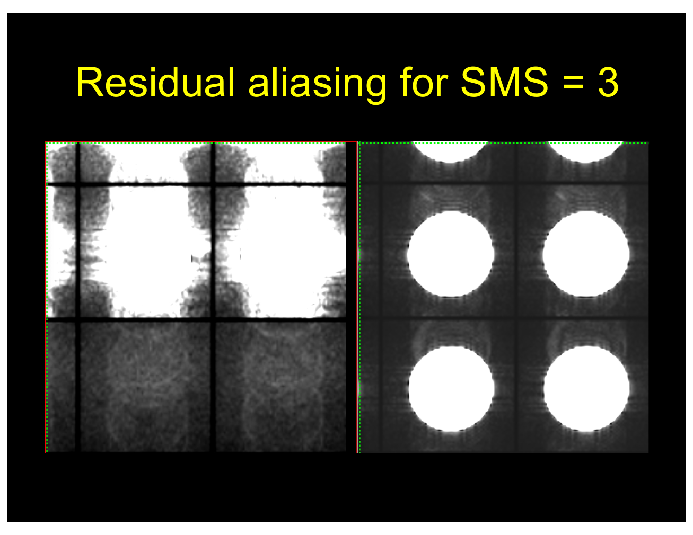

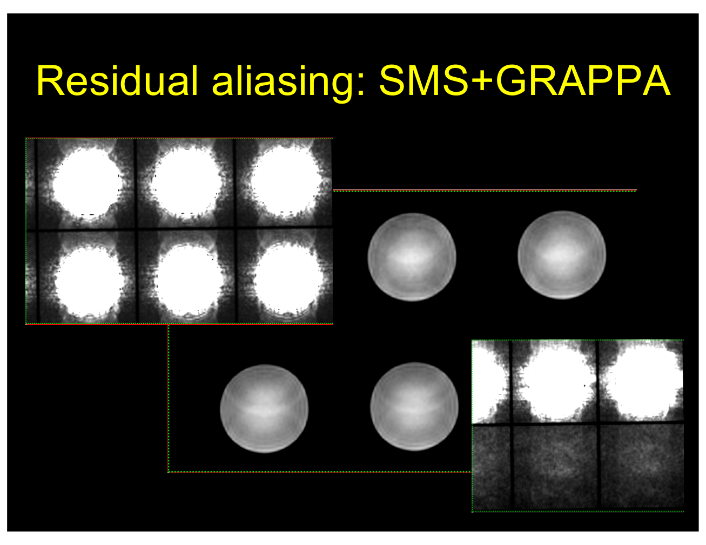

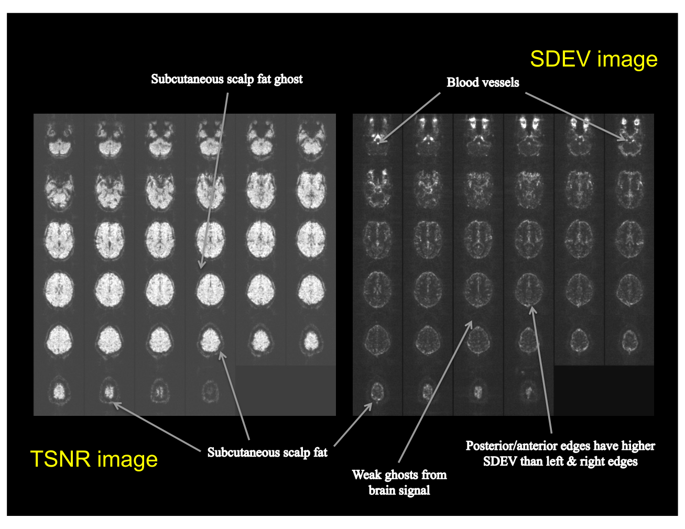

**Figure 9.3. Residual aliasing in accelerated EPI.** GRAPPA and SMS aliasing patterns, including TSNR and standard-deviation context. Source pages 194-197, 199 are grouped because they teach one local mechanism or diagnostic comparison. Key source labels and terms include: Residual aliasing for GRAPPA; GRAPPA R=2 No GRAPPA; Residual aliasing for SMS; SMS = 3 No SMS; Residual aliasing for SMS = 3; Residual aliasing: SMS+GRAPPA; TSNR image; SDEV image.

This figure should be read as a sequence inside Chapter 9, not as an isolated picture. It begins
with residual aliasing for grappa and ends with tsnr image, so the reader can follow how the
local idea changes across the source panels. The retained source-backed panels are used here
because the original annotations are part of the evidence: the reader needs the labels, axes,
arrows, image examples, and comparison tags to see why the mechanism matters.

The practical lesson is grappa and sms aliasing patterns, including tsnr and standard-deviation
context. In a scanner context, the important move is to translate what is drawn into an
acquisition consequence: which gradient is acting, which echo or reference data are being
trusted, which bandwidth or timing choice is limiting, or which image pattern would appear
during quality control.

For Figure 9.3, use the panels as a local reasoning test. If they show a temporal sequence, ask
what physical quantity is being conserved, reversed, accelerated, or lost. If they show images,
compare the same anatomical region across the named conditions before making a protocol
conclusion. That habit prevents a common fMRI error: treating the label residual aliasing in
accelerated epi as a diagnosis before checking the visual evidence.

## Motion sources and mechanical instability

Motion sources and mechanical instability is the local bridge between the course vocabulary and
a self-study explanation. The relevant source ideas include Movement; Real head motion; Pseudo-
motion from breathing; Movement of other body parts; Unstable hardware; Eye movements; Head
movements; Talking; Moving feet; Coil instability; Siemens Trio 32ch coil: ~3 cm "play" along z,
a few mm L-R; Coil instability?. Taken together, they should be read as one argument about
distinguish head, eye, body, coil, animal, and anatomical-scan motion. The textbook version
therefore slows the slide sequence down: first define the measured or manipulated quantity, then
state what changes it, and only then connect the change to image appearance or fMRI
interpretation.

In this part of artifact recognition and practical troubleshooting, the central discipline is to
separate mechanism from display. A pulse sequence diagram, a k-space grid, or a brain image is
not merely a picture of a result; it encodes a chain of causes. For motion sources and
mechanical instability, that chain starts with the controlled scanner quantity, passes through
spin phase or signal weighting, and ends as a spatial pattern, time-series change, or
acquisition tradeoff. If the chain is left implicit, the same term can be memorized without
being understood.

A useful way to study motion sources and mechanical instability is to ask three questions for
every equation or panel. What quantity is deliberately controlled in Chapter 9's local sequence
or example? What uncontrolled physical or biological quantity can perturb it? What image-space
or time-series signature would reveal the problem? These questions keep the mathematics
connected to practical fMRI, where protocol choices are judged by SNR, temporal stability,
distortion, dropout, timing, and interpretability rather than by elegance alone.

The source pages named Movement, Eye movements, Head movements, Talking, Moving feet, and
related panels also show why MRI explanations often require several levels. At the microscopic
level, spins precess, relax, dephase, or refocus. At the sequence level, RF pulses and gradients
impose timing and spatial encoding. At the reconstruction level, Fourier relationships convert
sampled signals into images. At the experimental level, subject motion, physiology, hardware
stability, and human factors determine whether the image series supports a defensible fMRI
interpretation.

For practice, the reader should be able to restate motion sources and mechanical instability
without using slide shorthand. The restatement should include the relevant variables, the
direction of the effect, and the likely failure mode. A good explanation is specific enough to
predict what would happen if the field strength, gradient area, echo spacing, flip angle, coil
sensitivity, motion state, or nuisance measurement changed.

## Figure 9.4. Motion sources and mechanical instability

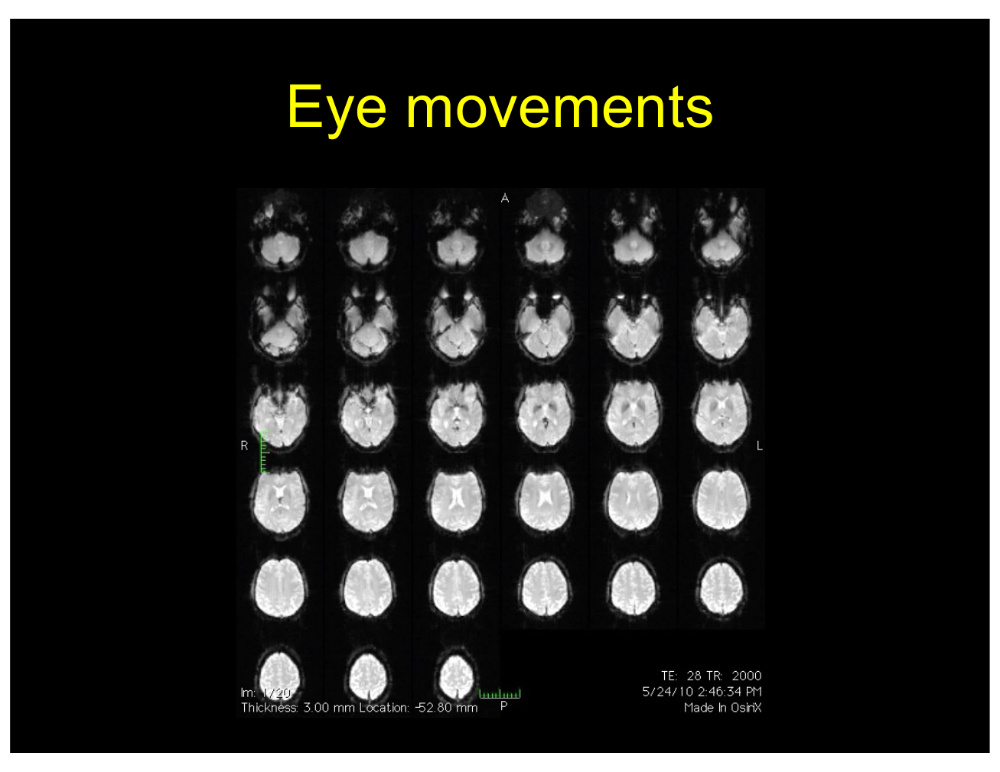

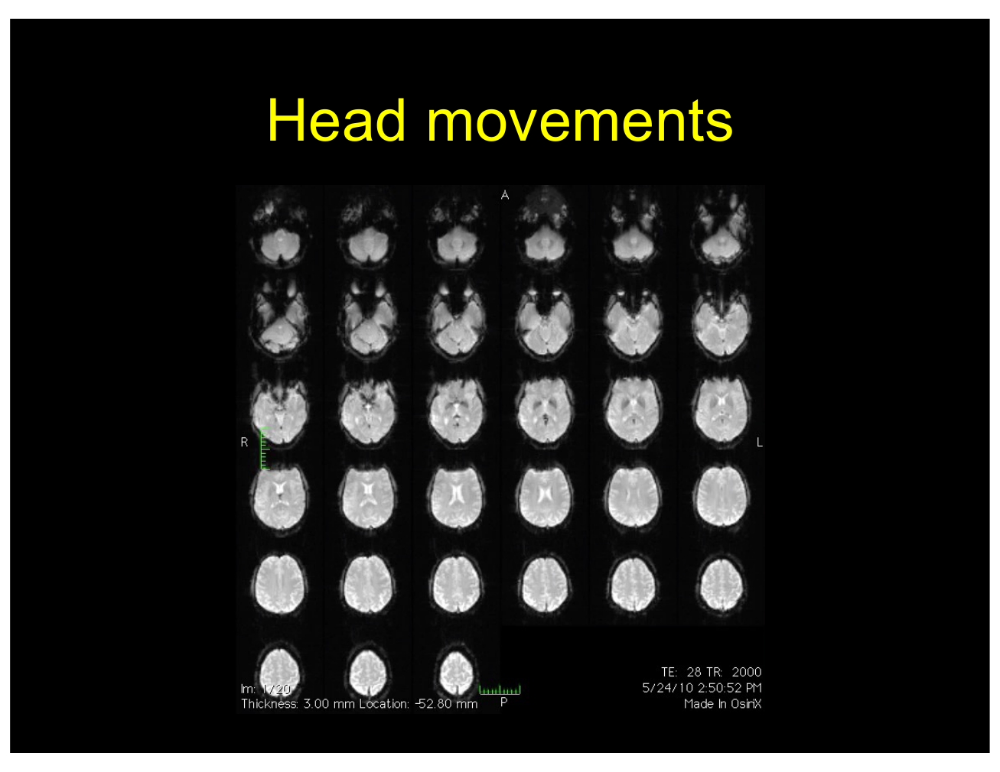

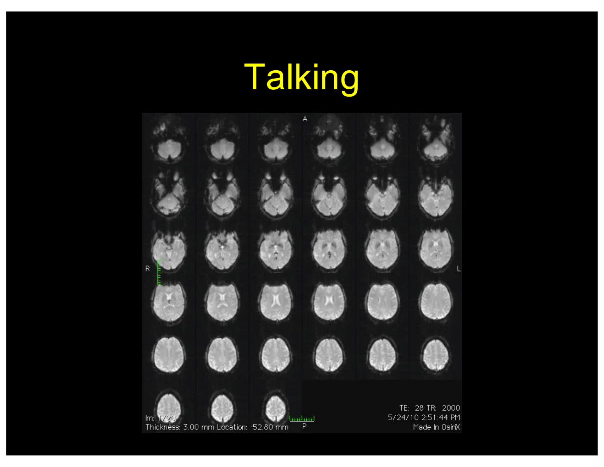

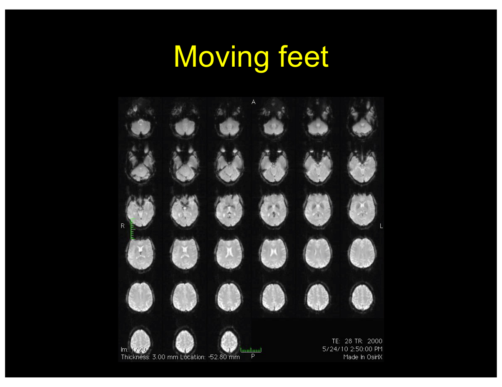

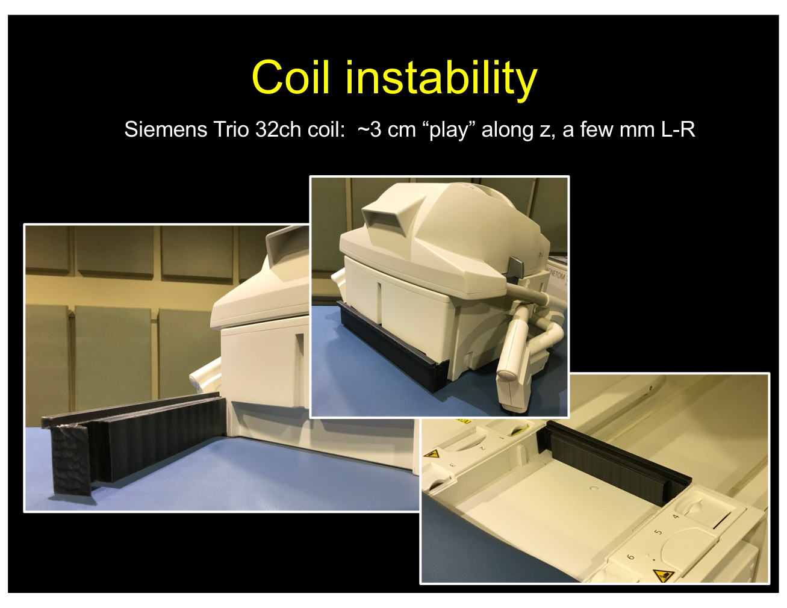

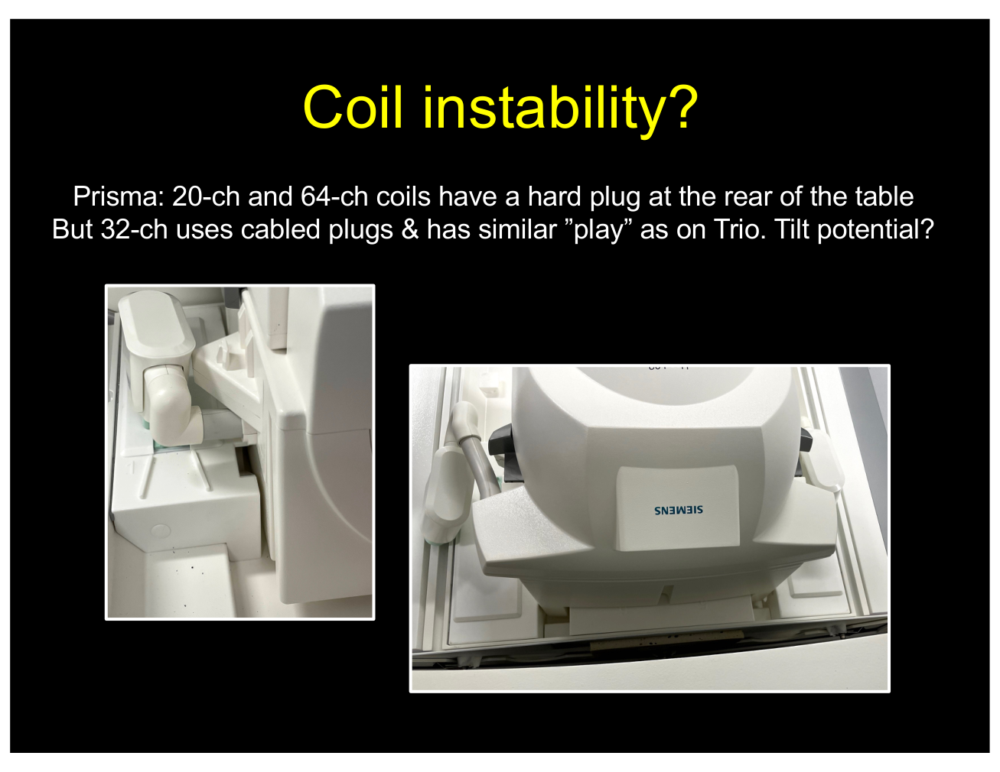

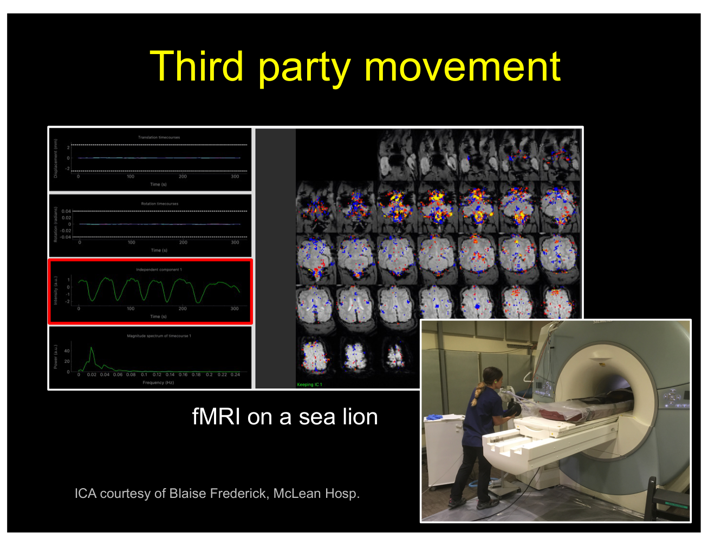

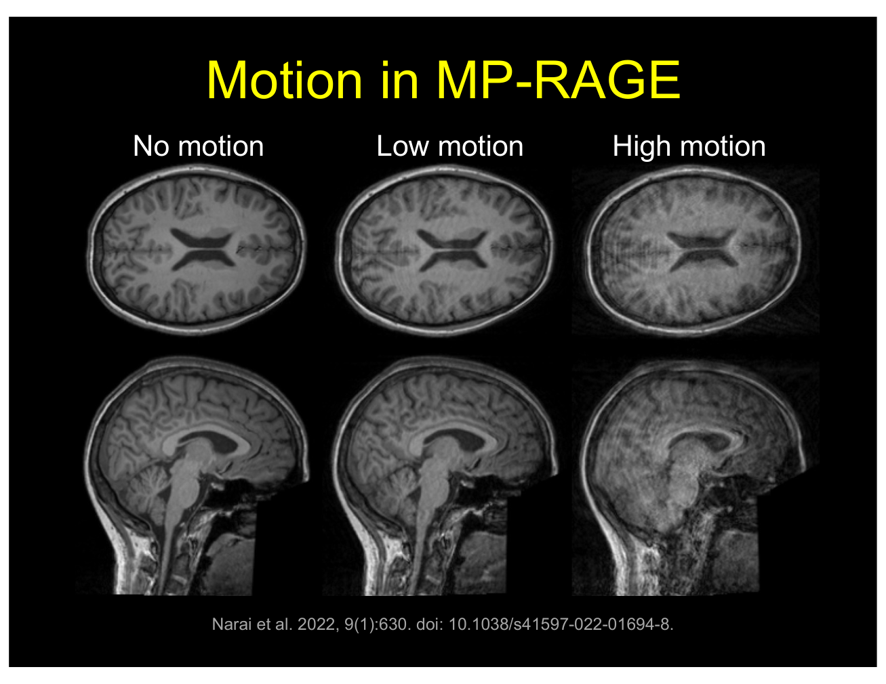

**Figure 9.4. Motion sources and mechanical instability.** Eye, head, speech, feet, coil, third-party, and anatomical-scan motion examples. Source pages 201-208 are grouped because they teach one local mechanism or diagnostic comparison. Key source labels and terms include: Eye movements; Head movements; Talking; Moving feet; Coil instability; Siemens Trio 32ch coil: ~3 cm "play" along z, a few mm L-R; Coil instability?; Prisma: 20-ch and 64-ch coils have a hard plug at the rear of the table.

This figure should be read as a sequence inside Chapter 9, not as an isolated picture. It begins
with eye movements and ends with motion in mp-rage, so the reader can follow how the local idea
changes across the source panels. The retained source-backed panels are used here because the
original annotations are part of the evidence: the reader needs the labels, axes, arrows, image
examples, and comparison tags to see why the mechanism matters.

The practical lesson is eye, head, speech, feet, coil, third-party, and anatomical-scan motion
examples. In a scanner context, the important move is to translate what is drawn into an
acquisition consequence: which gradient is acting, which echo or reference data are being
trusted, which bandwidth or timing choice is limiting, or which image pattern would appear
during quality control.

For Figure 9.4, use the panels as a local reasoning test. If they show a temporal sequence, ask
what physical quantity is being conserved, reversed, accelerated, or lost. If they show images,
compare the same anatomical region across the named conditions before making a protocol
conclusion. That habit prevents a common fMRI error: treating the label motion sources and
mechanical instability as a diagnosis before checking the visual evidence.

## Foreign objects, RF interference, and spiking

Foreign objects, RF interference, and spiking is the local bridge between the course vocabulary
and a self-study explanation. The relevant source ideas include Foreign objects - metal pin; RF
interference; Gradient spiking; Gradient spiking: phantom check; RF coil spikes; Localizer; MP-
RAGE. Taken together, they should be read as one argument about separate metallic artifacts, RF
pickup, gradient spikes, and coil spikes. The textbook version therefore slows the slide
sequence down: first define the measured or manipulated quantity, then state what changes it,
and only then connect the change to image appearance or fMRI interpretation.

In this part of artifact recognition and practical troubleshooting, the central discipline is to
separate mechanism from display. A pulse sequence diagram, a k-space grid, or a brain image is
not merely a picture of a result; it encodes a chain of causes. For foreign objects, rf
interference, and spiking, that chain starts with the controlled scanner quantity, passes
through spin phase or signal weighting, and ends as a spatial pattern, time-series change, or
acquisition tradeoff. If the chain is left implicit, the same term can be memorized without
being understood.

A useful way to study foreign objects, rf interference, and spiking is to ask three questions
for every equation or panel. What quantity is deliberately controlled in Chapter 9's local
sequence or example? What uncontrolled physical or biological quantity can perturb it? What
image-space or time-series signature would reveal the problem? These questions keep the
mathematics connected to practical fMRI, where protocol choices are judged by SNR, temporal
stability, distortion, dropout, timing, and interpretability rather than by elegance alone.

The source pages named Foreign objects - metal pin, RF interference, Gradient spiking, Gradient
spiking, Gradient spiking: phantom check, and related panels also show why MRI explanations
often require several levels. At the microscopic level, spins precess, relax, dephase, or
refocus. At the sequence level, RF pulses and gradients impose timing and spatial encoding. At
the reconstruction level, Fourier relationships convert sampled signals into images. At the
experimental level, subject motion, physiology, hardware stability, and human factors determine
whether the image series supports a defensible fMRI interpretation.

For practice, the reader should be able to restate foreign objects, rf interference, and spiking
without using slide shorthand. The restatement should include the relevant variables, the
direction of the effect, and the likely failure mode. A good explanation is specific enough to
predict what would happen if the field strength, gradient area, echo spacing, flip angle, coil
sensitivity, motion state, or nuisance measurement changed.

## Figure 9.5. Foreign objects, RF interference, and spike artifacts

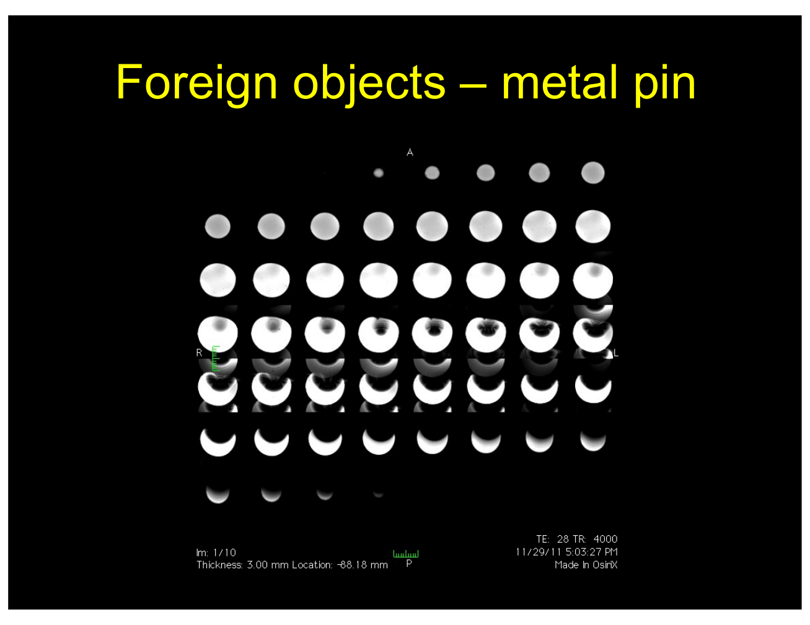

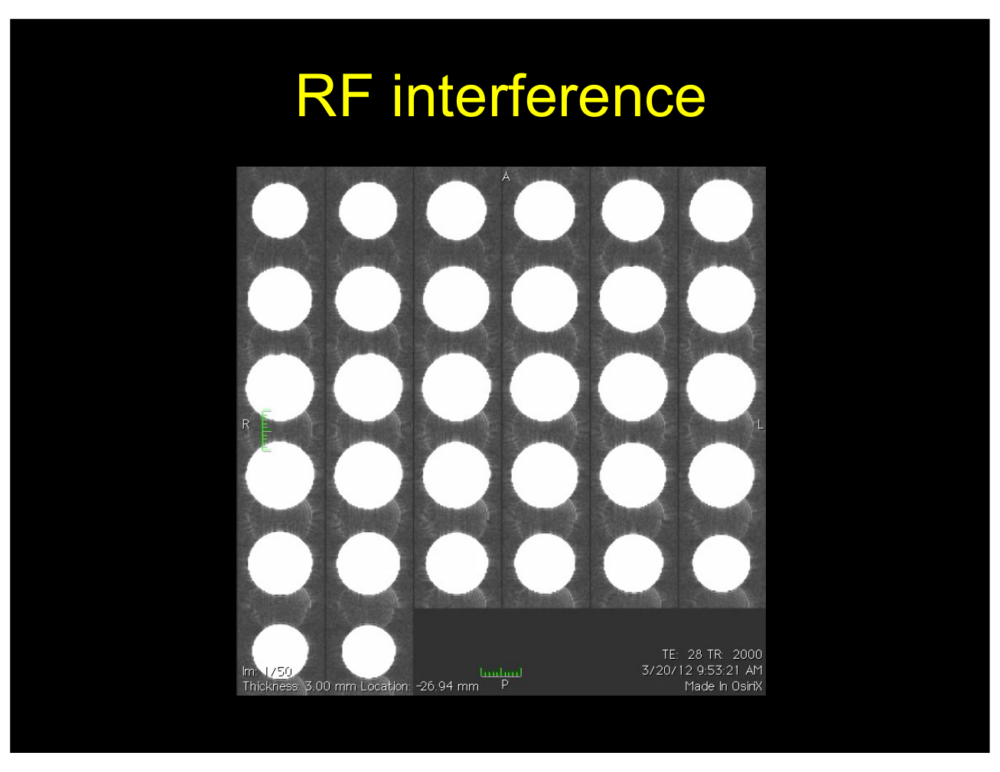

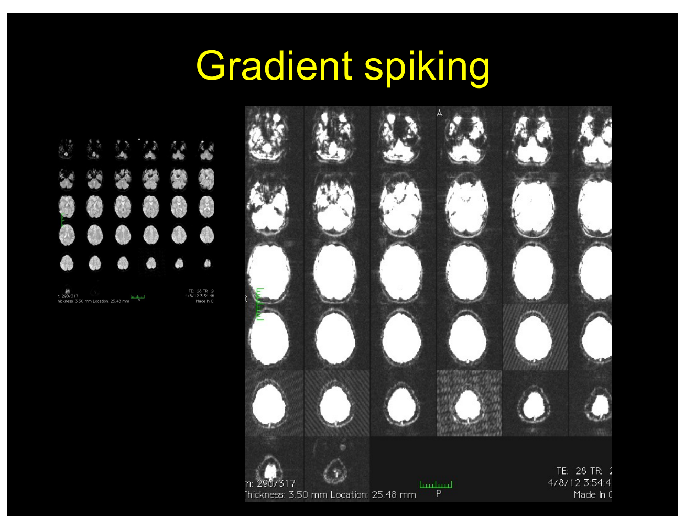

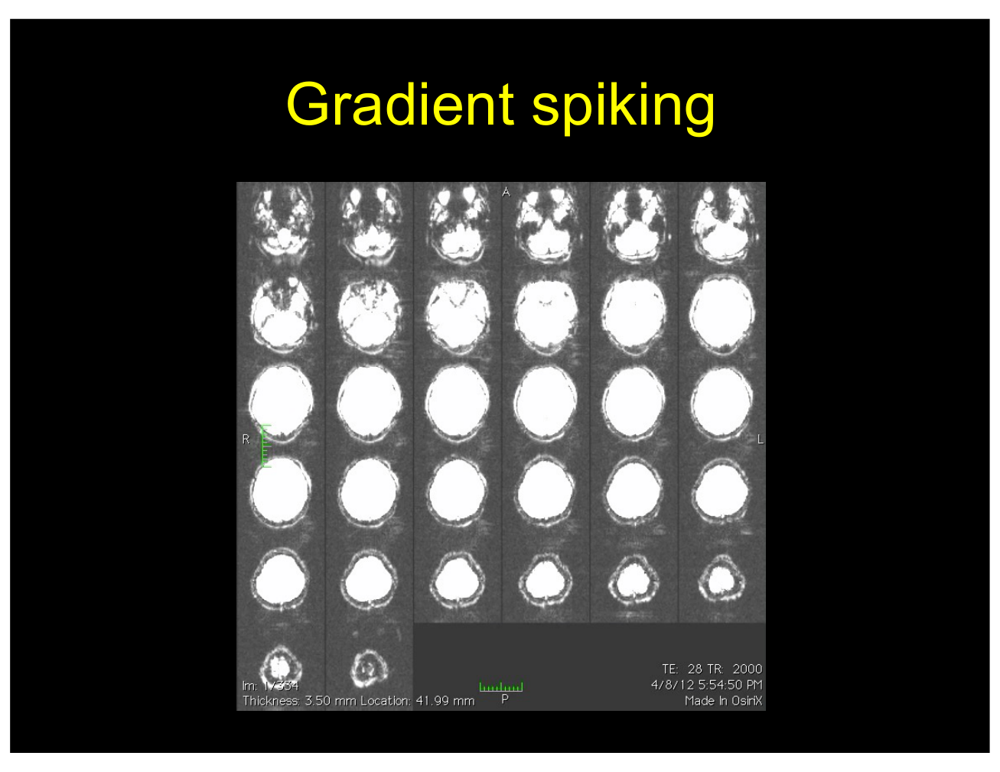

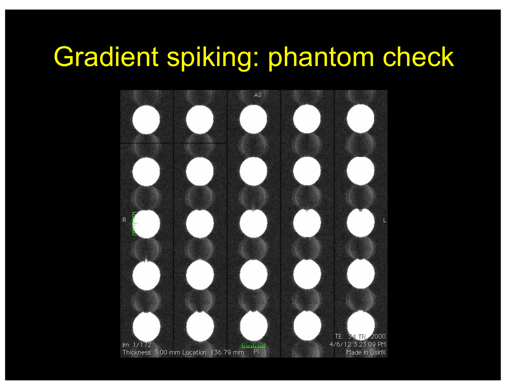

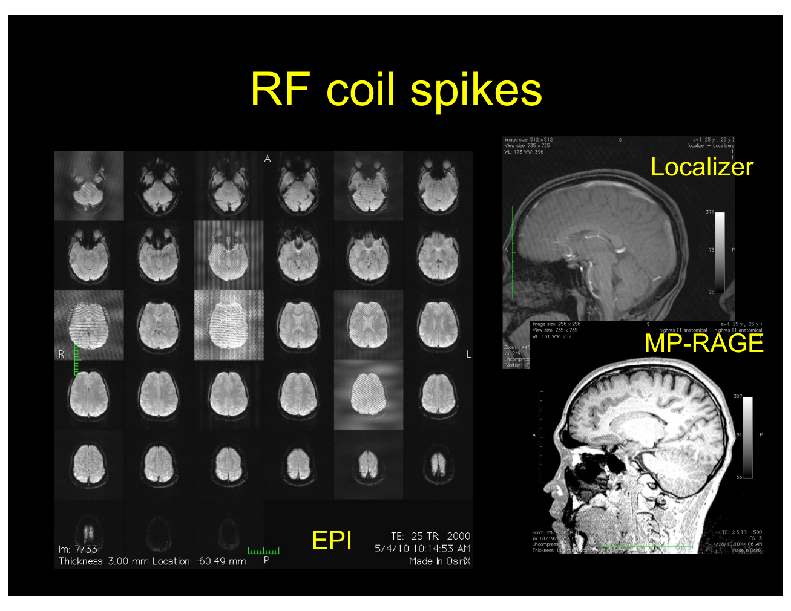

**Figure 9.5. Foreign objects, RF interference, and spike artifacts.** Metal pins, RF pickup, gradient spiking, phantom checks, and coil spikes. Source pages 209-214 are grouped because they teach one local mechanism or diagnostic comparison. Key source labels and terms include: Foreign objects - metal pin; RF interference; Gradient spiking; Gradient spiking: phantom check; RF coil spikes; Localizer; MP-RAGE.

This figure should be read as a sequence inside Chapter 9, not as an isolated picture. It begins
with foreign objects - metal pin and ends with rf coil spikes, so the reader can follow how the
local idea changes across the source panels. The retained source-backed panels are used here
because the original annotations are part of the evidence: the reader needs the labels, axes,
arrows, image examples, and comparison tags to see why the mechanism matters.

The practical lesson is metal pins, rf pickup, gradient spiking, phantom checks, and coil
spikes. In a scanner context, the important move is to translate what is drawn into an
acquisition consequence: which gradient is acting, which echo or reference data are being
trusted, which bandwidth or timing choice is limiting, or which image pattern would appear
during quality control.

For Figure 9.5, use the panels as a local reasoning test. If they show a temporal sequence, ask
what physical quantity is being conserved, reversed, accelerated, or lost. If they show images,
compare the same anatomical region across the named conditions before making a protocol
conclusion. That habit prevents a common fMRI error: treating the label foreign objects, rf
interference, and spike artifacts as a diagnosis before checking the visual evidence.

### Chapter Summary

Chapter 9 used pages 183-214 to develop convert artifact examples into a practical diagnostic
vocabulary for fmri data inspection. The main lesson is cumulative: the reader should move from
vocabulary to mechanism, from mechanism to protocol choice, and from protocol choice to image or
time-series consequences.

### Key Terms

FLEET, artifact, recognition, Ghosting, background, aliasing, Motion, sources, mechanical, Foreign.

### Review Questions

1. Explain how fleet and artifact-recognition mindset affects a practical fMRI decision.
2. Describe one way a visual panel in Chapter 9 changes the interpretation of the prose.
3. Name one acquisition parameter from this chapter and predict a tradeoff if it is changed.
4. Distinguish a mechanism-level explanation from an image-appearance description.
5. Identify one quality-control sign that would make you revisit this chapter before scanning more data.

# Chapter 10. System Drift and Diagnostic Strategy

This chapter covers source pages 215-217 and turns them into a self-study sequence about turn
troubleshooting examples into a reproducible sequence of temporal checks, retests, hypotheses,
and system adjustments. The chapter is organized by mechanism and scanning consequence, not by
slide order alone, so figures appear where they support the local explanation.

## System drifts and chronic motion

System drifts and chronic motion is the local bridge between the course vocabulary and a self-
study explanation. The relevant source ideas include Day Five; Afternoon; Artifacts and
troubleshooting; System drifts & chronic motion; Foam padding? Talking?; Other systemic or
chronic effects?; ~10 mins; Adjust:; Coil sensitivity map. Taken together, they should be read
as one argument about interpret slow changes in shim, sensitivity maps, and participant
behavior. The textbook version therefore slows the slide sequence down: first define the
measured or manipulated quantity, then state what changes it, and only then connect the change
to image appearance or fMRI interpretation.

In this part of system drift and diagnostic strategy, the central discipline is to separate
mechanism from display. A pulse sequence diagram, a k-space grid, or a brain image is not merely
a picture of a result; it encodes a chain of causes. For system drifts and chronic motion, that
chain starts with the controlled scanner quantity, passes through spin phase or signal
weighting, and ends as a spatial pattern, time-series change, or acquisition tradeoff. If the
chain is left implicit, the same term can be memorized without being understood.

A useful way to study system drifts and chronic motion is to ask three questions for every
equation or panel. What quantity is deliberately controlled in Chapter 10's local sequence or
example? What uncontrolled physical or biological quantity can perturb it? What image-space or
time-series signature would reveal the problem? These questions keep the mathematics connected
to practical fMRI, where protocol choices are judged by SNR, temporal stability, distortion,
dropout, timing, and interpretability rather than by elegance alone.

The source pages named Day Five, System drifts & chronic motion also show why MRI explanations
often require several levels. At the microscopic level, spins precess, relax, dephase, or
refocus. At the sequence level, RF pulses and gradients impose timing and spatial encoding. At
the reconstruction level, Fourier relationships convert sampled signals into images. At the
experimental level, subject motion, physiology, hardware stability, and human factors determine
whether the image series supports a defensible fMRI interpretation.

For practice, the reader should be able to restate system drifts and chronic motion without
using slide shorthand. The restatement should include the relevant variables, the direction of
the effect, and the likely failure mode. A good explanation is specific enough to predict what
would happen if the field strength, gradient area, echo spacing, flip angle, coil sensitivity,
motion state, or nuisance measurement changed.

## Figure 10.1. System drift and a diagnostic loop

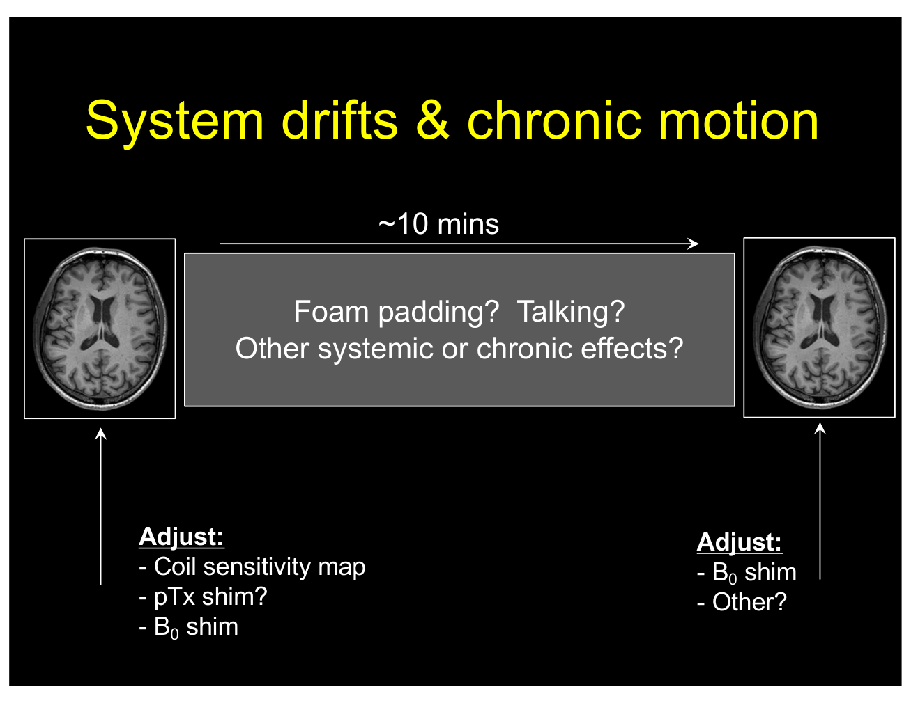

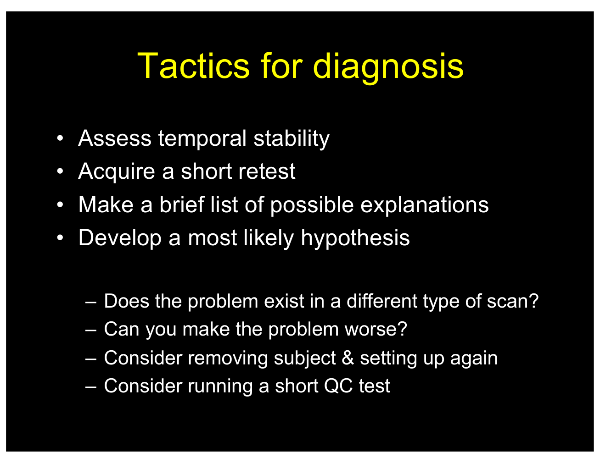

**Figure 10.1. System drift and a diagnostic loop.** Chronic temporal changes and a disciplined retest-hypothesis workflow. Source pages 216-217 are grouped because they teach one local mechanism or diagnostic comparison. Key source labels and terms include: System drifts & chronic motion; Foam padding? Talking?; Other systemic or chronic effects?; ~10 mins; Adjust:; Coil sensitivity map; Tactics for diagnosis; Assess temporal stability.

This figure should be read as a sequence inside Chapter 10, not as an isolated picture. It
begins with system drifts & chronic motion and ends with tactics for diagnosis, so the reader
can follow how the local idea changes across the source panels. The retained source-backed
panels are used here because the original annotations are part of the evidence: the reader needs
the labels, axes, arrows, image examples, and comparison tags to see why the mechanism matters.

The practical lesson is chronic temporal changes and a disciplined retest-hypothesis workflow.
In a scanner context, the important move is to translate what is drawn into an acquisition
consequence: which gradient is acting, which echo or reference data are being trusted, which
bandwidth or timing choice is limiting, or which image pattern would appear during quality
control.

For Figure 10.1, use the panels as a local reasoning test. If they show a temporal sequence, ask
what physical quantity is being conserved, reversed, accelerated, or lost. If they show images,
compare the same anatomical region across the named conditions before making a protocol
conclusion. That habit prevents a common fMRI error: treating the label system drift and a
diagnostic loop as a diagnosis before checking the visual evidence.

## A practical diagnostic loop

A practical diagnostic loop is the local bridge between the course vocabulary and a self-study
explanation. The relevant source ideas include Tactics for diagnosis; Assess temporal stability;
Acquire a short retest; Make a brief list of possible explanations; Develop a most likely
hypothesis; Does the problem exist in a different type of scan?. Taken together, they should be
read as one argument about formalize short retests, hypothesis lists, and follow-up decisions.
The textbook version therefore slows the slide sequence down: first define the measured or
manipulated quantity, then state what changes it, and only then connect the change to image
appearance or fMRI interpretation.

In this part of system drift and diagnostic strategy, the central discipline is to separate
mechanism from display. A pulse sequence diagram, a k-space grid, or a brain image is not merely
a picture of a result; it encodes a chain of causes. For a practical diagnostic loop, that chain
starts with the controlled scanner quantity, passes through spin phase or signal weighting, and
ends as a spatial pattern, time-series change, or acquisition tradeoff. If the chain is left
implicit, the same term can be memorized without being understood.

A useful way to study a practical diagnostic loop is to ask three questions for every equation
or panel. What quantity is deliberately controlled in Chapter 10's local sequence or example?
What uncontrolled physical or biological quantity can perturb it? What image-space or time-
series signature would reveal the problem? These questions keep the mathematics connected to
practical fMRI, where protocol choices are judged by SNR, temporal stability, distortion,
dropout, timing, and interpretability rather than by elegance alone.

The source pages named Tactics for diagnosis also show why MRI explanations often require
several levels. At the microscopic level, spins precess, relax, dephase, or refocus. At the
sequence level, RF pulses and gradients impose timing and spatial encoding. At the
reconstruction level, Fourier relationships convert sampled signals into images. At the
experimental level, subject motion, physiology, hardware stability, and human factors determine
whether the image series supports a defensible fMRI interpretation.

For practice, the reader should be able to restate a practical diagnostic loop without using
slide shorthand. The restatement should include the relevant variables, the direction of the
effect, and the likely failure mode. A good explanation is specific enough to predict what would
happen if the field strength, gradient area, echo spacing, flip angle, coil sensitivity, motion
state, or nuisance measurement changed.

### Chapter Summary

Chapter 10 used pages 215-217 to develop turn troubleshooting examples into a reproducible
sequence of temporal checks, retests, hypotheses, and system adjustments. The main lesson is
cumulative: the reader should move from vocabulary to mechanism, from mechanism to protocol
choice, and from protocol choice to image or time-series consequences.

### Key Terms

System, drifts, chronic, practical, diagnostic, loop.

### Review Questions

1. Explain how system drifts and chronic motion affects a practical fMRI decision.
2. Describe one way a visual panel in Chapter 10 changes the interpretation of the prose.
3. Name one acquisition parameter from this chapter and predict a tradeoff if it is changed.
4. Distinguish a mechanism-level explanation from an image-appearance description.
5. Identify one quality-control sign that would make you revisit this chapter before scanning more data.

# Chapter 11. Biological and Human Confounds in fMRI

This chapter covers source pages 218-226 and turns them into a self-study sequence about map
nuisance mechanisms to experiment classes and to the auxiliary measurements that can make them
interpretable. The chapter is organized by mechanism and scanning consequence, not by slide
order alone, so figures appear where they support the local explanation.

## Biological nuisance mechanisms

Biological nuisance mechanisms is the local bridge between the course vocabulary and a self-
study explanation. The relevant source ideas include Day Six; Confounds in fMRI; Biological
mechanisms; Relative importance of nuisance variables to different classes of fMRI experiment..
Taken together, they should be read as one argument about organize vascular, respiratory,
cardiac, and metabolic confounds. The textbook version therefore slows the slide sequence down:
first define the measured or manipulated quantity, then state what changes it, and only then
connect the change to image appearance or fMRI interpretation.

In this part of biological and human confounds in fmri, the central discipline is to separate
mechanism from display. A pulse sequence diagram, a k-space grid, or a brain image is not merely
a picture of a result; it encodes a chain of causes. For biological nuisance mechanisms, that
chain starts with the controlled scanner quantity, passes through spin phase or signal
weighting, and ends as a spatial pattern, time-series change, or acquisition tradeoff. If the
chain is left implicit, the same term can be memorized without being understood.

A useful way to study biological nuisance mechanisms is to ask three questions for every
equation or panel. What quantity is deliberately controlled in Chapter 11's local sequence or
example? What uncontrolled physical or biological quantity can perturb it? What image-space or
time-series signature would reveal the problem? These questions keep the mathematics connected
to practical fMRI, where protocol choices are judged by SNR, temporal stability, distortion,
dropout, timing, and interpretability rather than by elegance alone.

The source pages named Day Six, Biological mechanisms, Relative importance of nuisance variables
to different classes of fMRI experiment. also show why MRI explanations often require several
levels. At the microscopic level, spins precess, relax, dephase, or refocus. At the sequence
level, RF pulses and gradients impose timing and spatial encoding. At the reconstruction level,
Fourier relationships convert sampled signals into images. At the experimental level, subject
motion, physiology, hardware stability, and human factors determine whether the image series
supports a defensible fMRI interpretation.

For practice, the reader should be able to restate biological nuisance mechanisms without using
slide shorthand. The restatement should include the relevant variables, the direction of the
effect, and the likely failure mode. A good explanation is specific enough to predict what would
happen if the field strength, gradient area, echo spacing, flip angle, coil sensitivity, motion
state, or nuisance measurement changed.

## Figure 11.1. Biological nuisance mechanisms by experiment type

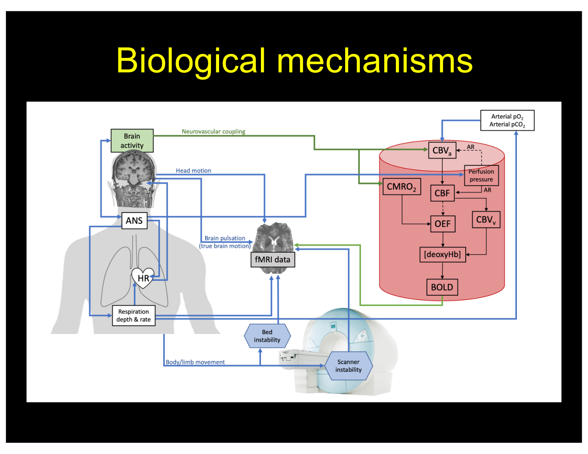

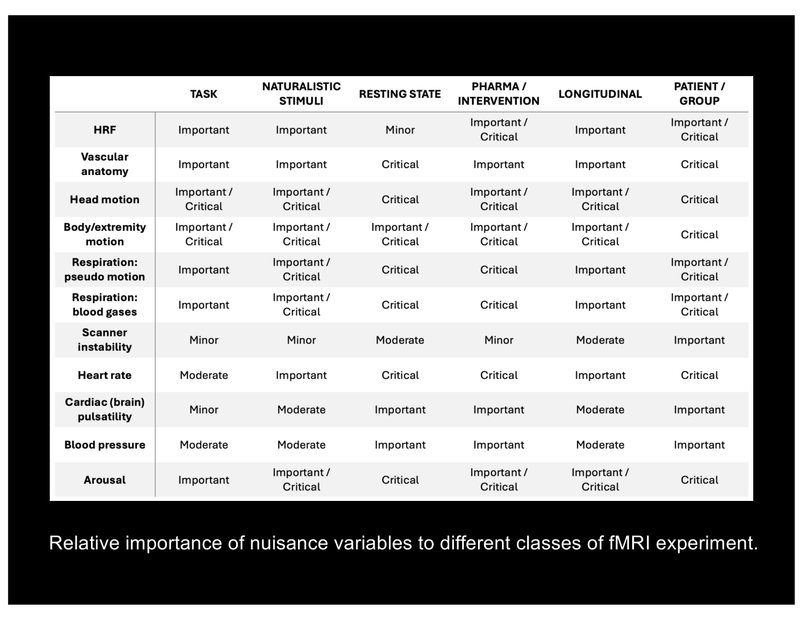

**Figure 11.1. Biological nuisance mechanisms by experiment type.** Relative confound importance across fMRI experiment classes. Source pages 219-220 are grouped because they teach one local mechanism or diagnostic comparison. Key source labels and terms include: Biological mechanisms; Relative importance of nuisance variables to different classes of fMRI experiment..

This figure should be read as a sequence inside Chapter 11, not as an isolated picture. It
begins with biological mechanisms and ends with relative importance of nuisance variables to
different classes of fmri experiment., so the reader can follow how the local idea changes
across the source panels. The retained source-backed panels are used here because the original
annotations are part of the evidence: the reader needs the labels, axes, arrows, image examples,
and comparison tags to see why the mechanism matters.

The practical lesson is relative confound importance across fmri experiment classes. In a
scanner context, the important move is to translate what is drawn into an acquisition
consequence: which gradient is acting, which echo or reference data are being trusted, which
bandwidth or timing choice is limiting, or which image pattern would appear during quality
control.

For Figure 11.1, use the panels as a local reasoning test. If they show a temporal sequence, ask
what physical quantity is being conserved, reversed, accelerated, or lost. If they show images,
compare the same anatomical region across the named conditions before making a protocol
conclusion. That habit prevents a common fMRI error: treating the label biological nuisance
mechanisms by experiment type as a diagnosis before checking the visual evidence.

## Human factors as modifiers

Human factors as modifiers is the local bridge between the course vocabulary and a self-study
explanation. The relevant source ideas include Human factors as modifiers; Caffeine: Damned if
you do…?; Block and single trial responses to a visual task prior to and 40 minutes; after a
200-mg caffeine dose. From Liu et al. (2004).; Relative importance of human factors modifying
the main confounding mechanisms.. Taken together, they should be read as one argument about
connect caffeine and participant state to BOLD interpretation. The textbook version therefore
slows the slide sequence down: first define the measured or manipulated quantity, then state
what changes it, and only then connect the change to image appearance or fMRI interpretation.

In this part of biological and human confounds in fmri, the central discipline is to separate
mechanism from display. A pulse sequence diagram, a k-space grid, or a brain image is not merely
a picture of a result; it encodes a chain of causes. For human factors as modifiers, that chain
starts with the controlled scanner quantity, passes through spin phase or signal weighting, and
ends as a spatial pattern, time-series change, or acquisition tradeoff. If the chain is left
implicit, the same term can be memorized without being understood.

A useful way to study human factors as modifiers is to ask three questions for every equation or
panel. What quantity is deliberately controlled in Chapter 11's local sequence or example? What
uncontrolled physical or biological quantity can perturb it? What image-space or time-series
signature would reveal the problem? These questions keep the mathematics connected to practical
fMRI, where protocol choices are judged by SNR, temporal stability, distortion, dropout, timing,
and interpretability rather than by elegance alone.

The source pages named Human factors as modifiers, Human factors as modifiers, Caffeine: Damned
if you do…?, Relative importance of human factors modifying the main confounding mechanisms.
also show why MRI explanations often require several levels. At the microscopic level, spins
precess, relax, dephase, or refocus. At the sequence level, RF pulses and gradients impose
timing and spatial encoding. At the reconstruction level, Fourier relationships convert sampled
signals into images. At the experimental level, subject motion, physiology, hardware stability,
and human factors determine whether the image series supports a defensible fMRI interpretation.

For practice, the reader should be able to restate human factors as modifiers without using
slide shorthand. The restatement should include the relevant variables, the direction of the
effect, and the likely failure mode. A good explanation is specific enough to predict what would
happen if the field strength, gradient area, echo spacing, flip angle, coil sensitivity, motion
state, or nuisance measurement changed.

## Figure 11.2. Human factors and caffeine effects

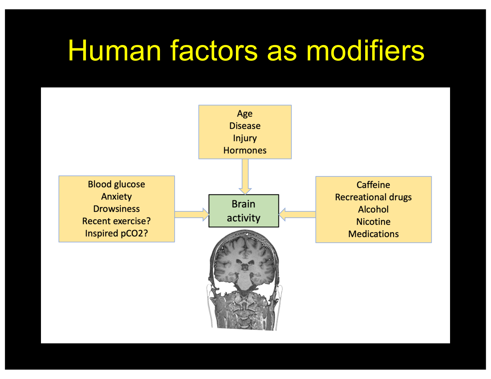

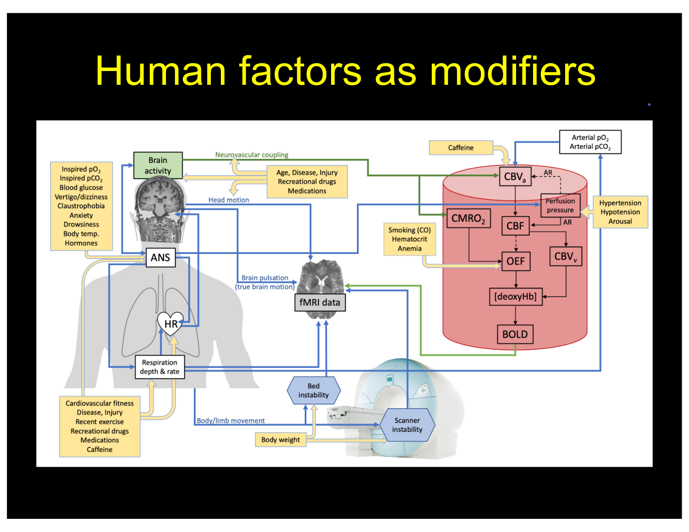

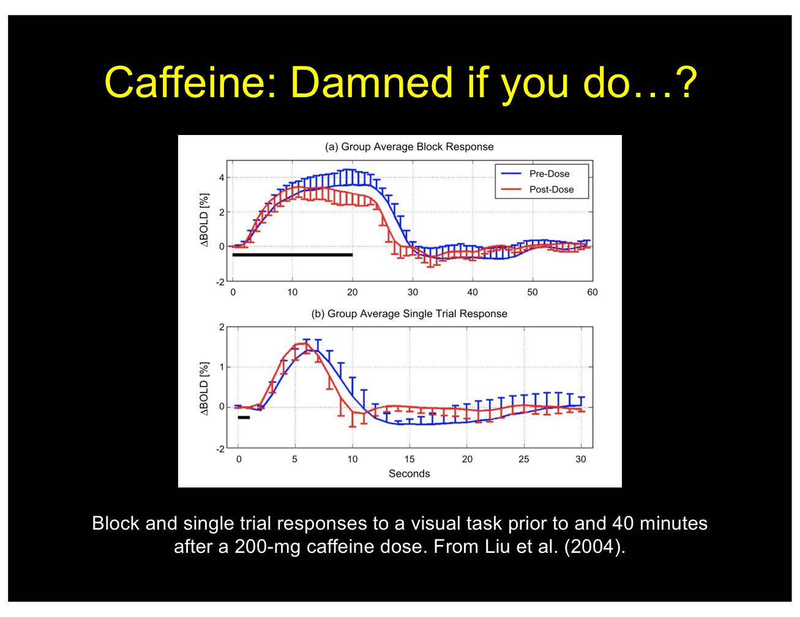

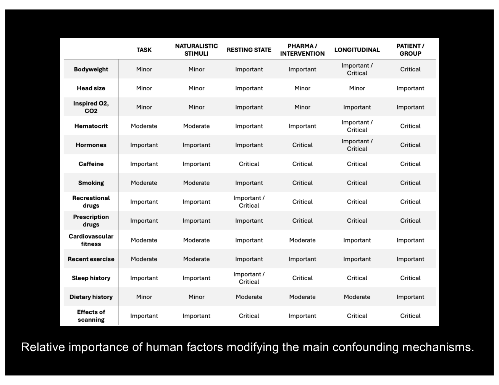

**Figure 11.2. Human factors and caffeine effects.** Participant-state modifiers and their impact on confounding mechanisms. Source pages 221-224 are grouped because they teach one local mechanism or diagnostic comparison. Key source labels and terms include: Human factors as modifiers; Caffeine: Damned if you do…?; Block and single trial responses to a visual task prior to and 40 minutes; after a 200-mg caffeine dose. From Liu et al. (2004).; Relative importance of human factors modifying the main confounding mechanisms..

This figure should be read as a sequence inside Chapter 11, not as an isolated picture. It
begins with human factors as modifiers and ends with relative importance of human factors
modifying the main confounding mechanisms., so the reader can follow how the local idea changes
across the source panels. The retained source-backed panels are used here because the original
annotations are part of the evidence: the reader needs the labels, axes, arrows, image examples,
and comparison tags to see why the mechanism matters.

The practical lesson is participant-state modifiers and their impact on confounding mechanisms.
In a scanner context, the important move is to translate what is drawn into an acquisition
consequence: which gradient is acting, which echo or reference data are being trusted, which
bandwidth or timing choice is limiting, or which image pattern would appear during quality
control.

For Figure 11.2, use the panels as a local reasoning test. If they show a temporal sequence, ask
what physical quantity is being conserved, reversed, accelerated, or lost. If they show images,
compare the same anatomical region across the named conditions before making a protocol
conclusion. That habit prevents a common fMRI error: treating the label human factors and
caffeine effects as a diagnosis before checking the visual evidence.

## MRI and auxiliary data for confounds

MRI and auxiliary data for confounds is the local bridge between the course vocabulary and a
self-study explanation. The relevant source ideas include Relative utility of MRI scans to
capture biological confounds.; Relative utility of simultaneous auxiliary data.; Relative
importance of auxiliary data to collect pre/post scan.. Taken together, they should be read as
one argument about decide which scans and pre/post measures help diagnose confounds. The
textbook version therefore slows the slide sequence down: first define the measured or
manipulated quantity, then state what changes it, and only then connect the change to image
appearance or fMRI interpretation.

In this part of biological and human confounds in fmri, the central discipline is to separate
mechanism from display. A pulse sequence diagram, a k-space grid, or a brain image is not merely
a picture of a result; it encodes a chain of causes. For mri and auxiliary data for confounds,
that chain starts with the controlled scanner quantity, passes through spin phase or signal
weighting, and ends as a spatial pattern, time-series change, or acquisition tradeoff. If the
chain is left implicit, the same term can be memorized without being understood.

A useful way to study mri and auxiliary data for confounds is to ask three questions for every
equation or panel. What quantity is deliberately controlled in Chapter 11's local sequence or
example? What uncontrolled physical or biological quantity can perturb it? What image-space or
time-series signature would reveal the problem? These questions keep the mathematics connected
to practical fMRI, where protocol choices are judged by SNR, temporal stability, distortion,
dropout, timing, and interpretability rather than by elegance alone.

The source pages named Relative utility of MRI scans to capture biological confounds., Relative
importance of auxiliary data to collect pre/post scan. also show why MRI explanations often
require several levels. At the microscopic level, spins precess, relax, dephase, or refocus. At
the sequence level, RF pulses and gradients impose timing and spatial encoding. At the
reconstruction level, Fourier relationships convert sampled signals into images. At the
experimental level, subject motion, physiology, hardware stability, and human factors determine
whether the image series supports a defensible fMRI interpretation.

For practice, the reader should be able to restate mri and auxiliary data for confounds without
using slide shorthand. The restatement should include the relevant variables, the direction of
the effect, and the likely failure mode. A good explanation is specific enough to predict what
would happen if the field strength, gradient area, echo spacing, flip angle, coil sensitivity,
motion state, or nuisance measurement changed.

## Figure 11.3. MRI and auxiliary measurements for confound capture

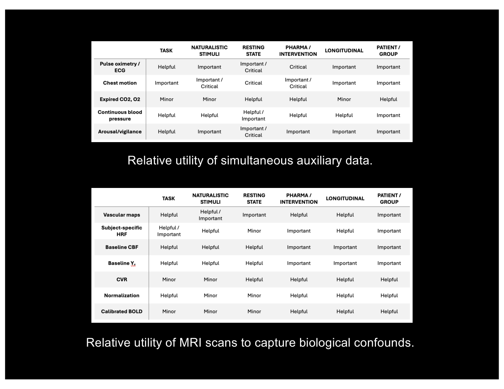

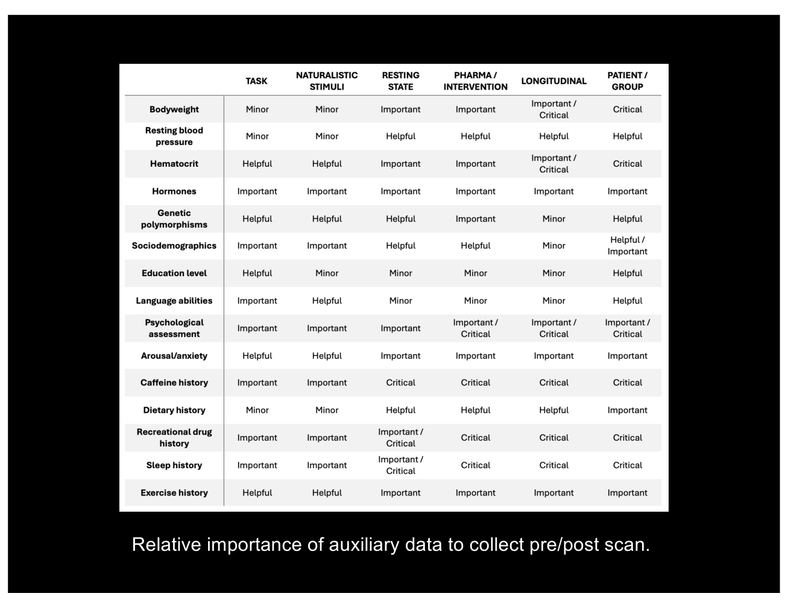

**Figure 11.3. MRI and auxiliary measurements for confound capture.** Which MRI scans, auxiliary data, and pre/post measures can capture biological confounds. Source pages 225-226 are grouped because they teach one local mechanism or diagnostic comparison. Key source labels and terms include: Relative utility of MRI scans to capture biological confounds.; Relative utility of simultaneous auxiliary data.; Relative importance of auxiliary data to collect pre/post scan..

This figure should be read as a sequence inside Chapter 11, not as an isolated picture. It
begins with relative utility of mri scans to capture biological confounds. and ends with
relative importance of auxiliary data to collect pre/post scan., so the reader can follow how
the local idea changes across the source panels. The retained source-backed panels are used here
because the original annotations are part of the evidence: the reader needs the labels, axes,
arrows, image examples, and comparison tags to see why the mechanism matters.

The practical lesson is which mri scans, auxiliary data, and pre/post measures can capture
biological confounds. In a scanner context, the important move is to translate what is drawn
into an acquisition consequence: which gradient is acting, which echo or reference data are
being trusted, which bandwidth or timing choice is limiting, or which image pattern would appear
during quality control.

For Figure 11.3, use the panels as a local reasoning test. If they show a temporal sequence, ask
what physical quantity is being conserved, reversed, accelerated, or lost. If they show images,
compare the same anatomical region across the named conditions before making a protocol
conclusion. That habit prevents a common fMRI error: treating the label mri and auxiliary
measurements for confound capture as a diagnosis before checking the visual evidence.

### Chapter Summary

Chapter 11 used pages 218-226 to develop map nuisance mechanisms to experiment classes and to
the auxiliary measurements that can make them interpretable. The main lesson is cumulative: the
reader should move from vocabulary to mechanism, from mechanism to protocol choice, and from
protocol choice to image or time-series consequences.

### Key Terms

Biological, nuisance, mechanisms, Human, factors, modifiers, auxiliary, data, confounds.

### Review Questions

1. Explain how biological nuisance mechanisms affects a practical fMRI decision.
2. Describe one way a visual panel in Chapter 11 changes the interpretation of the prose.
3. Name one acquisition parameter from this chapter and predict a tradeoff if it is changed.
4. Distinguish a mechanism-level explanation from an image-appearance description.
5. Identify one quality-control sign that would make you revisit this chapter before scanning more data.

# Appendix A. Equation and Variable Guide

The practical fMRI deck uses a small number of equations repeatedly. They are worth keeping in one place because each equation links a scanner control to a physical interpretation. The Larmor relation is $\omega_0 = \gamma B_0$: the resonant angular frequency is proportional to field strength. The RF flip-angle relation can be written as $\theta = \gamma B_1 T_p$: the effect of the RF pulse depends on its amplitude and duration. Transverse decay is represented by $M_{xy}(t) = M_{xy}(0)e^{-t/T_2}$, with the practical EPI extension that apparent decay during gradient echo imaging is often governed by $T_2^*$.

Fourier notation appears because MRI samples a signal in time and reconstructs spatial content through reciprocal variables. A one-dimensional readout under a gradient can be summarized as $S(k_x) = \int M(x)e^{ik_xx}dx$, with $k_x$ proportional to accumulated gradient area. Phase encoding repeats the same logic in the $y$ direction, so a two-dimensional acquisition fills a grid in $(k_x, k_y)$ before applying a two-dimensional Fourier transform.

EPI bandwidth formulas should be read operationally. In the frequency-encoding direction, pixel bandwidth is high because samples arrive rapidly during each readout. In the phase-encoding direction, effective bandwidth is much lower because adjacent ky lines are separated by echo spacing. That asymmetry explains why off-resonance errors displace signal mainly along the phase-encoding direction and why AP/PA reversal is diagnostically useful.

# Appendix B. Protocol Tradeoff Tables

| Method or issue | Primary benefit | Main cost | Practical check |
|---|---|---|---|
| Full Fourier EPI | Complete k-space sampling | Longer readout or fewer slices | Check TE and slice coverage |
| Early partial Fourier | Shorter TE | Less BOLD-optimal timing in many protocols | Confirm whether TE remains near expected T2-star |
| Late partial Fourier | More slices at similar TE | Regional dropout and smoothing risk | Inspect frontal and inferior temporal signal |
| GRAPPA | Less PE distortion and faster traversal | SNR loss and ACS motion sensitivity | Inspect calibration and residual aliasing |
| SMS EPI | More slices per TR | Slice leakage and SBRef motion sensitivity | Inspect SBRef, TSNR, and aliasing patterns |
| Multi-echo EPI | Echo-dependent denoising and regional SNR gains | Longer readout and more complex modeling | Confirm TE-dependent behavior before interpretation |
| Fat suppression | Reduces lipid ghosts | Can fail or change with setup | Inspect scalp ghosts and background |
| Motion control | Improves temporal stability | Can interact with receive fields | Compare motion traces, tSNR, and stdev images |

# Appendix C. Source Resource Links

The following source pages preserve external resources named by the course. These are reader-facing references rather than build notes.

- Page 23, Bonus videos: https://www.youtube.com/watch?v=TQegSF4ZiIQ, https://www.youtube.com/watch?v=fG-ZexdlziU
- Page 83, Aliasing: https://mriquestions.com/eliminate-wrap-around.html
- Page 111, Multi-slice EPI: slice order: https://imaging.mrc-cbu.cam.ac.uk/imaging/CommonArtefacts
- Page 114, https://practicalfmri.blogspot.com/2012/07/physics-for-understanding-fmri.html: https://practicalfmri.blogspot.com/2012/07/physics-for-understanding-fmri.html
- Page 117, Good EPI: https://practicalfmri.blogspot.com/2011/11/understandin, https://practicalfmri.blogspot.com/2011/11/understandin
- Page 120, Magnetic susceptibility: https://mriquestions.com/what-is-susceptibility-chi.html
- Page 168, Further information: https://practicalfmri.blogspot.com/2014/01/partial-fourier-
- Page 178, Multi-echo EPI: https://tedana.readthedocs.io/en/stable/index.html
- Page 179, Weighted sum of echoes: https://doi.org/10.3390/s23094329
- Page 188, - Good axial EPI: https://practicalfmri.blogspot.com/2011/11/understandin, https://practicalfmri.blogspot.com/2012/09/understandin
- Page 198, Good EPI: https://practicalfmri.blogspot.com/2011/11/understandin, https://practicalfmri.blogspot.com/2011/11/understandin

# Glossary

**ACS data.** Autocalibration signal data used by GRAPPA to estimate how missing k-space lines can be reconstructed from coil-array information.

**Aliasing.** Misregistration caused when the sampled field of view is smaller than the object being encoded, allowing signal to wrap into the image.

**B0.** The main static magnetic field that polarizes spins and sets the Larmor frequency.

**B1.** The RF magnetic field used to tip magnetization away from the longitudinal axis.

**Bandwidth.** Frequency range sampled per pixel or direction; in EPI the phase-encoding bandwidth is much lower than the frequency-encoding bandwidth.

**BOLD contrast.** Blood-oxygen-level-dependent contrast, an indirect fMRI signal tied to changes in deoxyhemoglobin and local magnetic susceptibility.

**Chemical shift.** Frequency offset caused by electron shielding differences, most practically visible as water-lipid displacement.

**Dropout.** Regional signal loss, often from susceptibility-driven dephasing around air-tissue interfaces.

**Echo spacing.** Time between adjacent echoes or ky lines in EPI, a key driver of distortion.

**EPI.** Echo-planar imaging, a rapid method that samples many k-space lines after one excitation.

**Flip angle.** The angle through which RF excitation tips net magnetization.

**Fourier transform.** Mathematical operation connecting a signal representation to its frequency or spatial-frequency content.

**Ghosting.** Replica image artifact, often shifted by FOV/2 in EPI because of alternating readout-line errors.

**Gradient.** A controlled spatial variation in magnetic field used for slice selection and spatial encoding.

**GRAPPA.** A parallel imaging method that reconstructs skipped k-space lines using calibration data and coil sensitivity information.

**K-space.** The spatial-frequency domain sampled by MRI before Fourier reconstruction.

**Nyquist ghost.** EPI ghost caused by mismatch between odd and even readout lines.

**Partial Fourier.** Acquisition that omits part of k-space and reconstructs it using conjugate symmetry assumptions.

**Receive bias field.** Spatial sensitivity pattern of the receive coil that can interact with motion and realignment.

**Slice selection.** Excitation of a slab using RF bandwidth in the presence of a slice-select gradient.

**SMS or multiband EPI.** Simultaneous excitation and acquisition of multiple slices, separated using coil-array information.

**T1.** Longitudinal relaxation time describing recovery toward thermal equilibrium.

**T2.** Transverse relaxation time describing spin-spin dephasing without macroscopic field-gradient effects.

**T2-star.** Apparent transverse decay including field inhomogeneity and susceptibility effects.

**Temporal SNR.** Ratio of mean signal to temporal standard deviation across a time series.
